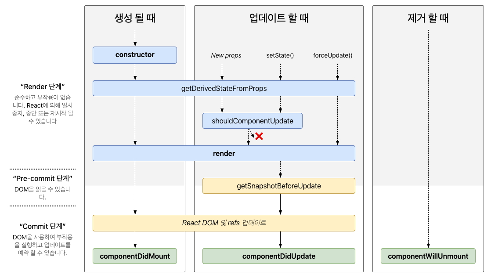

# 5장 ref: DOM에 이름 달기

일반 HTML 에서 DOM 요소 접근 작업이 필요할 땐 태그에 id 를 달아주는 방법 이용을 이용

⇒ 리액트에서는 ref 에 접근할 때 html 에서 처럼 id 를 달아주는 방식의 사용이 가능하지만 사용하지 않는 것을 권장

## why?

리액트의 컴포넌트가 재 사용되면서 같은 id의 DOM 이 여러 개 생길 수 있음

⇒ ref 를 이용해서 dom 에 접근해야 함

### ref 는 어떤 상황에서 사용 해야 할까 ?

**“DOM을 직접적으로 건드려야 할 때”**

**DOM 을 직접적으로 건드려야 하는 상황은?**

- 특정 input 에 포커스 주기
- 스크롤 박스 조작하기
- Canvas 요소에 그림 그리기 등

---

- 포커스, 텍스트 선택 영역, 혹은 미디어의 재생을 관리할 때.
- 애니메이션을 직접적으로 실행시킬 때.
- 서드 파티 DOM 라이브러리를 React와 같이 사용할 때.

## **ref 사용법**

1. 콜백 함수를 통한 ref 설정

```jsx
<input
  ref={(ref) => {
    this.input = ref;
  }}
/>
```

1. createRef 를 통한 ref 설정

```jsx
import { Component } from "react";

class RefSample extends Component {
  input = React.createRef();

  handleFocus = () => {
    this.input.current.focus();
  };

  render() {
    return (
      <div>
        <input ref={this.input} />
      </div>
    );
  }
}
export default RefSample;
```

Ref 에 접근하는 법

```jsx
const node = this.myRef.current;
```

위의 render 메서드 내의 ref 가 엘리먼트에 전달 되었을때그 노드를 향한 참조는 ref 의 current 어트리뷰트에 담기게 된다.

### 컴포넌트에 ref 달기

이미지 출처 : https://react.vlpt.us/basic/25-lifecycle.html



컴포넌트 마운트 시 ⇒ React는 `current` 프로퍼티(ref 에 전달되는 값) 에 DOM 엘리먼트를 대입\*\*\*\*

\*current 프로퍼티를 통해 해당 dom 엘리먼트에 접근가능

컴포넌트 마운트 해제 시⇒ `current` 프로퍼티는 null 이 된다.

```jsx
<MyComponent
  ref={(ref) => {
    this.myComponent = ref;
  }}
/>
```

1. **클래스 컴포넌트에 Ref 사용하기**

```jsx
class CustomTextInput extends React.Component {
  // ...
}
```

```jsx
class AutoFocusTextInput extends React.Component {
  constructor(props) {
    super(props);
    this.textInput = React.createRef();
  }

  componentDidMount() {
    this.textInput.current.focusTextInput();
  }

  render() {
    return <CustomTextInput ref={this.textInput} />;
  }
}
```

1. **함수 컴포넌트에서의 Ref**

함수 컴포넌트에서는 useRef 훅을 사용

```jsx
import React, { useRef, useEffect } from "react";

function MyFunctionalComponent() {
  const myRef = useRef(null);

  useEffect(() => {
    // 컴포넌트가 마운트된 후에 실행되는 부분
    myRef.current.focus();
  }, []); // 빈 배열은 컴포넌트가 마운트될 때 한 번만 실행됨

  return <input ref={myRef} />;
}
```

출처

리액트를 다루는 기술

https://ko.legacy.reactjs.org/docs/refs-and-the-dom.html
