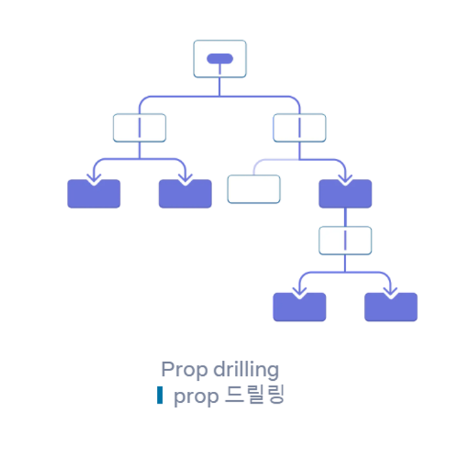
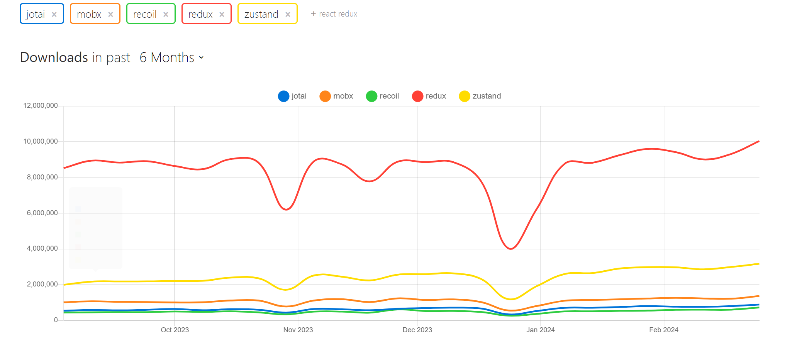
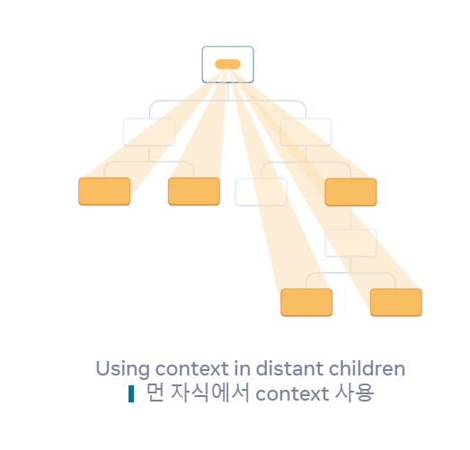
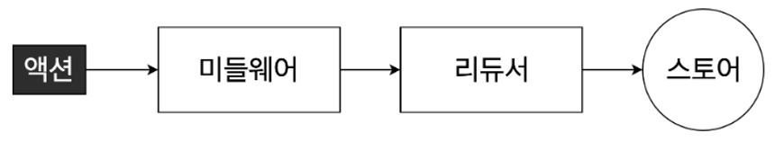
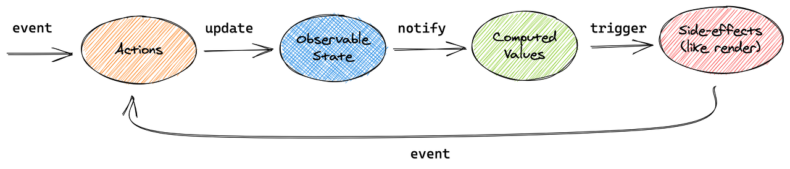
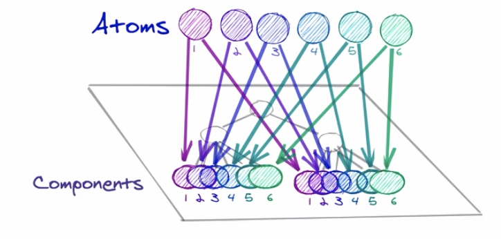
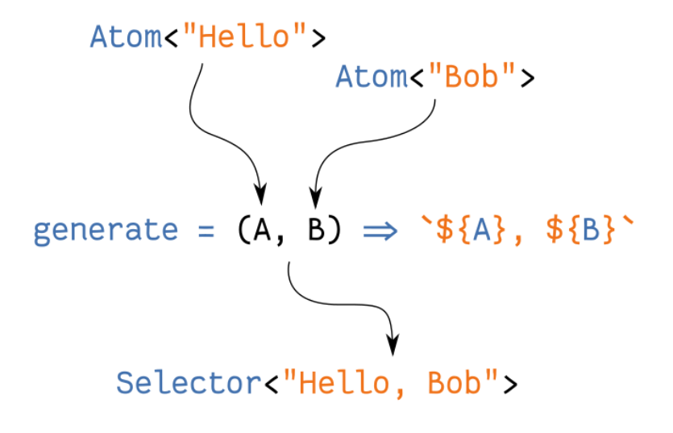

# React 상태 관리 라이브러리

리액트에서 **상태관리란?**

컴포넌트 간의 데이터 전달과 관리

## Props Drilling

props를 오로지 하위 컴포넌트로 전달하는 용도로만 쓰이는 컴포넌트들을 거치면서 React Component 트리의 한 부분에서 다른 부분으로 데이터를 전달하는 과정.

props 전달이 많아 질수록 추적할 단계가 많아져서 유지보수에 어려움이 생김
⇒ 이를 해결하기 위해 전역상태 관리 라이브러리 사용

출처 : npm trends

### **1.Context Api**

**ContextAPI 란 ?**

Props 를 사용하지 않아도 컴포넌트끼리 쉽게 값을 공유

앱의 모든 컴포넌트에서 사용할 수 있는 데이터를 전달할 때 유용

context는 React 컴포넌트 트리 안에서 전역적(global)이라고 볼 수 있는 데이터를 공유할 수 있도록 고안된 방법

한계

Selector가 없는 React의 context API를 사용할 경우 최상단 state를 업데이트하면 하위의 모든Context API는 모든 하위 컴포넌트에 상태 변경이 전파되기 때문에, 상태 변화가 없더라도 모든 자식 컴포넌트가 다시 렌더링될 수 있다.

### **2.Redux**

동작 방식

Flux 아키텍쳐를 기반으로 등장한 상태관리 라이브러리

- 단일 스토어 아키텍처를 사용하며, 상태 변경은 불변성을 유지하면서 리듀서 함수를 통해 이루어짐
- Middleware를 사용하여 비동기 작업과 로깅과 같은 기능을 추가 가능
- 컴포넌트들의 상태 관련 로직들을 다른 파일들로 분리 시켜 더욱 효율적으로 관리할 수 있으며 글로벌 상태 관리도 손쉽게 할 수 있음

**리덕스의 세가지 규칙**

1.하나의 애플리케이션에는 하나의 스토어 존재

1. 상태는 읽기 전용

⇒ 기존의 상태는 건들이지 않고 새로운 상태를 생성하여 업데이트 해주는 방식

불변성 유지

3.리듀서(변화를 일으키는 함수) 는 순수한 함수여야 한다.

순수함수란?

동일한 입력에 대해서 항상 동일한 출력을 반환하고 함수의 실행이 외부의 상태를 변경하지 않는 특성을 만족하는 함수

**리덕스 미들웨어**

리덕스 미들웨어를 사용하면 액선이 디스패치된 다음, 리듀서에서 해당 액션을 받아와서 업데이트 하기전에 추가적인 작업을 할 수 잇다. ⇒주된 용도는 비동기작업을 처리(ex 백엔드 api 연동시)

리덕스 미들웨어의 종류

redux-logger : 액션 정보를 콘솔에 출력해주는 미들웨어

redux-thunk : 비동기 작업을 처리할 때 가장 많이 사용하는 미들웨어

redux-saga : 비동기 작업 관련 라이브러리

### **3.MobX**

Component와 State를 연결하는 번잡한 보일러플레이트 코드들을 데코레이터(애노테이션)를 통해 미니멀하게 사용 가능

모든 상태 변화가 일어나는 부분을 자동으로 추적해줌

- Actions : Observable State에 저장되어 있는 데이터들을 변화시키는 액션 함수.
- Observable : 데이터를 감시하고 그 데이터의 변경을 자동으로 감지하여 그 변경을 사용자에게 알림
  **`observable`**로 선언된 객체나 변수의 값이 변경되면, 이에 의존하는 컴포넌트나 함수가 자동으로 업데이트되어 새로운 값에 따라 화면이 갱신됨. 이를 통해 개발자는 명시적으로 상태 변경을 감지하고 처리하는 코드를 작성하지 않아도 되며, 코드의 간결성과 유지 보수성을 높일 수 있음.
- Compute Values : **state의 변화로 인해 계산된 값(캐싱값)**. computed 내부에서 사용하는 state가 변경되었을때만 새로 계산해서 계산값을 저장해놓고 사용
- Side-Effects : 프로그래밍에서 사이드 이펙트란 함수 내부에서 함수 외부에 접근하여 영향을 주는 행위

한계

store의 데이터를 action 발행 없이 업데이트할 수 있는데,

이것은 구현은 쉽고 용이하지만, 테스트나 유지보수의 측면에서 문제를 일으킬 수 있음.

### **4.Recoil**

- Recoil을 사용하면 *atoms* (공유 상태)에서 *selectors* (순수 함수)를 거쳐 React 컴포넌트로 내려가는 data-flow graph를 만들 수 있다.
- Atoms는 컴포넌트가 구독할 수 있는 상태의 단위다. Selectors는 atoms 상태 값을 동기 또는 비동기 방식을 통해 변환한다
- Recoil은 Context API 기반으로 구현된 함수형 컴포넌트에서만 사용 가능한 라이브러리이다.

Atoms 란?

Atoms는 상태의 단위이며, 업데이트와 구독이 가능하다.

atom이 업데이트되면 각각 구독된 컴포넌트는 새로운 값을 반영하여 다시 렌더링 된다.

Selectors 란?( 리듀서의 역할)

**Selector**는 atoms나 다른 selectors를 입력으로 받아들이는 순수 함수다.

상위의 atoms 또는 selectors가 업데이트되면 하위의 selector 함수도 다시 실행된다.

컴포넌트들은 selectors를 atoms처럼 구독할 수 있으며 selectors가 변경되면 컴포넌트들도 다시 렌더링 된다.

각각의 atom 들을 get method 로 구독하고 구독된 state 들이 변화될때 마다 selector 도 변화 감지 후의 결과값을 반환 한다

한계

- 컴포넌트 상태를 공통된 상위 컴포넌트까지 끌어올려 공유할 수 있지만, 이 과정에서 거대한 트리가 리렌더링 되기도 한다.
- Context는 단일 값만 저장 가능하고, 자체 Consumer를 가지는 여러 값들의 집합을 담는 것은 불가하다.
- 위 특성으로 인해 state가 존재하는 곳 부터 state가 사용되는 곳 까지 코드 분할이 어렵게된다.

비교

|                 | redux  | mobx     | recoil |
| --------------- | ------ | -------- | ------ |
| 데이터 흐름     | 단방향 | 양방향   | 단방향 |
| state 변화 감지 | 액션   | observer | Atom   |
| 코드 간결성     | 중간   | 높음     | 높음   |
| 유지보수성      | 높음   | 중간     | 높음   |

출처

https://suzzeong.tistory.com/94

https://kimdevel.tistory.com/125

https://bennetthardwick.com/recoil-from-scratch/

https://www.nextree.io/riaegteu-sangtaegwanri-teurendeuyi-byeonhwa-2/

recoil 공식문서

redux 공식문서

mobx 공식문서

react 공식문서
