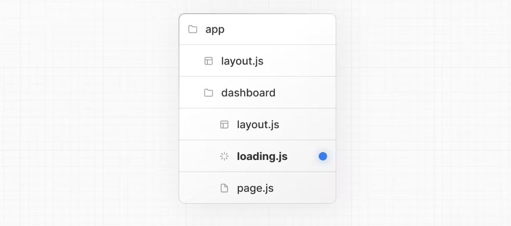
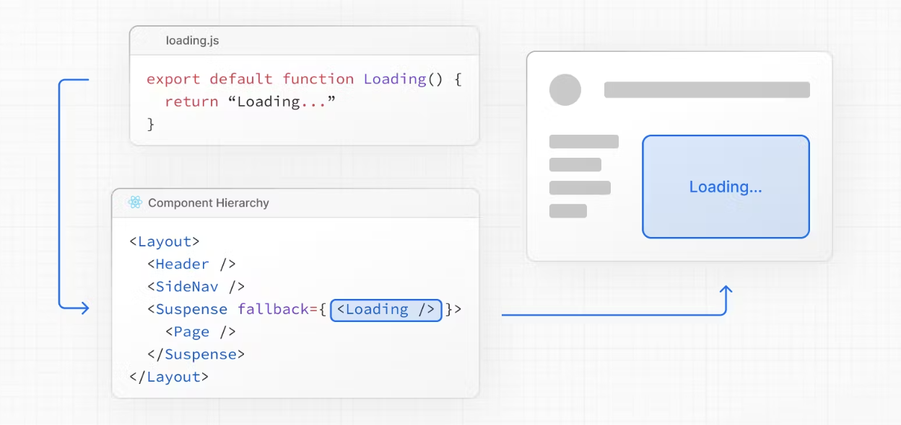
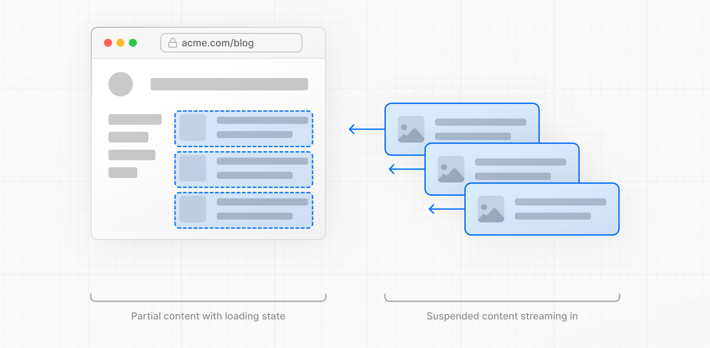

## Code Splitting

리엑트에서 코드 스플리팅이란 무엇인가?

리액트에서 개발을 하고 빌드를 한다. 빌드 과정에서 우리가 짠 모든 컴포넌트들과 코드들이 하나의 소스코드로 합쳐진다. 이 과정이 번들링이다. 만약 대규모 어플리케이션을 개발하고 있다면 번들링이 매우 커질 것이다. 이렇게 되면 처음 페이지들을 불러올 때 로딩시간이 길어지고 사용자 경험에 좋지 않은 영향을 주게된다. 이를 개선하기 위해 필요한 코드만 일단 가져와서 로딩하고 그 외의 코드들은 필요할 때 나중에 로드하는 방법을 사용할 수 있는데 이게 바로 코드 스플리팅이다. 당장 필요하지 않은 코드를 따로 분리시켜 나중에 로드하는 것이다.

코드 스플리팅을 하는 방법으로는 여러가지가 있다.

(코드 비동기 로딩을 하는 방법도 있다. 필요한 부분에서 파일을 임포트 함으로써 필요한 순간에 코드를 불러오는 방식이다. (동적 import)

이번에는 react.lazy와 Suspense를 사용해 스플리팅 하는 방법을 알아보겠다.

이는 리액트 16버전부터 새롭게 추가된 기능이다.

## React.lazy

React.lazy 메서드를 사용하면 동적으로 컴포넌트를 가져와서 컴포넌트 수준에서 코드를 분할할 수 있다.

```jsx
import React, { lazy } from 'react';

const ChildComponent = lazy(() => import('./ChildComponent'));

const ParentComponent = () => (
  <div>
    <ChildComponent />
  </div>
);
```

SPA의 단점은 한번에 모든 컴포넌트를 불러오기 때문에 대규모 어플리케이션 구축 시 처음 랜더링 되는데 시간이 오래 걸린다는 것이다.

많은 컴포넌트와, 메서드, 라이브러리를 사용하면 처음 랜더링을 할 때 큰 JS번들이 사용자에게 전송된다.

이럴 때 React.lazy 함수를 사용해서 컴포넌트들을 개별 JS청크로 분리할 수 있다. 즉 컴포넌트를 동적으로 import 할 수 있게되기 때문에 초기의 랜더링 지연시간을 줄일 수 있다.

이렇게 컴포넌트를 lazy하게 import해오면 컴포넌트를 불러오는데 로딩시간이 생긴다. 이 시간을 처리하기 위해 Suspense 컴포넌트와 함께 사용해 로드상태를 처리할 수 있다.

(이 또한 한계가 있게 때문에 SSR을 사용해야 함)

### Suspense

이렇듯 사용자에게 매우 큰 JS번들을 전송할 때의 문제점은 페이지를 로드하는데 시간이 오래 걸리는 것이다. 이때 React.lazy를 사용해 코드를 분할하고 Suspense로 로딩상태를 처리할 수 있다.

이는 아직 랜더링 준비가 되지 않은 컴포넌트에 대해 로딩화면을 보여주고 로딩 완료 시 컴포넌트를 보여주는 리액트의 기능이다

```jsx
import React, { lazy, Suspense } from 'react';

const ChildComponent = lazy(() => import('./ChildComponent'));

const ParentComponent = () => (
  <Suspense fallback={() => <p>Loading</p>}>
    <ChildComponent />
  </Suspense>
);
```

suspense는 다음과 같이 사용할 수 있다. 원하는 컴포넌트를 감싸주면 해당 컴포넌트를 로드 상태로 표시할 수 있다. 로딩 화면으로 사용할 컴포넌트를 fallback으로 설정해 줄 수 있다.

## Next 에서는?

서버컴포넌트는 자동으로 라우트 세그먼트별로 코드스플리팅이 된다.

기본적으로, 서버 컴포넌트는 자동으로 코드 분할되며, 스트리밍을 사용하여 서버에서 클라이언트로 UI 조각을 점진적으로 보낼 수 있습니다. 지연 로딩은 클라이언트 컴포넌트에 적용됩니다.

### 클라이언트 컴포넌트에서 Code Splitting 하기

- **`next/dynamic`**을 사용한 다이나믹 임포트 사용
- React에서와 같이 Suspense와 함께 React.lazy() 사용

### Dinamic import

- React.lazy()와 Suspense가 합쳐진 것으로 Next.js에서 이를 더 편하게 사용할 수 있도록 만든 기능이다.

(app, page 에서 모두 사용가능하다!)

```jsx
'use client';

import { useState } from 'react';
import dynamic from 'next/dynamic';

// Client Components:
const ComponentA = dynamic(() => import('../components/A'));
const ComponentB = dynamic(() => import('../components/B'));
const ComponentC = dynamic(() => import('../components/C'), { ssr: false });

export default function ClientComponentExample() {
  const [showMore, setShowMore] = useState(false);

  return (
    <div>
      {/* Load immediately, but in a separate client bundle */}
      <ComponentA />

      {/* Load on demand, only when/if the condition is met */}
      {showMore && <ComponentB />}
      <button onClick={() => setShowMore(!showMore)}>Toggle</button>

      {/* Load only on the client side */}
      <ComponentC />
    </div>
  );
}
```

다이나믹 임포트로 클라이언트 컴포넌트를 불러오면 해당 컴포넌트는 디폴트로 서버사이드랜더링(SSR)이 된다.

ssr option 에 false를 주어 pre-rendering을 disable 해줄 수 있다.

**Importing Server Components**

서버 컴포넌트를 다이나믹 임포트로 불러온다면 해당 컴포넌트의 자식 중 클라이언트 컴포넌트만 lazy-loaded된다.

## 그렇다면 서버컴포넌트는 어떻게 코드스플리팅을 적용할 수 있을까?

### **Loading UI and Streaming**

먼저 앞서 말했듯 서버 컴포넌트는 세그먼트별로 자동 코드스플리팅이 된다. 즉 페이지별로 진입 시 서버사이드 랜더가 되어 보여지게 된다. 이때 loading.js 파일을 만들면 페이지가 로드되는 동안 의미있는 Loading UI를 보여줄 수 있다. 랜더링이 완료되면 자동으로 페이지가 표시되게 된다.



다음과 같이 폴더 안에 loading.js 를 만들면 layout.js 안에 nested 되며 자동으로 <Suspense> 로 page.js를 감싼다.



서버 컴포넌트는 세그먼트별로 코드 스플리팅이 된다고 해도 여전히 서버에서 모든 데이터를 패치해서 유저에게 페이지를 보여주기 까지 시간이 걸릴 수 있다. 그렇다면 세그먼트 내부의 컴포넌트들도 스플리팅 할 순 없을까?

**스트리밍**을 사용하면 된다!

### Streaming?

스트리밍을 간단히 설명하자면 페이지의 HTML을 작은 조각으로 나누고 이를 점진적으로 클라이언트로 보내주는 것을 말한다.

SSR과 비교했을 때, SSR은 모든 데이터를 서버에서 가져온 후에야 페이지의 HTML을 렌더링하고 클라이언트로 전송한다. 이와 달리, 스트리밍은 페이지의 HTML을 조각으로 나누어 조금씩 보내므로 사용자는 페이지를 더 빨리 볼 수 있다. 이를 통해 페이지 로딩 성능을 향상시킬 수 있다.



## Streaming with Suspense

Suspense Boundary를 만들어 주어서 각각의 서버 컴포넌트를 스트리밍 할 수 있다.

이를 사용하면 위에서 말한것과 같이 작은 조각으로 나누어 차례대로 이를 클라이언트로 보내기 때문에 전체 데이터가 로드될때 까지 기다리지 않고 페이지의 일부를 먼저 볼 수 있게된다.

**사용법**

비동기적인 일을 하는 서버 컴포넌트를 Suspense로 감싸주면 해당 컴포넌트들이 스트리밍 되고 각각의 컴포넌트가 로드되는 동안 fallback UI를 보여주며 랜더링이 완료되면 해당 컴포넌트가 보이게 된다.

```jsx
import { Suspense } from 'react';
import { PostFeed, Weather } from './Components';

export default function Posts() {
  return (
    <section>
      <Suspense fallback={<p>Loading feed...</p>}>
        <PostFeed />
      </Suspense>
      <Suspense fallback={<p>Loading weather...</p>}>
        <Weather />
      </Suspense>
    </section>
  );
}
```
