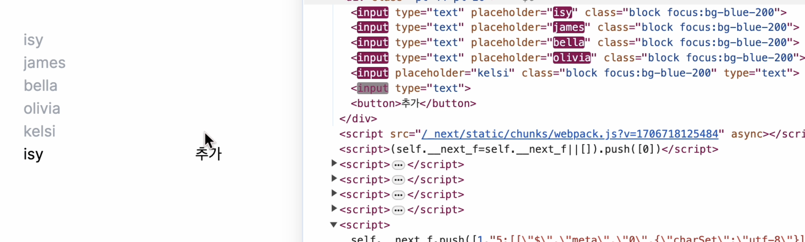
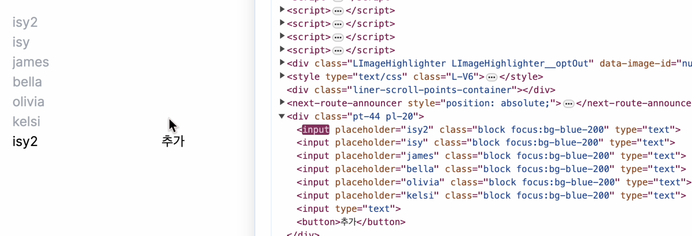

# Ref

HTML에서 id를 사용하여 DOM에 이름을 다는 것처럼 리액트에서는 ref를 사용하여 DOM에 이름을 달 수 있다.

ref는 특정 DOM에 직접적으로 접근해 조작해야 할 때 사용된다.

컴포넌트 간 데이터 흐름을 이용하는 것이 리액트의 철학에 부합하기 때문에 ref는 꼭 필요한 경우에만 사용하는 것이 좋다. 이를 남용하면 코드가 복잡해지고 유지보수가 어려워질 수 있다.

그렇다면 **DOM을 꼭 사용해 하는 상황**은 언제일까? (state만으로 해결할 수 없을 때)

- 특정 input에 focus 설정
- 스크롤 박스 조작
- Canvas 요소에 그림 그리기
- 외부 라이브러리와 통합 등

## ref 사용법

ref를 사용하는 방법에는 두가지가 있다.

- 콜백 함수를 통한 ref설정
- createRef를 통한 ref설정

### 콜백 함수를 통한 ref 설정

ref를 만드는 가장 기본적인 방법은 콜백 함수를 사용하는 것이다.

ref를 달고자 하는 엘리먼트에 ref라는 콜백함수를 props로 전달 해주면 된다.

콜백함수는 ref 값을 파라미터로 받고, 함수 내부에서 넘겨받은 ref 값을 컴포넌트의 멤버변수로 설정한다.

```jsx
<input
  ref={(ref) => {
    this.input = ref;
  }}
/>
```

이렇게 ref를 설정하면 앞으로 this.input은 input 요소의 DOM을 가리키게 된다.

ref의 이름은 원하는 것으로 자유롭게 지정할 수 있음

### createRef를 통한 ref 설정

createRef라는 리액트 내장 함수를 사용해면 더 쉽게 ref를 사용할 수 있다.

먼저 클래스 내부에 멤버변수로 React.createRef()를 담아준다. 그리고 해당 멤버변수를 ref를 달고자 하는 요소에 ref props로 넣어주면 ref 설정이 끝난다.

ref를 설정해준 DOM에 접근하려면 .current를 통해 접근할 수 있다.

```jsx
import React, { Component } from 'react';

class RefSample extends Component {
  input = React.createRef();

  handleFocus = () => {
    this.input.current.focus();
  };

  render() {
    return (
      <div>
        <input ref={this.input} />
      </div>
    );
  }
}

export default RefSample;
```

# 컴포넌트에 ref 달기

리액트에서는 컴포넌트에 ref를 달 수 있다.

컴포넌트에 ref를 달면 컴포넌트 내부에 DOM을 외부에서 사용할 수 있다.

```jsx
import { Component } from 'react';
import ScrollBox from './ScrollBox';

class App extends Component {
  render() {
    return (
      <div>
        <ScrollBox ref={(ref) => (this.ScrollBox = ref)} />
        <button onClick={() => this.ScrollBox.scrollToBottom()}>
          맨 밑으로
        </button>
      </div>
    );
  }
}

export default App;
```

다음과 같이 DOM에 ref를 달때와 똑같이 사용하면 된다.

이렇게 하면 해당 컴포넌트 내부의 메서드, 멤버변수, ref에 접근할 수 있다.

위의 예시를 보면 부모 컴포넌트에서 ScrollBox 컴포넌트에 ref를 달고 onClick 이벤트에 Scrollbox 컴포넌트의 메소드인 scrollToBottom에 접근한 것을 볼 수 있다.

아래는 ScrollBox 컴포넌트의 코드이다.

```jsx
// 스크롤 박스가 있는 컴포넌트를 하나 만들고, 스크롤바를 아래로 내리는 작업을 부모 컴포넌트에서 실행

import React, { Component } from 'react';
class ScrollBox extends Component {
  // 컴포넌트에 스크롤바를 맨 아래쪽으로 내리는 메서드
  // 이렇게 만든 메서드는 부모 컴포넌트인 App 컴포넌트에서 ScrollBox에 ref를 달면 사용가능
  scrollToBottom = () => {
    const { scrollHeight, clientHeight } = this.box;
    // scrollTop : 세로 스크롤바 위치
    // scrollHeight : 스크롤이 있는 박스 안의 div 높이
    // clientHeight : 스크롤이 있는 박스의 높이

    this.box.scrollTop = scrollHeight - clientHeight;
    // scrollTop은 0 ~ (박스 내부의 긴 콘텐츠 - 스크롤바가 감싸고 있는 바깥의 박스) 의 값을 가진다.
  };

  render() {
    const style = {
      border: '1px solid black',
      height: '300px',
      width: '300px',
      overflow: 'auto',
      position: 'relative',
    };
    const innerStyle = {
      width: '100%',
      height: '650px',
      background: 'linear-gradient(white, black)',
    };
    return (
      <div
        style={style}
        ref={(ref) => {
          this.box = ref;
        }}
      >
        <div style={innerStyle} />
      </div>
    );
  }
}
export default ScrollBox;
```

이렇게 ScrollBox 컴포넌트에서 this.box로 스크롤바가 있는 박스 DOM에 접근할 수 있고 ScrollToBottom이라는 메소드가 이 DOM에 접근해 스크롤 바의 위치를 맨 아래로 변경한다.

### 주의

- button 요소에 onClick 이벤트를 등록 시, onClick = {this.scrollBox.scrollToBottom}으로 작성하는 것이 문법상으로 틀리진 않았지만 컴포넌트가 처음 렌더링 될 때는 ref등록이 콜백함수 이므로 this.scrollBox 값이 undefined 이다.
- 그러므로 화살표 함수 문법으로 새로운 함수를 만들고, 그 내부에서 this.scrollBox.scrollToBottom 메소드를 실행하면 버튼을 누를때,(이미 한번 렌더링을 거쳐 this.scrollBox를 설정한 시점) this.scrollBox.scrollToBottom 값을 읽어 와서 실행하므로 오류가 발생하지 않는다.

---

## 자바스크립트 배열의 map() 함수

`map` 함수는 파라미터로 전달된 함수를 사용해서 배열 내 각 요소를 원하는 규칙에 따라 변환한 후 그 결과로 새로운 배열을 생성한다.

`arr.map(callback, [thisArg])`

- `callback`: 새로운 배열의 요소를 생성하는 함수
- `thisArg`(필수 X): `callback` 함수 내부에서 사용할 `this` 레퍼런스

아래는 예제 코드로, `processed`에 `[1, 4, 9, 16, 25]` 배열이 저장된다.

```
var numbers = [1, 2, 3, 4, 5];
var processed = numbers.map(num => num*num);
```

데이터 배열을 컴포넌트 배열로 변환할 수도 있다.

```jsx
const IterationSample = () => {
  const names = ['눈사람', '얼음', '눈', '바람'];
  const nameList = names.map((name, index) => <li key={index}>{name}</li>);
  return <ul>{nameList}</ul>;
};
```

> 리액트에서는 컴포넌트 배열을 렌더링했을 때 어떤 원소에 변동이 있었는지 알아내기 위해 key를 사용한다. 예를 들어 원소를 새로 생성하거나 제거, 수정할 때 key가 없다면 Virtual DOM에서 리스트를 순차적으로 비교하면서 변화를 감지하지만 key가 있다면 더욱 빠르게 알아낼 수 있다.

`key` 값은 유일해야 하기 때문에 데이터가 가진 고윳값으로 설정해야 한다. 데이터의 고윳값이 딱히 없다면 `map` 함수에 전달되는 콜백 함수의 인수인 `index` 값을 사용할 수도 있다. 그러나 index를 사용하면 리스트를 변경(아이템의 추가 또는 삭제) 할 때 각 아이템의 인덱스 또한 재배치한다. 그 결과 key를 변경시켜 렌더링 성능을 저하 시킬 우려가 있다. 그러므로 이유로 인덱스를 key로 사용하는 경우는 신중히 고려해야 한다.

```jsx
'use client';
import React from 'react';
import { useRef, useState, useEffect } from 'react';

export default function TestPage() {
  const inputRef = useRef(null);
  const [userList, setUserList] = useState([
    { id: 1, name: 'james' },
    { id: 2, name: 'bella' },
    { id: 3, name: 'olivia' },
    { id: 4, name: 'kelsi' },
  ]);
  function pushNewUser() {
    setUserList([
      // ...userList,
      {
        id: userList.length + 1,
        name: inputRef.current.value,
      },
      ...userList,
    ]);
    console.log(userList);
  }

  return (
    <div className="pt-44 pl-20">
      {userList.map((user, index) => (
        <input
          key={index}
          type="text"
          placeholder={user.name}
          className="block focus:bg-blue-200"
        />
      ))}
      <input type="text" ref={inputRef} />
      <button onClick={pushNewUser}>추가</button>
    </div>
  );
}
```

위와같이 리스트의 끝에 추가하는게 아니라 위에 요소를 추가하는 경우를 보자.


key값으로 index를 사용한다면 index가 재배치 되어 새로 추가된 요소와 아래의 요소들의 key값이 모두 바뀐다. 즉 변경이 필요하지 않은 리스트의 요소까지 모두 변경이 일어나므로 비효율적이다.



반면 key값을 고유한 id(userid)로 지정해 준 경우에는 새로 추가된 요소만 변경되는것을 볼 수 있다.

### 옳바른 key 사용

그로므로 index를 사용하려면 상황을 고려해 다음과 같은 경우에만 사용해야 한다.

- 리스트와 아이템이 고정되어, 다시 계산되거나 수정되지 않는다
- 리스트의 아이템에 id가 없다
- 리스트가 재배치되거나 필터되지 않는다

추가적으로 키로 이용할 수 있는 고유한 값으로 uuid, nanoid 와 같은 라이브러리가 있다.

이러한 라이브러리를 사용하면 매번 수동으로 유니크한 key 값을 지정할 필요 없이 간편하게 고유한 값을 생성할 수 있다. 그 중 uuid에 대해서 간단하게 알아보겠다.

### \***\*UUID\*\***

즉, UUID는 식별자의 고유성을 보장하는 특정 형식의 문자열을 만드는 데 사용되는 알고리즘입니다. UUID 표준에 따라 이름을 부여하면 고유성을 완벽하게 보장할 수는 없지만 수학적으로 계산해보면 중복될 가능성이 거의 없다고 인정되기 때문에 많이 사용되고 있습니다.

### uuid**사용법**

```jsx
npm install uuid
```

위와같이 설치 후

```jsx
import { v4 as uuidv4 } from 'uuid';
uuidv4(); // ⇨ '9b1deb4d-3b7d-4bad-9bdd-2b0d7b3dcb6d'
```

모듈을 불러와 사용하면 된다.

uuid 함수를 호출하면 다음과 같이 랜덤으로 생성된 문자열이 만들어진다. 이를 컴포넌트의 key 값으로 사용하면 고유한 key 값을 부여할 수 있다.
