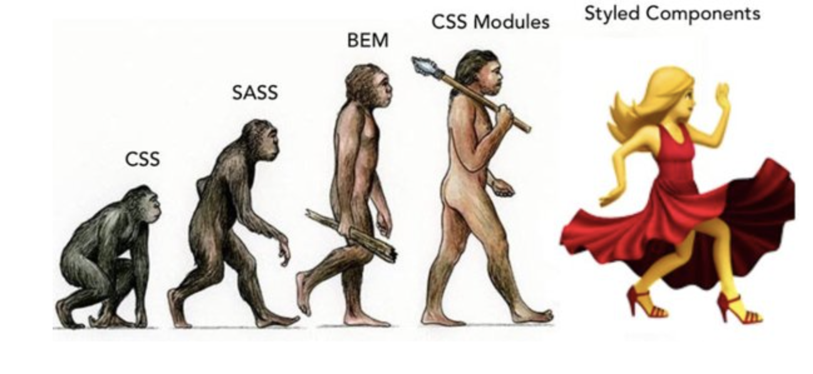

리액트에서 컴포넌트를 스타일링하는 다양한 방법이 존재한다. 어떠한 방식들이 있는지 알아보도록 하겠다.

CSS는 1996년에 도입된 이래와 같이 발전해왔다.



([oliverturner's twitter](https://www.javascriptstuff.com/what-are-css-modules/))

## 일반 CSS

- 기존의 css를 사용하는 방식
- css클래스가 중복되지 않게 하기 위해 규칙을 사용하여 이름을 짓거나 css selector를 활용할 수 있다. (충돌 방지)
  - 규칙
    - ‘컴포넌트이름-클래스’ 형태
    - 어디에서 어떤 용도로 사용되는지 명확히 작성하는 방식
  - css selector
    - css 클래스가 특정 클래스 내부에 있는 경우에만 스타일을 적용할 수 있도록 함
    - Ex: “.App header”, “.App .logo"

# Sass

- Syntactically Awesome Style Sheets (sass 언어, 전처리기)
- sass는 css코드를 간결하고 효율적으로 작성하기 위해 사용하는 프로그래밍 언어이다.
- sass로 코드를 작성하면 sass 전처리가 이를 css로 컴파일해 브라우저에 로드될 수 있도록 빌드해 준다.
- .scss와 .sass의 두 가지 확장자 지원
- 두 확장자의 문법은 아래와 같은 차이가 있다.

```
// .sass
$font-stack: Helvetica, sans-serif
$primary-color: #333

body
  font: 100% $font-stack
  color: $primary-folor

//.scss
$font-stack: Helvetica, sans-serif;
$primary-color: #333;

body {
  font: 100% $font-stack;
  color: $primary-folor;
}
```

sass는 중괄호와 세미콜론을 사용하지 않는다. scss가 css와 작성법이 비슷하여 더 자주 사용된다.

# CSS Module

- 스타일을 작성할 때 CSS 클래스가 다른 CSS 클래스의 이름과 절대 충돌하지 않도록 파일마다 고유한 이름을 자동으로 생성해 주는 옵션
- 파일이름*클래스이름\**\*해시값 형태로 이름을 자동으로 변경해줌
- .module.css 확장자로 파일을 저장하면 자동으로 CSS Module이 적용됨
- 특정 클래스를 전역적으로 사용하려면 :global 을 앞에 입력해준다.
- sass도 css module로 사용 가능

### 장점

- css module을 불러온 컴포넌트 내에서면 작동하기 때문에 클래스 이름을 지을 때 고유성에 대해 생각하지 않아도 된다.

# CSS-in-JS

JS 파일 안에 스타일을 선언하는 방식

대표적 예시 : emotion, Styled-components

### 장점

- css모델을 문서 레벨이 아닌 컴포넌트 레벨로 추상화한다. (모듈성)
- js와 상태를 공유할 수 있다
- 자바스크립트와 css 사이의 상수, 함수를 공유 (ex: props를 활용한 조건부 스타일링)
- 현재 사용중인 스타일만 DOM에 포함한다
- 짧은 길이의 고유한 클래스를 자동으로 생성 → 코드 경량화

### 단점

- 별도의 라이브러리 설치 → 번들 크기가 커짐
- runtime에 스타일을 생성하는 방식 → 스타일이 복잡한 경우 런타임 성능을 떨어뜨린다.

### **zero-runtime css-in-js**

우리가 흔히 사용하는 runtime-css-in-js의 문제를 해결하기 위해 zero-runtime 라이브러리들이 등장했다.

zero-runtime이란 말 그대로 앞서 설명한 runtime에서의 동작이 없다는 것을 뜻한다. 즉 동적으로 스타일을 생성하지 않는다.

그 중 하나인 [Linaria](https://linaria.dev/)는 styled-components에서 영감을 받아 유사한 API를 가진 CSS-in-JS라이브러이고, zero-runtime으로 동작한다. [linaria - how it works](https://github.com/callstack/linaria/blob/master/docs/HOW_IT_WORKS.md)에서 설명하는대로 babel plugin과 webpack loader를 통해 사용된 css코드를 추출해 **정적인 스타일시트**를 생성한다.

### CSS-in-CSS vs CSS-in-JS

CSS-in-CSS: 이 방법은 스타일 시트가 별도로 로드되며, 브라우저가 CSSOM (CSS Object Model)을 생성한다. CSSOM이 한 번 생성되고 나면, 다시 렌더링 될 때는 해당 스타일 시트를 다시 파싱할 필요가 없으므로 렌더링 성능이 향상될 수 있다. 또한, 렌더링이 빈번하게 발생하더라도 스타일이 변경되지 않는다면, CSS-in-CSS 방식이 더 효율적일 수 있다.

CSS-in-JS: 이 방법은 컴포넌트가 렌더링 될 때마다 새로운 스타일을 동적으로 생성한다. 따라서, 상태 변경이나 prop 변경에 따라 스타일이 자주 변경되는 컴포넌트의 경우 CSS-in-JS가 더 효율적일 수 있다.

→ 빈번한 리렌더링이 발생하더라도 스타일이 자주 변경되지 않는다면 CSS-in-CSS가 성능적으로 더 유리하고, 스타일이 빈번하게 변경되는 경우 CSS-in-JS가 더 적합할 수 있다.

출처:

https://so-so.dev/web/css-in-js-whats-the-defference/

[https://velog.io/@sunfkkc/CSS-in-JS-vs-CSS-in-CSS-성능-비교를-중심으로](https://velog.io/@sunfkkc/CSS-in-JS-vs-CSS-in-CSS-%EC%84%B1%EB%8A%A5-%EB%B9%84%EA%B5%90%EB%A5%BC-%EC%A4%91%EC%8B%AC%EC%9C%BC%EB%A1%9C)

# Styled-components

install

`npm install --save styled-components`

typeScript를 사용하기 때문에 타임을 가져온다

`npm i --save-dev @types/styled-components`

styled-components 를 import 해준다

`import styled from 'styled-components';`

### 사용 예시

styled.<DOM element> → div,span,a,button 등

다음과 같이 컴포넌트를 만들고 ``안에 스타일을 작성해준다. 그리고 export해주면 컴포넌트처럼 사용할 수 있다!

```jsx
import styled from '@emotion/styled';

const Wrapper = styled.div`
  height: 50px;
  display: flex;
  align-items: center;
  justify-content: center;
  gap: 1.5rem /* 24px */;
`;
```

다음과 같이 작성해주면 Wrapper라는 스타일을 가진 컴포넌트가 만들어진다.

```tsx
'use client';

import styled from '@emotion/styled';

const Wrapper = styled.div`
  height: 50px;
  display: flex;
  align-items: center;
  justify-content: center;
  gap: 1.5rem /* 24px */;
`;

export default function NavBar(): JSX.Element {
  return (
    <Wrapper>
      <div>예시</div>
    </Wrapper>
  );
}
```

styled component에 props를 넘기거나 상속을 하는 것 또한 가능하다.

### Styled-components’s pros

- 스타일과 컴포넌트를 한번에 관리해서 컴포넌트별로 스타일 할 수 있다. 관리가 쉽다.
- 프롭스를 받을 수 있어서 props, state값에 따라 동적으로 스타일링 할 수 있다.
- css클래스 이름 충돌을 방지한다. 스타일을 컴포넌트 범위로 유지하기 때문이다.

이런 Styled-components를 tailwind css로도 만들 수 있다.

이를 위해서 tailwind CSS를 설치하는 과정, 장단점 그리고 tailwind-styled-component를 사용하는 법까지 차근차근 해보자.

## Tailwind CSS

`npm install -D tailwindcss postcss autoprefixer`

`npx tailwindcss init -p`

`tailwind.config.js` 파일 안에 tailwind 를 사용할 경로 추가해주기

```jsx
/** @type {import('tailwindcss').Config} */
module.exports = {
  content: [
    './app/**/*.{js,ts,jsx,tsx,mdx}', // Note the addition of the `app` directory.
    './pages/**/*.{js,ts,jsx,tsx,mdx}',
    './components/**/*.{js,ts,jsx,tsx,mdx}',

    // Or if using `src` directory:
    './src/**/*.{js,ts,jsx,tsx,mdx}',
  ],
  theme: {
    extend: {},
  },
  plugins: [],
};
```

global.css에 다음 Tailwind의 directive를 추가한다.

@tailwind base; 는 기본 css를 모두 초기화 한다.

```jsx
@tailwind base;
@tailwind components;
@tailwind utilities;
```

### Tailwind’s pros

- **빠른 개발**

이미 만들어진 클래스를 가져다 쓴다. 이를 element에 바로 적용을 할 수 있기 때문에 빠르고 비교적 쉽게 개발이 가능하다. 또한 사전 정의된 클래스를 조합해서 사용하므로 따로 네이밍 할 필요도 없

- **커스터마이징 쉬움:**

기본적으로 제공되는 클래스 외에도 프로젝트에 맞게 새로운 클래스를 정의하거나 기존 클래스를 조합해서 사용 할 수 있다.

- **Colocation Bad 해결**

기존 css 에 클래스 정의하면 이 스타일에 뭐가 정의되어 있는지 찾아야함. 스타일 보려면 css파일을 봐야한다는 단점이 있음. → Seperation of Concerns

하지만 Tailwind는 딱 보면 뭐가 적용됐는지 파악할 수 있고 수정 삭제 또한 용이하다

- tailwind → **Bootstrap 과 css사이**
  - Bootstrap : Convention + CSS: Configuration
  - → desigm system 만들기 쉽다

### Tailwind’s cons

- **가독성**

필요한 클래스들을 조합하는 방식이기 때문에 클래스를 많이 나열하게 되면 가독성이 떨어진다.

- **러닝 커브**

처음에는 클래스 이름을 익히고 이해하는 데 시간이 걸릴 수 있으며, 개발자들이 이에 익숙해지려면 약간의 학습이 필요하다.

## tailwind-styled-component

tailwind css로 styled-component 를 만드는 것이다.

다음 명령어로 설치해준다.

`npm install -D tailwind-styled-components`

그리고 사용하고자 하는 파일에 임포트 해준다.

`import tw from "tailwind-styled-components"`

```jsx
import tw from 'tailwind-styled-components';

const MenuItem = tw.a`
  text-center
  group
  hover:border-b-2
  border-transparent
  hover:border-gray-500
`;

export default function NavBar(): JSX.Element {
  return (
    <Wrapper>
      <MenuItem href="#">채용</MenuItem>
      <MenuItem href="#">이벤트</MenuItem>
      <MenuItem href="#">이력서</MenuItem>
      <MenuItem href="#">소셜</MenuItem>
      <MenuItem href="#">프리랜서</MenuItem>
      <MenuItem href="#">AI 합격예측</MenuItem>
    </Wrapper>
  );
}
```

다음과 같이 a 태그마다 작성해줘야 했던것을

```jsx
<a href="" className="text-center group hover:border-b-2 border-transparent hover:border-gray-500">채용</a>
<a href="" className="text-center group hover:border-b-2 border-transparent hover:border-gray-500">이벤트</a>
<a href="" className="text-center group hover:border-b-2 border-transparent hover:border-gray-500">이력서</a>
...
```

컴포넌트화 해서 tailwind를 사용하면서 styled-component 처럼 사용할 수 있다

```jsx
<MenuItem href="#">채용</MenuItem>
```
