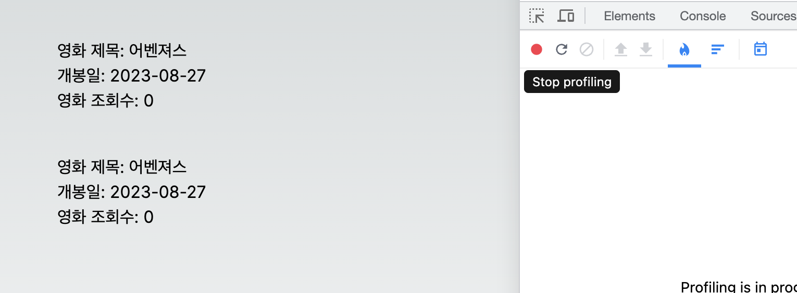
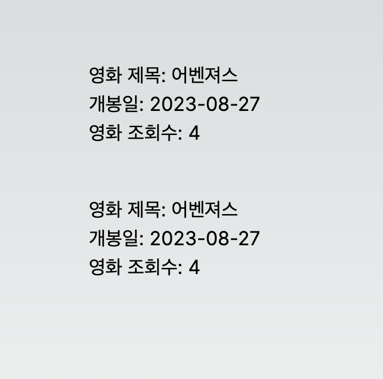
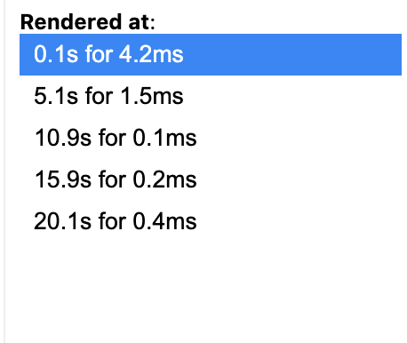
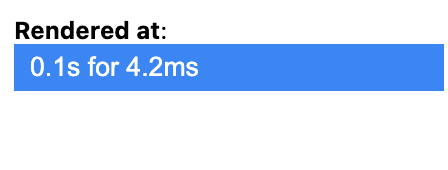

리액트 최적화

# Memoization

- 기존에 수행한 결과값을 어딘가에 저장해두고 동일한 입력이 들어오면 재활용 하는 프로그래밍 기법
- 이전 값을 메모리에 저장해 동일한 계산의 반복을 제거해 빠른 처리를 가능하게 하는 기술

> → 자주 사용되는 값을 받아오기 위해 반복적으로 계산을 해야하는 상황에서, 특정 값을 캐싱함 → 해당 값이 또 필요할 때마다 메모리에서 꺼내서 재사용함.

# React.memo

- React.memo는 Higher-Order Components(HOC)이다.
- Higher-Order Components(HOC): 보통 컴포넌트를 받아서 최적화된 컴포넌트로 반환해주는 함수

리액트는 먼저 컴포넌트를 랜더링 하고, 이전 랜더된 결과와 비교하여 실제 돔에 업데이트 할지 말지를 결정한다.

다음 랜더링 결과와 이전 결과를 비교하는 과정을 메모이제이션을 통해 더 빠르게 할 수 있다.

컴포넌트가 `React.memo()`로 래핑 될 때, 리액트는 컴포넌트를 랜더링하고 결과를 **메모이징** 한다. 그리고 다음 랜더링이 일어날 때, **props가 같으면** 메모이징된 내용을 재사용한다.

### 언제?

- 컴포넌트가 같은 props로 자주 랜더링 될 때
- 컴포넌트가 랜더링 될 때마다 복잡한 로직을 처리해야 할 때

부모컴포넌트에 의해 하위 컴포넌트가 같은 props로 리 랜더링 되는 경우의 예시

- MemoizedRealtime 이라는 부모 컴포넌트 : 매초 view를 업데이트

```jsx
function MovieViewsRealtime({ title, releaseDate, views }) {
  return (
    <div>
      <Movie title={title} releaseDate={releaseDate} />
      Movie views: {views}
    </div>
  );
}
```

- Movie 라는 자식 컴포넌트: 영화제목과 개봉일

```jsx
export function Movie({ title, releaseDate }) {
  return (
    <div>
      <div>영화 제목: {title}</div>
      <div>개봉일: {releaseDate}</div>
    </div>
  );
}
```

- `views`가 업데이트 될 때 마다 `MoviewViewsRealtime` 컴퍼넌트 또한 리렌더링 된다. 이때 `Movie` 컴퍼넌트 또한 `title`이나 `releaseData`가 같음에도 불구하고 리렌더링 된다.

- `Movie` 컴퍼넌트에 메모이제이션을 적용

```jsx
export const MemoizedMovie = React.memo(Movie);

function MovieViewsRealtime2({ title, releaseDate, views }) {
  return (
    <div>
      <MemoizedMovie title={title} releaseDate={releaseDate} />
      Movie views: {views}
    </div>
  );
}
```

→ `title` 혹은 `releaseDate` props가 같다면, React는 `MemoizedMovie`를 리렌더링 하지 않음 → `MovieViewsRealtime` 컴퍼넌트의 성능 향상

```jsx
export default function App() {
  const [title, setTitle] = useState('어벤져스');
  const [releaseDate, setReleaseDate] = useState('2023-08-27');
  const [views, setViews] = useState(0);

  useEffect(() => {
    const interval = setInterval(() => {
      setViews((prevViews) => prevViews + 1);
    }, 5000);

    return () => {
      clearInterval(interval);
    };
  }, []);

  return (
    <main className="flex min-h-screen flex-col items-center p-24 gap-10">
      <div className=" ">
        <MovieViewsRealtime1
          title={title}
          releaseDate={releaseDate}
          views={views}
        />
      </div>
      <div>
        <MovieViewsRealtime2
          title={title}
          releaseDate={releaseDate}
          views={views}
        />
      </div>
    </main>
  );
}
```

react.memo는 props변화에만 영향을 줌. memo로 감싸진 함수에 useState, useContext훅을 사용하면 state나 context가 변할 때 다시 랜더링 됨!

- but, React.memo()는 props 혹은 props의 객체를 비교할 때 얕은 비교를 통해 객체의 레퍼런스(메모리 주소)만을 비교함
- 이러한 동작 방식으로 인해 복잡한 객체의 경우 객체의 내부 값이 변경되었음에도 레퍼런스가 변경되지 않으면 변경을 감지하지 못할 수 있음.
- so, 다른 더 구체적인 비교동작을 원한다면 두번째 인자로 비교함수 제공해야함.
- ***

### profiling을 통한 분석






### 주의!

렌더링될 때 `props`가 계속 달라지는 컴포넌트라면, 메모이제이션 기법의 이점을 얻기 힘들다.

`props`가 자주 변하는 컴퍼넌트를 `React.memo()`로 래핑할지라도, React는 아래의 두 가지 작업을 리렌더링 할 때마다 수행해야함.

1. 이전 `props`와 다음 `props`의 동등 비교를 위해 비교 함수를 수행한다.
2. 비교 함수는 거의 항상 `false`를 반환할 것이기 때문에, React는 이전 렌더링 내용과 다음 렌더링 내용을 비교할 것이다.

# useMemo, useCallback

→컴포넌트의 랜더링 최적화를 위해 사용하는 hooks

# useMemo

useMemo는 메모이즈된 값을 return하는 hook이다.

useMemo는 이전 값을 기억해두었다가 조건에 따라 재활용하여 성능을 최적화하는 용도로 사용된다.

`const memoizedValue = useMemo(() => computeExpensiveValue(a, b), [a, b])*;*`

인자로 함수와 Dependencies를 넘겨 받는다. 이 때, **2번째 인자로 넘겨준 디펜던시 중에 하나라도 값이 변경되면 1번째 인자의 함수를 재실행** 하고 그 반환값을 반환해줌

### **[useMemo()와 React.memo의 차이점](<https://uhee-12.tistory.com/64#useMemo()%EC%99%80%20React.memo%EC%9D%98%20%EC%B0%A8%EC%9D%B4%EC%A0%90-1>)**

- React.memo는 HOC이고, useMemo와 useCallback은 hook이다.
- React.memo는 HOC이기 때문에 **클래스형 컴포넌트, 함수형 컴포넌트 모두 사용 가능**하지만, useMemo는 hook이기 때문에 **함수형 컴포넌트 안에서만 사용 가능**하다
- useMemo → 값을 메모이징, React.memo → 컴포넌를 메모이징

```jsx
'use client';
import React, { useState, useEffect, useMemo } from 'react';

export function Movie({ title, releaseDate }) {
  return (
    <div>
      <div>영화 제목: {title}</div>
      <div>개봉일: {releaseDate}</div>
    </div>
  );
}

function MovieViewsRealtime1({ title, releaseDate, views }) {
  return (
    <div>
      <Movie title={title} releaseDate={releaseDate} />
      영화 조회수: {views}
    </div>
  );
}

function MovieViewsRealtime2({ memoizedMovie, releaseDate, views }) {
  return (
    <div>
      {memoizedMovie}
      영화 조회수: {views}
    </div>
  );
}

export default function UseMemoEx() {
  const [title, setTitle] = useState('어벤져스');
  const [releaseDate, setReleaseDate] = useState('2023-08-27');
  const [views, setViews] = useState(0);

  useEffect(() => {
    const interval = setInterval(() => {
      setViews((prevViews) => prevViews + 1);
    }, 5000);

    return () => {
      clearInterval(interval);
    };
  }, []);
  //**memoizedMovie**는 **useMemo**를 사용하여 **Movie** 컴포넌트를 메모이제이션하고,
  //이 컴포넌트는 **MovieViewsRealtime2** 컴포넌트에서 사용됨.
  //이렇게 하면 **Movie** 컴포넌트가 동일한 **title**과 **releaseDate** props를 가질 때 이전에 계산한 값을 재사용하게 됩니다.
  const memoizedMovie = useMemo(
    () => <Movie title={title} releaseDate={releaseDate} />,
    [title, releaseDate]
  );

  return (
    <main className="flex min-h-screen flex-col items-center p-24 gap-10">
      <div className=" ">
        <MovieViewsRealtime1
          title={title}
          releaseDate={releaseDate}
          views={views}
        />
      </div>
      <div>
        <MovieViewsRealtime2
          memoizedMovie={memoizedMovie}
          releaseDate={releaseDate}
          views={views}
        />
      </div>
    </main>
  );
}
```

### 요약

위 코드에서 **`memoizedMovie`**는 **`useMemo`**를 사용하여 **`Movie`** 컴포넌트를 메모이제이션하고, 해당 컴포넌트를 **`MovieViewsRealtime2`** 컴포넌트에서 사용됨. 이렇게 하면 **`Movie`** 컴포넌트가 동일한 **`title`**과 **`releaseDate`** props를 가질 때 이전에 계산한 값을 재사용하게 됨.







# Usecallback

- 함수가 렌더링마다 재생성되는 것을 방지하기 위해 이전에 생성된 함수를 재사용 할 수 있게 해줌
- 앞서 보았던 useMemo는 메모이제이션된 값을 반환한다면, useCallback은 **메모이제이션된 함수를 반환**.

```jsx
const memoizedCallback = useCallback(() => console.log(), [디펜던시 값])
```

디펜던시 배열의 값이 변하면 첫번째 인자로 받은 콜백함수가 새로 생성되고, 변하지 않으면 이전에 생성된 함수가 재사용됨.

- **불필요한 랜더링 방지**
  - 함수가 렌더링 될 때마다 새로운 함수 인스턴스가 생성되는 것을 방지하여 불필요한 랜더링을 막을 수 있습니다.
  - but 리액트: 브라우저에서 함수 생성이 성능에 미치는 영향이 적다고 주장

→ 위의 이유보다는 속성값이 매번 변경되기 때문에 React.memo를 사용해도 불필요한 랜더링이 발생한다는 문제가 더 큼.

- **자식 컴포넌트 최적화**
  - **`useCallback`**으로 최적화된 함수를 자식 컴포넌트에 전달하면, 자식 컴포넌트가 불필요하게 재랜더링되는 것을 방지. 이는 자식 컴포넌트에서 이 함수를 **`React.memo`**와 같이 사용할 때 특히 유용하게 사용 할 수 있음

```jsx
'use client';

import React, { useState } from 'react';

//3. 부모 컴포넌트가 재렌더링될 때마다 함수가 새로 생성되고
//  다시 자식 컴포넌트에 전달됩니다.
//4. 자식 컴포넌트가 새로운 함수를 받아 렌더링되고,
const ChildComponent = React.memo(({ onClick }) => {
  console.log('ChildComponent rendered');
  return <button onClick={onClick}>증가</button>;
});

//1. handleIncrement 함수가 호출, count 증가
//2. ParentComponent 컴포넌트가 다시 렌더링됨, 자식에게 함수전달
export default function ParentComponent() {
  const [count, setCount] = useState(0);

  // useCallback을 사용하지 않은 일반적인 함수
  const handleIncrement = () => {
    setCount((prevCount) => prevCount + 1);
  };

  console.log('ParentComponent rendered');

  return (
    <div>
      <p>Count: {count}</p>
      <ChildComponent onClick={handleIncrement} />
    </div>
  );
}
```


```jsx
'use client';
import React, { useState, useCallback } from 'react';

//3. ChildComponent 컴포넌트는 onClick 속성이 변경되지 않았으므로,
//   최적화된 함수를 재사용, 재랜더링x
//(React.memo로 감싸져 있기 때문에 onClick 속성이 변경되지 않는 한 재 랜더링x)
const ChildComponent = React.memo(({ onClick }) => {
  console.log('ChildComponent rendered');
  return <button onClick={onClick}>증가</button>;
});

//1. handleIncrement 함수가 호출, count 증가
//2. ParentComponent 컴포넌트가 다시 렌더링됨
export default function ParentComponent() {
  const [count, setCount] = useState(0);

  // useCallback을 사용하여 최적화된 콜백 함수 생성
  const handleIncrement = useCallback(() => {
    setCount((prevCount) => prevCount + 1);
  }, []);

  console.log('ParentComponent rendered');

  return (
    <div>
      <p>Count: {count}</p>
      <ChildComponent onClick={handleIncrement} />
    </div>
  );
}
```


### 요약

**`handleIncrement`** 함수는 부모 컴포넌트에서 usecallback을 통해서 생성됨. 이 함수는 자식 컴포넌트인 **`ChildComponent`**에 전달되며, **`React.memo`**로 감싸진 **`ChildComponent`**는 이 함수(**`handleIncrement`)**의 변경이 없는 한 재랜더링되지 않음.
