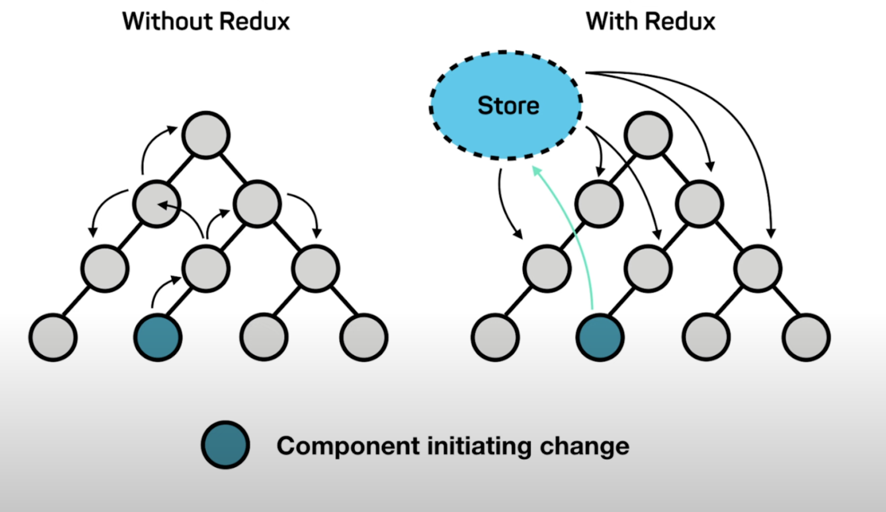

### 상태관리

- 지역상태: 특정 컴포넌트 안에서만 관리됨
- 전역상태: 프로젝트 전체에 영향을 끼침

**why 전역상태 관리가 필요?**

- props drilling 해결을 위해



## Context API

일일이 props를 넘겨주지 않고도 컴포넌트 트리 전체에 데이터를 제공할 수 있는 리액트 내장 툴 →(전역상태 관리 툴)

**장점**

- 사용 간단

**단점**

- 불필요한 렌더링이 많다
  - context의 상태값이 달라지면 구독하고 있는 하위 컴포넌트가 모두 다시 랜더링 된다 :(

→ 단순히 props drilling 해결이 목적이고 랜더링 최적화가 필요없는 상태라면 Context로 충분히 해결가능

## Recoil

페이스북에서 만든 상태관리 라이브러리로 React 문법에 친화적

**장점**

- 적은 코드량
- 랜더링 최적화
- 간편한 비동기 처리

**단점**

- 안정성에 대한 우려
  - 아직 experimental
- 관련 오픈소스 생태계가 redux에 비해 부족

## 사용법

```jsx
import './App.css';
import { useState } from 'react';
function Counter(props) {
  return (
    <div>
      <h1>Counter</h1>
      <button
        onClick={() => {
          props.onIncrease();
        }}
      >
        +
      </button>
      {props.count}
    </div>
  );
}
function DisplayCounter(props) {
  return <div>{props.count}</div>;
}
function App() {
  const [count, setCount] = useState(10);

  return (
    <div className="App">
      <Counter count={count} onIncrease={() => setCount(count + 1)} />
      <DisplayCounter count={count} />
    </div>
  );
}

export default App;
```

다음과 같은 코드를 recoil을 사용하도록 바꾸어보자.

`npm install recoil`

전역으로 상태를 관리하고자 하는 곳을 아래와 같이 RecoilRoot 컴포넌트로 감싸준다.

```jsx
const root = ReactDOM.createRoot(document.getElementById('root'));
root.render(
  <React.StrictMode>
    <RecoilRoot>
      <App />
    </RecoilRoot>
  </React.StrictMode>
);
```

다음으로는 전역상태를 만들어준다. 이 전역상태는 atom이라고 불린다. 아톰의 이름은 key 프로퍼티로 주고 default로 아톰을 초기화 해줄 수 있다.

```jsx
import { atom } from 'recoil';

export const countState = atom({
  key: 'count',
  default: 10,
});
```

이렇게 만든 전역상태를 사용하기 위해 다음과 같이 한다.

괄호 안에 사용할 아톰(전역상태) 이름을 적어주면 된다.

이렇게 recoil을 사용하도록 바꾸면 카운터와 디스플레이카운터 컴포넌트는 전역상태인 countState를 구독하고 있는 형태가 된다.

```jsx
import './App.css';
import { useRecoilState } from 'recoil';
import { countState } from './atom.js';

const countState = atom({
  key: 'count',
  default: 10,
});

function Counter() {
  const [count, setCount] = useRecoilState(countState);

  return (
    <div>
      <h1>Counter</h1>
      <button
        onClick={() => {
          setCount(count + 1);
        }}
      >
        +
      </button>
      {count}
    </div>
  );
}
function DisplayCounter() {
  const [count] = useRecoilState(countState);
  // 읽어오기만 하므로 setCount는 쓰지 않아도 된다.
  return <div>{count}</div>;
}
function App() {
  return (
    <div className="App">
      <Counter />
      <DisplayCounter />
    </div>
  );
}

export default App;
```

---

atom 외에도 selector라는것이 있다.

**Selector**

selector는 atom이나 다른 selector을 입력으로 받아들여 새로운 값으로 반환시킨다.

사용시에는 기본적으로 key와 get 프로퍼티를 써 줘야 한다.

atom에서와 같이 key는 selector의 이름을 적어줘야한다. (고유한 이름으로 생성한다)

get은 아래의 해당 형식과 같이 사용하면 된다. 다만, get(사용하고자 하는 atom / 다른 selector의 이름) 형태로 사용하여 원하는 atom/selector을 **다른 값으로 반환**시켜 사용한다.

```jsx
const charCountState = selector({
  key: 'charCountState', // unique ID (with respect to other atoms/selectors)
  get: ({ get }) => {
    const text = get(textState); //textState대신 사용하고자 하는 atom / selector의 key값을 넣어주시면 됩니다.

    return text.length;
  },
});
```

selector는 useRecoilVallue()를 사용하여 해당 값을 읽을 수 있다.

```jsx
function CharacterCount() {
  const count = useRecoilValue(charCountState);

  return <>Character Count: {count}</>;
}
```
