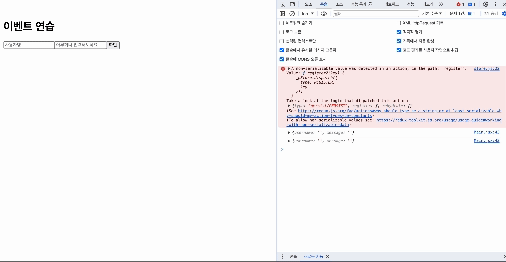

# 이벤트 핸들링

이벤트..?

-> 사용자가 웹 브라우저에서 DOM 요소들과 상호 작용하는 것

ex) onmouseover, onclick, onchange......

## 리액트의 이벤트 시스템

```jsx
import {useState} from 'react';

const Say = () => {

  const [message,setMessage] = useState('');
  const onClickEnter = () => setMessage('안녕하세요!');
  const onClickLeave = () => setMessage('안녕히 가세요!');

  const [color,setColor] = useState('black');

  return(

    <div>
    <button onClick={onClickEnter} >입장</button>
    <button onClick={onClickEnter} >입장</button>
    (...)
  );

}

```

## 이벤트를 사용할 때 주의사항

1. 이벤트 이름은 카멜 표기법으로 작성
2. 이벤트에 실행할 자바스크립트 코드를 전달하는 것이 아니라, 함수 형태의 값을 전달
3. DOM 요소에만 이벤트를 설정 가능

> **2번 관련 오류가 났던 경험이 있음!**
   
```jsx
import { useSelector, useDispatch } from "react-redux";
import Stack from "@mui/material/Stack";
import Button from "@mui/material/Button";
import { decreaseCount, increaseCount } from "../store/cart/cartSlice";
import { selectCartTotal } from "../store/cart/cartSlice";

function Cart() {
  const dispatch = useDispatch();
  const list = useSelector((state) => state.cart);
  const total = useSelector(selectCartTotal);

  const handelPlus = (id) => {
    dispatch(increaseCount(id));
  };

  const handelMinus = (id) => {
    dispatch(decreaseCount(id));
  };

  return (
    <Stack spacing={2} direction="column" margin={5} alignItems="center">
      {list.map((data) => (
        <Stack key={data.id} spacing={2} margin={5}>
          <div>{"상품 이름: " + data.title}</div>
          <div>{"가격: " + data.price}</div>
          <Stack spacing={2} direction="row">
            <Button variant="outlined" onClick={handelPlus(data.id)}>
              +
            </Button>
            <div>{"갯수: " + data.count}</div>
            <Button variant="outlined" onClick={handelMinus(data.id)}>
              -
            </Button>
          </Stack>
        </Stack>
      ))}
      <div>상품 총액: {total}</div>
    </Stack>
  );
}

export default Cart;
```

위와 같이 작성했더니 화면이 동작하지 않게되었습니다...

**이유?**

버튼 클릭 시 함수가 즉시 호출되는 형태로 작성
-> 이를 해결하기 위해서는 콜백 함수를 사용하여 이벤트 핸들러를 올바르게 작성해야 합니다.

**해결!**

```jsx
<Button variant="outlined" onClick={()=>handelMinus(data.id)}>
              -
</Button>
```

콜백함수로 변경!


## 콜백함수와 직접 호출

`onClick={handelPlus(data.id)}`는 함수를 직접 호출하는 것입니다.
`onClick={()=>handelPlus(data.id)}`는 콜백 함수로 작성한 것입니다.
 
 1. 실행 시점
	- 직접 호출
    	
        - 렌더링 시점에 함수가 호출, 이벤트가 발생 하기 전에 함수가 실행
    - 콜백
    	
        - 클릭 이벤트가 발생했을 경우에만 함수가 실행됨
 2. 클로저
 	- 직접 호출
    	
        - 클로저 문제가 발생할 수 있음
          - 클로저란, 외부 함수의 실행이 끝나 함수가 소멸되어도 내부 함수가 외부 함수의 변수에 접근할 수 있는 것
        	- 클로저문제란, 함수가 선언될 당시의 상태를 유지하면서 실행되는 현상
  
    - 콜백
    	
        - 클로저 문제 피할 수 있음
   
  예시) 반복문 안에서 이벤트 핸드러를 등록할 때 직접호출을 사용하게 되면 반복문의 마지막 값만을 참조하게 됨

  >클로저 예시상황

  ```jsx
  for (var i = 0; i < 5; i++) {
  setTimeout(function() {
    console.log(i);
  }, 1000);
}

  ```

  위의 결과는 5가 5번 출력되게 된다.

  **이유?**

  setTimeout 함수 내부의 콜백 함수가 외부 함수인 for 루프의 변수 i에 접근하기 때문입니다. setTimeout 함수는 비동기적으로 실행되는데, 콜백 함수가 실제로 실행되는 시점은 for 루프가 이미 완료된 이후입니다. 따라서 setTimeout 함수 내부의 콜백 함수는 for 루프가 종료된 후에 실행되며, 이때 i의 값은 이미 5가 되어있습니다.

  **해결!**

  ```jsx
  for (var i = 0; i < 5; i++) {
  (function(j) {
    setTimeout(function() {
      console.log(j);
    }, 1000);
  })(i);
}
  ```

  콜백함수로 작성해주면 됩니다.


3. 렌더링
	- 직접호출로 작성하게 되면 함수를 호출하게 되고 상태 값이 변하게 됨
    	
        - 이는 과한 렌더링을 유발

## onKeyPress 이벤트 핸들링

comment 인풋에서 Enter를 눌렀을 때 handleClick 메서드를 호출하도록 코드 작성

```jsx
import { useState } from 'react';

const EventPractice = () => {
  const [form,setForm] = useState({username:'',message:''});
  const {usename,message} = form;
  const onChange = e => {
    const nextForm = {
      ...form,
      [e.target.name]: e.target.value
    };
    setForm(nextForm);
  };

  const onClick = () => {
    alert(username + ': ' + message );
    setForm({username:'',message:''});
  };

  const onKeyPress = e => {
    if(e.key === 'Enter'){
      onClick();
    }
  };

  return(
    <div>
      <h1>이벤트 연습</h1>
      <input 
      type="text"
      name="username"
      placeholder="사용자명"
      value={username}
      onChange={onChange}
      />
      <input 
      type="text"
      name="message"
      placeholder="아무거나 입력해보세요"
      value={message}
      onChange={onChange}
      onKeyPress={onKeyPress}
      />
      <button onClick={onClick}>확인</button>
    </div>
  )
}

export default EventPractice;
```
이렇게 구현해도 되지만 아래 자료를 보시면


console로 form을 찍어보면 계속해서 값을 참조하는 것을 확인할 수 있습니다. 사실 우리는 최종 입력 값만 필요하기 때문에 굳이 이렇게 짤 이유는 없습니다!
(위와 같이 짜야하는 경우는 검색기능..등)

## 비제어 컴포넌트로 변환

```jsx
import { useState } from 'react';

const EventPractice = () => {
  const usernameRef = useRef(null);
  const messageRef = useRef(null);
  const [form, setForm] = useState({ username: "", message: "" });

  const onClick = (e) => {
    e.preventDefault();
    const username = usernameRef.current.value;
    const message = messageRef.current.value;
    setForm({ username: username, message: message });
    alert(username + ": " + message);
    usernameRef.current.value = "";
    messageRef.current.value = "";
  };

  const onKeyPress = (e) => {
    if (e.key === "Enter") {
      onClick(e);
    }
  };

  useEffect(() => {
    console.log(form);
  }, [form]);

  return (
    <div>
      <form onSubmit={onClick}>
        <h1>이벤트 연습</h1>
        <input
          type="text"
          name="username"
          placeholder="사용자명"
          ref={usernameRef}
        />
        <input
          type="text"
          name="message"
          placeholder="아무거나 입력해보세요"
          ref={messageRef}
          onKeyPress={onKeyPress}
        />
        <button type="submit">확인</button>
      </form>
    </div>
  );
}

export default EventPractice;
```



이렇게 비제어로 잘 짜진걸 확인할 수 있습니다~~!

### 참고블로그

[이벤트 리스너(event listener)와 콜백함수(call back function)](https://velog.io/@usreon/%EC%9D%B4%EB%B2%A4%ED%8A%B8-%EB%A6%AC%EC%8A%A4%EB%84%88event-listener%EC%99%80-%EC%BD%9C%EB%B0%B1%ED%95%A8%EC%88%98call-back-function)
[[JavaScript]Callback vs Promise 자바스크립트 콜백함수 vs 프로미스 예시, 비교](https://velog.io/@eunjin/JavascriptCallback-vs-Promise-%EC%9E%90%EB%B0%94%EC%8A%A4%ED%81%AC%EB%A6%BD%ED%8A%B8-%EC%BD%9C%EB%B0%B1%ED%95%A8%EC%88%98-vs-%ED%94%84%EB%A1%9C%EB%AF%B8%EC%8A%A4-%EC%98%88%EC%8B%9C-%EB%B9%84%EA%B5%90)
[콜백과 이벤트](https://velog.io/@kakasoo/%EC%BD%9C%EB%B0%B1%EA%B3%BC-%EC%9D%B4%EB%B2%A4%ED%8A%B8)
[생활코딩 댓글](https://m.facebook.com/groups/174499879257223?view=permalink&id=981257408581462&refsrc=deprecated&_rdr)
[클로저](https://developer.mozilla.org/ko/docs/Web/JavaScript/Closures)
[[JavaScript] 클로저 (Closure)](https://oagree0123.tistory.com/16)