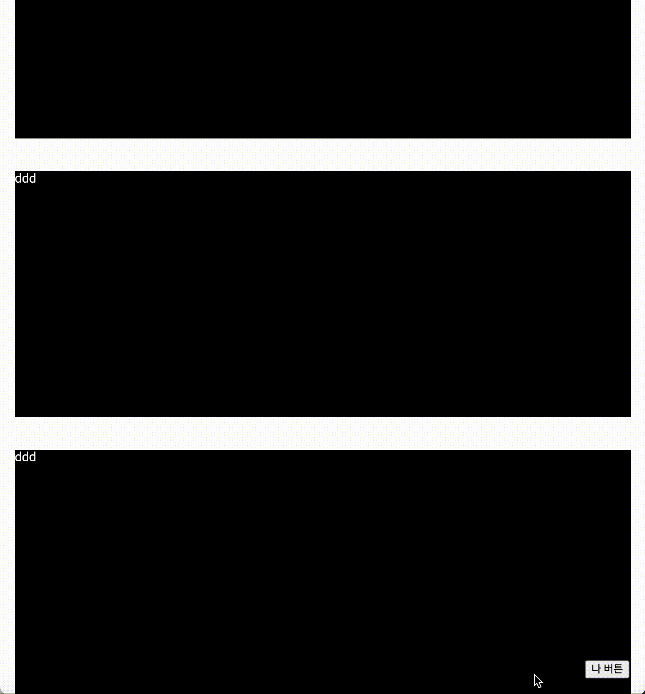
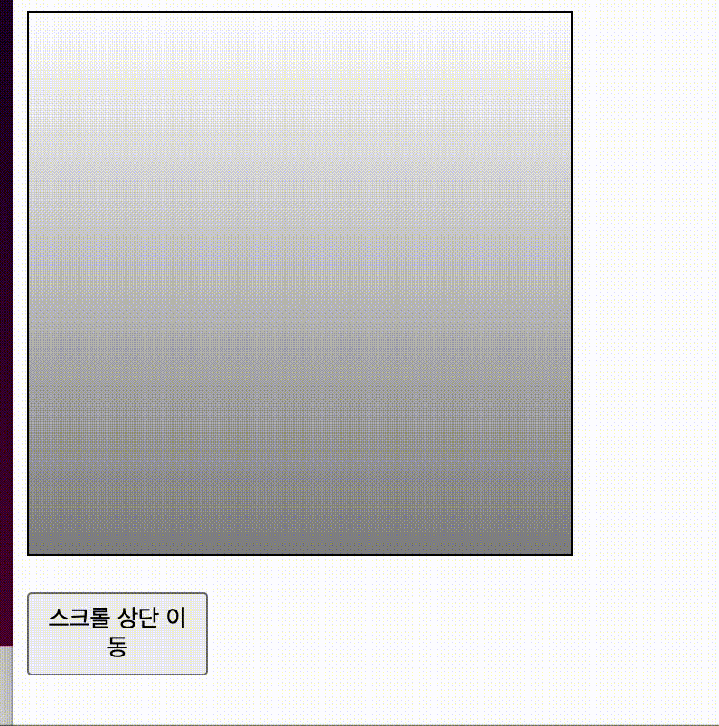
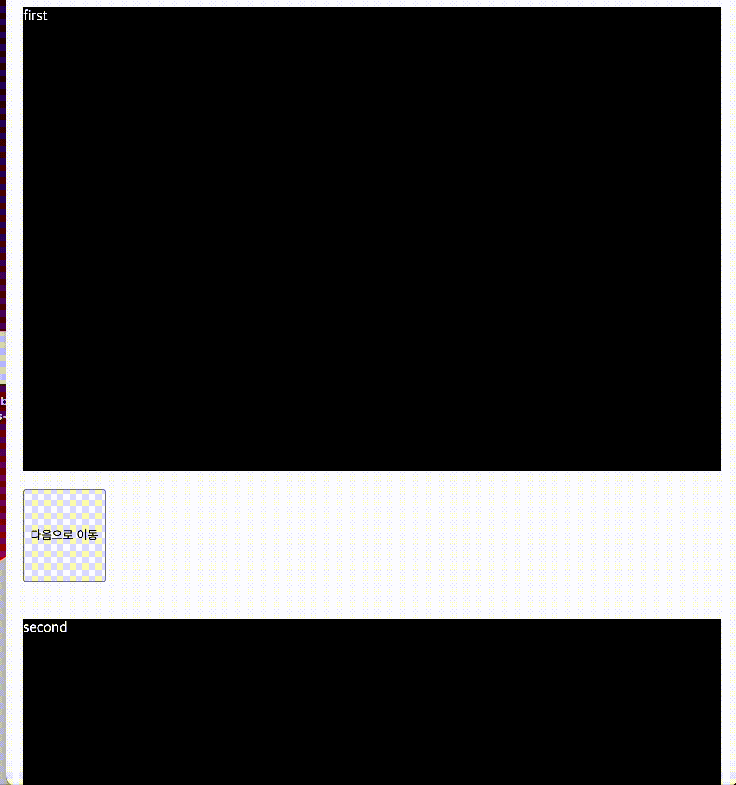

# DOM?

Document Object Model, HTML 요소를 Javascript Object 처럼 조작할 수 있도록 함

> Q. 리액트에서 컴포넌트 안에서 id를 사용하면 안되나요?
>
> A. 사용은 가능하지만 권장하지는 않는다!
>
> HTML에서 DOM의 id는 유일해야 하는데 위와 같이 id를 붙여주게 되면 중복 id를 가진 DOM이 여러개 생기게 됩니다.
>
> id를 사용해야 하는 상황이 오면 id에 추가 텍스트를 붙여 중복을 방지해야함 (ex) btn01, btn02 ...)

# ref?

render 메서드에서 생성된 DOM 노드나 React 엘리먼트에 접근하는 방법을 제공

## 사용해야 하는 상황?

"DOM을 직접적으로 건드려야 할 때"

리액트가 자동으로 렌더링 아웃풋과 맞추도록 DOM을 업데이트 하기 때문에, 컴포넌트를 직접 조작할 일은 흔치 않습니다.

하지만!
가끔은 리액트가 관리하는 DOM 요소에 직접 접근해야 할 필요가 있습니다.

- 특정 Input에 포커스 주기
- 스크롤 박스 조작하기
- Canvas 요소에 그림 그리기
- 등...

### ref 사용법

1. 콜백 함수를 사용하기!

ref를 달고자 하는 요소에 ref라는 콜백 함수를 props로 전달해 주면 됩니다.

```javascript
<input ref={(ref)=>{this.input=ref}}/>
```

2. createRef 를 통한 설정

```javascript

import {Component} from 'react';

class RefSample extends Component {
  input = React.createRef();

  handleFocus = () => {
    this.input.current.focus();
  }

  render(){
    return(
      <div>
        <input ref={this.input} />
      </div>
    );
  }
}

export default RefSample;
```

### 컴포넌트에 ref 달기!

```jsx
<MyComponent ref={(ref)=>{this.myComponent=ref}} />
```

이렇게 하면 MyComponents 내부의 메서드 및 멤버 변수에도 접근할 수 있습니다! (예: myComponent.handleClick, myComponent.input 등)

## 예시

책에는 클래스형으로 나와있어서 함수형으로 찾아봤습니다.

### 기본 페이지에서 스크롤바 상단으로 이동

```jsx
import Layout from "./components/Layout";
import styled from "styled-components";

function App() {
  const goToTop = () => {
    window.scrollTo({ top: 0, behavior: "smooth" });
  };

  return (
    <Layout>
      <StyledBox>ddd</StyledBox>
      <StyledBox>ddd</StyledBox>
      <StyledBox>ddd</StyledBox>
      <StyledBox>ddd</StyledBox>
      <StyledBox>ddd</StyledBox>
      <StyledBox>ddd</StyledBox>
      <StyledBox>ddd</StyledBox>
      <StyledBox>ddd</StyledBox>
      <StyledBox>ddd</StyledBox>
      <StyledBox>ddd</StyledBox>
      <StyledBox>ddd</StyledBox>
      <StyledBox>ddd</StyledBox>
      <StyledBox>ddd</StyledBox>
      <StyledBox>ddd</StyledBox>
      <StyledBox>ddd</StyledBox>
      <StyledBtn onClick={goToTop}>나 버튼</StyledBtn>
    </Layout>
  );
}

export default App;

const StyledBox = styled.div`
  height: 300px;
  background-color: black;
  color: white;
  margin: 10px;
`;

const StyledBtn = styled.button`
  position: fixed;
  bottom: 20px;
  right: 20px;
`;

```



### 특정 컴포넌트의 스크롤을 상단으로 이동

**ScrollBox.tsx**

```jsx
import { forwardRef } from "react";
import styled from "styled-components";

const ScrollBox = forwardRef((props, ref) => {
  return (
    <StyleBox ref={ref}>
      <InnerStyle />
    </StyleBox>
  );
});

export default ScrollBox;

const StyleBox = styled.div`
  border: 1px solid black;
  height: 300px;
  width: 300px;
  overflow: auto;
  position: relative;
`;

const InnerStyle = styled.div`
  width: 100%;
  height: 650px;
  background: linear-gradient(white, black);
`;

```

**App.tsx**

```jsx
import { useRef, useState, useEffect } from "react";
import Layout from "./components/Layout";
import ScrollBox from "./components/scrollBox";
import StyledBtn from "./components/StyledBtn";

function App() {
  const scrollRef = useRef<HTMLDivElement>(null);

  const handleButtonClick = () => {
    if (scrollRef.current) {
      scrollRef.current.scrollTo(0, 0);
    }
  };

  return (
    <Layout>
      <ScrollBox ref={scrollRef} />
      <StyledBtn onClick={handleButtonClick}>스크롤 상단 이동</StyledBtn>
    </Layout>
  );
}

export default App;

```



> Q. 근데 왜 컴포넌트에 forwardRef를 써야할까?
>
> A. 
> 함수형 컴포넌트에서는 ref를 직접 전달할 수 없습니다. ref는 클래스 컴포넌트의 인스턴스에 연결되기 때문입니다.
>
> 인스턴스: 클래스를 기반으로 생성된 구체적인 실체,
> 클래스는 객체를 생성하기 위한 템플릿
> 인스턴스는 그 템플릿을 기반으로 실제로 메모리에 할당된 객체 

### 스크롤바 각각 컴포넌트로 이동

```jsx
import { useRef, useState, useEffect } from "react";
import Layout from "./components/Layout";
import styled from "styled-components";

function App() {
  const focusFirst = useRef<HTMLDivElement>(null);
  const focusSecond = useRef<HTMLDivElement>(null);
  const focusLast = useRef<HTMLDivElement>(null);

  const onMoveToFocus = (focus: React.RefObject<HTMLDivElement>) => {
    focus.current?.scrollIntoView({ behavior: "smooth", block: "start" });
  };

  return (
    <Layout>
      <section ref={focusFirst}>
        <StyledBox>first</StyledBox>
        <StyledBtn onClick={() => onMoveToFocus(focusSecond)}>
          다음으로 이동
        </StyledBtn>
      </section>
      <section ref={focusSecond}>
        <StyledBox>second</StyledBox>
        <StyledBtn onClick={() => onMoveToFocus(focusLast)}>
          다음으로 이동
        </StyledBtn>
      </section>
      <section ref={focusLast}>
        <StyledBox>third</StyledBox>
        <StyledBtn onClick={() => onMoveToFocus(focusFirst)}>
          처음으로 이동
        </StyledBtn>
      </section>
    </Layout>
  );
}

export default App;

const StyledBox = styled.div`
  height: 500px;
  background-color: black;
  color: white;
  margin: 10px;
`;

const StyledBtn = styled.button`
  height: 100px;
  margin: 10px;
`;
```



### 참고 자료

[리액트공식문서](https://react.dev/reference/react/useRef)
[[React] 스크롤 이동 페이지 만들기 with react useRef(), scrollIntoView()](https://velog.io/@newjin46/%EC%99%93%EC%86%A1-%EA%B0%9C%EB%B0%9C%EA%B8%B0-%EC%8A%A4%ED%81%AC%EB%A1%A4-%EC%9D%B4%EB%8F%99-%ED%8E%98%EC%9D%B4%EC%A7%80-%EB%A7%8C%EB%93%A4%EA%B8%B0-with-react-useRef-scrollIntoView)
[React ref와 forwardRef 그리고 useImperativeHandle 제대로 알기](https://blog.leaphop.co.kr/blogs/35)
[함수형 컴포넌트로 ref 보내기 | forwardRef에 대해 알아보자](https://pottatt0.tistory.com/entry/%ED%95%A8%EC%88%98%ED%98%95-%EC%BB%B4%ED%8F%AC%EB%84%8C%ED%8A%B8%EB%A1%9C-ref-%EB%B3%B4%EB%82%B4%EA%B8%B0-forwardRef%EC%97%90-%EB%8C%80%ED%95%B4-%EC%95%8C%EC%95%84%EB%B3%B4%EC%9E%90)
