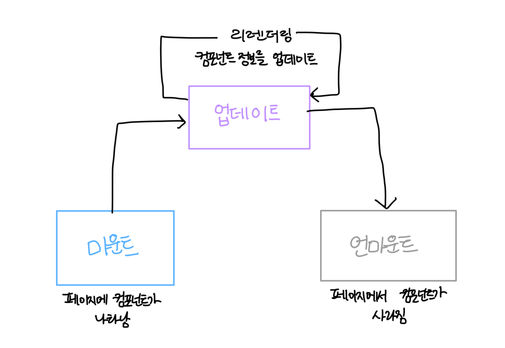
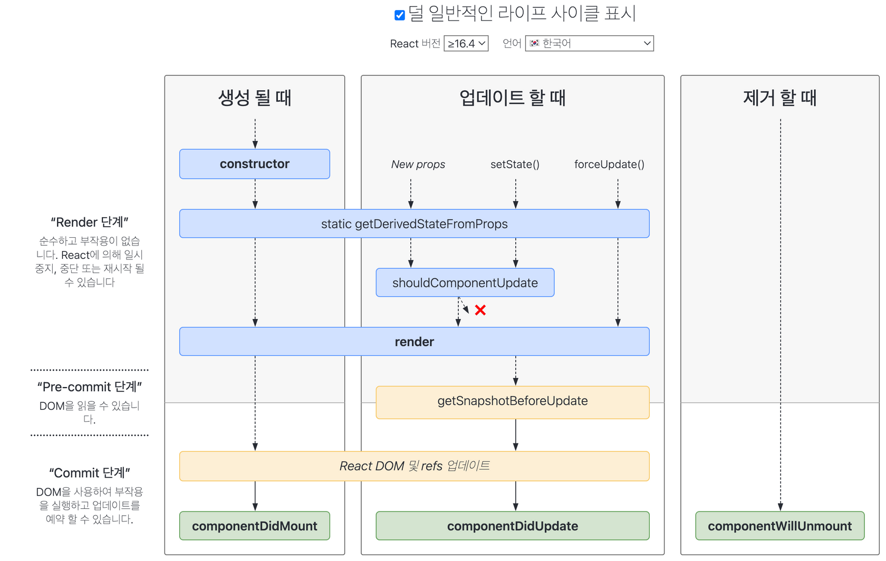

# 라이프사이클 메서드의 이해

라이프 사이클은 총 세 가지, **마운트, 업데이트, 언마운트** 카테고리로 나눕니다.

## 마운트

**마운트할 때 호출되는 메서드**

- 컴포넌트 만들기
- constructor
  - 컴포넌트를 새로 만들 때마다 호출되는 클래스 생성자 메서드
- getDerivedStateFromProps
  - props에 있는 값을 state에 넣을 때 사용하는 메서드
- render
  - 우리가 준비한 UI를 렌더링하는 메서드
- componentDidMount
  - 컴포넌트가 웹 브라우저사아에 나타난 후 호출하는 메서드

## 업데이트

1. props 바뀔 때
2. state 바뀔 때
3. 부모 컴포넌트가 리렌더링될 때
4. this.forceUpdate로 강제로 렌더링을 트리거할 때

- getDerivedStateFromProps
- shouldComponentUpdate
  -  컴포넌가 리렌더링을 해야 할지 말아야 할지를 결정하는 메서드
- true 반환 시 render 호출, false 반환 시 여기서 작업 취소
- render -> forceUpdate
- getSnapshotBeforeUpdate
- 웹 브라우저상의 실제 DOM 변화
- componentDidUpdate

## 언마운트

- 언마운트하기
- componentWillUnmount
  - 컴포넌트가 웹 브라우저상에서 사라지기 전에 호출하는 메서드

# 라이프사이클 메서드 살펴보기

### render()

this.props와 this.state에 접근할 수 있습니다.
리액트 요소를 반환합니다.
아무것도 보여주고 싶지 않을 경우 null/false를 반환합니다.

### constructor 메서드

컴포넌트의 생성자 메서드 입니다.
컴포넌트를 만들 때 처음으로 실행됩니다.

### componentDidMount 메서드

컴포넌트를 만들고, 첫 렌더링을 다 마친 후 실행됩니다.

### shouldComponentUpdate 메서드

props또는 state를 변경했을 때, 리렌더링을 시작할지 여부를 지정하는 메서드입니다.

### getSnapshotBeforeUpdate 메서드

render에서 만들어진 결과물이 브라우저에 실제로 반경되기 직전에 호출됩니다.
업데이트하기 직전의 값을 참고할 일이 있을 때 사용됩니다.
(예시: 스크롤바 위치)

### componentDidUpdate 메서드

리렌더링을 완료한 후 실행됩니다.
prevProps 또는 prevState를 사용하여 컴포넌트가 이전에 가졌던 데이터에 접근할 수 있습니다.
getSnapshotBeforeUpdate에서 반환한 값이 있다면 여기서 snapshot 값을 전달받을 수 있습니다.

### componentWillUnmount 메서드

컴포넌트를 DOM에서 제거할 때 실행됩니다.
componentDidMount에서 등록한 이벤트, 타이머, 직접 생성한 DOM이 있다면 여기서 제거 작업을 해야 합니다.

### componentDidCatch 메서드

컴포넌트 렌더링 도중에 에러가 발생했을 때 애플리케이션이 먹통이 되지 않고 오류 UI를 보여 줄 수 있게 해 줍니다.

