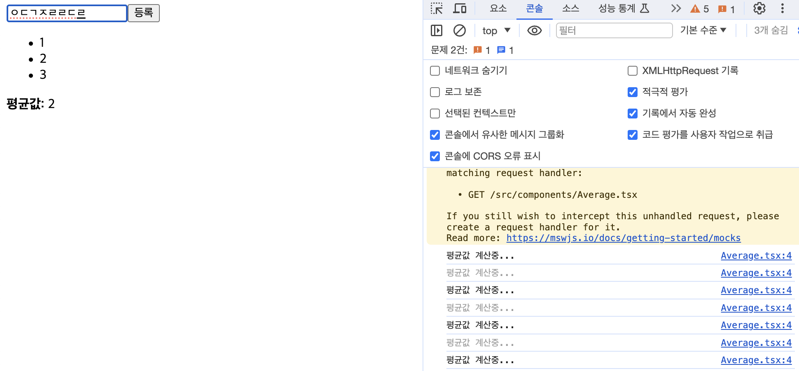
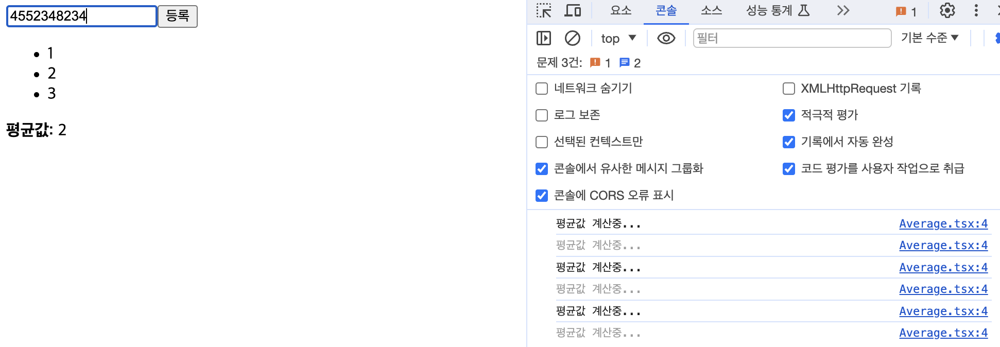
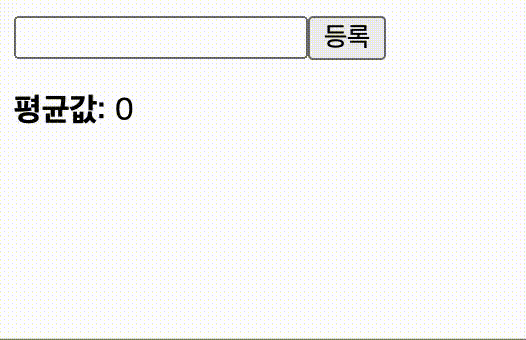

# Hooks

는 함수 컴포넌트에서도 상태 관리를 할 수 있는, 렌더링 직후 작업을 설정하는 useEffect 등의 기능을 제공하여 기존의 함수 컴포넌트에서 할 수 없었던 다양한 작업을 할 수 있게 해줍니다.

이전에 리액트가 겪던 문제들을 해결해주며 클래스형 컴포넌트를 사용하지 않고도 함수형 컴포넌트에서 상태값 접근과 자식 요소에 접근이 가능해졌습니다.

## useState

가변적 상태를 지닐 수 있게 해줍니다.

### useState 여러번 사용하기

하나의 useState는 하나의 상태만 관리할 수 있습니다.
관리해야 할 상태가 여러개라면 여러개 사용하면 됩니다.

> 하지만 연관있는 데이터라면?

```jsx

const [form,setForm] = useState({
  name:"",
  nickName:""
})

const onChangeInputForm = (e) => {
    const { name } = e.target;
    const formTemp = { ...form, [name]: e.target.value };
    setForm(formTemp);
};

```

이런식으로 객체형태로 관리하는 것이 좋습니다. 
하지만 이렇게 입력받는 값이 많아진다면
그땐 비제어 컴포넌트를 이용하는 편이 좋다고 생각합니다!

## useEffect

리액트 컴포넌트가 렌더링 될 때마다 특정 작업을 수행하도록 설정할 수 있는 Hook 입니다.

### 마운트 될 때만 실행

```jsx
useEffect(()=>{
},[])
```

### 특정 값이 업데이트될 때만 실행

```jsx
useEffect(()=>{
},[name/*특정값을 여기 넣어주면 됨*/])
```

### 뒷정리하기

```jsx
useEffect(()=>{

  return () => {
    /*뒷정리 할 내용*/
  }

},[name/*특정값을 여기 넣어주면 됨*/])
```

## useReducer

useState보다 더 다양한 컴포넌트 상황에 따라 다양한 상태를 다른 값으로 업데이트해 주고 싶을 때 사용하는 Hook 입니다.

전역상태관리 라이브러리를 이용하면 더 쉽습니다!

## 전역 상태 라이브러리 종류와 차이점

### 상태 관리 유형 분류

1. Flux 방식

    **Redux**, **Zustand**가 이 유형에 속합니다.
    **중앙 집중식 상태 관리 솔루션** 입니다.
    데이터가 단방향으로 흐릅니다.
   

2. Atomic 방식
  
  **Recoil**, **Jotai**가 이 유형에 속합니다.
  **전체 상태를 원자로** 나누는 것을 추구합니다.

(Proxy 방식 인 MobX도 있지만 잘 사용안한다고 해서 소개하진 않겠습니다.)

## useMemo

함수 컴포넌트 내부에서 발생하는 연산을 최적화할 수 있습니다.

**Average.tsx**

```jsx
import { useState } from "react";

const getAverage = (numbers: number[]) => {
  console.log("평균값 계산중...");
  if (numbers.length === 0) return 0;

  const sum = numbers.reduce((a, b) => a + b);
  return sum / numbers.length;
};

const Average = () => {
  const [list, setList] = useState<number[]>([]);
  const [number, setNumber] = useState<string>("");

  const onChange = (e: React.ChangeEvent<HTMLInputElement>) => {
    setNumber(e.target.value);
  };
  const onInsert = () => {
    const nextList = list.concat(Number(number));
    setList(nextList);
    setNumber("");
  };

  return (
    <div>
      <input value={number} onChange={onChange} />
      <button onClick={onInsert}>등록</button>
      <ul>
        {list.map((value, index) => (
          <li key={index}>{value}</li>
        ))}
      </ul>
      <div>
        <b>평균값: </b> {getAverage(list)}
      </div>
    </div>
  );
};

export default Average;

```



인풋 내용이 바뀔 때는 평균값을 다시 계산할 필요가 없는데, 수정되는 문제가 발생합니다!

**Average.tsx**

```tsx
import { useState, useMemo } from "react";

const getAverage = (numbers: number[]) => {
  console.log("평균값 계산중...");
  if (numbers.length === 0) return 0;

  const sum = numbers.reduce((a, b) => a + b);
  return sum / numbers.length;
};

const Average = () => {
  const [list, setList] = useState<number[]>([]);
  const [number, setNumber] = useState<string>("");

  const onChange = (e: React.ChangeEvent<HTMLInputElement>) => {
    setNumber(e.target.value);
  };
  const onInsert = () => {
    const nextList = list.concat(Number(number));
    setList(nextList);
    setNumber("");
  };

  const avg = useMemo(() => getAverage(list), [list]);

  return (
    <div>
      <input value={number} onChange={onChange} />
      <button onClick={onInsert}>등록</button>
      <ul>
        {list.map((value, index) => (
          <li key={index}>{value}</li>
        ))}
      </ul>
      <div>
        <b>평균값: </b> {avg}
      </div>
    </div>
  );
};

export default Average;

```


새로운 값이 입력될 때만 평균값이 계산되는 것을 확인할 수 있습니다.

## useCallback

useMemo와 비슷한 함수입니다.
렌더링 성능을 최적화해야 하는 상황에서 사용합니다.

**Average** 컴포넌트에서도 onChange와 onInsert라는 함수를 선언해 주었습니다.
이렇게 선언하면 컴포넌트가 리렌더링될 때마다 새로 만들어진 함수를 사용하게 됩니다.
컴포넌트의 렌더링이 자주 발생하거나 렌더링해야 할 컴포넌트의 개수가 많아지면 이 부분을 최적화 해주는 것이 좋습니다.

```tsx
(...)

const onChange = useCallback((e: React.ChangeEvent<HTMLInputElement>) => {
    setNumber(e.target.value);
  }, []); // 컴포넌트 처음 렌더링 될 때만 함수 생성

  const onInsert = useCallback(() => {
    const nextList = list.concat(Number(number));
    setList(nextList);
    setNumber("");
  }, [number, list]); //number 혹은 list가 변경되었을 때만 함수 생성

(...)
```

함수 부분을 위와 같이 변경해주면 됩니다.

> Q. useCallback 과 useEffect의 차이??
>
> A. **사용 목적**이 다릅니다.
>
> **useCallback**
> 콜백함수를 자식에게 전달해줄 때 사용
> 자주 렌더링 위험이 있는 요소를 성능 최적화하기 위해 사용
> **useEffect**
> 사이드 이펙트 방지를 위해 사용
> API 통신, 이벤트 리스너 추가, DOM 업데이트 등

## useRef

함수 컴포넌트에서 ref를 쉽게 사용할 수 있도록 해줍니다.

Average 컴포넌트에서 **등록** 버튼을 눌럿을 때 포커스가 인풋 쪽으로 넘어가도록 코드를 작성해 보겠습니다.
 
```tsx
import { useState, useMemo, useCallback, useRef } from "react";

const getAverage = (numbers: number[]) => {
  console.log("평균값 계산중...");
  if (numbers.length === 0) return 0;

  const sum = numbers.reduce((a, b) => a + b);
  return sum / numbers.length;
};

const Average = () => {
  const [list, setList] = useState<number[]>([]);
  const [number, setNumber] = useState<string>("");
  const inputEl = useRef<HTMLInputElement>(null);

  const onChange = useCallback((e: React.ChangeEvent<HTMLInputElement>) => {
    setNumber(e.target.value);
  }, []); // 컴포넌트 처음 렌더링 될 때만 함수 생성

  const onInsert = useCallback(() => {
    const nextList = list.concat(Number(number));
    setList(nextList);
    setNumber("");
    inputEl.current?.focus();
  }, [number, list]); //number 혹은 list가 변경되었을 때만 함수 생성

  const avg = useMemo(() => getAverage(list), [list]);

  return (
    <div>
      <input value={number} onChange={onChange} ref={inputEl} />
      <button onClick={onInsert}>등록</button>
      <ul>
        {list.map((value, index) => (
          <li key={index}>{value}</li>
        ))}
      </ul>
      <div>
        <b>평균값: </b> {avg}
      </div>
    </div>
  );
};

export default Average;

```

기존엔 인풋에 포커스가 걸리지 않았지만



코드를 변경한 후엔 인풋에 포커스가 걸리게 됩니다.


## 커스텀 Hooks 만들기

비슷한 기능을 공유할 경우, 우리만의 Hook으로 작성하여 로직을 재작성 할 수 있습니다.

앞에 use를 붙이고 hook을 사용하면 그것이 **Custom Hook** 입니다.

### Hook의 원칙

1. 훅을 조건부 블록에서 사용하지 않는다.
2. 훅을 일반 javascript 함수 스코프 내에서 호출하지 않는다. (하고 싶다면 커스텀 훅을 이용한다.)

- 조건부로 호출한 경우

```jsx
if(condition === true){
  const [name, setName] = useState('Mary');
}
```

- 일반 함수 몸체 내에서 호출한 경우

```jsx
function badPractice (){
  const [name, setName] = useState('Mary'); // 해당 badPractice가 호출되지 않는다면 이 훅의 호출을 보장할 수가 없다.
}
```

두 경우다 훅의 호출에서 해당 훅의 호출이 안될 가능성이 존재하므로, 기대하던 훅의 순서에서 벗어날 수도 있어서 문제가 됩니다.

[useHooks](https://usehooks.com/)에서 다양한 커스텀 훅들을 볼 수 있습니다.

### useMediaQuery

media query의 변화에 반응합니다.

```jsx
import * as React from "react";
import { useMediaQuery } from "@uidotdev/usehooks";
import { phone, tablet, laptop, desktop } from "./icons";

export default function App() {
  const isSmallDevice = useMediaQuery("only screen and (max-width : 768px)");
  const isMediumDevice = useMediaQuery(
    "only screen and (min-width : 769px) and (max-width : 992px)"
  );
  const isLargeDevice = useMediaQuery(
    "only screen and (min-width : 993px) and (max-width : 1200px)"
  );
  const isExtraLargeDevice = useMediaQuery(
    "only screen and (min-width : 1201px)"
  );

  return (
    <section>
      <h1>useMediaQuery</h1>
      Resize your browser windows to see changes.
      <article>
        <figure className={isSmallDevice ? "active" : ""}>
          {phone}
          <figcaption>Small</figcaption>
        </figure>
        <figure className={isMediumDevice ? "active" : ""}>
          {tablet}
          <figcaption>Medium</figcaption>
        </figure>
        <figure className={isLargeDevice ? "active" : ""}>
          {laptop}
          <figcaption>Large</figcaption>
        </figure>
        <figure className={isExtraLargeDevice ? "active" : ""}>
          {desktop}
          <figcaption>Extra Large</figcaption>
        </figure>
      </article>
    </section>
  );
}
```

미디어 크기에 따라서 대상체들이 화면에 보일지 보이지 않을지 결정짓게 됩니다.

### useDebounce

함수의 실행 혹은 상태 업데이트를 지연시킵니다.

> Q. 디바운스?
>
> A. 
> 이벤트를 그룹화하여 특정시간이 지난 후 하나의 이벤트만 발생하도록 하는 기술 

```jsx
import * as React from "react";
import { useDebounce } from "@uidotdev/usehooks";
import searchHackerNews from "./searchHackerNews";
import SearchResults from "./SearchResults";

export default function App() {
  const [searchTerm, setSearchTerm] = React.useState("js");
  const [results, setResults] = React.useState([]);
  const [isSearching, setIsSearching] = React.useState(false);
  const debouncedSearchTerm = useDebounce(searchTerm, 300);

  const handleChange = (e) => {
    setSearchTerm(e.target.value);
  };

  const handleSubmit = (e) => {
    e.preventDefault();
    const formData = new FormData(e.target);
    setSearchTerm(formData.get("search"));
    e.target.reset();
    e.target.focus();
  };

  React.useEffect(() => {
    const searchHN = async () => {
      let results = [];
      setIsSearching(true);
      if (debouncedSearchTerm) {
        const data = await searchHackerNews(debouncedSearchTerm);
        results = data?.hits || [];
      }

      setIsSearching(false);
      setResults(results);
    };

    searchHN();
  }, [debouncedSearchTerm]);

  return (
    <section>
      <header>
        <h1>useDebounce</h1>
        <form onSubmit={handleSubmit}>
          <input
            name="search"
            placeholder="Search HN"
            style={{ background: "var(--charcoal)" }}
            onChange={handleChange}
          />
          <button className="primary" disabled={isSearching} type="submit">
            {isSearching ? "..." : "Search"}
          </button>
        </form>
      </header>
      <SearchResults results={results} />
    </section>
  );
}
```

debouncedSearchTerm의 실행시간을 지연시킨 것을 확인할 수 있습니다.

### 참고블로그

[[React] Hooks란?](https://velog.io/@niboo/React-Hooks-%EB%9E%80)
[우리 팀이 Zustand를 쓰는 이유](https://velog.io/@greencloud/%EC%9A%B0%EB%A6%AC-%ED%8C%80%EC%9D%B4-Zustand%EB%A5%BC-%EC%93%B0%EB%8A%94-%EC%9D%B4%EC%9C%A0)
[[Hook] 커스텀 훅과 그 종류](https://velog.io/@chltjdrhd777/Hook-%EC%BB%A4%EC%8A%A4%ED%85%80-%ED%9B%85%EA%B3%BC-%EA%B7%B8-%EC%A2%85%EB%A5%98)
[useHooks](https://usehooks.com/)
[[React] useEffect와 useCallback 차이 간단 정리!](https://23log.tistory.com/192)