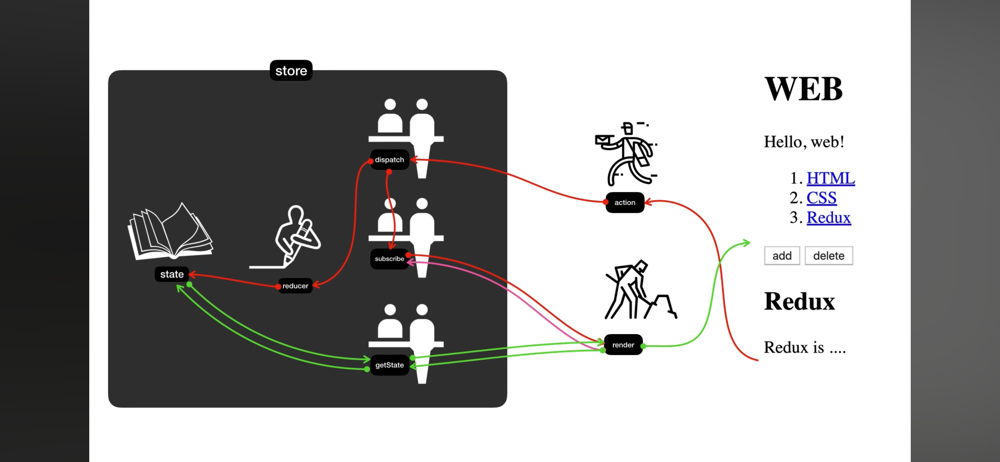

# 17장-18장. Redux

## Deep Dive - Redux

왜 사용하는가?

- props drilling 방지
- 중앙 집중 상태관리로 데이터 관리 로직을 분리하여 효율적으로 관리

### Redux 구성 파헤치기



1. store : 정보가 저장되는 곳
2. state : store 내 저장된 실제 정보
3. Reducer 함수 : state를 받아 action을 참조해서 새로운 state로 가공한다 => **state값을 변경한다.**

   ```javascript
   function reducer(oldState, action) {
     //...
   }
   const store = createStore(reducer); // 스토어를 생성하면서 인자로 reducer
   ```

4. Render : UI를 만든 코드
5. dispatch, subscribe, getState : 창구직원들

   - dispatch(useDispatch) : reducer를 호출해서 state의 값을 바꾸고, subscribe를 이용해서 render함수를 호출하여 UI를 갱신

   ```javascript
   store.dispatch(
     { type: "create", payload: { title: title } } // action
   );
   ```

   - getState(useSelector) : state 값을 가지고 온다.  
     📝 getState vs useSelector? 둘 다 스토어에 저장된 상태값을 반환해주는 역할이다.  
      **useSelector**는 Redux의 Hook으로 함수형 컴포넌트에서 사용 가능하고 함수를 전달하여 필요한 상태값만 선택적으로 가져올 수 있다. 단순히 값만 불러와주는 것이 아니라 값이 달라질때마다 자동으로 업데이트도 헤준다.  
      **getState**는 Redux store에 접근 가능한 곳이면 어디서든 사용가능하지만 상태값을 가져올 때 전체 상태를 가져온다. useSelector처럼 변화하는 상태값을 추적하여 업데이트해주지 않는다.

   ```javascript
   function render() {
     const state = store.getState();
     const state = useSelector((state) => state.id);
   }
   ```

   - subscribe : state의 값이 바뀔 때마다 render함수가 호출되면서 UI 갱신된다.

   ```javascript
   store.subscribe(render);
   ```

### Redux 기본 사용법

```javascript
// index.js
import { Provider } from "react-redux";
import { createStore } from "redux";

function reducer(state = initialState, action) {
  switch (action.type) {
    case A:
      return stateA;
    case B:
      return stateB;
    default:
      return state;
  }
}
let store = createStore(reducer);

ReactDOM.render(
  <Provider store={store}>
    <App />
  </Provider>
);
```

```javascript
// App.js
import { useSelector } from "react-redux";

function App() {
  const state = useSelector((state) => state.id);
}
return <div>{state}</div>;
```

### Redux 미들웨어를 사용하는 이유?

🚨Redux는 순수함수이기 때문에 다른 처리를 할 수 없다🚨

[액션] => [미들웨어] => [리듀서] => [스토어]

액션을 처리하기 전에 미들웨어가 여러가지 작업을 수행할 수 있다.

#### 비동기 처리 작업을 간편하게 가능(Redux-thunk, Redux-saga)

Redux는 동기적인 작업 처리에 적합한 구조이기 때문에  
미들웨어를 활용하며 비동기 작업을 간단하게 처리할 수 있다.

#### 로깅 및 디버깅 (redux-logger)

Redux 미들웨어를 사용하면 액션과 상태를 가로채서 로깅하거나 디버깅하기 쉽게 할 수 있다.

#### 코드를 모듈화하고 재사용성

여러 액션에서 재사용될 수 있으므로 코드의 재사용성을 높일 수 있다.

### 출처

-
