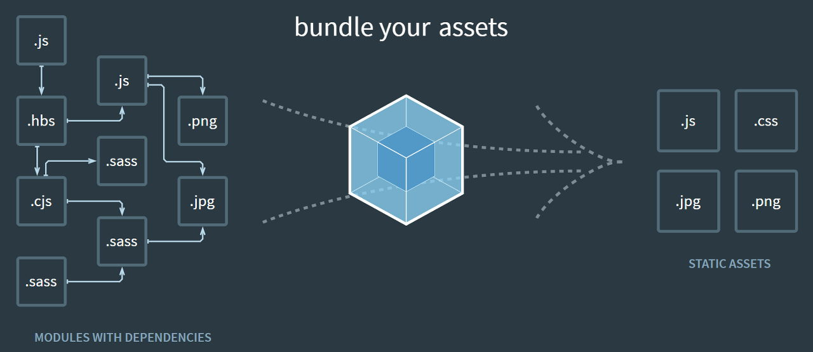

# 번들러란?


여러 개로 모듈화된 자바스크립트 파일을 하나로 합쳐주는 도구다.

브라우저는 모듈화된 자바스크립트는 읽지 못하기 때문에 브라우저에서 코드를 실행하려면 반드시 번들러가 필요하다.

하나의 자바스크립트 파일로 번들링 해줌으로써 한 번의 네트워크 요청으로 웹 페이지를 로드할 수 있다.

## 번들러의 종류
1. Webpack : Asset Management, 코드 분할, 트랜스파일링 등을 포함, 레퍼런스가 많고 안정적이지만 설정이 복잡하며 느린게 단점이다.
2. Rollup : 번들링과 최적화에 초점이 맞춰 설정이 비교적 쉽고 Webpack보다 가볍다.
3. Esbuild : GO로 작성된 번들러로, 코드 분할, 트랜스파일링 등을 포함, build 속도가 Webpack, Rollup에 비해 100배 정도 빠르지만 설정이 어렵다.
4. Vite : 의존성과 소스 코드를 나눠서 속도를 개선하고, 코드 수정 시 자동으로 재빌드하는 HMR 기능을 제공한다. 설정하는 것이 쉽고 빠르다.
주의할 점은 vite는 기본적으로 ES6를 타겟으로 번들을 생성하므로 ES5 이하는 별도의 polyfill을 설정해줘야한다.

# JSX
JSX는 자바스크립트의 확장 문법이며, XML과 매우 비슷하게 생겼다.

JSX로 작성된 코드는 브라우저에서 실행되기 전에 코드가 번들링되는 과정에서 Babel을 사용하여 자바스크립트 형태의 코드로 변환되어 렌더링 된다.

## JSX의 장점
JSX 코드와 자바스크립트로 작성된 코드를 비교하면 JSX가 보기 쉽고 익숙하다는 것이 장점이다.

먼저 JSX 코드는 다음과 같다.
```JSX
function App() {
  return (
    <div>
      Hello <b>react</b>
    </div>
  )
}
```

일반 자바스크립트 코드는 다음과 같다.
```js
function App() {
  return React.createElement("div", null, "Hello ", React.createElement("b", null, "react"));
}
```

또한 JSX로 작성하면 컴포넌트도 JSX 안에서 작성이 가능하기 때문에 컴포넌트를 HTML 태그 쓰듯이 사용할 수 있다.

## JSX 문법
1. **감싸인 요소**
   
   컴포넌트에 여러 요소가 있다면 반드시 부모 요소 하나로 감싸야 한다.

   그 이유는 Virtual DOM에서 컴포넌트 변화를 감지할 때 효율적으로 비교할 수 있도록 컴포넌트 내부는 하나의 DOM트리 구조로 이루어져야 하기 때문이다.

   또한 감쌀 때 `<div></div>` div태그로 감싸도 되지만 `<></>` 빈 태그로 감싸도 된다.
2. **자바스크립트 표현**
   
   JSX 내부에서는 자바스크립트 표현식을 사용할 수 있다.
   
   ```jsx
   const name = '리액트';
   return (
    <>
      <h1>{name} 안녕!</h1>
      <h2>잘 작동하나?</h2>
    </>
   );
   ```
   위 코드처럼 JSX 내부에서 자바스크립트 표현식 코드를 `{ }`로 감싸주면 된다.
3. **if문 대신 삼항 연산자**
   
   JSX 내부에서는 if문을 사용할 수 없다.
   
   하지만 조건에 따라 렌더링해야 할 때는 JSX 밖에서 if문을 사용하여 값을 설정하거나, 삼항 연산자를 사용하면 된다.

   ```jsx
   const name = '리액트';
   return (
    <>
      {
        name === '리액트' ? (
         <h1>{name} 안녕!</h1>
        ) : (
         <h2>리액트가 아니다.</h2>
        )
      }
    </>
   );
   ```
   위 코드는 name의 값이 `리액트` 유무에 따라 다르게 렌더링이 된다.
4. **AND 연산자(&&)를 사용한 조건부 렌더링**
   
   특정 조건을 만족할 때 해당 내용을 보여주고, 만족하지 않을 때는 아무것도 보여주지 않아야 하는 상황이 있다.

   이럴 때 AND 연산자를 통해 쉽게 구현할 수 있다.
   ```jsx
   const name = '리액트';
   return (
    <>
      {name === '리액트' && <h1>{name} 안녕!</h1>}
    </>
   );
   ```

   또는 아까와 같이 삼항 연산자로도 구현할 수 있다.
   ```jsx
   const name = '리액트';
   return (
    <>
      {name === '리액트' ? <h1>{name} 안녕!</h1> : null}
    </>
   );
   ```
   AND 연산자를 통해 조건부 렌더링을 할 수 있는 이유는 리액트에서 false를 렌더링할 때는 null과 마찬가지로 아무것도 보여주지 않기 때문이다.

   그렇다고 모든 falsy한 값을 안보여주는 것이 아니다.

   예외로 falsy인 값 0은 화면에 나타나므로 주의해야한다.
   > AND 연산자(&&)와 OR 연산자(||)의 동작 차이는 다음과 같다.
   ```js
   // AND 연산자는 두 값이 true여야만 true를 반환하므로 첫 번째 값이 true라 하더라도 두 번째 값이 false면 false를 반환한다.
   // 따라서 두 번째 값에 따라 true의 여부를 판단한다.
   console.log(true && true) // true
   console.log(true && false) // false
   console.log(false && true) // false

   // OR 연산자는 두 값 중 하나만 true여도 true를 반환하므로 첫 번째 값이 true면 두 번째는 실행하지도 않고 true를 반환한다.
   // 그래서 OR 연산자를 활용하면 undefined, null 값일 때 렌더링 시키고 싶은 값이 있을 때 사용하면 된다.
   console.log(true || true) // true
   console.log(true || false) // true
   console.log(false || true) // true
   ```
   이런 동작 과정을 통해 AND 연산자로 조건부 렌더링이 가능한 것이다.
5. **인라인 스타일**
   
   JSX 내부에서 인라인으로 스타일을 적용할 때는 카멜케이스로 작성해야한다.

   따라서 `font-size`를 `fontSize`로 작성해야 적용할 수 있다.
6. **class 대신 className**
   
   일반 HTML에서 CSS 클래스를 사용할 때는 `<div class="myclass"></div>`와 같이 작성했다면 JSX에서는 `className`으로 작성해야한다.

   class로 작성해도 동작은 하지만 리액트에서 className으로 변경 후 경고를 띄워준다.
    