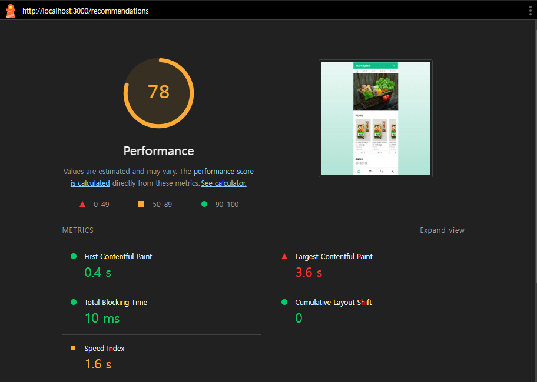
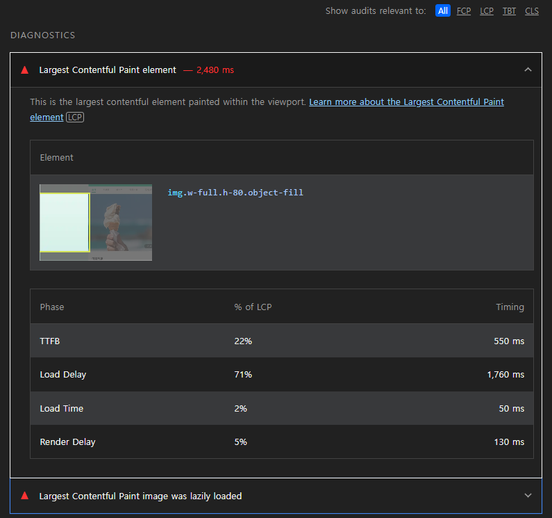

# Lighthouse 최적화

chrome에서 제공하는 웹 성능 최적화 도구

> "성능이 저하되면 사용자가 떠나고 매출이 감소한다. 반대로 말하면 성능이   향상되면 그만큼 사용자가 늘고 매출이 오른다.
> Think with Google / SOASTA Research, 2017

UX 를 개선하여 가입률과 전환율을 높이고 이탈률은 낮춰 더 많은 수익을 창출할 수 있기 때문에 웹 성능 최적화가 중요하다.

## 웹 성능을 결정하는 요소

로딩 성능과 렌더링 성능으로 결정된다.

### 로딩 성능

웹 페이지와 기타 리소스를 다운로드 할 때의 성능을 나타낸다.

HTML CSS JS 파일의 크기가 크다면 다운로드 시간이 오래걸려 사용자에게 늦게 표시될 것이다.

로딩 성능 개선 방법

- 다운로드해야 할 리소스의 수를 줄이거나 크기를 줄이는 것
- 코드 분할
- 리소스 우선순위 설정 후 preload

### 렌더링 성능

다운로드한 리소스를 가지고 화면을 그릴 때의 성능

자바스크립트가 렌더링 성능에 크게 영향을 준다.

렌더링 성능 개선 방법
- 매우 다양하며 서비스 유형, 브라우저 동작원리, 사용하는 프레임워크의 라이프사이클 등 웹 개발의 기본 지식을 이해하고 있어야 한다.

## Lighthouse 웹 성능 지표


Mode
- Navigation : lighthouse 기본 값, 초기 페이지 로딩 시 발생하는 성능 문제를 분석

- Timespan : 사용자가 정의한 시간동안 발생한 성능 문제를 분석

- Snapshot : 현재 상태의 성능 문제를 분석

Categories
- Performance : 웹 페이지의 로딩 과정에서 발생하는 성능 문제를 분석
- Accessibility : 서비스의 사용자 접근성 문제를 분석
- Best Practice : 웹 사이트의 보안 측면과 웹 개발의 최신 표준에 중점을 두고 분석
- SEO : 검색 엔진 에서 얼마나 잘 크롤링되고 검색 결과에 표시 되는지 분석
- Progress Web App : 서비스 워커와 오프라인 동작등  PWA 와 관련된 문제를 분석

## Navigation 모드의 Performance 를 측정



Performance 측정 후 각 지표를 확인한다

- First Contentful Paint (FCP)

 FCP는 페이지 로드가 시작된 후 뷰포트내의 의미있는 콘텐츠 일부가 처음 화면에 렌더링 될 때까지의 시간에 대한 지표.

- Speed Index (SI)

  웹 페이지 로드 중에 콘텐츠가 시각적으로 표시되는 속도에 대한 지표

  

    
- Largest Contentful Paint (LCP)

 FCP는 페이지 로드가 시작된 후 뷰포트내의 가장 큰 콘텐츠가 렌더링 될 때까지의 시간에 대한 지표.

- Time to Interactive (TTI)

  TTI는 사용자가 페이지와 상호작용이 가능한 시점까지 걸리는 시간에 대한 지표

- Total Blocking Time (TBT)

TBT 측정항목은 기본 스레드가 입력 반응성을 방지할 만큼 충분히 오랫동안 차단된 FCP 이후의 총 시간에 대한 지표.

- Cumulative Layout Shift (CLS)

  예기치 않은 레이아웃 변경을 측정한 지표

측정 후 하단의 진단 섹션을 참고하여 개선한다.

## 이미지 최적화

nextjs의 경우 [Image](https://nextjs.org/docs/pages/api-reference/components/image) 컴포넌트를 사용한 이미지 파일에 대해 source set 을 생성하므로 이미지 크기에 대한 최적화를 지원한다.

Image 컴포넌트의 아래의 속성으로 전략에 맞는 최적화를 진행할 수 있다.
- quality 
  
  최적화된 이미지의 품질, 1에서 100 사이의 정수입니다 기본 값은 75.

- priority

  true 인 경우 높은 우선순위를 가지며 preload 됨.
  
  priority 를 사용하는 이미지의 경우 lazy loading 이 자동으로 비활성화 됨.
  
  LCP 요소로 감지된 이미지에는 priority 속성을 사용해야 한다.

- placeholder

  이미지 데이터가 로딩되는 동안 사용될 표시자.

  blur, empty, 또는 data:image/.... 기본값은 empty.

  src가 static import object이고 가져온 이미지가 .jpg, .png, .webp 또는 .avif인 경우 이미지가 애니메이션으로 감지되는 경우를 제외하고는 BlurDataURL이 자동으로 채워진다.

  동적 이미지의 경우 무조건 blurDataURL 속성을 제공해야 한다.

### before


```typescript
// 개선 전

const eventImages = [
  'https://cdn.pixabay.com/photo/2015/05/04/10/16/vegetables-752153_1280.jpg',
  'https://cdn.pixabay.com/photo/2016/03/23/15/00/ice-cream-1274894_1280.jpg',
  'https://cdn.pixabay.com/photo/2017/01/31/09/30/raspberries-2023404_1280.jpg',
]

export default class EventBanner extends Component {
    ...
    return (
      <div className="relative h-80">
        <Slider {...settings}>
          {eventImages.map((eventImage, index) => (
            <Image
              key={index}
              src={eventImage}
              alt="event banner image"
              width={300}
              height={300}
              className="h-80 w-full object-fill"
            />
          ))}
        </Slider>
       ...
      </div>
    )
}
// src/app/layout.tsx

export default function RootLayout({ children }: { children: React.ReactNode }) {
  return (
    <html lang="ko-KR" className={pretendard.className}>
      <body className={`${pretendard.className} flex h-full items-center justify-center bg-fixed`}>
        <div className="no-scrollbar fixed h-full w-96 overflow-auto overflow-x-hidden bg-white">
          <Provider>{children}</Provider>
        </div>
        // 당장 사용하지 않는 script
        <Script src="https://cdn.iamport.kr/v1/iamport.js" />
        <Script src="//t1.daumcdn.net/mapjsapi/bundle/postcode/prod/postcode.v2.js" />
      </body>
    </html>
  )
}

```
진단 섹션에서 참고한 결과 



LCP 가 lazy loading 되고 있고 load delay 가 1.7ms 로 가장 많은 포션을 차지한다.

LCP에 preload를 적용하는 priority 속성을 적용하고 jpg 파일 보다 더 적은 용량으로 압축된느 avif 파일로 파일 형식을 변경한다.
([단, avif 파일은 호환성 문제에서 webp 파일보다 자유롭지 않다](https://namu.wiki/w/AVIF#s-3.1))


html, font, preload 된 이미지, css, script 순으로 로드되는 것을 네트워크 탭에서 확인 가능하다.

당장 필요하지 않은 script 인 portone 결제 모듈은 결제 페이지에서 불러오는 것으로 변경한다.


### after
```typescript
// 개선 후

// 이미지 파일의 형식을 jpg 에서 avif 로 변경
const eventImages = [
  '/images/vegetables.avif',
  '/images/ice-cream.avif',
  '/images/raspberries.avif',
]

export default class EventBanner extends Component {
    ...
    return (
      <div className="relative h-80">
        <Slider {...settings}>
          {eventImages.map((eventImage, index) => (
            <Image
              key={index}
              src={eventImage}
              alt="event banner image"
              width={300}
              height={300}
              // 첫 번째 이미지 preload
              priority={index === 0}
              placeholder="blur"
              className="h-80 w-full object-fill"
            />
          ))}
        </Slider>
       ...
      </div>
    )
}
// src/app/layout.tsx

export default function RootLayout({ children }: { children: React.ReactNode }) {
  return (
    <html lang="ko-KR" className={pretendard.className}>
      <body className={`${pretendard.className} flex h-full items-center justify-center bg-fixed`}>
        <div className="no-scrollbar fixed h-full w-96 overflow-auto overflow-x-hidden bg-white">
          <Provider>{children}</Provider>
        </div>
        // 당장 필요하지 않은 script 는 필요한 페이지로 이동
        <Script src="//t1.daumcdn.net/mapjsapi/bundle/postcode/prod/postcode.v2.js" />
      </body>
    </html>
  )
}
```

## reference
- [웹 개발 스킬을 한 단계 높여주는 프론트엔드 성능 최적화 가이드 -유동균](https://www.yes24.com/Product/Goods/115209526)
- https://web.dev/articles/critical-rendering-path?hl=ko