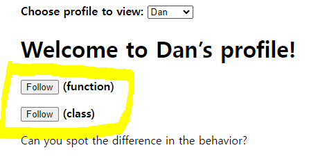
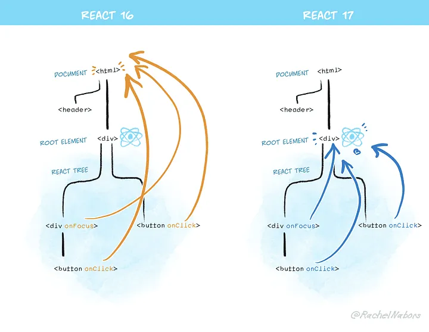

# Chapter 3 & 4 컴포넌트와 이벤트

## 컴포넌트의 정의

UI building blocks

컴포넌트는 html CSS 및 JS가 결합된 웹 앱의 독립적으로 재사용 가능한 UI 요소를 의미

컴포넌트의 구셩요소
- props : 부모 컴포넌트에서 자식 컴포넌트에 전달되는 read-only immutable 데이터 
- state : 컴포넌트 내부의 상태를 나타내는 mutable 데이터
- context : 부모 컴포넌트에서 생성하여 모든 자식 컴포넌트에게 전달하는 데이터. 

### 컴포넌트 합성 패턴
https://felixgerschau.com/react-component-composition/

https://velog.io/@rjsdnql123/%EC%BB%B4%ED%8C%8C%EC%9A%B4%EB%93%9C-%EC%BB%B4%ED%8F%AC%EB%84%8C%ED%8A%B8%EB%9E%80

https://medium.com/@developInvestor/composition-pattern-%EC%9D%84-react-component%EC%97%90-%EC%A0%81%EC%9A%A9%ED%95%B4%EB%B3%B4%EC%9E%90-6bf82c564585

## 리액트가 클래스형 컴포넌트 대신 함수형 컴포넌트를 권장하는 이유

### TLDR
함수형 컴포넌트는 렌더링이 일어날 때 그 순간의 props와 state 값을 기준으로 렌더링 된다.
클래스형 컴포넌트는 mutable한 값인 this를 기준으로 렌더링이 된다

1. 리랜더링 될 때 immutable한 값을 유지한다.
2. 함수형 컴포넌트는 props에 따른 랜더링 결과를 보장받는다.
(immutable한 props를 받기 때문에 결국엔 랜더링 결과가 보장된다)
3. 매개변수로 받는 props의 destructuring을 활용해 가독성을 보장받을 수 있다.
4. 함수 그 자체이므로 함수의 모든 장점을 이용할 수 있다.

#### 가장 쉽게 찾은 답변
1. 성능이 좋다
2. 가독성이 좋고 간결하여 테스트에 용이하다
3. 렌더링 속도가 빠르다

#### 의문점

1. 성능은 주로 함수인지 클래스인지보다 코드가 수행하는 작업에 따라 다르지 않나?
    - dan abramov의 말에 의하면 성능은 주로 함수인지 클래스인지보다 코드가 수행하는 작업에 따라 다르고 동일 작업에 대한 성능 또한 큰 차이가 없다.

2. JS에서 함수는 호출될 때마다 실행 컨택스트가 생성된다. 그에 반해 클래스는 생성된 클래스 객체가 재사용된다 그렇다면 매번 새로 만들어지는 함수형 컴포넌트보다 클래스형 컴포넌트가 메모리 사용 측면에서 더 뛰어나지 않나?
    - 메모리 사용 측면의 문제는 memo로 해결할 수 있으며 오히려 함수형 컴포넌트가 리렌더링에서 불변성 유지에 장점이 있다

### 리액트의 아버지 리버지 dan abramov의 설명

```함수형 컴포넌트는 렌더링이 일어날 때마다 그 순간의 값인 props와 state를 기준으로 렌더링 된다.```

#### [How Are Function Components Different from Classes?](https://overreacted.io/how-are-function-components-different-from-classes/) - Dan Abramov ([번역](https://ideveloper2.dev/blog/2019-03-12--how-are-function-components-different-from-classes/))




```javascript
function ProfilePage(props) {
  const showMessage = () => {
    alert("Followed " + props.user);
  };

  const handleClick = () => {
    setTimeout(showMessage, 3000);
  };

  return <button onClick={handleClick}>Follow</button>;
}
```
```javascript
class ProfilePage extends React.Component {
  showMessage = () => {
    alert('Followed ' + this.props.user);
  };
 
  handleClick = () => {
    setTimeout(this.showMessage, 3000);
  };
 
  render() {
    return <button onClick={this.handleClick}>Follow</button>;
  }
}
```
props.user가 Dan인 경우 Follow 버튼을 누르면 'Followed Dan' alert창을 3초 뒤에 보여준다.
[live demo](https://codesandbox.io/p/sandbox/pjqnl16lm7)


-  **함수형 컴포넌트**는, Dan의 프로필에서 follow를 클릭하고, 소피로 이동하면 여전히 Followed **Dan** 이라는 알림창을 띄운다.

-  **class형 컴포넌트**는, Dan의 프로필에서 follow를 클릭하고, 소피로 이동하면 Followed **Sophie** 라는 알림창을 띄운다.

**클래스형 컴포넌트에서 문제가 발생한 이유**

```javascript
class ProfilePage extends React.Component {
  showMessage = () => {
    alert('Followed ' + this.props.user); 
  };
```
showMessage 함수는 ```this.props```.user로 부터 값을 불러온다. ```props는 리액트에서 불변의 값이지만 this는 변경 가능하며, 조작도 가능```하다.
따라서 요청이 진행되고 있는 상황에서 클래스 컴포넌트가 다시 렌더링 된다면 this.props 또한 바뀌게 된다. showMessage 함수가 새로운 props의 user를 읽는 것이다.

즉, **클래스형 컴포넌트에서 this.props가 리렌더링 이후 늦게 읽혀 지는 것**.

물론 클래스형 컴포넌트에서 이 버그는 수정 가능하나 코드가 길어진다.

클래스형 컴포넌트는 클로저 함수 render() 메소드를 사용하여 props와 state를 캡쳐(그대로 메모리에 기억함)하여 언제나 동일한 props와 state로 동일한 렌더링을 보장할 수 있다. 

하지만 같은 기능을 더 적은 코드를 가진 함수형 컴포넌트로 사용할 수 있다.


## React에서 이벤트를 관리하는 방법



[참고 콴다 기술블로그](https://blog.mathpresso.com/react-deep-dive-react-event-system-1-759523d90341)

### TLDR
리액트 이벤트 시스템은 리액트의 fiberNode 구조(Virtual DOM)와 Synthetic Event 객체를 사용하여 이벤트 핸들링이 필요한 컴포넌트에 직접 이벤트 핸들러를 붙이지 않고도 동작할 수 있도록 구현되었습니다

리액트는 NativeEvent를 한번 감싼 SyntheticEvent 객체를 사용해 이벤트를 처리하며, FiberTree가 생성되는 시점에 NativeEvent의 이름과 리액트 이벤트 핸들러의 Property를 매핑해주는 매핑 테이블을 생성하고, 전체 NativeEvent에 대해 Loop을 돌면서 해당 이벤트에 리액트 이벤트 핸들러를 등록합니다.

### 브라우저의 이벤트 관리 방법
```javascript
document.getElementById("button").addEventListener("click", (e) => {
  console.log("Event: ", e);
});
```
1. Javascript를 사용해서 이벤트 핸들러를 붙일 DOM Node를 Select
2. Select된 해당 DOM Node에 addEventListener 함수를 사용해서 특정 콜백 함수를 등록
3. 사용자가 해당 이벤트 리스너가 바인드된 DOM Node와의 상호작용을 통해 해당 이벤트를 트리거하면, 콜백함수가 실행

### 리액트에서 이벤트 관리 방법
React 17버전부터 이벤트 핸들러를 “Document” 레벨이 아닌 리액트 트리가 렌더되는 **root DOM container**에 attach한다
```javascript
import React, { useCallback } from "react";

export default function App() {
  const handleClick = useCallback((e) => {
    console.log(e.nativeEvent.currentTarget);
  }, []);

  return (
    <div className="App">
      <button id="test" onClick={handleClick}>
        Try Me!
      </button>
    </div>
  );
}
// <div id="root">...</div>
```
### 이벤트 핸들러 함수의 "e"의 정체 합성 (systhetic) 이벤트란

React는 크로스 브라우징을 위해 NativeEvent를 그대로 사용하지 않고 이벤트를 동일하게 처리하기 위해 구현된 인터페이스인 **SyntheticEvent** Wrapper 객체로 NativeEvent를 감싸 사용한다.

```typescript
type BaseSyntheticEvent = {
  isPersistent: () => boolean,
  isPropagationStopped: () => boolean,
  _dispatchInstances?: null | Array<Fiber | null> | Fiber,
  _dispatchListeners?: null | Array<Function> | Function,
  _targetInst: Fiber,
  nativeEvent: Event,
  target?: mixed,
  relatedTarget?: mixed,
  type: string,
  currentTarget: null | EventTarget,
}
```

이 SyntheticEvent를 사용하기 때문에 리액트에서는 이 이벤트를 처리하는 핸들러(‘onClick’, ‘onChange’등)를 따로 보유하게 되는 것이며, NativeEvent(‘click’, ‘change’)와 이 이벤트 핸들러를 매핑해주는 단계가 필요하다.

**리액트가 처리하는 이벤트 핸들러(‘onClick’, ‘onChange’등)를 root DOM node에 붙이는 과정은 Virtual DOM(Fiber Tree)를 생성하는 시점에 일어난다**. 리액트는 이 Fiber Tree를 root DOM node에 _reactRootContainer 라는 key로 저장하게 되며, 리액트에서 처리하는 이벤트 핸들러들은 이 Fiber Tree가 생성되고 나면, 다음의 단계를 거쳐 root DOM node에 attach 됩니다.

1. ‘click’, ‘change’, ‘dblclick’ 등 **핸들링 되어야 할 모든 Native Event들의 목록을 정리**합니다. 리액트는 코드 안에 NativeEvent List를 저장해두고 있습니다.

2. **NativeEvent 이름과 리액트 이벤트 핸들러 Property를 매핑**합니다. 이를테면 click: 'onClick', change: 'onChange' 와 같은 형식입니다. 이렇게 생성된 매핑테이블은 추후 이벤트가 발생했을 때, 이를 적절한 이벤트 핸들러와 연결해줍니다.

3. Discrete Event, UserBlocking Event, Continuous Event 등 리액트에서 정의한 이벤트 타입에 따라 부여하는 이벤트의 우선순위가 다른데, **전체 Native Event를 리액트에서 부여하는 기준에 맞게 우선순위를 설정**합니다.

4. 1 ~ 3단계를 진행한 이후에 리액트의 **Virtual DOM(root Fiber Node)에 이 이벤트 핸들러들을 등록**하는 과정을 거칩니다.

### user interaction시 처리 단계
```javascript
import React, { useCallback } from "react";

export default function App() {
  const handleClickDiv = useCallback((e) => {
    console.log("Div Clicked: ", e);
  }, []);
  const handleClickButton = useCallback((e) => {
    console.log("Button Clicked: ", e);
  }, []);

  return (
    <div className="App">
      <div id="test-wrapper" onClick={handleClickDiv}>
        <button id="test" onClick={handleClickButton}>
          Try Me!
        </button>
      </div>
    </div>
  );
}
```
1. Button을 클릭하면 리액트에서 ‘click’ 이벤트를 감지하고, attach한 이벤트 리스너가 트리거됩니다. 이때, 이 이벤트 리스너는 리액트에서 정의한 dispatchEvent 함수를 호출하게 됩니다.

2. 호출시 넘어온 이벤트 객체로부터 target DOM node(여기서는 Button node)를 식별하며, 내부적으로 사용하는 키인 internalInstanceKey 를 사용하여 이 DOM node가 어떤 Fiber node instance와 매칭되는지를 확인합니다

3. 해당 Fiber node instance를 찾고 나면, 해당 node로부터 출발해서 root node에 이르기까지 Fiber Tree를 순회합니다. 이때 매칭되는 이벤트 Property(‘onClick’)과 매칭되는 이벤트를 가지는 Fiber Node(여기서는 onClick 이 바인딩된 ‘div’ node)를 발견할때 마다 이 이벤트 리스너(콘솔을 찍는 함수)들을 dispatchQueue 라고 불리는 Array에 저장합니다.

4.root node에 도착하고 나면, 처음 dispatchQueue 들어간 순서대로 리스너 함수를 실행합니다. (즉 위의 예시에서는 Button의 리스너가 먼저 실행되고, div의 리스너가 나중에 실행됩니다.) 

### react에서 지원하는 이벤트

[출처 ttaeng_99's tistory](https://abangpa1ace.tistory.com/entry/Reactjs-SyntheticEvent%ED%95%A9%EC%84%B1-%EC%9D%B4%EB%B2%A4%ED%8A%B8)

리액트의 이벤트 리스너들은 모두 버블링 단계에서 호출된다.  
