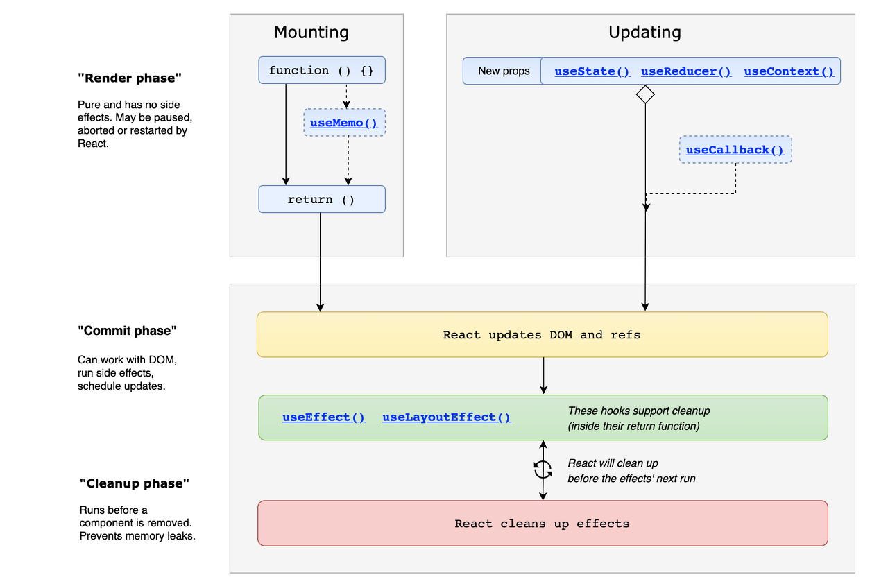

# Chapter 6 Rendering

## 렌더링

- 리액트 어플리케이션의 모든 컴포넌트들의 props와 state를 기반으로 UI를 구성하는 DOM 결과를 계산하는 과정.

### 렌더링이 일어나는 이유

1. 최초 렌더링

    사용자가 처음 어플리케이션에 진입할 때 제공하는 최초의 렌더링

2. 리렌더링

    최초 렌더링 이후로 발생하는 모든 렌더링

### 리렌더링이 발생하는 경우

- 클래스형 컴포넌트의 setState가 실행되는 경우

- 클래스형 컴포넌트의 forceUpdate가 실행되는 경우

- 함수형 컴포넌트의 useState()의 setter가 실행되는 경우

- 함수형 컴포넌트의 useReducer()의 dispatch가 실행되는 경우

- 컴포넌트의 key props가 변경되는 경우

- props가 변경되는 경우

- 부모 컴포넌트가 렌더링되는 경우

### 렌더링 프로세스

#### TLDR

- 리액트 렌더링은 렌더 단계와 커밋 단계로 나눌 수 있다.
- 렌더 단계는 재조정으로 가상 DOM 요소의 변화를 감지하고 필요한 업데이트를 결정하는 단계이다.
- 커밋 단계에서는 렌더 단계에서 결정된 변경 사항들을 실제 DOM에 반영한다.

루트부터 업데이트가 필요한 컴포넌트를 찾는 **재조정(reconciliation)과정**의 결과로

```javascript
function Hello() {
  return (
    <TestComponent a={35} b="marigold">
      안녕하세요
    </TestComponent>
  )
}
```

JSX는 React.createElement()를 호출하는 구문으로 변환되고 이는 JS객체를 반환한다.

```javascript
function Hello() {
  return React.createElement(
    TestComponent,
    { a: 35, b: "marigold"},
    '안녕하세요'
  )
}
```

```javascript
{type: TestComponent, props: {a: 35, b: "marigold", children: "안녕하세요"}}
```

#### 렌더 단계



컴포넌트를 샐행한 결과와 이전 Virtual DOM을 비교하는 단계

과 이전 
WIP tree(컴포넌트를 실행하여 계산한 새로운 VDOM)와 Current tree(이전 VDOM)을 비교하며 **type, props, key** 중 하나라도 변경된 것이 있으면 변경이 필요한 컴포넌트로 체크해둔다.

#### 커밋 단계

렌더 단계의 변경사항을 실제 DOM에 적용해 사용자에게 보여주는 과정을 말하고
이 단계가 끝나야 브라우저의 렌더링이 발생한다.

커밋 단계에서 업데이트한 새로운 VDOM(WIP tree)를 Current tree로 포인터를 swap한다. 그 이후 클래스형 컴포넌트에서 componentDidMount, componentDidUpdate 메서드를 호출하고 함수형 컴포넌트는 useLayoutEffect를 호출한다.

**리액트의 렌더링이 일어난다고 해서 무조건 DOM이 업데이트가 일어나는 것은 아니다.**

렌더링을 수행했으나 변경사항이 감지되지 않거나 변경사항을 감지하지 못한다면 커밋단계는 생략될 수 있다

[잘 정리된 velog](https://velog.io/@jinyoung234/Render-and-commit)