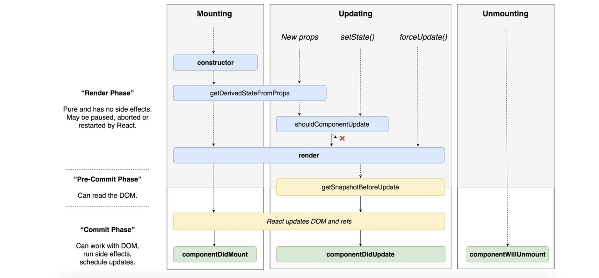
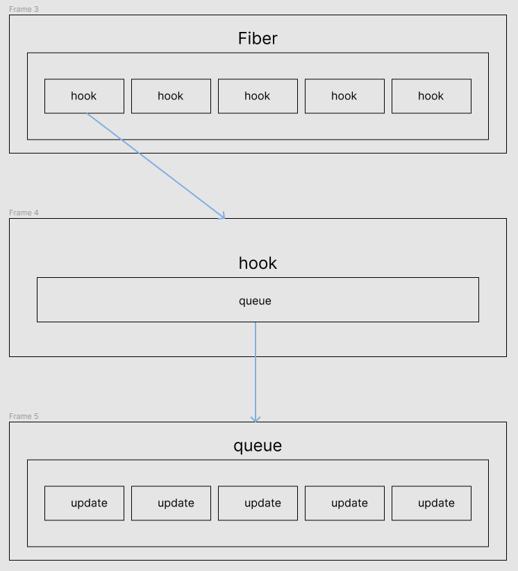

# Hooks

## 리액트 패키지 구성요소

- react core
  - 컴포넌트 정의
  - 다른 패키지에 대한 의존성이 없으므로 여러 플랫폼 (브라우저, 모바일)에서 사용 가능
- renderer
  - react-dom, react-native-renderer 등 호스트 렌더링 환경에 의존
  - reconciler와 legacy-envets 패키지에 의존성을 가진다
- event (legacy-events)
  - SyntheticEvent로 기존 web native event를 wrapping하여 추가적인 기능 수행
- scheduler
  - react는 Task를 비동기로 실행하고 이 Task가 실행되는 타이밍을 알고있는 패키지
- reconciler
  - fiber 구조에서 VDOM 재조정 과정을 담당
  - 컴포넌트를 호출하는 패키지

## 참고용 시각자료

[useState 시각자료](https://jser.dev/2023-06-19-how-does-usestate-work/#4-summary)

## hook은 어디서 정의되는가

**react element**는 JSX로 작성된 컴포넌트가 React.createElement()를 통해 {type,state,props}의 형태로 변환된 객체.
재조정 과정중에 reconciler가 react element를 fiber(VDOM의 트리 노드)로 확장하면서 hook 속성을 컴포넌트에 추가된다

## useState 꼬리 질문

본론 setState의 state update 과정 특히 setState(1) * 3회 과정을 알고 싶었다

### 1. setState()를 호출할 때마다, 컴포넌트가 리렌더링 되나?
```typescript
const [state,setState] = useState(0)

seState()
```
<details>
값이 변경되지 않으면 렌더링 되지 않는다
</details>

### 2. setState를 N번 호출하면 N번 리렌더링 되는가?
```typescript
const [state,setState] = useState(0)

seState(1)
seState(2)
```
<details>
값을 바꾸더라도 렌더링은 1번 일어난다.
</details>

### 3. 왜 리렌더링이 1번 일어나는가?

[mountState](https://github.com/facebook/react/blob/main/packages/react-reconciler/src/ReactFiberHooks.js#L1745)

```typescript
// react v18.2 
function mountState<S>( initialState: (() => S) | S ): [S, Dispatch<BasicStateAction<S>>] {
const hook = mountStateImpl(initialState);
const queue = hook.queue;
const dispatch: Dispatch<BasicStateAction<S>> = (dispatchSetState.bind(
  null,
  currentlyRenderingFiber,
  queue,
): any);
queue.dispatch = dispatch;
// const [state,setState] = useState(initialStateValue)  
return [hook.memoizedState, dispatch];
}
```
<details>
setState는 dispatchSetState 함수를 통해 상태를 변경하는 함수이고 하나의 객체에 대한 업데이트를 한데 묶어(batch) 업데이트하고 한 번만 컴포넌트를 호출하기 때문이다.
</details>

### 4. dispatchSetState는 어떻게 batch 업데이트를 처리하나?

[dispatchSetState](https://github.com/facebook/react/blob/main/packages/react-reconciler/src/ReactFiberHooks.js#L3176)

```typescript
// setState 실제 구현 코드
function dispatchSetState<S, A>(
  fiber: Fiber,
  queue: UpdateQueue<S, A>,
  action: A,
): void {
  if (__DEV__) {
    if (typeof arguments[3] === 'function') {
      console.error(
        "State updates from the useState() and useReducer() Hooks don't support the " +
          'second callback argument. To execute a side effect after ' +
          'rendering, declare it in the component body with useEffect().',
      );
    }
  }

  const lane = requestUpdateLane(fiber);

  const update: Update<S, A> = {
    lane, // 우선순위 파라미터
    revertLane: NoLane,
    action, // setState()의 인자
    hasEagerState: false,
    eagerState: null, // 실제 렌더링하고 싶은 상태의 결과 값
    next: (null: any), // 순환 연결 리스트
  };

  if (isRenderPhaseUpdate(fiber)) { 
    enqueueRenderPhaseUpdate(queue, update); // 업데이트 큐에 저장
  } else { // 초기 렌더링
    const alternate = fiber.alternate; // VDOM current tree 참조
    if (
      fiber.lanes === NoLanes &&
      (alternate === null || alternate.lanes === NoLanes)
    ) {
      const lastRenderedReducer = queue.lastRenderedReducer;
      if (lastRenderedReducer !== null) {
        let prevDispatcher;

        try {
          const currentState: S = (queue.lastRenderedState: any); // queue의 가장 마지막 state값
          const eagerState = lastRenderedReducer(currentState, action); // 계산 이후의 state값

          update.hasEagerState = true;
          update.eagerState = eagerState;
          if (is(eagerState, currentState)) { // 현재 상태와 계산 이후의 상태가 같으면 불필요한 렌더링 방지를 위한 최적화 작업 진행
            /*
            * useState(1)
            * useState(1) return
            * useState(1) return
            */
            enqueueConcurrentHookUpdateAndEagerlyBailout(fiber, queue, update); //bailout 보석금을 내다 == 중간에 return해준다
            return;
          }
        } catch (error) {
        } finally {
        }
      }
    }
    const root = enqueueConcurrentHookUpdate(fiber, queue, update, lane); // 비동기 업데이트 큐에 저장
    if (root !== null) {
      scheduleUpdateOnFiber(root, fiber, lane); // scheduler에 fiber 업데이트 작업을 넘긴다.
      entangleTransitionUpdate(root, queue, lane);
    }
  }

  markUpdateInDevTools(fiber, lane, action); 
}
```

 1. 업데이트 우선순위를 결정하고
 2. update 객체를 생성한다
 3. 렌더단계인지 확인 후 업데이트한다
 4. 렌더단계가 아닌경우 동시성 업데이트를 위한 큐에 넣어 처리한다

### 5. 업데이트를 한 번에 처리해주는 것이 렌더링이 한 번만 일어나는 것을 보장하나?

<!--  -->


세로축의 렌더 단계와 커밋 단계을 보면 batch 하게 렌더링을 처리하기 때문에 렌더링이 1번 발생한다
또는 리렌더링시 재조정 단계에서 변경사항이 없다면 커밋 단계가 생략됩니다.

VDOM의 변경사항에 대해 업데이트하는 경우는 렌더링이 1번 발생합니다 다만 변경사항이 없는 경우 커밋 단계가 생략될 수 있습니다.

### 6. batching update 과정에 대해 설명해달라

#### TLDR

update 정보가 담긴 원형 연결 리스트를 순회하면서 state를 계산하고 마지막으로 계산된 state의 값을 리턴하여 화면에 렌더링한다

<!--  -->


```typescript
export type Hook = {
  memoizedState: any,
  baseState: any,
  baseQueue: Update<any, any> | null,
  queue: any,
  next: Hook | null,
};

// cirular linked list
const queue = hook.queue = {
  last:null,
  dispatch:null,
  lastRenderedReducer:basicStateReducer,
  lastRenderedState: initialState
}

export type UpdateQueue<S, A> = {
  pending: Update<S, A> | null,
  lanes: Lanes,
  dispatch: (A => mixed) | null,
  lastRenderedReducer: ((S, A) => S) | null,
  lastRenderedState: S | null,
};
```

[updateReducer](https://github.com/facebook/react/blob/main/packages/react-reconciler/src/ReactFiberHooks.js#L1177)

1. baseQueue(update객체)와 pendingQueue(비동기update객체)의 tail(pending상태의 update 객체)을 추가하여 머지한다
2. baseQueue가 비어있다면 hook객체의 memorizedState를 리턴
3. update가 null이 아니고 baseQueue가 empty가 아니면 do while문 반복
  
    a. 렌더링 우선순위를 업데이트하고 렌더링을 발생시키지 않는 작업인지 아닌지 확인하고 비동기 작업인지 아닌지 확인한다
    
    b. 새로 얻은 newState에 action(setState의 인자 함수 혹은 변수) 적용
    
    c. update.next 호출
4. newBaseQueueLast(state 변경이 모두 스킵된 경우) baseState 리턴
5. 새로 얻은 newState와 hook.memorizedState의 값이 같은지 비교하여 WIP tree에 변경사항 마크
6. hook 객체의 memorizedState baseState baseQueue lastRenderedState를 업데이트하고 queue의 우선순위 초기화
7. hook.memorizedState와 dispatch를 리턴

참고자료

소스코드
https://github.com/facebook/react/blob/main/packages/react-reconciler/src/ReactFiberHooks.js

꼬리질문
https://joong-sunny.github.io/react/react1/

구버전(v16) 유투브
https://www.youtube.com/watch?v=JadWu4Ygnyc&list=PLpq56DBY9U2B6gAZIbiIami_cLBhpHYCA&index=1

영문
https://jser.dev/2023-06-19-how-does-usestate-work/