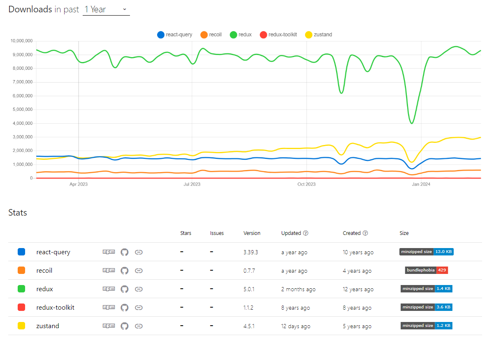

# Zustand!


## zustand 소개 



## zustand 특징

- 컴포넌트의 리렌더링을 최소화하여 성능 최적화에 도움이 됩니다.

- 상태의 일부분만 선택하여 구독할 수 있는 선택적 구독 기능을 제공합니다.

- 비동기 액션을 지원하므로, 비동기적인 상태 업데이트를 쉽게 처리할 수 있습니다.

- 미들웨어를 지원하므로, 개발자들은 상태 변경을 추적하거나 로깅하는 등의 부가적인 작업을 수행할 수 있습니다.

- provider 가 필요하지 않아 provider hell 문제를 해결할 수 있습니다.

# Zustand의 동작원리

zustand는 발행/구독 모델 기반으로 이루어져 있으며, 내부적으로 스토어 상태를 클로저로 관리한다.
<details>
<summary>createStore 코드</summary>

```tsx
// 아래는 type과 deprecated 부분을 제외한 vanilla 코드
// 상태 변경을 구독할 리스너는 Set을 통해 관리하고 있다.
const createStoreImpl = createState => {
  let state;
  const listeners = new Set();

  const setState = (partial, replace) => {
    // ... (생략)
  };

  const getState = () => state;

  const subscribe = listener => {
    // ... (생략)
  };
  
  const api = { setState, getState, subscribe };
  // 클로저로 구현
  state = createState(setState, getState, api);
  return api;
};

export const createStore = createState =>
  createState ? createStoreImpl(createState) : createStoreImpl;
```
</details>

## **setState**

상태를 변경하는 `setState` 함수를 보면 인자가 *function* 타입일 경우 현재 상태를 인자로 넘겨 **nextState**를 정의한다. 

그리고 **nextState**와 **state**가 다르다면 `Object.assign` 을 이용해서 상태를 갱신해 준다.

<details>
<summary>setState 코드</summary>

```tsx
const setState = (partial, replace) => {
  const nextState = typeof partial === "function" ? partial(state) : partial;

  if (!Object.is(nextState, state)) {
    const previousState = state;
    state =
      replace ?? typeof nextState !== "object"
        ? nextState
        : Object.assign({}, state, nextState);

    listeners.forEach(listener => listener(state, previousState));
  }
};
```
</details>

# First Create Store

```tsx
import { create } from 'zustand'

const useStore = create((set) => ({
  bears: 0,
  increasePopulation: () => set((state) => ({ bears: state.bears + 1 })),
  removeAllBears: () => set({ bears: 0 }),
  updateBears: (newBears) => set({ bears: newBears }),
}))

function BearCounter() {
  const bears = useStore((state) => state.bears)
  return <h1>{bears} around here...</h1>
}

function IncreaseButton() {
  const increasePopulation = useStore((state) => state.increasePopulation)
  return <button onClick={increasePopulation}>one up</button>
}
```

- store는 **hook** 입니다. **원시 값, 객체, 함수** 등 무엇이든 넣을 수 있습니다.

- `set` 함수는 상태를 병합합니다.

- provider로 app을 감싸지 않아도 사용할 수 있습니다.

- state를 **선택자**(( state ) ⇒ state.bears )로 선택하면 해당 state가 변경될 때 **구독**한 component가 re-rendering됩니다.

    - 선택자 ( selector ): store에 전달하는 함수
        - const bear = useBearStore( **( state ) ⇒ state.bears )**) // state 중에 bear 선택함
    
    - 구독 : 컴포넌트에서 store에 특정 state 및 setter 사용하는 것
        - const bear =  **useBearStore( ( state ) ⇒ state.bears ))** // bear 선택하고 구독함

# **Updating state**

```tsx
// bearSlice

import { create } from 'zustand'
// 1. 타입 선언

// state 
type State = {
  bears:number
}

// action
type Action = {
  // 왜 actions 객체로 선언하는가?
  // 상태와 action을 분리하여 모든 store를 구독하는 불필요한 리렌더링을 방지
  actions: {
    increasePopulation: () => void
    removeAllBears: () => void
    updateBears: (newBears: State["bears"]) => void
  }
}

// store
type BearStore = State & Action

// 2. 초기값 설정
const initialState: State = {
  bears: 0,
}

// 3. 스토어 생성
const useStore = create<BearStore>((set) => ({
  ...initialState
  actions: {
    increasePopulation: () => set((state) => ({ bears: state.bears + 1 })),
    removeAllBears: () => set({ bears: 0 }),
    updateBears: (newBears: State["bears"]) => set({ bears: newBears }),	
  }
}))

// component 에서 사용
function BearCounter() {
  const bears = useStore((state) => state.bears) // 선택과 구독
  return <h1>{bears} around here...</h1>
}

function Controls() {
  const { increasePopulation } = useStore((state) => state.actions) // action은 함수의 모음이라 상태가 없다
  return <button onClick={increasePopulation}>one up</button>
}
```
    

## Flat updates

새로운 state로 제공된 `set` 함수를 호출하면 스토어의 기존 상태와 ***얕은 병합 (shallow merge)*** 하여 업데이트 됩니다.

객체의 중첩( nested )된 속성까지는 업데이트되지 않습니다.
<details>
<summary>얕은 병합 예제</summary>

```tsx
import { create } from 'zustand'
// 1. State, Action, initialValue의 Type 정의
type State = {
  firstName: string
  lastName: string
}

type Action = {
	actions: {
	  updateFirstName: (firstName: State['firstName']) => void
	  updateLastName: (lastName: State['lastName']) => void
	}
}

type PersonStore = State & Action

// state 초기 값 설정
const initialState: State = {
  firstName: '',
  lastName: '',
}

// store 생성
const usePersonStore = create<PersonStore>((set,get) => ({
	...initialState
	actions: {
    updateFirstName: (firstName) => set(() => ({ firstName: firstName })),
	  updateLastName: (lastName) => set(() => ({ lastName: lastName })),
	}
}))

// In consuming app
function App() {
  // 필요한 state와 action (이 경우에는 firstName ,updateFirstName)을 "선택"합니다.
  const firstName = usePersonStore((state) => state.firstName)
  const { updateFirstName } = usePersonStore((state) => state.actions)

  return (
    <main>
      <label>
        First name
        <input
          // Update the "firstName" state
          onChange={(e) => updateFirstName(e.currentTarget.value)}
          value={firstName}
        />
      </label>
      <p>
        Hello, <strong>{firstName}!</strong>
      </p>
    </main>
  )
}
```
</details>

# **Immutable state and merging**

`set` 함수는 얕은 병합, 한 수준에서만 state를 병합합니다.

```tsx
import { create } from 'zustand'

const useCountStore = create((set) => ({
  count: 0,
  inc: () => set((state) => ({ count: state.count + 1 })),
}))
```

 `set` 함수는 state의 불변성을 유지하기 위해서 spread 연산자 (전개구문)를 사용한 업데이트를 할 수 있습니다.

그러나 `set` 함수는 state를 merge하는 일반적인 패턴이므로 spread 연산자를 skip 할 수 있습니다.

```tsx
set((state) => ({ ...state, count: state.count + 1 }))

//...state 부분을 건너뛸 수 있습니다.
set((state) => ({ count: state.count + 1 }))

// immer middleware를 적용한 경우
set((state) => ({ state.count += 1 }))
```

# Deeply nested object

중첩된 state를 업데이트하려면 불변성을 유지하기 위한 약간의 노력이 필요합니다.

```tsx
type State = {
  deep: {
    nested: {
      obj: { count: number }
    }
  }
}
```

## Normal approach

React 또는 Redux와 마찬가지로 state 객체의 각 level을 스프레드 연산자를 사용하여 복사하는 것입니다.

코드 가독성과 유지보수 성이 떨어져 Immer 미들웨어를 사용하여 중첩 객체를 업데이트합니다.
<details>
<summary>기본적인 깊은 병합 방법</summary>

```tsx
export const userInfoStore = create<UserStore>((set) => ({
  // 업데이트 할 상태 값
  user: {
    name: '해린',
    age: 17,
    preferences: {
      theme: 'dark',
      language: 'kor',
    },
  },
  
  // Deep update
  updatePreferences: (newPreferences) =>
    set((state) => ({
      user: {
        ...state.user,
        preferences: {
          ...state.user.preferences,
          ...newPreferences,
        },
      },
    })),
}));
```
</details>

## with Immer

<details>
<summary>Immer 라이브러리를 사용한 깊은 병합 방법</summary>

```tsx
 export const userInfoStore = create<UserStore>((set) => ({
  user: {
    name: '해린',
    age: 17,
    preferences: {
      theme: 'dark',
      language: 'kor',
    },
  },
  
  // Deep update with immer
  updatePreferences: (newPreferences) =>
    set(
      produce((state) => {
        state.user.preferences = {
          ...state.user.preferences,
          ...newPreferences,
        };
      })
    ),
}));
```
</details>

## with Immer middleware

<details>
<summary>Immer middleware를 사용한 깊은 병합 방법</summary>

```tsx
import { immer } from 'zustand/middleware/immer'

export const userInfoStore = create<UserStore>()(
	immer((set) => ({
    user: {
      name: '해린',
	    age: 17,
	    preferences: {
        theme: 'dark',
	      language: 'kor',
	    },
	  },
	  // Deep update with immer middleware
	  updatePreferences: (newPreferences) =>
	    set(
	      (state) => {
	        state.user.preferences = newPreferences,
	      })
	    ),
	}))
);
```
</details>

# Replace flag ( State 덮어쓰기 )

```tsx
// state를 newState로 대체한다
set((state) => newState, true)

// 예제
interface UseNumberOverwriteStore {
    numberA: number;
    numberB: number;
    clear: () => void;
    deleteNumberB: () => void;
}

const useNumberOverwriteStore = create<UseNumberOverwriteStore>()((set, get) => ({
    numberA: 2,
    numberB: 3,
    // 스토어를 빈 객체 {} 로 초기화
    clear: () => set({}, true),
    // numberB 삭제
    deleteNumberB: () => set((state) => Reflect.deleteProperty(state,"numberB"), true),
}));

export default useNumberOverwriteStore;
```

# **Flux inspired practice**

Zustand는 독립적인 라이브러리이지만 몇 가지 패턴을 권장합니다. 

## Recommended patterns

- 애플리케이션 전역 상태는 하나의 zustand store에 위치해야 합니다.

- 애플리케이션의 규모가 큰 경우 zustand는 store를 slice으로 분할하는 slice pattern을 지원합니다.

### Single store

### Use `set` / `setState` to update the store

- store를 업데이트 하려면 항상 `set` 또는 `setState` 를 사용하세요.

- `set` 또는 `setState`는 적절한 state merge와 리스너(구독 컴포넌트)가 적절하게 알림을 받도록 보장합니다.

### Colocate store actions 

- zustand에서는 다른 Flux 라이브러리에 있는 dispatch action과 reducer를 사용하지 않고도 state업데이트할 수 있습니다.

- 권장되는 사용법은 ***action과 state를 같은 store에 배치하는 것*** 입니다
    1. action과 state를 같은 store에 배치
        
        ```tsx
        export const useBoundStore = create((set) => ({
          count: 0,
          text: 'hello',
          inc: () => set((state) => ({ count: state.count + 1 })),
          setText: (text) => set({ text }),
        }))
        ```
        
    2. store 외부에 action 정의 ( custom hook )
        
        ```tsx
        export const useBoundStore = create(() => ({
          count: 0,
          text: 'hello',
        }))
        
        export const inc = () =>
          useBoundStore.setState((state) => ({ count: state.count + 1 }))
        
        export const setText = (text) => useBoundStore.setState({ text })
        ```
        
        - 장점
            - 이 action을 소비할 때 hook을 임포트할 필요가 없습니다.
            - 코드 분할을 용이합니다.

# 공식은 아니지만 자주 사용되는 방법

## **Only export custom hooks**

```tsx
// ⬇️ export 되지 않아서 아무도 전체 스토어를 구독할 수 없습니다.
const useBearStore = create((set) => ({
  bears: 0,
  fish: 0,
  increasePopulation: (by) => set((state) => ({ bears: state.bears + by })),
  eatFish: () => set((state) => ({ fish: state.fish - 1 })),
  removeAllBears: () => set({ bears: 0 }),
}))

// 💡 exported - 이 훅을 소비할 때는 선택자를 작성할 필요가 없습니다.
export const useBears = () => useBearStore((state) => state.bears)
```

```tsx
// ❌ 전체 store를 구독하는 방식
// 즉 bear가 변경되지 않은 경우에도 state 업데이트에 대한 정보가 제공되므로 
// re-render됩니다.(e.g fish의 수가 줄 었을 때)

// 컴포넌트에서 사용할 때
const { bears } = useBearStore()

// ✅
const bears = useBears()
```

- store에서 단 하나의 값을 구독하려는 모든 곳에서 selector를 반복적으로 작성할 필요가 없습니다.
- 실수로 전체 스토어를 구독하는 것을 방지합니다.

## **Prefer atomic selectors**

이것은 이미 [공식문서](https://github.com/pmndrs/zustand/tree/2b29d736841dc7b3fd7dec8cbfea50fee7295974#selecting-multiple-state-slices)에서 설명했으므로 간단하게 설명하도록 하겠습니다. 

하지만 “잘못 이해”하면 **렌더링 성능이 저하**될 수 있기 때문에 여전히 매우 중요합니다. 

먼저 zustand에 의해 관리되고 있는 데이터들이 리렌더링이 발생되는 경우는 **"strict-equality (old === new)"** [엄격한 동등성 검사](https://developer.mozilla.org/en-US/docs/Web/JavaScript/Reference/Operators/Strict_equality)에 해당되지 않을 때입니다.

일반적으로 number, string 등의 타입을 이용하여 값을 비교할 때는 값 자체를 비교하기 때문에 문제가 되지 않지만 **array나 object를 사용하는 경우는 문제가 발생**하게 됩니다.

새 배열 또는 객체를 반환하면 값은 변화가 없지만 저장되는 메모리 주소 값이 변경되어  [엄격한 동등성 검사](https://developer.mozilla.org/en-US/docs/Web/JavaScript/Reference/Operators/Strict_equality)에 해당되지 않기 때문에 *항상* 변경으로 간주됩니다.

1. **multi state selectors** 방식
    
    ```tsx
    // 🚨 selector는 모든 호출에서 새 객체를 반환합니다.
    const { bears, fish } = useBearStore((state) => ({
      bears: state.bears,
      fish: state.fish,
    }))
    
    // 😮 같은 코드
    const { bears, fish } = useBearStore()
    ```
    
    - `shallow`를 사용하여 렌더링 최적화
        
        ```tsx
        // shallow를 추가하여 object를 얕게 비교하기 원한다고 zustand에 알려줍니다.
        import { shallow } from 'zustand/shallow';
        
        const { numberA, numberB } = useNumberShallowStore(
          (state) => ({
              numberA: state.numberA,
              numberB: state.numberB,
          }),
          shallow,
        );
        ```
        
    - `useShallow`를 사용하여 렌더링 최적화
        - https://docs.pmnd.rs/zustand/guides/prevent-rerenders-with-use-shallow
2. **atomic state selector** 방식
    
    ```tsx
    const bears = useBearStore((state) => state.bears)
    const fish = useBearStore((state) => state.fish)
    ```
    
3. **atomic state selector** + **custom hook**방식
    
    ```tsx
    export const useBears = () => useBearStore((state) => state.bears)
    export const useFish = () => useBearStore((state) => state.fish)
    ```
    

## **Separate Actions from State**

action은 정적이며 절대 변경되지 않으므로 기술적으로 "state” 가 아닙니다.

이를 state 별도 속성으로 구성하면 성능에 영향을 주지 않고 모든 컴포넌트에서 하나의 custom hook으로 사용할 수 있습니다.

```tsx
const useBearStore = create((set) => ({
  bears: 0,
  fish: 0,
  // ⬇️ action을 위한 별도의 네임스페이스
  actions: {
    increasePopulation: (by) =>
      set((state) => ({ bears: state.bears + by })),
    eatFish: () => set((state) => ({ fish: state.fish - 1 })),
    removeAllBears: () => set({ bears: 0 }),
  },
}))

export const useBears = () => useBearStore((state) => state.bears)
export const useFish = () => useBearStore((state) => state.fish)

// 🎉  모든 action을 위한 하나의 selector
export const useBearActions = () => useBearStore((state) => state.actions)

// 소비 component
const { increasePopulation } = useBearActions()
```

“atomic selectors” 팁과 모순되는 것처럼 들릴 수 있지만 실제로는 그렇지 않습니다. Action은 절대 변하지 않기 때문에 우리가 “모두”를 구독하는 것은 중요하지 않습니다. Action 객체는 단일 원자 조각으로 볼 수 있습니다. 

## **Model Actions as Events, not Setters**

컴포넌트가 아닌 store 내부에 비즈니스 로직을 격리하는 데 도움이 됩니다.

```tsx
const useBearStore = create((set) => ({
  bears: 0,
  fish: 0,
  actions: {
		// 컴포넌트는 Action을 호출하고 Store는 이를 사용하여 수행할 작업을 결정합니다.
		// 컴포넌트 입장에서는 비즈니스 로직을 신경쓸 필요가 없어진다.
    increasePopulation: (by) =>
      set((state) => ({ bears: state.bears + by })),
    eatFish: () => set((state) => ({ fish: state.fish - 1 })),
    removeAllBears: () => set({ bears: 0 }),
  },
}))
```

## **Keep the scope of your store small**

전체 앱에 대해 단일 Store를 가져야하는 Redux와 다르게 Zustand는 여러개의 작은 Store를 가질 것을 권장합니다. 각 Store는  단일 상태를 담당할 수 있습니다. 그것들을 결합해야하는 경우, 커스텀 훅을 사용하여 결합할 수 있습니다. 

- slice 패턴을 하나의 store로 통합하지 않고 사용하는 방법
    
    ```tsx
    // src/store/slice/fishSlice.ts
    export const useFishStore= create((set) => ({
      fishes: 0,
    	actions: {
    		addFish: () => set((state) => ({ fishes: state.fishes + 1 })),
    	}
    }))
    
    // src/store/slice/bearSlice.ts
    export const useBearStore = create((set) => ({
      bears: 0,
    	actions:{
    	  addBear: () => set((state) => ({ bears: state.bears + 1 })),
    	  eatFish: () => set((state) => ({ fishes: state.fishes - 1 })),
    	}
    }))
    
    // 소비 component
    function App() {
      const bears = useBearStore ((state) => state.bears)
      const fishes = useFishStore((state) => state.fishes)

      const { addBear } = useBearStore ((state) => state.actions)

      return (
        <div>
          <h2>Number of bears: {bears}</h2>
          <h2>Number of fishes: {fishes}</h2>
          <button onClick={() => addBear()}>Add a bear</button>
        </div>
      )
    }
    
    ```
    
- 하나의 store로 slice를 합치는 방법
    
     https://docs.pmnd.rs/zustand/guides/slices-pattern
    
    ```tsx
    // src/store/slice/fishSlice.ts
    export const createFishSlice = (set) => ({
      fishes: 0,
      addFish: () => set((state) => ({ fishes: state.fishes + 1 })),
    })
    
    // src/store/slice/bearSlice.ts
    export const createBearSlice = (set) => ({
      bears: 0,
      addBear: () => set((state) => ({ bears: state.bears + 1 })),
      eatFish: () => set((state) => ({ fishes: state.fishes - 1 })),
    })
    
    // src/store/slice/createBearFishSlice.ts
    // 하나의 함수로 여러 store를 동시에 업데이트할 수 있습니다.
    export const createBearFishSlice = (set, get) => ({
      addBearAndFish: () => {
        get().addBear()
        get().addFish()
      },
    })
    
    // src/store/store.ts
    import { create } from 'zustand'
    import { createBearSlice } from './bearSlice'
    import { createFishSlice } from './fishSlice'
    
    export const useBoundStore = create((...a) => ({
      ...createBearSlice(...a),
      ...createFishSlice(...a),
      ...createBearFishSlice(...a),
    }))
    
    // 소비 component
    function App() {
      const bears = useBoundStore((state) => state.bears)
      const fishes = useBoundStore((state) => state.fishes)
      const addBear = useBoundStore((state) => state.addBear)
      return (
        <div>
          <h2>Number of bears: {bears}</h2>
          <h2>Number of fishes: {fishes}</h2>
          <button onClick={() => addBear()}>Add a bear</button>
        </div>
      )
    }
    ```
    
    # Redux-like pattern
    
    리덕스 없이 살수 없게 되어버린 리덕스 애호가라면 store 최상단에 reducer를 정의한 dispatch를 사용하세요
    
    ```tsx
    const types = { increase: 'INCREASE', decrease: 'DECREASE' }
    
    const reducer = (state, { type, by = 1 }) => {
      switch (type) {
        case types.increase:
          return { grumpiness: state.grumpiness + by }
        case types.decrease:
          return { grumpiness: state.grumpiness - by }
      }
    }
    
    const useGrumpyStore = create((set) => ({
      grumpiness: 0,
      dispatch: (args) => set((state) => reducer(state, args)),
    }))
    
    const dispatch = useGrumpyStore((state) => state.dispatch)
    dispatch({ type: types.increase, by: 2 })
    ```
    

# **Auto Generating Selectors**

매번 selector 작성하기 귀찮은 경우

```tsx
// 매법 적기 귀찮음
const bears = useBearStore((state) => state.bears)
```

 `createSelectors` 함수

```tsx
// src/store/selector.ts
import { StoreApi, UseBoundStore } from 'zustand'

type WithSelectors<S> = S extends { getState: () => infer T }
  ? S & { use: { [K in keyof T]: () => T[K] } }
  : never

const createSelectors = <S extends UseBoundStore<StoreApi<object>>>(
  _store: S,
) => {
  let store = _store as WithSelectors<typeof _store>
  store.use = {}
  for (let k of Object.keys(store.getState())) {
    ;(store.use as any)[k] = () => store((s) => s[k as keyof typeof s])
  }

  return store
}
```

예시 store

```tsx
// src/store/store.ts

interface BearState {
  bears: number
  increase: (by: number) => void
  increment: () => vo
}

const useBearStoreBase = create<BearState>()((set) => ({
  bears: 0,
  increase: (by) => set((state) => ({ bears: state.bears + by })),
  increment: () => set((state) => ({ bears: state.bears + 1 })),
}))

export default createSelectors(useStoreBase);
```

예시 소비 component

```tsx
import useStore from "src/store/store.ts";

export default function App() {
  const bears = useStore.use.bears();
  const increment = useStore.use.increment();
}
```

# Typescript guide

- https://docs.pmnd.rs/zustand/guides/typescript

# How to reset state

https://docs.pmnd.rs/zustand/guides/how-to-reset-state

```tsx
mport { create } from 'zustand'

// define types for state values and actions separately
type State = {
  salmon: number
  tuna: number
}

type Actions = {
  addSalmon: (qty: number) => void
  addTuna: (qty: number) => void
  reset: () => void
}

// define the initial state
const initialState: State = {
  salmon: 0,
  tuna: 0,
}

// create store
const useSlice = create<State & Actions>()((set, get) => ({
  ...initialState,
  addSalmon: (qty: number) => {
    set({ salmon: get().salmon + qty })
  },
  addTuna: (qty: number) => {
    set({ tuna: get().tuna + qty })
  },
  // 초기 값으로 reset
  reset: () => {
    set(initialState)
  },
}))
```

# **Initialize state with props**

컴포넌트의 props 를 사용하여 store 를 초기화해야 하는 경우와 같이 종속성 주입이 필요한 경우 권장되는 접근 방식은 React.context와 함께 바닐라 store 를 사용하는 것입니다.

## store creator with createStore

```tsx
import { createStore } from 'zustand'

interface BearProps {
  bears: number
}

interface BearState extends BearProps {
  addBear: () => void
}

type BearStore = ReturnType<typeof createBearStore>

// zustand store를 return 하는 함수
const createBearStore = (initProps?: Partial<BearProps>) => {
  const DEFAULT_PROPS: BearProps = {
    bears: 0,
  }
  return createStore<BearState>()((set) => ({
    ...DEFAULT_PROPS,
    ...initProps,
    addBear: () => set((state) => ({ bears: ++state.bears })),
  }))
}
```

## Common patterns

```tsx
// src/components/providers/bearProvider.tsx

import { createContext } from 'react'
import { useContext } from 'react'
import { useStore } from 'zustand'
import { useRef } from 'react'

// BearStore context 생성
export const BearContext = createContext<BearStore | null>(null)

type BearProviderProps = React.PropsWithChildren<BearProps>

function BearProvider({ children, ...props }: BearProviderProps) {
  // 싱글톤 패턴을 사용해 중복 스토어가 생기는 것을 방지
  const storeRef = useRef<BearStore>()
  if (!storeRef.current) {
    storeRef.current = createBearStore(props)
  }
  return (
    <BearContext.Provider value={storeRef.current}>
      {children}
    </BearContext.Provider>
  )
}
// custom hook으로 사용
function useBearContext<T>(selector: (state: BearState) => T): T {
  const store = useContext(BearContext)
  if (!store) throw new Error('Missing BearContext.Provider in the tree')
  return useStore(store, selector)
}
```

## Consumer component usage of the custom hook

```tsx
// Consumer usage of the custom hook
function CommonConsumer() {
  const bears = useBearContext((s) => s.bears)
  const addBear = useBearContext((s) => s.addBear)
  return (
    <>
      <div>{bears} Bears.</div>
      <button onClick={addBear}>Add bear</button>
    </>
  )
}
```

# SSR and Hydration
https://docs.pmnd.rs/zustand/guides/ssr-and-hydration#hydration

# Nextjs + zustand App Router**를 이용한 상태 관리 소개**

[Jack Herrington 아저씨의 App router 상태관리](https://www.pronextjs.dev/tutorials/state-management/state-management-with-react-context/intro-to-state-management-with-next-js-app-router)
<details>
<summary>접기/펼치기</summary>

여러 해 동안 Redux는 React 및 Next.JS 앱의 "상태 관리"와 동의어였습니다. 

모든 데이터를 Redux 스토어에 넣고, 서버와 클라이언트 상에서 어느 컴포넌트에서나, 어느 장소에서나 사용하였습니다.

하지만 Next.js App Router가 도입되면서 상황이 바뀌었습니다.

우리는 이제 두 가지 다른 유형의 컴포넌트를 가지게 되었습니다

- 서버에서만 렌더링되는 ***React Server Components*** (약칭 RSCs)
- 클라이언트와 서버 모두에서 렌더링되는 ***Client Components***.

앱 라우터가 이제 비동기적으로 렌더링할 수 있어, **단일 서버가 한 번에 둘 이상의 요청을 처리할 수 있다는 것**입니다.

이로 인해 Next.JS 앱에서의 상태 관리의 새로운 규칙들이 생겼습니다.

### 전역 스토어 사용 금지.

Next.JS 앱 라우터를 이용한 상태 관리의 첫 번째 규칙은 전역 스토어 사용을 피하는 것입니다.

지금까지, 우리는 단순히 스토어를 전역 변수로 정의하는 것에 익숙해졌습니다. 

하지만 앱 라우터가 동시에 여러 요청을 처리할 수 있기 때문에, 동시에 두 가지 다른 요청에서 데이터가 처리될 가능성이 있습니다. 이로 인해 한 고객이 다른 고객의 요청에서 반환되어야 할 데이터를 얻을 수 있습니다.

이 튜토리얼을 통해 전역 변수를 생성하는 대신 애플리케이션 상태를 위한 스토어를 어떻게 접근해야 하는지 배울 수 있습니다. 이렇게 함으로써 이 문제를 피할 수 있습니다.

### RSCs는 스토어의 데이터를 보여주지 않아야 합니다.

앱 라우터 앱에서의 상태 관리의 두 번째 규칙은 React Server Components가 스토어의 데이터를 보여주지 않아야 한다는 것입니다.

이 규칙은 첫 번째 규칙을 따르면 쉽게 적용할 수 있습니다. 왜냐하면 스토어가 전역적으로 정의되지 않았을 때, RSC가 스토어의 데이터에 접근하는 것은 어렵기 때문입니다.

그런데 어떤 데이터가 보여져야 할까요? 그것은 세 번째 규칙에 의해 정의됩니다.

### RSCs는 불변 데이터를 보여주고, 클라이언트 컴포넌트는 가변 데이터를 보여줍니다.

데이터를 표시하는 데 사용되는 컴포넌트의 유형은 작업 중인 데이터의 유형에 따라 결정됩니다.

불변 데이터는 페이지와의 세션 동안 변경되지 않는 데이터 유형이며, 가변 데이터는 클라이언트에서 변경될 수 있습니다.

불변 데이터의 예로는 제품 목록 및 각 제품의 설명과 가격이 있습니다. 이들은 React Server Components에 의해 처리됩니다.

클라이언트 컴포넌트는 클라이언트에서 변경될 수 있는 가변 데이터에 사용됩니다. 여기에는 장바구니와 제품 리뷰가 예가 될 수 있습니다.
</details>


# **Setup with Next.js**

Next.js는 Zusstand를 적절하게 사용하는 데 있어 몇 가지 unique challenge 가 존재 

### **Per-request store**

- Next.js 서버는 여러 요청을 동시에 처리할 수 있습니다.

- 즉, store는 요청별로 생성되어야 하며 요청 간에 공유되어서는 안 됩니다. 

### **SSR friendly**

- Next.js 애플리케이션은 서버에서 먼저 렌더링되고 클라이언트에서 다시 렌더링 되어 총 두 번 렌더링됩니다. 

- 클라이언트와 서버 모두에서 서로 다른 결과 값이 있으면 "hydration errors"가 발생합니다.

- 이를 방지하려면 store를 서버에서 초기화한 다음 동일한 데이터로 클라이언트에서 다시 초기화해야 합니다.

### **SPA routing friendly**

- Next.js는 클라이언트 측 라우팅을 위한 하이브리드 모델을 지원합니다. 

- 즉, store를 reset하려면 Context를 사용하여 component 수준에서 이를 초기화해야 합니다.

### **Server caching friendly**

- 최신 버전의 Next.js(특히 앱 라우터)는 공격적인 서버 캐싱을 지원합니다.
- zustand store는 모듈 상태이기 때문에 이 캐싱과 완벽하게 호환됩니다.

## Nextjs + Zustand의 적절한 사용을 위한 일반적인 권장 사항

### **No global stores**

- store는 요청 간에 공유되어서는 안 되기 때문에 전역 변수로 정의되어서는 안 됩니다. 
  => provider와 call by reference로 참조해라

- 대신 요청에 따라 store를 생성해야 합니다.

### **React Server Components should not read from or write to the store**

- RSC는 hook과 context를 사용할 수 없습니다. state 저장을 위한 것이 아닙니다.

- RSC가 전역 store에서 값을 읽거나 쓰는 것은 Next.js의 아키텍처를 위반합니다.

### Note: creating a store per route would require creating and sharing the store at page (route) component level. **`Try not to use this`** if you do not need to create a store per route.
- 라우트마다 스토어를 생성하는 것은 페이지(라우트) 컴포넌트 수준에서 스토어를 생성하고 공유해야 한다는 것을 의미합니다. 라우트마다 스토어를 생성할 필요가 없다면, 이 방법을 사용하지 않는 것이 좋습니다.

## 각 요청에 대해 새 스토어를 생성하는 스토어 팩토리 함수

<details>
<summary>src/store/orderSlice.ts</summary>

```typescript
'use client'

import { create } from 'zustand'
import { devtools } from 'zustand/middleware'

import { IOrder } from '@/types/order'

// state action store 타입 정의

export type OrderState = {
  orders: IOrder
}

export type OrderAction = {
  setOrders: (orders: IOrder) => void
  getOrderName: (orders: IOrder) => string
  isEmpty: () => boolean
}

export type OrderStore = OrderState & OrderAction

// store 초기값 정의

export const defaultInitialState: IOrder = {
  orderId: 0,
  amount: 0,
  salesTotalAmount: 0,
  totalAmount: 0,
  memberName: '',
  phoneNumber: '',
  address: null,
  orderItemDtos: [],
}

// 초기 state를 인자로 받는 팩토리 함수

export const createOrderStore = (initialState: IOrder = defaultInitialState) => {
  return create<OrderStore>()(
    devtools((set, get) => ({
      orders: { ...initialState },
      setOrders: (orders: IOrder) => {
        set({ orders: orders })
      },
      getOrderName: (orders: IOrder) => {
        const { isEmpty } = get()
        return OrdersController(orders).createOrderName(isEmpty())
      },
      isEmpty: () => {
        const { orders } = get()
        return OrdersController(orders).isEmpty()
      },
    })),
  )
}

// 비즈니스 로직

const OrdersController = (orders: IOrder) => ({
  createOrderName: (isEmpty: boolean) => {
    return isEmpty ? createEmptyOrderName() : createNonEmptyOrderName(orders)
  },
  isEmpty: () => {
    return !orders ? true : orders.orderItemDtos.length === 0
  },
})

const createEmptyOrderName = () => {
  return `선택된 상품이 없습니다`
}

const createNonEmptyOrderName = (orders: IOrder) => {
  const headItemNamePrefix = orders.orderItemDtos[0].itemName.substring(0, 12)
  const orderProductCount = orders.orderItemDtos.length
  return `${headItemNamePrefix}...외${orderProductCount}건`
}

```
</details>

## context provider를 사용한 스토어 공유

<details>
<summary>src/component/OrderProvider.tsx 또는 src/provider/OrderProvider.tsx</summary>

```typescript
'use client'

import { createContext, type ReactNode, useContext, useRef } from 'react'
import { type StoreApi, useStore } from 'zustand'

import { initializePaymentModule } from '@/lib/payment/portOnePayment'
import { createOrderStore, type OrderStore } from '@/store/client/orderSlice'
import { IOrder } from '@/types/order'

export const OrderStoreContext = createContext<StoreApi<OrderStore> | null>(null)

export interface OrderStoreProviderProps {
  orders: IOrder
  children: ReactNode
}

export function OrderStoreProvider({ orders, children }: OrderStoreProviderProps) {
  // ref로 스토어 참조
  const storeRef = useRef<StoreApi<OrderStore>>()
  // 싱글톤
  if (!storeRef.current) {
    storeRef.current = createOrderStore(orders)
    
    // 결제 모듈 초기화
    if (typeof window !== 'undefined') initializePaymentModule()
  }

  return <OrderStoreContext.Provider value={storeRef.current}>{children}</OrderStoreContext.Provider>
}

export const useOrderStore = <T,>(selector: (store: OrderStore) => T): T => {
  const orderStoreContext = useContext(OrderStoreContext)

  if (!orderStoreContext) {
    throw new Error(`useOrderStore must be use within OrderStoreProvider`)
  }

  return useStore(orderStoreContext, selector)
}
```
</details>

## App Router에서 사용하기

<details>
<summary>src/app/(cart)/order/layout.tsx</summary>

```typescript
import { Metadata } from 'next'

import { getOrders } from '@/api/server/order'
import { OrderStoreProvider } from '@/components/provider/OrderStoreProvider'

export const dynamic = 'force-dynamic'

export const metadata: Metadata = {
  title: 'Market place | 주문',
  description: 'Market place order page',
}

async function layout({ children }: { children: React.ReactNode }) {
  // 초기 값 order fetch
  const orders = await getOrders()
  // provider에 초기 값 전달
  return <OrderStoreProvider orders={orders}>{children}</OrderStoreProvider>
}

export default layout
```
</details>

## 컴포넌트에서 사용

<details>
<summary>src/components/feature/order/OrderForm.tsx</summary>

```typescript
function OrderForm() {
  const form = useForm<z.infer<typeof FormSchema>>({
    resolver: zodResolver(FormSchema),
    defaultValues: {},
  })

  const router = useRouter()
  const state = useModalState()
  // OrderStore 구독
  const { orders, getOrderName } = useOrderStore((state) => state)
  const orderName = getOrderName(orders)
```
</details>