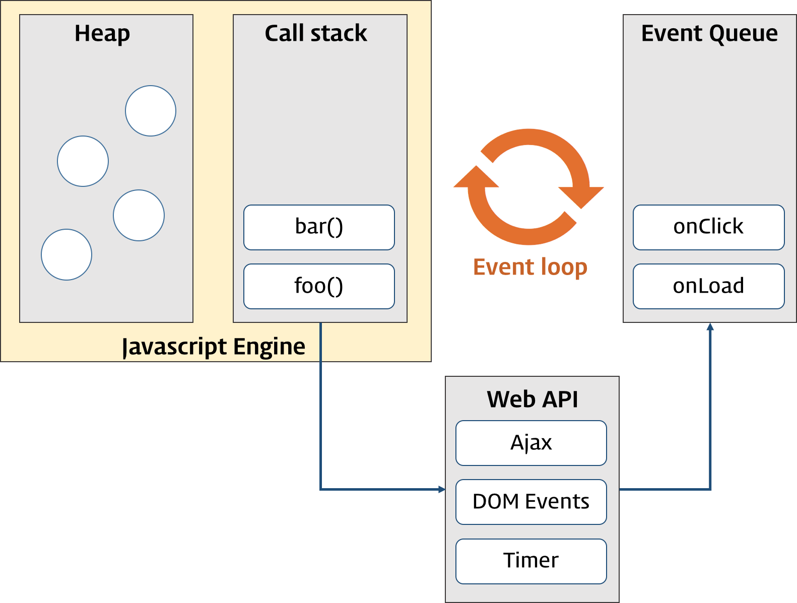
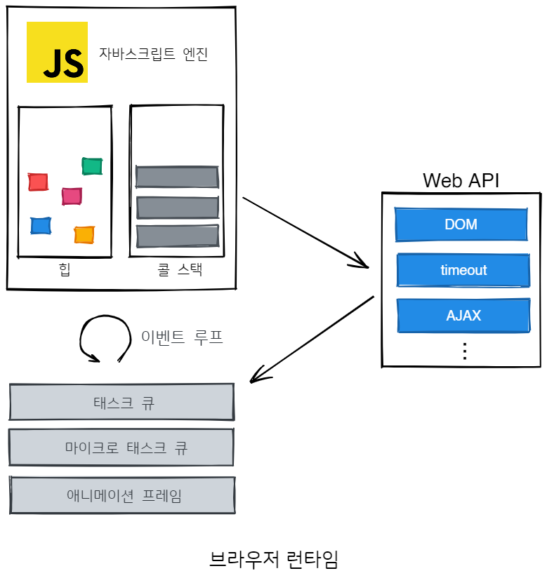

# promise

## 비동기 처리 과정




1. **http 요청**, **DOM API**, **타이머 함수**는 비동기적으로 동작한다
2. 비동기 함수는 JS 코드 평가 단계와 실행 단계에서 undefined 로 초기화하고 종료된다
3. return 값이 존재하지 않아 외부에서 참조해도 undefined
4. 비동기 함수는 실행 컨택스트 스택(콜 스택) 이 idle 한 상태일 때 (동기적 코드가 모두 실행되고 콜스택이 빈 상태일 때) 이벤트루프에 의해 태스크 큐에서 콜 스택으로 이동하여 실행된다

## promise 이전의 비동기 처리

```javascript
// GET 요청을 위한 비동기 함수
const get = (url) => {
  const xhr = new XMLHttpRequest();
  xhr.open("GET", url);
  xhr.send();

  xhr.onload = () => {
    if (xhr.status === 200) {
      // 서버의 응답을 콘솔에 출력한다.
      console.log(JSON.parse(xhr.response));
    } else {
      console.error(`${xhr.status} ${xhr.statusText}`);
    }
  };
};

// id가 1인 post를 취득
const response_data = get("https://jsonplaceholder.typicode.com/posts/1");

console.log("response_data:", response_data); // undefined
```

promise를 사용하지 않고 콜백 함수를 사용하여 비동기 처리를 할 수 있지만 콜백 지옥문제도 있고 안 쓰기도 하니 넘어가겠습니다

## promise
```javascript
const promise = new Promise((resolve, reject) => {
  if (/* 비동기 처리 성공 */) {
    resolve('result');
  } else { /* 비동기 처리 실패 */
    reject('failure reason');
  }
});
```
Promise 생성자 함수가 파라미터로 전달받은 콜백 함수 내부에서 비동기 처리를 수행한다


|promise의 상태|의미|상태 변경 조건|
|---|---|---|
|pending|비동기 처리가 아직 수행되지 않은 상태|promise가 생성된 직후 기본 상태|
|fulfilled|비동기 처리가 수행된 상태(성공)|resolve 함수 호출|
|reject|비동기 처리가 수행된 상태(실패)|reject 함수 호출|

**fulfilled** 또는 **rejected** 상태를 `settled` 상태라고 한다. `settled` 상태는 **fulfilled** 또는 **rejected** 상태와 **상관없이** `pending`이 아닌 상태로 비동기 처리가 수행된 상태.

## promise 후속 처리 메소드

### then()

then 메소드는 두 개의 콜백 함수(resolve, reject)를 파라미터로 전달 받고 promise를 리턴한다

- 첫 번째 파라미터 콜백
  - promise가 fufilled 상태인 경우 호출
  - promise의 비동기 처리 결과를 파라미터로 전달 받는다 

- 두 번째 파라미터 콜백
  - promise가 reject 상태인 경우 호출
  - promise의 error를 파라미터로 전달 받는다 

```javascript
// case 1 : then 파라미터 1개 (resolve)
const wrongUrl = "https://jsonplaceholder.typicode.com/XXX/1";

promiseGet(wrongUrl)
  .then((res) => console.log(res))
  .catch((err) => console.error(err)); // Error: 404

// case 2 : then 파라미터 2개 (resolve, reject)
// fulfilled
new Promise((resolve) => resolve("fulfilled")).then(
  (v) => console.log(v),
  (e) => console.error(e)
); // fulfilled

// rejected
new Promise((_, reject) => reject(new Error("rejected"))).then(
  (v) => console.log(v),
  (e) => console.error(e)
); // Error: rejected
```

### catch()

promise가 reject된 경우에만 호출된다

```javascript
// rejected
new Promise((_, reject) => reject(new Error("rejected"))).catch((e) =>
  console.log(e)
); // Error: rejected
```

### finally()

promise 성공 여부와 관계 없이 무조건 한 번 호출된다

```javascript
new Promise(() => {}).finally(() => console.log("finally")); // finally
```

### promise 에러 처리

then() 메소드의 두 번째 콜백으로 처리하기 보다 catch() 메소드를 사용하는 것이 가독성이 좋고 명료하다

## promise 체이닝

```javascript
const url = "https://jsonplaceholder.typicode.com";

promiseGet(`${url}/posts/1`) // id가 1인 post의 userId를 취득
  .then(({userId}) => promiseGet(`${url}/users/${userId}`)) // 취득한 userId로 user 정보 취득
  .catch((err) => console.error(err));
```

promise 후속 처리 메소드 콜백의 결과 값이 promise가 아니라도 암묵적으로 promsie로 wrapping 되어 resolve 또는 reject 반환된다

## promise 정적 메소드

### Promise.resolve/ Promise.reject

Promise.resolve와 Promise.reject 정적 메소드는 이미 존재하는 값을 래핑하여 promise를 생성하기 위해 사용한다

```javascript
const resolvedPromise = Promise.resolve([1, 2, 3]);
resolvedPromise.then(console.log); // [1, 2, 3]

const rejectedPromise = Promise.reject(new Error("Error!"));
rejectedPromise.catch(console.log); // Error: Error!
```
### Promise.all
Promise.all 메소드는 여러 개의 비동기 처리를 모두 병렬처리할 때 사용한다

파라미터로 전달받은 배열의 모든 promise가 fulfilled 상태가 되면 종료한다

가장 오래 걸리는 promise의 처리 시간에 의해 총 처리 시간이 결정되지만, 순서는 코드의 전달된 promise 배열의 순서대로 처리 순서를 보장한다

첫 번째 promise가 가장 나중에 fulfilled 상태가 되어도 Promise.all 메소드는 첫 번째 promise가 resolve한 처리 결과부터 차례대로 배열에 저장해 그 배열을 resolve하는 새로운 promise를 반환한다

Promise.all 메소드는 모든 promise가 fulfilled 상태가 되면 모든 처리 결과를 배열에 저장해 새로운 promise를 반환하므로, 해당 처리중에 rejected가 발생될 경우 에러가 발생되고 나머지 promise가 fulfilled 상태가 되는 것을 기다리지 않고 즉시 종료한다

```javascript
// case 1 : then() 메소드로만 연결할 경우

const requestData1 = () =>
  new Promise((resolve) => setTimeout(() => resolve(1), 3000));
const requestData2 = () =>
  new Promise((resolve) => setTimeout(() => resolve(2), 2000));
const requestData3 = () =>
  new Promise((resolve) => setTimeout(() => resolve(3), 1000));

// 세 개의 비동기 처리를 순차적으로 처리
const res = [];
requestData1()
  .then((data) => {
    res.push(data);
    return requestData2();
  })
  .then((data) => {
    res.push(data);
    return requestData3();
  })
  .then((data) => {
    res.push(data);
    console.log(res); // ?
  })
  .catch(console.error);

// Promise.all을 사용한 병렬 처리
const requestData1 = () =>
  new Promise((resolve) => setTimeout(() => resolve(1), 3000));
const requestData2 = () =>
  new Promise((resolve) => setTimeout(() => resolve(2), 2000));
const requestData3 = () =>
  new Promise((resolve) => setTimeout(() => resolve(3), 1000));

Promise.all([requestData1(), requestData2(), requestData3()])
  .then(console.log) // ?
  .catch(console.error);
```

파라미터로 전달받은 이터러블의 요소가 promise가 아닌 경우 Promise.resolve 메소드를 통해 promise로 래핑한다.

```javascript
Promise.all([
  1, // => Promise.resolve(1)
  2, // => Promise.resolve(2)
  3, // => Promise.resolve(3)
])
  .then(console.log) // [1, 2, 3]
  .catch(console.log);
```

### Promise.race
Promise.all 메소드와 동일하게 promise를 요소로 갖는 배열 등의 이터러블을 파라미터로 전달받는

Promise.race 메소드는 모든 promise가 fulfilled 상태가 되는 것을 기다리는 것이 아니라 가장 먼저 fulfilled 상태가 된 promise의 처리 결과를 resolve하는 새로운 promise를 반환한다


```javascript
Promise.race([
  new Promise((resolve) => setTimeout(() => resolve(1), 3000)), // 1
  new Promise((resolve) => setTimeout(() => resolve(2), 2000)), // 2
  new Promise((resolve) => setTimeout(() => resolve(3), 1000)), // 3
])
  .then(console.log) // 3
  .catch(console.log);
```

### Promise.allSettled

Promise.allSettled 메소드는 promise를 요소로 갖는 배열 등의 이터러블을 파라미터로 전달받는다. 전달받은 promise가 모두 settled 상태(비동기 처리가 수행된 상태, fulfilled / rejected 상태)가 되면 처리 결과를 배열로 반환한다.

```javascript
Promise.allSettled([
  new Promise((resolve) => setTimeout(() => resolve(1), 2000)),
  new Promise((_, reject) =>
    setTimeout(() => reject(new Error("Error!")), 1000)
  ),
]).then(console.log);
/*
[
  {status: "fulfilled", value: 1},
  {status: "rejected", reason: Error: Error! at <anonymous>:3:54}
]
*/
```

## 마이크로태스크 큐

```javascript
setTimeout(() => console.log(1), 0);

Promise.resolve()
  .then(() => console.log(2))
  .then(() => console.log(3));
```
<details>
<summary>실행 순서</summary>
2 > 3 > 1 
</details>

마이크로태스크 큐라는 태스크 큐와 별개의 큐에 promise의 후속 처리 메소드의 콜백 함수가 저장되기 때문이다

마이크로태스크 큐는 태스크 큐보다 우선순위가 높다

그 외의 비동기 함수(HTTP, DOM API, timer)의 콜백 함수나 이벤트 핸들러는 태스크 큐에 일시 저장된다

이벤트 루프는 콜 스택이 비면 먼저 마이크로태스크 큐에서 대기하고 있는 함수를 가져와 실행하고 이후 마이크로태스크 큐가 비면 태스크 큐에서 대기하고 있는 함수를 가져와 실행한다

## promise가 실행되는 시점

1. Promise 객체를 리턴하는 함수를 호출할 때 비동기 콜백함수는 실행되기 시작하고, 마이크로 태스크 큐에 들어가서 대기 

    (==Promise는 Promise 인스턴스가 만들어 질 때 promise에게 넘겨준 함수를 실행)

2. 호출되는 순간 Promise 객체의 상태는 pending 상태

```javascript
function sleep(delay){
  return new Promise((res, rej) => {
     setTimeout(() => {
           res();
     }, delay)
  });
}
async function execute(){
  //3초가 걸리는 잡이 3개가 있습니다. 
  let excuteTimes  = [3000, 3000, 3000]; 
    
  excuteTimes = excuteTimes.map(sleep);
  console.log(excuteTimes);
  for(let i=0;i<excuteTimes.length;i++){
    // 1개의 잡이 끝나고 반복문이 1증가하면서 다음잡이 실행될것 같습니다.
      await excuteTimes[i]; 
  }
    
  return;
}

execute().then(_ => {
    console.log("몇초나 걸렸죠?");
})
```

<details>
<summary>실행 시간</summary>
3초

Promise.all의 예제와 다른 이유는 순차적 처리(앞의 promise 처리를 기다려야 함)에 있다.
</details>


# flux 패턴


