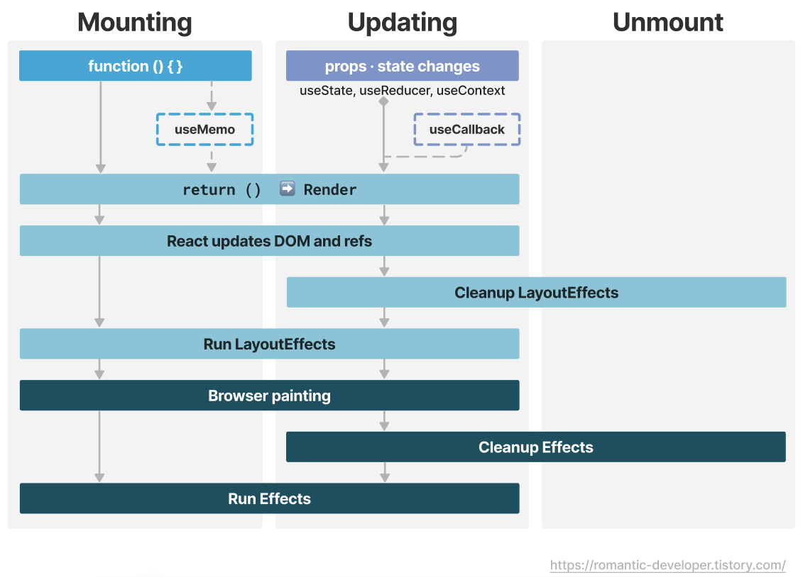

# 함수형 컴포넌트 라이프사이클

함수형 컴포넌트는 리액트 v16.8 이후 클래스 컴포넌트의 라이프사이클 메서드를 Hook을 통해 사용할 수 있게 되었다.

리액트 컴포넌트의 생명주기는 그림처럼 Mounting > Updating > Unmount 순서를 따른다.

###  Mounting : 컴포넌트의 처음 렌더링
1. 컴포넌트 내부 함수 수행
    - 컴포넌트의 상태를 설정하고, 훅을 사용해 다양한 사이드 이팩트나 메모이제이션을 준비한다. 
     - 컴포넌트가 처음 마운트될 때, `useMemo`에 전달된 함수는 처음 실행되어 결과값을 계산한 후 이 값을 메모이제이션 한다. 
     - `useMemo`는 계산 비용이 많이 드는 연산의 결과를 메모이제이션하여 동일한 입력 값에 대해 연산을 다시 수행하지 않고 이전 계산된 값을 재사용한다.
    
2. 렌더링
   - 컴포넌트 함수로부터 반환된 JSX를 사용해 가상 DOM을 생성하고, 실제 DOM을 업데이트하기 위한 준비를 한다.
   - 이 단계는 실제 DOM을 변경하는 게 아닌, 리액트가 DOM을 어떻게 변경할지 계획하는 단계이다. 
3. DOM과 refs 업데이트
   - 리액트가 계산된 변경사항을 실제 DOM에 반영한다. 이 과정에서 DOM 노드의 추가, 삭제, 수정이 이뤄진다.
   - `ref`가 설정되면, 이 단계에서 `ref.current`가 실제 DOM요소를 가르키도록 업데이트 된다.
4. LayoutEffects 실행
   - `useLayoutEffect` 훅은 DOM 변경 후 즉시 브라우저가 그리기 전에 수행된다.
   - 이 훅은 DOM 노드의 읽기나 변경 같은 작업을 동기적으로 수행하는 데 사용된다.
5. 브라우저 화면 painting
   - 브라우저는 변경된 DOM에 따라 화면을 그린다. (Reflow, Repaint) 이는 사용자가 실제 화면을 볼 수 있는 UI를 생성하는 단계이다.
6. Effects 실행
  - `useEffect` 훅은 브라우저가 화면을 그린 후 실행된다.
  - 사이드 이팩트를 수행하기 위해 사용된다.
### Updating
1. Props 및 State의 변경
  - `useState`,`useReducer`,`useContext`와 같은 훅에 의해 state나 props가 변경될 때 컴포넌트 업데이트를 판단한다.
2. 렌더링
  - 컴포넌트 함수를 다시 호출하여 새로운 JSX를 생성한다.
  - 이 단계에서 실제 DOM에 바로 반영되지 않고 무엇을 렌더링할지 계획한다.
3. DOM 업데이트
   - 새로운 JSX와 이전에 렌더링된 내용의 차이를 계산한 후, 실제 DOM에 변경사항을 반영한다.
4. Cleanup & LayoutEffects
   - `useLayoutEffect`에서 반환된 클린업 함수가 호출된다. 이는 이전에 설정된 사이드 이펙트를 정리하는 역할을 한다. 
   - 이후, 새로운 `useLayoutEffect`를 실행한다. 이는 DOM 업데이트 직후, 브라우저가 화면을 그리기 전에 동기적으로 실행되어 필요한 DOM 조작을 수행한다.
5. 브라우저 화면 painting
   - 리액트가 업데이트한 DOM에 따라 브라우저가 화면을 그린다.
6. Cleanup & Effects
  - `useEffect`에 반환된 클린업 함수가 호출된다. 이는 컴포넌트가 업데이트되기 전에 이전에 설정된 사이드 이팩트를 정리하는데 사용된다.
  - 새로운 `useEffect` 함수가 실행되어 사이드 이펙트를 수행한다.

### Unmount