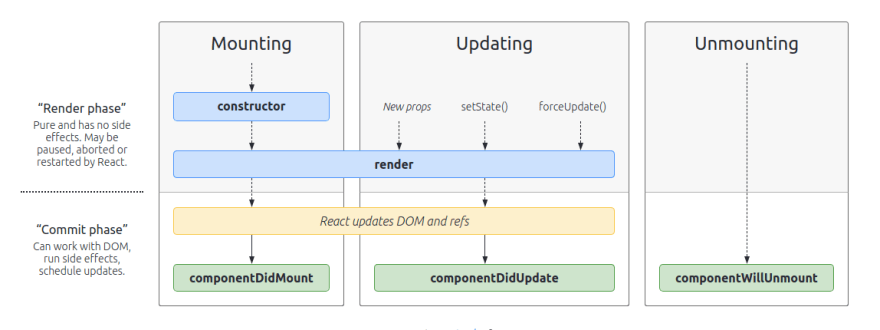

# 리액트 라이프 사이클
### 1. 라이프 사이클의 이해
- 리액트의 컴포넌트에는 라이프사이클이 존재한다. 이는 페이지에 렌더링되기 전인 **준비과정**에서 시작해 페이지에서 사라질 때 끝난다.
- 라이프 사이클 메서드는 클래스형 컴포넌트에서만 사용 가능하다. 함수형 컴포넌트에서는 Hooks를 사용해 비슷한 작업을 처리한다.

### 2. 라이프 사이클 메서드
- 라이프 사이클 메서드 용어

  | 용어 | 설명 |
  |------|------|
  | ~ will | 어떤 '작업을 수행하기 전에 실행되는 메서드와 관련. |
  | ~ did | 어떤 '작업을 수행한 이후'에 실행되는 메서드와 관련. |
  | mount | 컴포넌트 내에서 **'DOM이 생성'**되고 웹 브라우저 상에 나타나는 메서드와 관련. |
  | unmount | 컴포넌트 내에서 **'DOM을 제거'**되고 웹 브라우저 상에 사라지는 메서드와 관련. |
  | update | 컴포넌트 내에서 '변화'가 발생하였을 때 수행하는 것을 의미. |

  <br/>
  <br/>

  
  [출처] https://projects.wojtekmaj.pl/react-lifecycle-methods-diagram/

- 마운트
  - `constructor`: 컴포넌트를 새로 만들 때마다 호출되는 클래스 생성자 메서드
  - `getDerivedStateFromProps`: props에 있는 값을 state에 넣을 때 사용하는 메서드
  - `render`: UI를 렌더링하는 메서드. 렌더링을 수행
    - 유일한 필수 메서드로 this.props와 this.state에 접근할 수 있으며 리액트 요소를 반환한다. 
  - `componentDidMount`: 화면 렌더링 이후 DOM트리에 삽입
    - 컴포넌트를 만들고, 첫 렌더링을 다 마친 후 실행. 다른 js라이브러리, 프레임워크 함수 호출, 이벤트 등록 등 비동기 작업 처리.
- 업데이트
  - `getDerivedStateFromProps`: 마운트 과정에서도 호출됨. 업데이트 시작 전 호출하여 props의 변화에 따라 state 값에 변화를 주고 싶을 때 사용.
  - `getSnapshotBeforeUpdate`: 컴포넌트 변화를 DOM에 반영하기 바로 직전에 호출하는 메서드
    - 주로 업데이트하기 직전의 값을 참고할 일이 있을 때 활용됨. (스크롤바 위치 유지)
  - `shouldComponentUpdate`: 컴포넌트의 리렌더링 여부 결정하는 메서드. boolean으로 반환함.
  - `componentDidUpdate`: 컴포넌트 업데이트 작업이 끝난 후 호출하는 메서드.
  - 4가지의 경우 업데이트를 수행함.
    - props가 바뀔 때
    - state가 바뀔 때
    - 부모 컴포넌트가 리렌더링될 때
    - this.forceUpdate로 강제 렌더링을 트리거할 때   
- 언마운트
  - `componentWillUnmount`: 컴포넌트가 DOM에서 제거되기 전 호출되는 메서드.
  - 컴포넌트가 사용 중인 리소스 해제, 타이머 해제, 네트워크 요청 취소 등 클린업 작업 수행에 사용
- `componentDidCatch`: 컴포넌트 렌더링 중 에러 발생 시 오류 UI를 보여줄 수 있게 함. 


# 브라우저 렌더링 원리와 리액트
리액트 프로젝트가 브라우저에 로드되고 실행되는 과정을 브라우저 렌더링 원리와 함께 정리해보면 좋을 것 같아 작성합니다.

과정은 크게 다음과 같이 나뉜다.
1. 초기로드 및 렌더링
2. 리액트에 의한 동적 UI업데이트
3. 브라우저 렌더링

### 1. 초기 로드 및 렌더링
1. **HTML 및 리소스 로드**: 사용자가 웹사이트에 접속하면, 브라우저는 `index.html`과 함께 필요한 javaScript 파일(리액트 및 애플리케이션 코드), CSS 파일 등을 로드한다.
2. **DOM 트리 구축** : 브라우저는 HTML을 파싱하여 DOM트리를 구축한다.
3. **CSSOM 트리 구축** : CSS 파일과 스타일 태그 내의 CSS가 파싱되어 CSSOM 트리가 구축된다.
4. **Javascript 실행**: 리액트 및 기타 JavaScript 코드가 로드되고 실행된다. 리액트는 가상돔(VDOM)을 생성하고, 초기 UI 렌더링을 위해 실제 DOM을 조작한다.
  - `ReactDOM.render()`함수는 특정 DOM 요소(`<div id="root/>`) 내에 `APP` 컴포넌트 같은 리액트 컴포넌트를 렌더링한다.
5. **Reflow & Repaint** :밑에 상세 설명
  - 
### 2. 리액트에 의한 동적 UI 업데이트
1. 리액트 컴포넌트의 라이프사이클 메서드에 따라 컴포넌트가 마운트, 업데이트, 언마운트 된다.
2. **상태 및 속성 변경**: 사용자 상호작용  또는 API호출 등으로 컴포넌트의 상태나 속성 (state, props)이 변경될 경우, 리액트는 VDOM을 업데이트하고 실제 DOM과의 차이를 계산한다.
3. **DOM 업데이트**: 리액트는 계산된 차이를 바탕으로 실제 DOM을 최소한으로 조작해 변경사항을 반영한다.
  - DOM의 update를 Batch로 처리하여 실제 DOM의 리렌더링 연산을 최소화할 수 있다. 연쇄적인 Reflow, Repaint 발생을 줄인다.

### 3.브라우저의 렌더링
1. **Reflow 최소화**: DOM의 변경(요소의 추가, 삭제, 크기 변경 등)이 발생하면, 브라우저는 화면에 영향을 미치는 요소의 위치와 크기를 다시 계산하는 Reflow를 한다. 초기 로드시, 리액트 컴포넌트가 DOM에 추가되는 순간 Reflow가 발생하며, 컴포넌트의 크기나 위치가 바뀌는 컴포넌트 업데이트가 일어날 때도 발생한다.

2. **Repaint 최적화**: 요소의 스타일(색상, 배경 등)이 변경되면, 브라우저는 해당 요소를 다시 그리는 Repaint를 한다. Reflow 후에 일어날 수도 있고, Repaint만 일어날 수 있다.


3. 추가 설명
- Props나 State 변화, 부모 컴포넌트 리렌더링은 재렌더링을 유발한다. 이는 결과적으로 DOM에 변화를 주는데 리액트는 가상 DOM을 사용해 불필요한 DOM 조작을 최소화하기 때문에 Reflow를 최적화한다.

  - Batch Update 예시
  ```js
   const list = document.getElementById('myList');
    list.style.color = 'blue'; // (1) 스타일 변경
    list.textContent = 'Updated list item'; // (2)텍스트 변경
  ```
  - 일반적인 브라우저 Update는 DOM 조작이 즉시 처리됨: (1),(2)가 각각 DOM 변경 별개 처리되기 때문에 Reflow, Repaint발생
  ```js
  function MyComponent() {
    const [color, setColor] = useState('red');
    const [text, setText] = useState('Initial text');

    const updateComponent = () => {
      setColor('blue'); // (1) 색상 변경
      setText('Updated list item'); // (2) 텍스트 변경
    };

    return (
      <div style={{ color }}>
        {text}
        <button onClick={updateComponent}>Update</button>
      </div>
    );
  }
  ```
  - 리액트는 상태 변경들을 Batch Update처리함. 여러 상태 변경을 한 번에 모아 처리. 따라서 단 한번의 Reflow와 Repaint가 일어남.

- 그럼에도 불구하고, 큰 리스트를 렌더링하거나, 복잡한 레이아웃을 가진 컴포넌트는 Reflow 성능에 영향을 미칠 수 있다. 

- 이를 위해 `shouldComponentUpdate`, `React.memo`, `useMemo`등의 기법을 사용한다.
- 예를 들어 전체 개시물을 보여주는 count state의 경우 텍스트 내용만 바꾸기 때문에 (= DOM 요소의 크기나 위치에 영향을 주지 않기 때문에) Reflow는 발생하지 않고 Repaint만 발생한다.
- 예를 들어 `margin-top`같은 속성 변경이 발생하면, 리액트는  VDOM에서 차이를 계산하고, 레아웃에 영향으 주기 때문에 Reflow가 발생하며 이후 Repaint를 한다.
- Reflow를 발생시키는 CSS 사용을 최소화하면 좋다. (CSS 속성마다 어떤 발생을 일으키는지 알려주는 사이트: https://www.lmame-geek.com/)
- Layout과 Paint가 모두 발생하지 않는 속성: `transform, opacitiy, cursor, orphans, perspective`


#### 참고
>https://velog.io/@1nthek/React-Virtual-DOM%EA%B3%BC-%EB%A0%8C%EB%8D%94%EB%A7%81

> 리액트 다루는 기술 7장

> https://adjh54.tistory.com/42