# 이벤트 객체

이벤트가 발생하면 이벤트에 관련한 다양한 정보를 담고 잇는 이벤트 객체가 동적으로 생성됩니다. **생성된 이벤트 객체는 이벤트 핸들러의 첫 번째 인수로 전달됩니다.**

클릭 이벤트에 의해 생성된 이벤트 객체는 이벤트 핸들러의 첫 번째 인수로 전달되어 매개변수 e에 암묵적으로 할당됩니다. 이는 브라우저가 이벤트 핸들러를 호출할 때 이벤트 객체를 인수로 전달하기 때문입니다. 따라서 이벤트 객체를 전달받으려면 이벤트 핸들러를 정의할 때 이벤트 객체를 전달받을 매개변수를 명시적으로 선언해야 합니다. 위 예제에서는 e라는 이름으로 매개변수를 선언했지만 다른 이름을 사용해도 상관없습니다.

이벤트 핸들러 어트리뷰트 방식으로 이벤트 핸들러를 등록했다면 위와 같이 `event`를 통해 이벤트 객체를 전달받을 수 있습니다.

이벤트 핸들러 어트리뷰트 방식의 경우 이벤트 객체를 전달받으려면 이벤트 핸들러의 첫 번째 매개변수 이름이 반드시 `event`여야 합니다. 만약 `event`가 아닌 다른 이름으로 매개변수를 선언하면 이벤트 객체를 전달 받을 수 없습니다. (이는 이벤트 핸들러 어트리뷰트 값은 사실 암묵적으로 생성되는 이벤트 핸들러의 함수 몸체를 의미하기 때문입니다.)

즉, `onclick="showCoords(event)"` 어트리뷰트는 파싱되어 다음과 같은 함수를 암묵적으로 생성하여 `onclick` 이벤트 프로퍼티에 할당합니다.

## 이벤트 객체의 상속 구조

이벤트 객체는 다음과 같은 상속 구조를 갖습니다.

`Event`,`UIEvent`,`MouseEvent` 등 모두는 생성자 함수입니다.

이처럼 이벤트가 발생하면 암묵적으로 생성되는 이벤트 객체도 생성자 함수에 의해서 생성됩니다. 생성된 이벤트 객체는 생성자 함수와 더불어 생성되는 프로토타입으로 구성된 프로토타입 체인의 일원이 됩니다. 

예를 들어, `click` 이벤트가 발생하면 암묵적으로 생성되는 `MouseEvent` 타입의 이벤트 객체는 다음과 같은 프로토타입 체인의 일원이 됩니다.

이벤트 객체 중 일부는 사용자의 행위에 의해 생성된 것이고 일부는 자바스크립트 코드에 의해 인위적으로 생성된 것 입니다.

`MouseEvent` 타입의 이벤트 객체는 사용자의 마우스 이벤트에 의해서,
`CustomEvent` 타입의 이벤트 객체는 자바스크립트 코드에 의해서 생성된 것 입니다.

`Event` 인터페이스는 DOM 내에서 발생한 이벤트에 의해 생성되는 이벤트 객체를 나타냅니다. `Event` 인터페이스에는 모든 이벤트 객체의 공통 프로퍼티가 정의되어 있고 `FocusEvent`,`MouseEvent`,`KeyboardEvent`,`WheelEvent` 같은 하위 인터페이스에는 이벤트 타입에 따라 고유한 프로퍼티가 정의되어 있습니다.

다음 예제와 같이 이벤트 객체의 프로퍼티는 발생한 이벤트 타입에 따라서 달라집니다.

## 이벤트 객체의 공통 프로퍼티

`Event` 인터페이스, 즉 `Event.prototype`에 정의되어 있는 이벤트 관련 프로퍼티는 `UIEvent`,`CustomEvent`,`MouseEvent` 등 모든 파생 이벤트 객체에 상속됩니다. 즉, `Event` 인터페이스 이벤트 관련 프로퍼티는 모든 이벤트 객체가 상속받는 공통 프로퍼티 입니다.

사용자의 입력에 의해 체크박스 요소의 체크상태가 변경되면 
1. `checked` 프로퍼티의 값이 변경되고 `change` 이벤트가 발생  
2. `Event` 타입의 이벤트 객체가 생성

이벤트 객체의 `target` 프로퍼티는 이벤트를 발생시킨 객체, 즉 `change` 이벤트를 발생시킨 DOM 요소 `$checkbox`이고 이 객체의 `checked` 프로퍼티는 현재의 체크 상태를 나타냅니다.

일반적으로 이벤트 객체의 `target` 프로퍼티와 `currentTarget` 프로퍼티는 동일한 DOM 요소를 가리키지만, 서로 다른 DOM 요소를 가리킬 수도 있습니다.

## 마우스 정보 취득

`click`,`dbclick`,`mousedown`,`mouseup`,`mousemove`,`mouseenter`,`mouseleave` 이벤트가 발생하면 생성되는 `mouseEvent` 타입의 이벤트 객체는 다음과 같은 고유의 프로퍼티를 갖습니다.

예를 들어, DOM 요소를 드래그하여 이동시키는 예제를 만들면,

드래그는 마우스 버튼을 누른 상태에서 마우스를 이동하는 것으로 시작하고 마우스 버튼을 떼면 종료합니다.

따라서 `mousedown` 이벤트가 발생한 상태에서 `mousemove` 이벤트가 발생한 시점에 시작하고 `mouseup` 이벤트가 발생한 시점에 종료합니다.

드래그가 시작되면 드래그 시작 시점, 즉 `mousedown` 이벤트가 발생했을 때의 마우스 포인터 좌표와 드래그를 하고 있는 시점, 즉 `mousedown` 이벤트가 발생했을 때의 마우스 포인터 좌표와 드래그를 하고 있는 시점, 즉 `mousemove` 이벤트가 발생할 때마다의 마우스 포인터 좌표를 비교하여 드래그 대상의 이동 거리를 합니다.

`mouseup` 이벤트가 발생하면 드래그가 종료한 것 입니다. 이때 드래그 대상 요소를 이동시키는 이벤트 핸들러를 제거하는 이동을 멈춥니다.

마우스 포인터 좌표는 `MouseEvent` 타입의 이벤트 객체에서 제공합니다. `mousedown`,`mouseup`,`mousemove` 이벤트가 발생하면 생성되는 `MouseEvent` 타입의 이벤트 개게는 마우스 포인터의 좌표 정보를 나타내는 `screenX/screenY`,`clientX/clientY`,`pageX/pageY`,`offsetX/offsetY` 프로퍼티를 제공합니다. 이 프로퍼티 중에서 `clientX/clientY`는 뷰포트, 즉 웹페이지의 가시 영역을 기준으로 마우스 포인터 좌표를 나타냅니다.

# 이벤트 전파

DOM 트리 상에 존재하는 DOM 요소 노드에서 발생한 이벤트는 DOM 트리를 통해서 전파됩니다.

생성된 이벤트 객체는 이벤트를 발생시킨 DOM 요소인 이벤트 타깃을 중심으로 DOM 트리를 통해 전파됩니다.

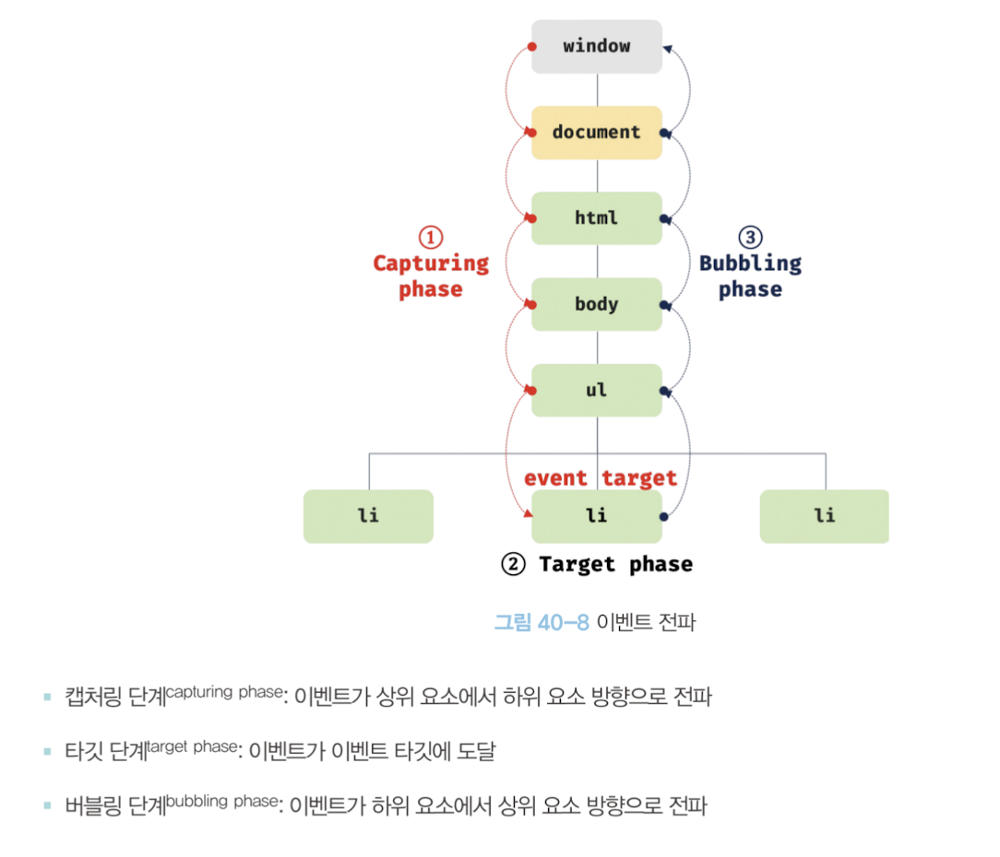

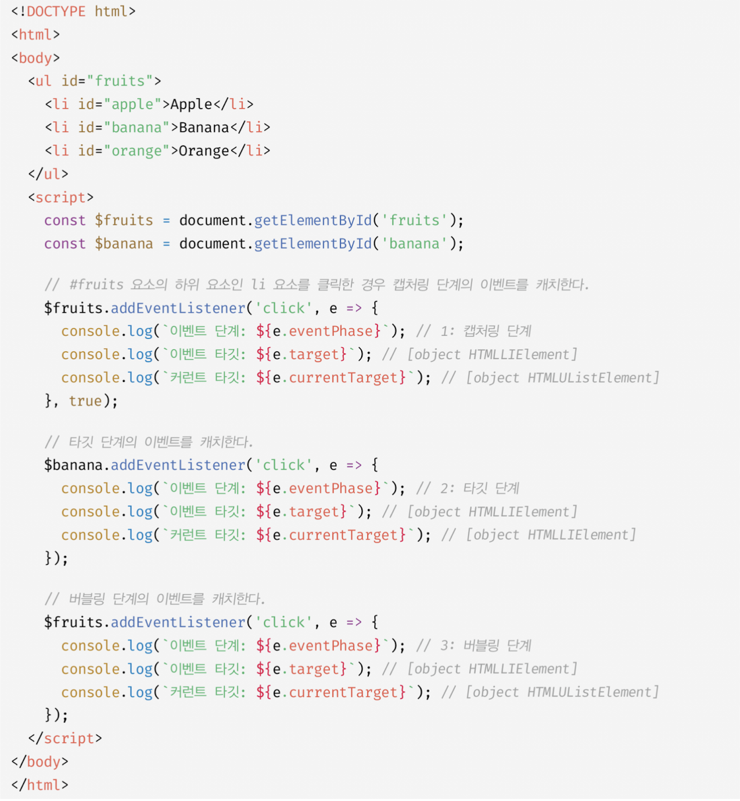

이벤트는 이벤트를 발생시킨 이벤트 타깃은 물론 상위 DOM 요소에서도 캐치ㅏㄹ 수 있습니다.

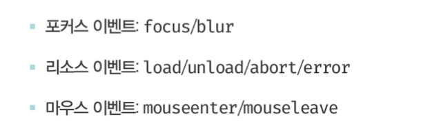

위 사진의 이벤트는 버블링되 않기 때문에, 이벤트 타깃의 상위 요소에서 위 이벤트를 캐치하려면 캡처링 단계의 이벤트를 캐치해야 합니다.

혹은 대체가 가능합니다.

`focus/blur` -> `focusin/focusout`
`mouseenter/mouseleave` -> `mouseover/mouseout`

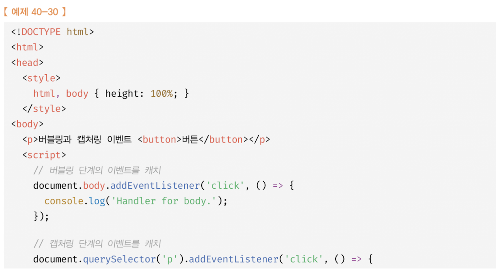
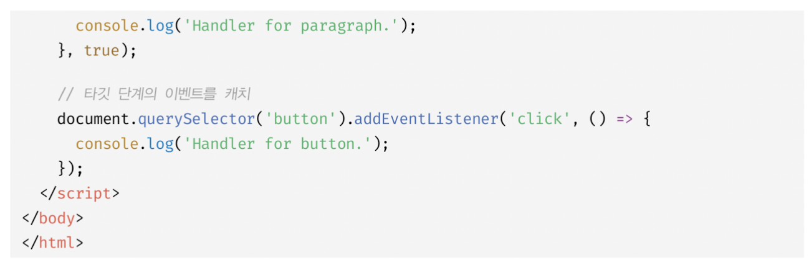

- `body` 요소는 버블링 단계의 이벤트만을 캐치
- `p` 요소는 캡처링 단계의 이벤트만을 캐치

이벤트는 캡처링 - 타깃 - 버블링 단계로 전파됩니다.

결과는 아래와 같습니다.

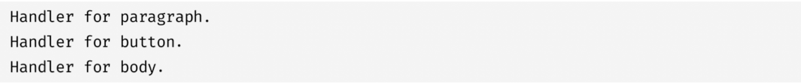

만일 `p` 요소에서 클릭 이벤트가 발생하면 캡처링 단계를 캐치하는 `p` 요소의 이벤트 핸들러가 호출되고 버블링 단계를 캐치하는 `body` 요소의 이벤트 핸들러가 순차적으로 호출됩니다.

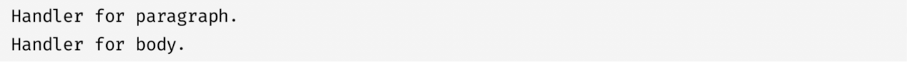

# 이벤트 위임

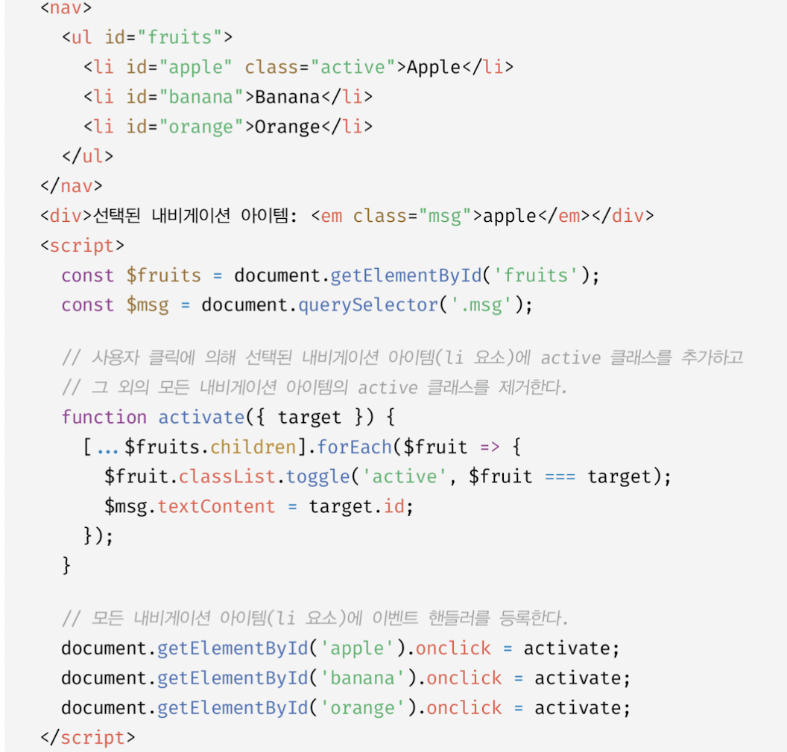

내비게이션 아이템(li 요소)이 클릭 이벤트에 반응하도록 모든 내비게이션 아이템에 이벤트 핸들러인 `activate`를 등록해야 합니다.

성능 저하 및 유지 보수에 부적합한 코드입니다.

**이벤트 위임**은 여러 개의 하위 DOM 요소에 각각 이벤트 핸들러를 등록하는 대신 하나의 상위 DOM 요소에 이벤트 핸들러를 등록하는 방법을 말합니다.

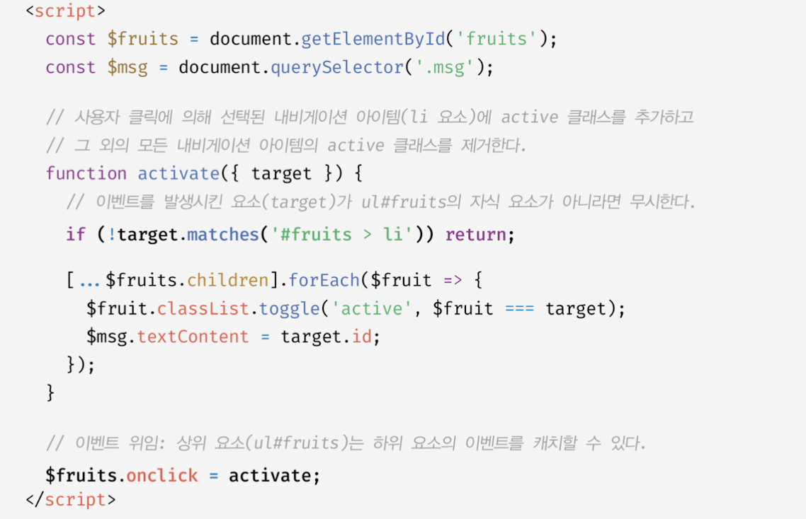

상위 요소에 이벤트 핸들러를 등록하기 때문에 이벤트 타깃, 즉 이벤트를 실제로 발생시킨 DOM 요소가 개발자가 기대한 DOM 요소가 아닐 수도 있습니다.

위 예제의 경우, `ul#fruits` 요소에 바인딩된 이벤트 핸들러는 자기 자신은 물론 `ul#fruits` 요소으 하위 요소 중에서 클릭 이벤트를 발생시킨 모든 DOM 요소에 반응합니다.

따라서 반응이 필요한 DOM 요소 (예제의 경우, `#fruits > li` 선택자에 의해 선택되는 DOM 요소)에 한정하여 이벤트 핸들러가 실행되도록 이벤트 타깃을 검사할 필요가 있습니다.

`Element.prototype.matches` 메서드는 인수로 전달된 선택자에 의해 특정 노드를 탐색 가능한지 확인합니다.

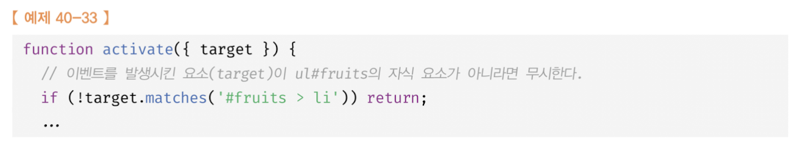

일반적으로 `target` 과 `currentTarget` 프로퍼티는 동일한 DOM 요소를 가리키지만 이벤트 위임을 통해 상위 DOM 요소에 이벤트를 바인딩 한 경우 이벤트 객체의 `target` 프로퍼티와 `currentTarget` 프로퍼티가 다른 DOM 요소를 가리킬 수 있습니다.

# DOM 요소의 기본 동작 조작

## DOM 요소의 기본 동작 중단

이벤트 객체의 `preventDefault` 메서드는 DOM 요소의 기본 동작을 중단시킵니다.

(ex) a 요소 클릭하면 href 어트리뷰트에 지정된 링크로 이동..)

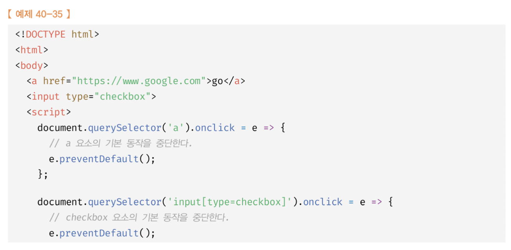

## 이벤트 전파 방지

`stopPropagation` 메서드는 이벤트 전파를 중지시킵니다.

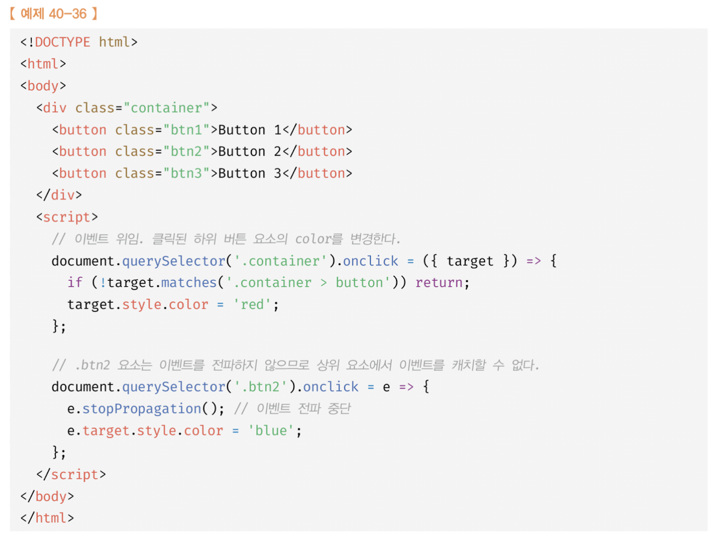

# 이벤트 핸들러 내부의 this

## 이벤트 핸들러 어트리뷰트 방식

이벤트 핸들러를 호출할 떄 인수로 전달한 `this`는 이벤트를 바인딩한 DOM 요소를 가리킵니다.

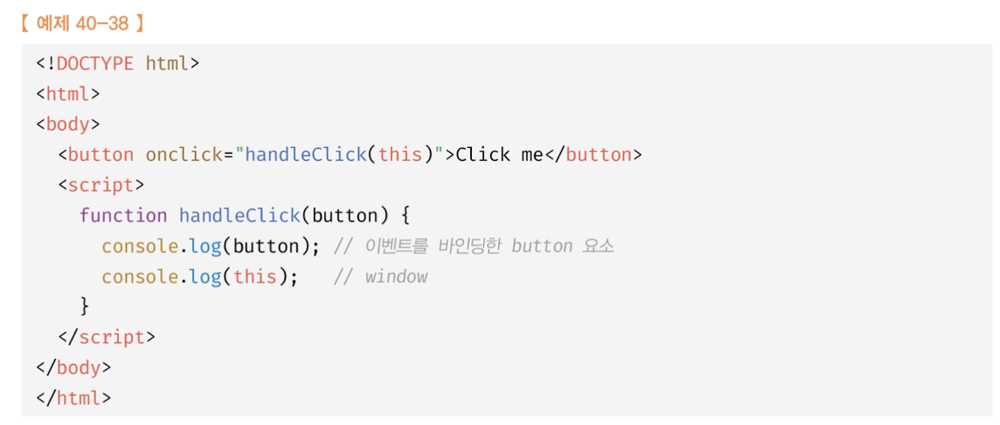

## 이벤트 핸들러 프로퍼티 방식과 `addEventListener` 메서드 방식

이벤트 핸들러 프로퍼티 방식과 `addEventListener` 메서드 방식 모두 이벤트 핸들러 내부의 `this`는 이벤트를 바인딩한 DOM 요소를 가리킵니다.

즉, 이벤트 핸들러 내부의 `this`는 이벤트 객체의 `currentTarget` 프로퍼티와 같습니다.

### 화살표 함수

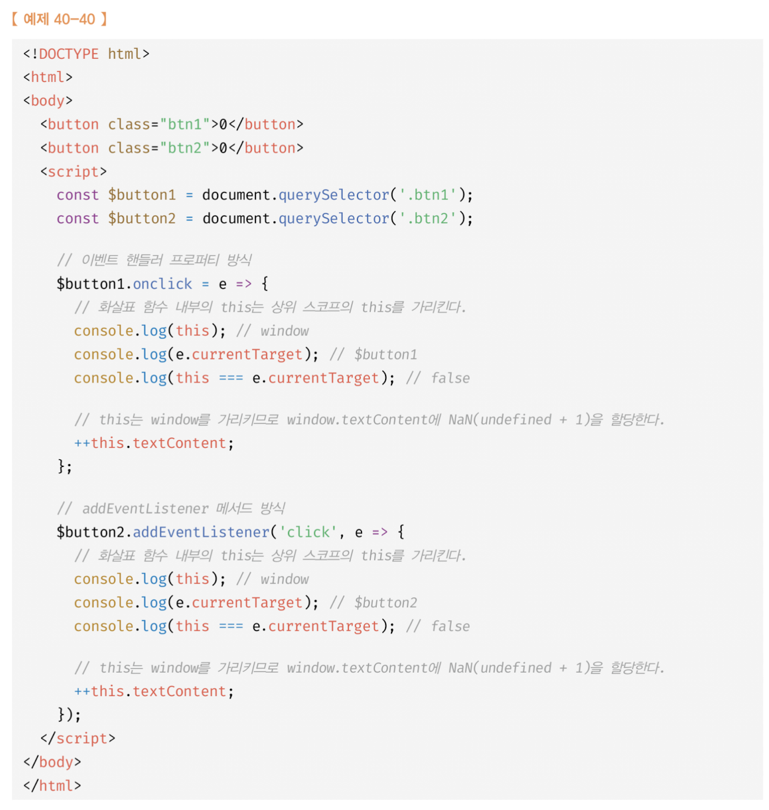

화살표 함수로 정의한 경우 상위 스코프의 `this`를 가리킵니다.

### 클래스

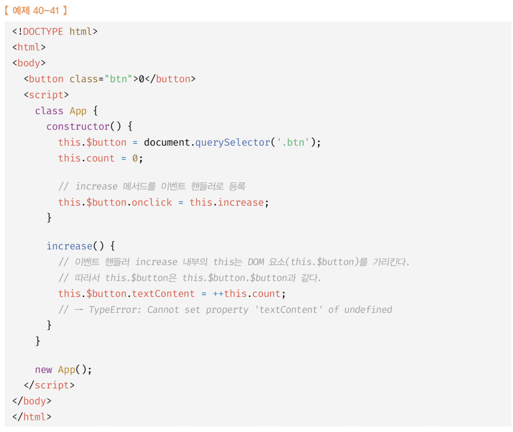

이벤트 핸들러 내부의 `this`는 이벤트를 바인딩한 DOM 요소를 가리킵니다.
따라서 위 예제에서 `increase` 메서드 내부의 `this`는 `this.$button`을 가리키게 됩니다.

이것은 `bind`를 사용해서 `increase` 메서드 내부의 `this`가 클래스가 생성할 인스턴스를 가리키도록 해주어야 합니다.

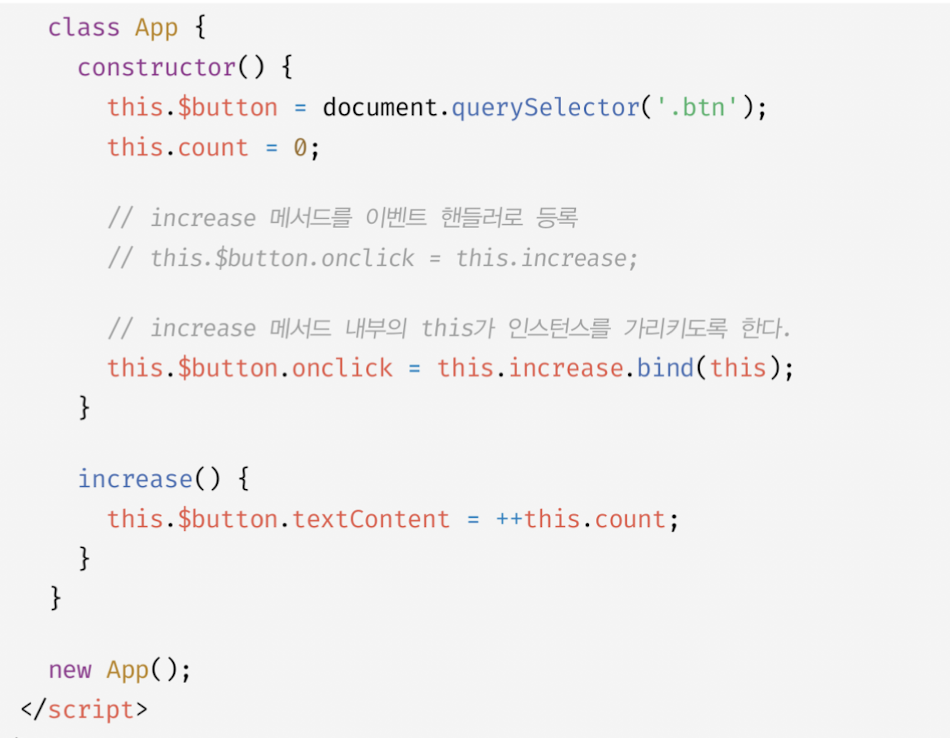

혹은 화살표 함수를 이용해도 됩니다.

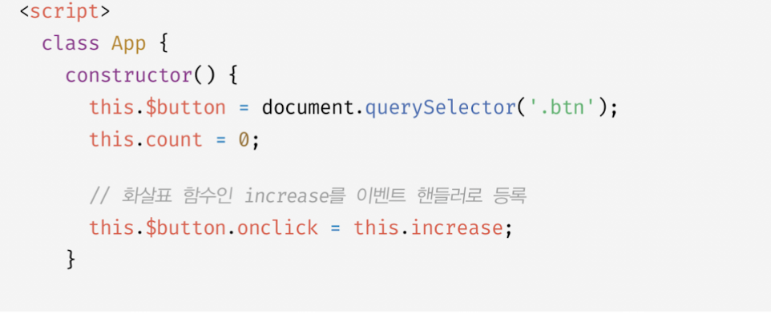
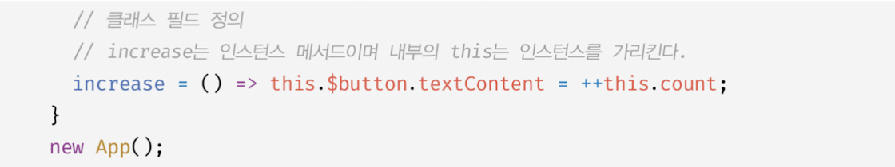

# 이벤트 핸들러에 인수 전달

이벤트 핸들러 어트리뷰트 방식은 함수 호출문을 사용할 수 있기 때문에 인수 전달이 가능합니다.

프로퍼티 방식과 `addEventListener` 메서드 방식의 경우 이벤트 핸들러를 브라우저가 호출하기 때문에, 함수 호출문이 아닌 함수 자체를 등록해야하므로 인수를 전달할 수 없습니다.

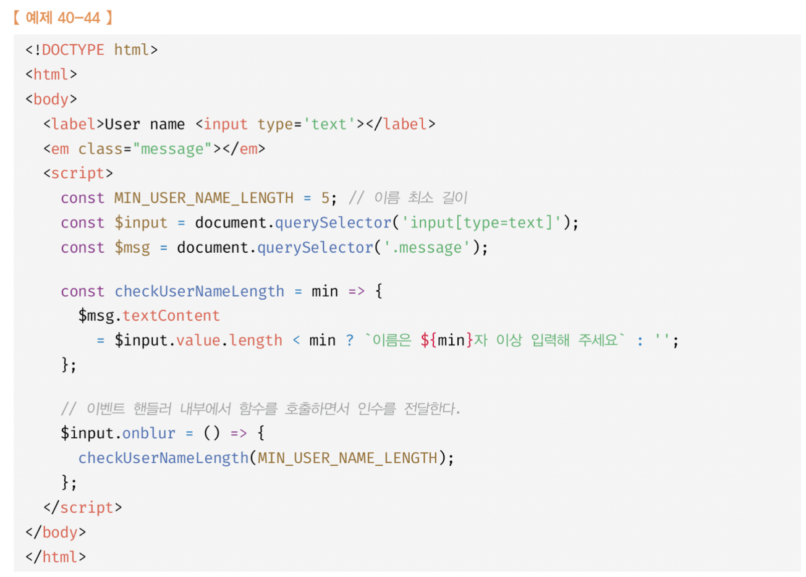

하지만 위 예제 처럼 이벤트 핸들러 내부에서 함수를 호출하면서 인수를 전달할 수 있습니다.

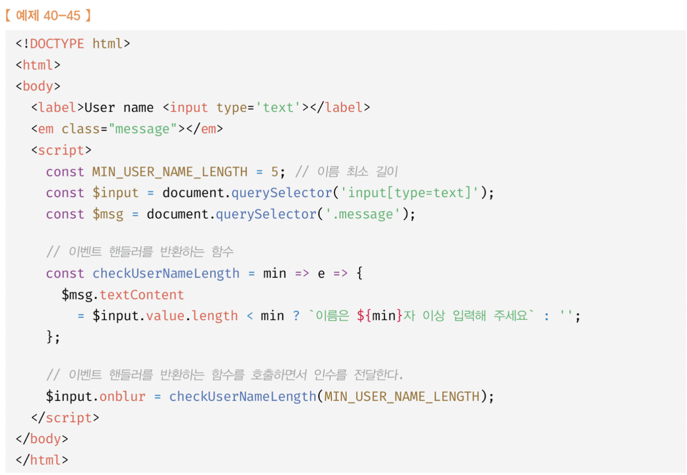

또는 이벤트 핸들러를 반환하는 함수를 호출하면서 인수를 전달할 수 있습니다.

# 커스텀 이벤트

## 커스텀 이벤트 생성

`Event`,`UIEvent`,`MouseEvent` 같은 이벤트 생성자 함수를 호출하여 명시적으로 생성한 이벤트 객체는 임의의 이벤트 타입을 지정할 수 있습니다.

이것을 커스텀 이벤트라고 합니다.

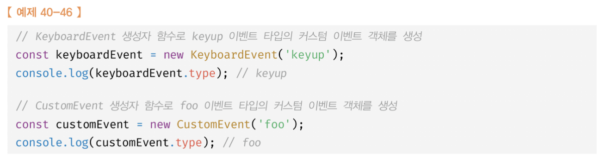

첫 번째 인수로 이벤트 타입을 나타내는 문자열을 받습니다.
이벤트 타입은 기존 이벤트 타입 혹은 임의의 문자열 모두 가능합니다.
일반적으로는 `CustomEvent` 이벤트 생성자를 사용합니다.

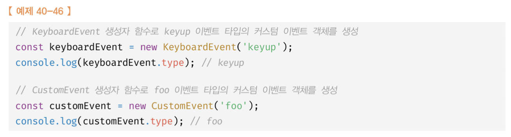

버블링과 `preventDefault` 메서드를 이용한 취소가 모두 불가능합니다.

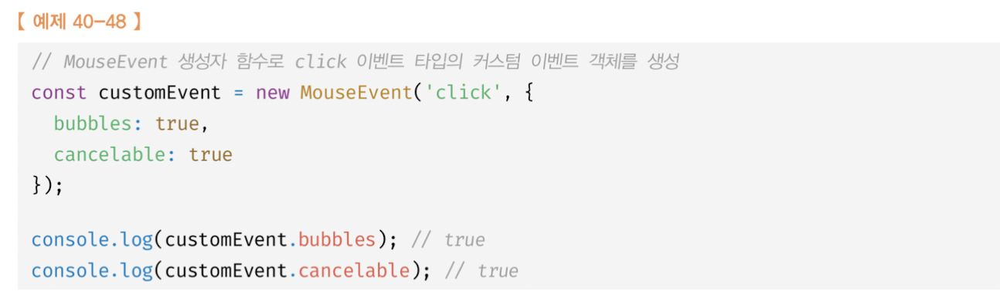

커스텀 이벤트 객체의 `bubbles` 또는 `cancleable` 프로퍼티를 갖는 객체를 전달하여 사용가능하게 해줍니다.

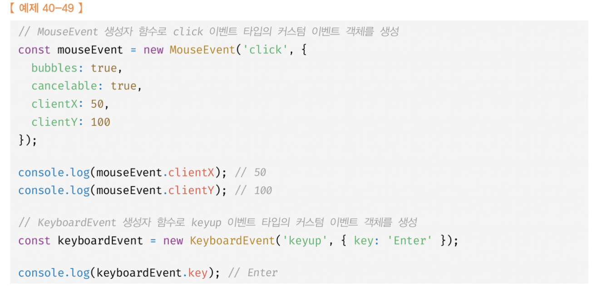

위 예제와 같이 마우스 이벤트 객체 고유의 프로퍼티 등등도 전달 가능합니다.

이벤트 생성자 함수로 생성한 커스텀 이벤트는 `isTrusted` 프로퍼티 값이 언제나 `false` 입니다.

## 커스텀 이벤트 디스패치

생성된 커스텀 이벤트는 `dispatchEvent` 메서드로 디스패치(이벤트를 발생시키는 행위) 할 수 있습니다.

`dispatchEvent` 메서드에 이벤트 객체를 인수로 전달하면서 호출하면 인수로 전달한 이벤트 타입의 이벤트가 발생합니다.

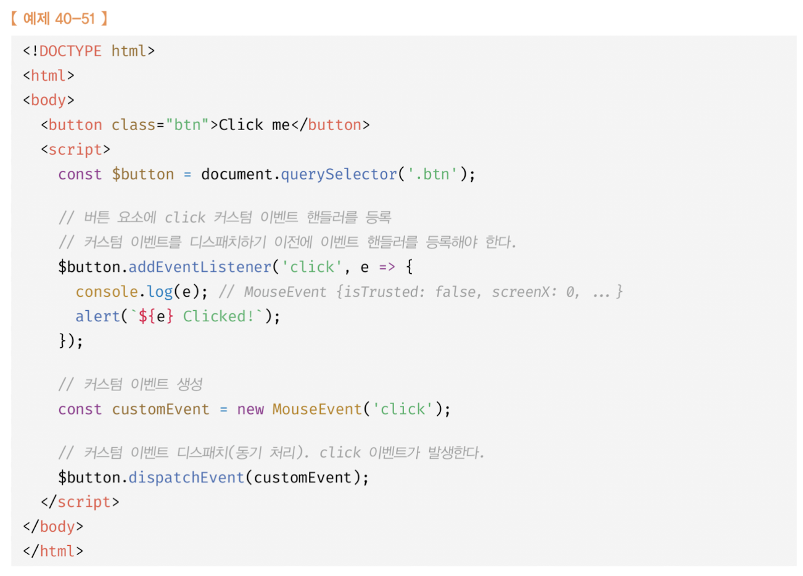

`dispatchEvent`는 동기 처리 방식으로 호출하기 때문에, 커스텀 이벤트에 바인딩된 이벤트 핸들러를 직접 호출하는 것과 같습니다. 

`dispatcEvent` 메서드로 이벤트를 디스패치 하기 이전에 커스텀 이벤트를 처리할 이벤트 핸들러를 등록해야 합니다.

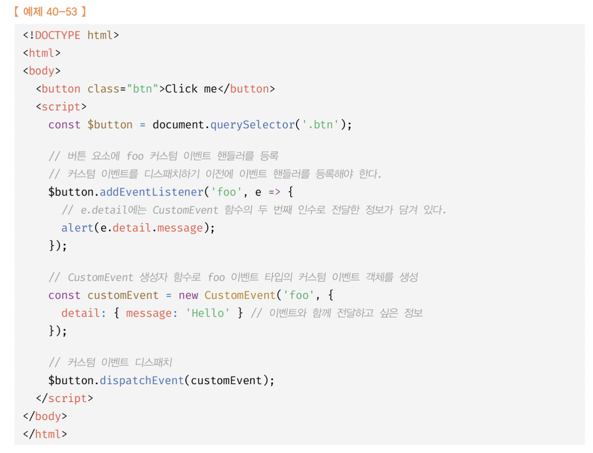

임의의 이벤트 타입을 지정하여 커스텀 이벤트 객체를 생성한 경우 `addEventListener`를 반드시 이용해야 합니다.

이벤트 핸들러 어트리뷰트/프로퍼티 방식을 사용할 수 없는 이유는 'on + 이벤트타입'으로 이루어진 이벤트 핸들러 어트리뷰트/프로퍼티가 요소 노드에 존재하지 않기 떄문입니다.

예시) '`foo`'라는 임의의 이벤트 타입으로 커스텀 이벤트를 생성한 경우 '`onfoo`'라는 핸들러 어트리뷰트/프로퍼티가 요소 노드에 존재하지 않기 때문에 이벤트 핸들러 어트리뷰트/프로퍼티 방식으로는 이벤트 핸들러를 등록할 수 없습니다. 