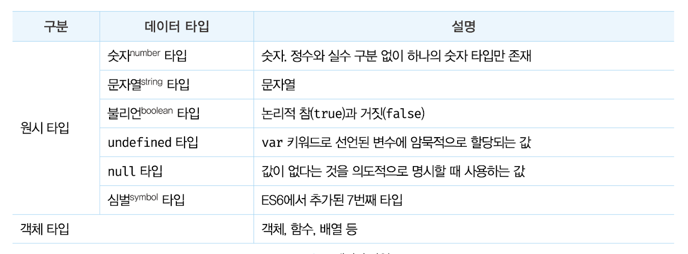

# 데이터 타입

자바스크립트는 7개의 데이터 타입을 제공한다.



각각의 특징을 살펴보자.

## 숫자 타입

다른 언어들과 달리 자바스크립트는 하나의 숫자 타입만 존재한다.

ECMAScript 사용에 따르면 숫자 타입의 값은 배정밀도 64비트 부동소수점 형식을 따른다. 즉, 모든 수를 실수로 처리하며, 정수만 표현하기 위한 데이터 타입이 별도로 존재하지 않는다.

```jsx
// 숫자 타입은 모두 실수로 처리된다.
console.log(1 === 1.0); //true

// 정수로 나누어도 실수가 나올 수 있다.
console.log(3 / 2); // 1.5
```

정수, 실수, 2진수, 8진수, 16진수 리터럴은 모두 메모리에 배정밀도 64비트 부동소수점 형식의 2진수로 저장된다. 자바스크립트는 2진수, 8진수, 16진수를 표현하기 위한 데이터 타입을 제공하지 않는다.

```jsx
var binary = 0b01000001; // 2진수
var octal = 0o101; // 8진수
var hex = 0x41;

// 표기만 다를 뿐 모두 같은 값이다.
console.log(binary); // 65
console.log(octal); // 65
console.log(hex); // 65
```

숫자 타입은 추가로 세 가지 특별한 값도 표현할 수 있다.

- Infinity : 양의 무한대
- Infinity : 음의 무한대
- NaN : 산술 연산 불가(not-a-number)

```jsx
console.log(10 / 0); // Infinity
console.log(10 / -0); // -Infinity
console.log(1 * 'String'); // NaN
```

## 문자열 타입

문자열(string) 타입은 텍스트 데이터를 나타내는 데 사용한다. 문자열은 0개 이상의 16비트 유니코드 문자(UTF-16)의 집합으로 전 세계 대부분의 문자를 표현할 수 있다.

자바스크립트에서 가장 일반적인 표기법은 작은 따옴표를 사용하는 것이다.

```jsx
var string;
string = '문자열'; // 작은따옴표
string = '문자열'; // 큰따옴표
string = `문자열`; // 백틱(ES6)

string =
  '작은 따옴표로 감싼 문자열 내의 "큰따옴표"는 문자열로 인식된다. 반대도 마찬가지';
```

> 자바스크립트의 문자열은 C, Java와 다르게 원시 타입이며, 변경 불가능한 값(immutable value)이다. 이것은 문자열이 생성되면 그 문자열을 변경할 수 없다는 것을 의미한다.

## 템플릿 리터럴

ES6부터 템플릿 리터럴(template literal)이라고 하는 새로운 문자열 표기법이 도입되었다.

템플릿 리터럴은 멀티라인 문자열, 표현식 삽입, 태그드 템플릿 등 편리한 문자열 처리기능을 제공한다.

템플릿 리터럴은 런타임에 일반 문자열로 변환되어 처리되며 백틱(``)으로 표현한다.

### 멀티라인 문자열

일반 문자열의 경우 문자열 내 개행이 안되므로 공백을 표현하려면 이스케이프 시퀀스를 사용해야 한다. (/ㅠ, /ㅜ, /ㅅ, /’, // 등)

템플릿 리터럴의 경우 이스케이프 시퀀스 없이 줄바꿈, 공백 등이 있는 그대로 적용된다.

```jsx
// 이스케이프 시퀀스를 사용해 작성한 HTML 문자열
var template1 = '<ul>\n\t<li><a href="#">Home</a></li>\n</ul>';

// 템플리 리터널 내에서 작성한 HTML 문자열
var template2 = `<ul>
	<li><a href="#">Home</a></li>
</ul>`;
```

===

```html
<ul>
  <li><a href="#">Home</a></li>
</ul>
```

### 표현식 삽입

문자열은 +를 사용해 연결할 수 있다. +연산자는 피연산자 중 하나 이상이 문자열인 경우 문자열 연결 연산자로 동작한다.

템플릿 리터럴 내에서는 표현식 삽입을 통해 간단히 문자열을 삽입할 수 있다.

```jsx
var first = 'Kozel';
var last = 'dark';

// ES5 문자열 연결
console.log('My name is' + first + ' ' + last + '.');

// ES6 표현식 삽입
console.log(`My name is ${first} ${last}.`);

//결과는 'My name is Kozel dark.'로 동일하다.
```

이때 표현식의 결과가 문자열이 아니더라도 문자열로 강제 변환되어 삽입된다.

## 불리언 타입

불리언 타입의 값은 논리적 참, 거짓을 나타내는 true와 false뿐이며 조건문에서 자주 사용한다.

```jsx
var foo = true;
console.log(foo); // true

foo = false;
console.log(foo); // false
```

## undefined 타입

undefined 타입의 값은 undefined가 유일하다.

var 키워드로 선언한 변수는 확보된 메모리 공간을 처음 할당이 이뤄질 때까지 빈 상태로 내버려두지 않고 자바스크립트 엔진이 암묵적으로 undefined로 초기화한다.

```jsx
var foo;
console.log(foo); // undefined
```

undefined를 개발자가 의도적으로 할당하는 것은 본래 취지와 어긋날 뿐더러 혼란을 줄 수 있으므로 권장하지 않는다.

변수에 값이 없다는 것을 명시하고 싶을 때는 null을 할당한다.

> undefined를 직역하면 '정의되지 않은'이다.
> 다른 프로그래밍에선 선언과 정의를 엄격히 구분하는 경우가 있다.
> 자바스크립트의 경우 변수를 선언하면 암묵적으로 정의가 이뤄지기 때문에 선언과 정의의 구분이 모호하다.
> ECMAScript 사양에서 변수는 '선언한다'라고 표현하고, 함수는 '정의한다'라고 표현한다.

## null 타입

null 타입의 값은 null이 유일하다.

프로그래밍 언어에서 null은 변수에 값이 없다는 것을 의도적으로 명시할 때 사용하며 변수에 null을 할당하는 것은 변수가 이전에 참조하던 값을 더 이상 참조하지 않겠다는 의미다.

자바스크립트 엔진은 누구도 참조하지 않는 메모리 공간에 대해 가비지 콜렉션을 수행할 것이다.

```jsx
var foo = 'String';
// 이전 참조를 제거. foo 변수는 더 이상 'String'을 참조하지 않는다.
foo = null;
```

함수가 유효한 값을 반환할 수 없는 경우 명시적으로 null을 반환하기도 한다.

(document.querySelector 메서드가 조건에 부합하는 HTML요소 못찾으면 null반환)

## 6.7 심벌 타입

심벌(symbol)은 ES6에서 추가된 7번째 타입으로, 변경 불가능한 원시 타입이다.

심벌은 Symbol 함수를 호출해 생성한다. 이때 생성된 심벌 값은 외부에 노출되지 않으며, 다른 값과 절대 중복되지 않는 유일무이한 값이다.

주로 이름이 충돌할 위험이 없는 객체의 유일한 프로퍼티 키를 만들기 위해 사용한다.

```jsx
// 심벌 값 생성
var key = Symbol('key');
console.log(typeof key); // symbol

// 객체 생성
var obj = {};

// 이름이 충돌할 위험이 없는 유일무이한 값인 심벌을 프로퍼티 키로 사용한다.
obj[key] = 'value';
console.log(obj[key]); // value
```

## 객체 타입

원시 타입과 객체 타입은 근본적으로 다르다.

중요한 것은 자바스크립트는 객체 기반의 언어이며, 앞서 살펴본 6가지 데이터 타입 이외의 값은 모두 객체 타입이다.

---

# 데이터 타입의 필요성

- **메모리 공간 할당**:
  - 값을 메모리에 저장하기 위해서는 먼저 해당 값의 데이터 타입에 따라 적절한 크기의 메모리 공간을 확보해야 한다. 데이터 타입에 따라 필요한 메모리 공간의 크기가 결정된다.
- **값의 참조**:
  - 값을 참조할 때, 데이터 타입에 따라 한 번에 읽어 들여야 할 메모리 공간의 크기를 결정할 수 있다. 이를 통해 적절한 단위로 메모리에 저장된 값을 읽어올 수 있다.
- **값의 해석**:
  - 메모리에서 읽어 들인 2진수 값을 적절히 해석하기 위해서는 데이터 타입이 필요하다. 동일한 2진수 값이라도 데이터 타입에 따라 숫자, 문자열, 불리언 값 등으로 다르게 해석된다.

# 동적 타이핑

### 동적 타입 언어와 정적 타입 언어

C, Java같은 정적 타입(static/strong type) 언어는 변수를 선언할 때 변수에 할당할 수 있는 값의 종류, 즉 데이터 타입을 사전에 선언해야 한다. 정적 타입 언어는 변수의 타입을 변경할 수 없으며, 컴파일 시점에 타입 체크를 수행하여 선언한 데이터 값과 값의 타입을 확인한다.

자바스크립트는 키워드를 사용해 변수를 선언할 뿐 타입을 선언하지 않는다. 미리 선언한 데이터 타입의 값이 있더라도 다른 타입의 값을 자유롭게 할당할 수 있다.

```jsx
// console.log(typeof foo); 로 확인해보자.
var foo; // undefined
foo = 3; // number
foo = 'Hello'; // string
foo = true; // boolean
foo = null; // object
foo = Symbol(); //symbol
foo = {}; // object
foo = []; // object
foo = function () {}; // function
```

즉, 정적 타입 언어는 변수 선언 시점에서 변수의 타입이 결정되고 변수의 타입을 변경할 수 없다. 자바스크립트에서는 값을 할당하는 시점에 변수의 타입이 동적으로 결정되고 변수의 타입을 언제든지 자유롭게 변경할 수 있다.

> 자바스크립트의 변수는 선언이 아닌 할당에 의해 타입이 결정(타입 추론)된다. 그리고 재할당에 의해 변수의 타입은 언제든지 동적으로 변할 수 있다.
>
> 이러한 특징을 동적 타이핑(dynamic typing)이라 하며, 자바스크립트를 동적 타입(dynamic/weak type) 언어라 한다.

### 동적 타입 언어와 변수

동적 타입 언어는 변수에 어떤 데이터 타입의 값이라도 자유롭게 할당할 수 있다. 하지만 동적 타입 언어 또한 구조적인 단점이 있다.

동적 타입 언어는 변수의 값을 확인하기 전에는 타입을 확신할 수 없으며 자바스크립트는 개발자의 의도와는 상관없이 자바스크립트 엔진에 의해 암묵적으로 타입이 자동으로 변환되기도 한다.

**→ 동적 타입 언어는 유연성은 높지만 신뢰성은 떨어진다.**

> 따라서 다음을 주의하자
>
> - 변수는 꼭 필요한 경우에 한해 제한적으로 사용한다.
> - 변수의 유효 범위(스코프)는 최대한 좁게 만들어 변수의 부작용을 억제해야 한다.
> - 전역 변수는 최대한 사용하지 않도록 한다.
> - 변수보다는 상수를 사용해 값의 변경을 억제한다.
> - 변수의 이름은 변수의 목적이나 의미를 파악할 수 있도록 네이밍한다.
