# this

## this 키워드

자신이 속한 객체의 프로퍼티를 차모하려면 먼저 **자신이 속한 객체를 가리키는 식별자를 참조할 수 있어야 합니다.**

객체 리터럴 방식의 경우, 메서드 내부에서 메서드 자신이 속한 객체를 가리키는 식별자를 재귀적으로 참조할 수 있습니다.

```js
const circle = {
  //프로퍼티: 객체 고유의 상태 데이터
  radius: 5,
  //메서드: 상태 데이터를 참조하고 조작하는 동작
  getDiameter() {
    //이 메서드가 자신이 속한 객체의 프로퍼티나 다른 메서드를 참조하려면
    //자신이 속한 객체인 circle을 참조할 수 있어야 합니다.
    return 2 * circle.radius;
  }
}

console.log(circle.getDiameter()); //10
```

`getDiameter` 메서드 내에서 메서드 자신이 속한 객체를 가리키는 식별자 `circle`을 참조하고 있다. 이 참조 표현식이 평가되는 시점은 `getDiameter` 메서드가 호출되어 함수 몸체가 실행되는 시점이다.

`getDiameter`가 호출되는 시점에는, `circle`식별자에 생성된 객체가 할당된 이후 입니다. 따라서 메서드 내부에서 `circle` 식별자를 참조할 수 있습니다.

```js
function Circle(radius){
  //이 시점에는 생성자 함수 자신이 생성할 인스턴스를 가리키는 식별자를 알 수 없다.
  ????.radius = radius;
}

Circle.prototype.getDiameter = function () {
  //이 시점에는 생성자 함수 자신이 생성할 인스턴스를 가리키는 식별자를 알 수 없다.
  return 2 * ????.radius;
};

// 생성자 함수로 인스턴스를 생성하려면 먼저 생성자 함수를 정의해야 한다.
const circle = new Circle(5);
```

생성자 함수로 인스턴스를 생성하려면 먼저 생성자 함수가 존재해야 합니다.

생성자 함수를 정의하는 시점에는 아직 인스턴스를 생성하기 이전이므로 생성자 함수가 생성할 인스턴스를 가리키는 식별자를 알 수 없습니다. 따라서 자신이 속한 객체 또는 자신이 생성할 인스턴스를 가리키는 특수한 식별자가 필요한데, 이것이 `this` 입니다.

**`this`는 자신이 속한 객체 또는 자신이 생성할 인스턴스를 가리키는 자기 참조 변수입니다. `this`를 통해 자신이 속한 객체 또는 자신이 생성할 인스턴스의 프로퍼티나 메서드를 참조할 수 있습니다.**

**`this`가 가리키는 값, `this` 바인딩은 함수 호출 방식에 의해 동적으로 결정됩니다.**

```js
//객체 리터럴
const circle = {
  radius: 5,
  getDiameter(){
    //this 메서드를 호출한 객체를 가리킨다.
    return 2 * this.radius;
  }
};

console.log(circle.getDiameter()); //10
```

객체 리터럴의 메서드 내부에서의 `this`는 메서드를 호출한 객체, 즉 `circle`을 가리킵니다.

```js
//생성자 함수
function Circle(radius){
  //this는 생성자 함수가 생성할 인스턴스를 가리킨다.
  this.radius = radius;
}

Circle.prototype.getDiameter = function () {
  //this는 생성자 함수가 생성할 인스턴스를 가리킨다.
  return 2 * this.radius;
}

//인스턴스 생성
const circle = new Circle(5);
console.log(circle.getDiameter()); //10
```
생성자 함수 내부의 `this`는 생성자 함수가 생성할 인스턴스를 가리킵니다. 이처럼 `this`는 상황데 따라 가리키는 대상이 다릅니다.

자바스크립트의 `this`는 함수가 호출되는 방식에 따라 `this`에 바인딩될 값, 즉 `this` 바인딩이 동적으로 결정됩니다. `strict mode` 역시 `this` 바인딩에 영향을 줍니다.

```js
// this는 어디서든지 참조 가능합니다.
// 전역에서 this는 전역 객체 window를 가리킵니다.
console.log(this);

function square(number){
  // 일반 함수 내부에서 this는 전역 객체 window를 가리킵니다.
  console.log(this); //window
  return number * number;
}

square(2);

const person = {
  name: 'Lee',
  getName() {
    //메서드 내부에서 this는 메서드를 호출한 객체를 가리킵니다.
    console.log(this); // {name: "Lee", getName: f(함수)}
    return this.name;
  }
}
console.log(person.getName()); //Lee

function Person(name){
  this.name = name;
  //생성자 함수 내부에서 this는 생성자 함수가 생성할 인스턴스를 가리킵니다.
  console.log(this); // Person {name: "Lee"}
}

const me = new Person('Lee');
```

하지만 `this`는 객체의 ㅡ로퍼티나 메서드를 참조하기 위한 자기 참조 변수이므로 일반적으로 객체의 메서드 내부 또는 생성자 함수 내부에서만 의미가 있습니다. 따라서 `strict mode`가 적용된 일반 함수 내부의 `this`에는 `undefined`가 바인딩 됩니다. 일반 함수 내부에서 `this`를 사용할 필요가 없기 때문입니다.

## 함수 호출 방식과 this 바인딩

this 바인딩(this에 바인딩될 값)은 함수 호출 방식, 즉 함수가 어떠헥 호출되었는지에 따라 동적으로 결정됩니다.

**함수 호출 방식**

- 일반 함수 호출
- 메서드 호출
- 생성자 호출
- Function.prototype.apply/call/bind 메서드에 의한 간접 호출

```js
// this 바인딩은 함수 호출 방식에 따라 동적으로 결정됩니다.
const foo = function () {
  console.dir(this);
};

// 동일한 함수도 다양한 방식으로 호출할 수 있습니다.

// 1. 일반 함수 호출
// foo 함수를 일반적인 방식으로 호출
// foo 함수 내부의 this는 전역 객체 window를 가리킵니다.
foo();

// 2. 메서드 호출
// foo 함수를 프로퍼티 값으로 할당하여 호출
// foo 함수 내부의 this는 메서드를 호출한 객체 obj를 가리킵니다.
const obj = {foo};
obj.foo(); //obj

// 3. 생성자 함수 호출
// foo 함수를 new 연산자와 함께 생성자 함수로 호출
// foo 함수 내부의 this는 생성자 함수가 생성한 인스턴스를 가리킵니다.
new foo(); // foo {}

// 4. Function.prototype.apply/call/bind 메서드에 의한 간접 호출
// foo 함수 내부의 this는 인수에 의해 결정됩니다.
const bar = {name: 'bar'}
foo.call(bar); // bar
foo.apply(bar); // bar
foo.bind(bar); //bar
```

### 일반 함수 호출

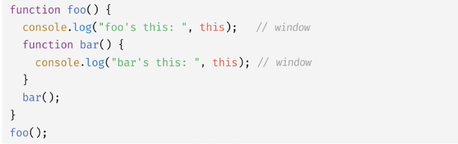

일반 함수로 호출하면 함수 내부의 `this`에는 전역 객체가 바인딩됩니다.

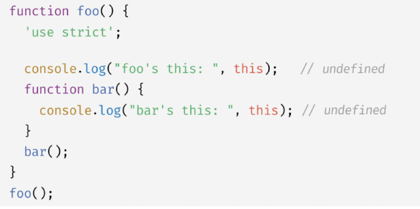

`strict mode`가 적용된 일반 함수 내부의 `this`에는 `undefined`가 바인딩됩니다.

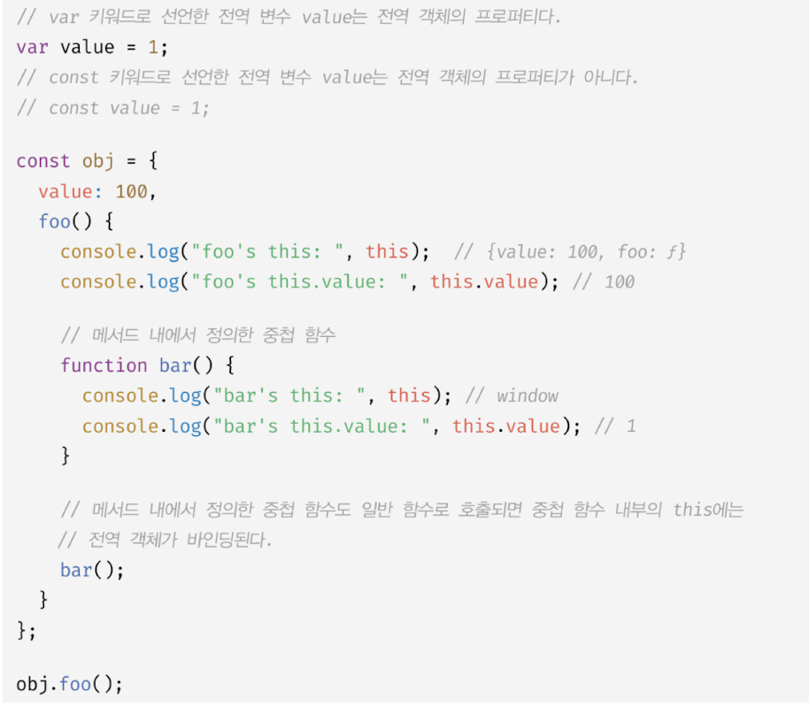

메서드 내에서 정의한 중첩 함수도 일반 함수로 호출되면 중첩 함수 내부의 `this`에는 전역 객체가 바인딩됩니다.

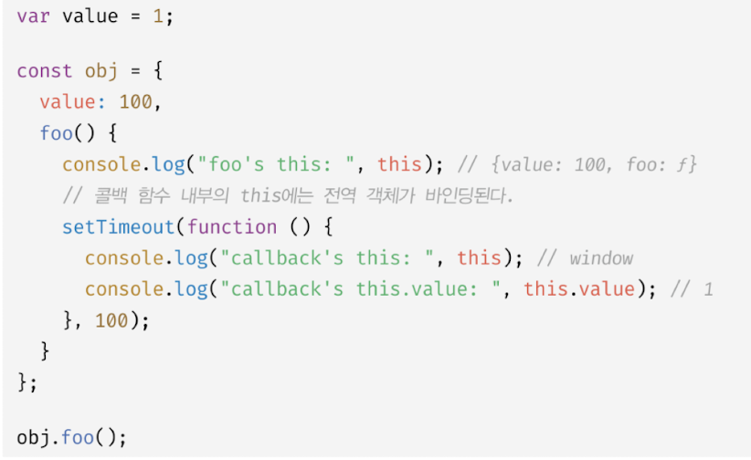

콜백 함수 내부의 `this`에도 전역 객체가 바인딩됩니다. 

**어떤 함수라도 일반 함수로 호출되면 `this`에 전역 객체가 바인딩 됩니다.**

위 예제의 경우 메서드 내부에서 `setTimeout` 함수에 전달된 콜백 함수의 `this`에는 전역 객체가 바인딩됩니다. 따라서 `this.value`는 `obj` 객체의 `value` 프로퍼티가 아닌 전역 객체의 `value` 프로퍼티, 즉 `window.value`를 참조합니다. `var` 키워드로 선언한 전역 변수는 전역 객체의 프로퍼티가 되므로 `window.value`는 1 입니다.

메서드 내부의 중첩 함수나 콜백 함수의 `this` 바인딩을 메서드의 `this` 바인딩과 일치시키기 위한 방법은 다음과 같습니다.

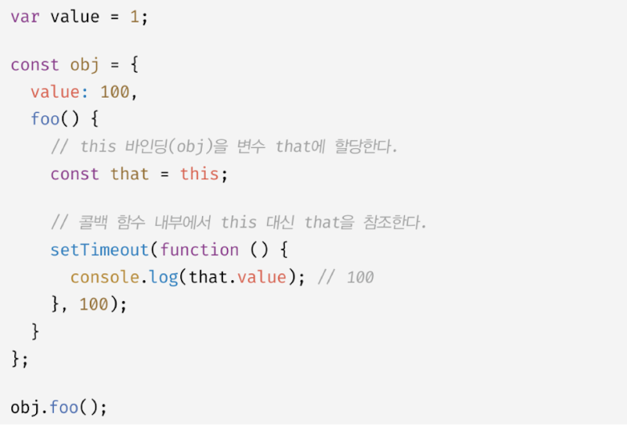

이 외에도, Function.prototype.apply/call/bind 메서드를 제공하고 있습니다.

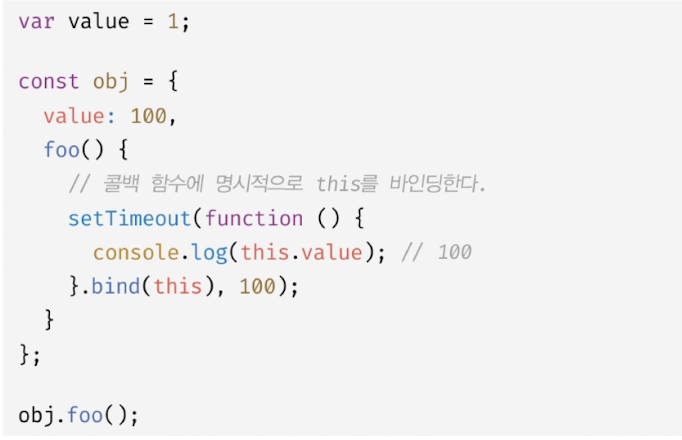

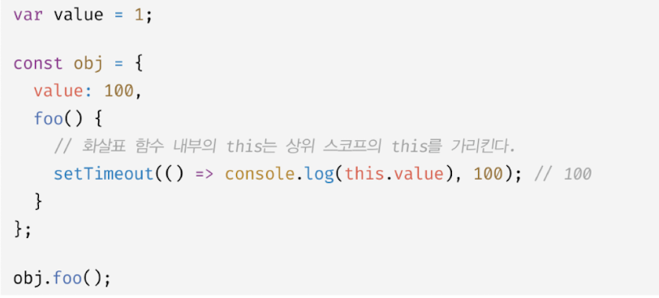

화살표 함수를 사용해서 `this`바인딩을 일치시킬 수도 있습니다.

### 메서드 호출

메서드 내부의 `this`에는 메서드를 호출한 객체, 즉 메서드를 호출할 때 메서드 이름 앞의 마침표(.) 연산자 앞에 기술한 객체가 바인딩됩니다. 주의할 것은 메서드 내부의 `this`는 메서드를 소유한 객체가 아닌 메서드를 호출한 객체에 바인딩된다는 것 입니다.

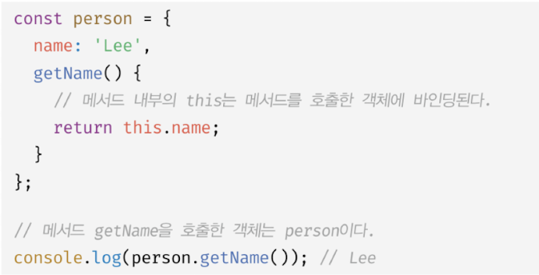

`getName` 메서드는 `person` 객체의 메서드로 정의되어있습니다. 메서드는 프로퍼티에 바인딩된 함수입니다. 즉, `person` 객체의 `getName` 프로퍼티가 가리키는 함수 객체는 `person` 객체에 포함된 것이 아니라 독립적으로 존재하는 별도의 객체입니다. `getName` 프로퍼티가 함수 객체를 가리키고 있을 뿐 입니다.

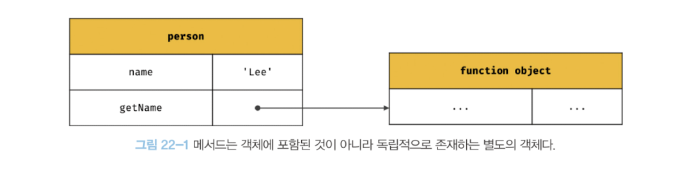

`getName` 프로퍼티가 가리키는 함수 객체, 즉 `getName` 메서드는 다른 객체의 프로퍼티에 할당하는 것으로 다른 객체의 메서드가 될 수도 있고 일반 변수에 할당하여 일반 함수로 호출될 수도 있습니다.

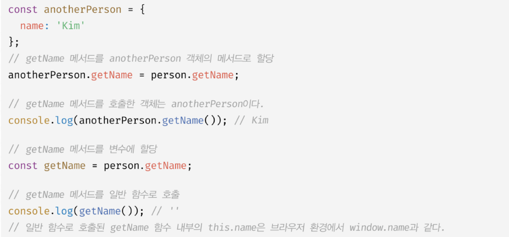


메서드 내부의 `this`는 프로퍼티로 메서드를 가리키고 있는 객체와는 관계가 없고 메서드를 호출한 객체에 바인딩 됩니다.

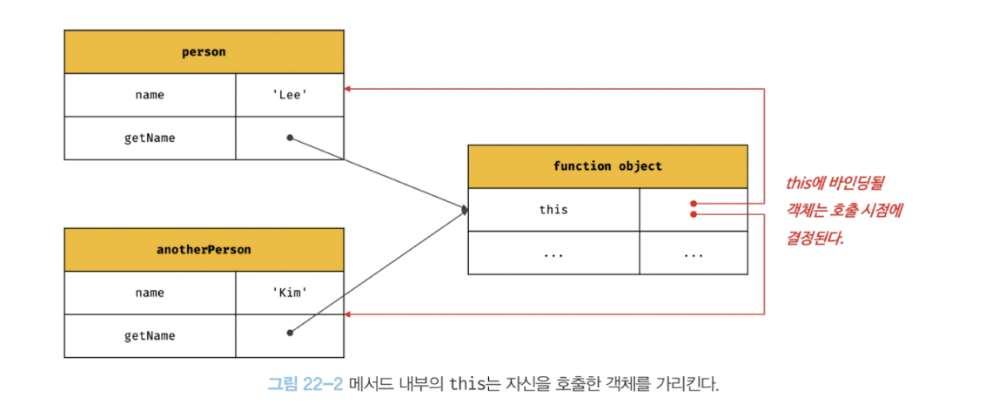

프로토타입 메서드 내부에서 사용된 `this`도 일반 메서드와 마찬가지로 해당 메서드를 호출한 객체에 바인딩 됩니다.

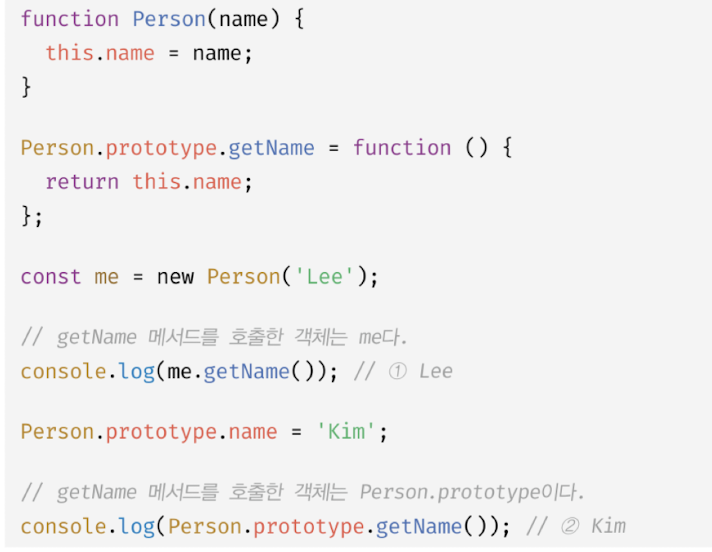

1 의 경우 `getName` 메서드를 호출한 객체는 `me` 입니다. 따라서 `getName` 메서드 내부의 `this`는 `me`를 가리키며 `this.name`은 `Lee` 입니다.

2 의 경우 `getName` 메서드를 호출한 객체는 Person.prototype 입니다. Person.prototype도 객체이므로 직접 메서드를 호출할 수 있습니다. 따라서 getName 메서드 내부의 this는 Person.prototype을 가리키며 this.name은 'kim' 입니다.

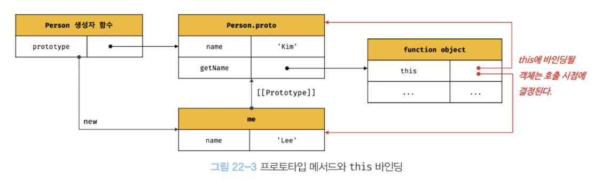

### 생성자 함수 호출

생성자 함수 내부의 `this`에는 생성자 함수가 생성할 인스턴스가 바인딩 됩니다.

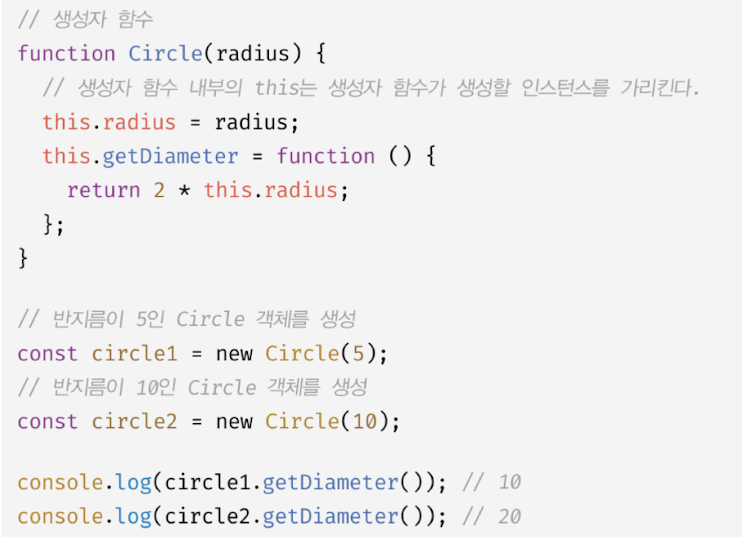
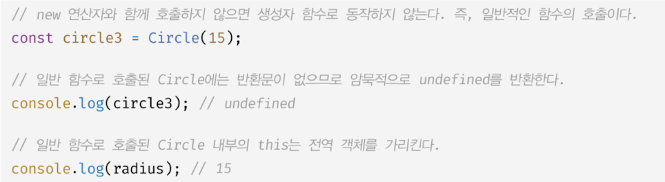

### Function.prototype.apply/call/bind 메서드에 의한 간접 호출

이들 메서드는 모든 함수가 상속받아 사용할 수 있습니다.

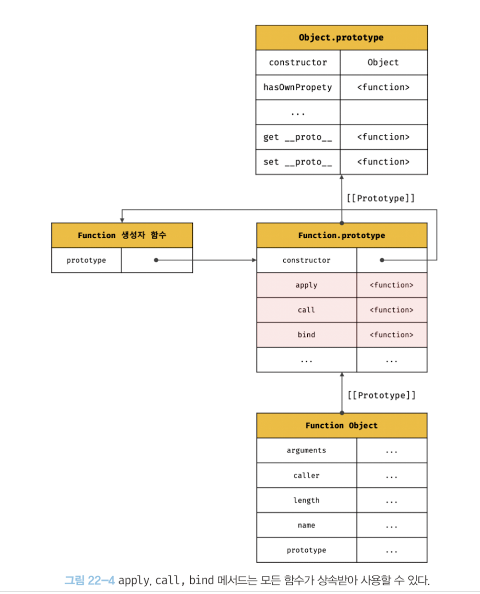

`Function.prototype.apply/call` 메서드는 `this`로 사용할 객체와 인수 리스트를 인수로 전달받아 함수를 호출합니다. `apply`와 `call` 메서드의 사용법은 다음과 같습니다.

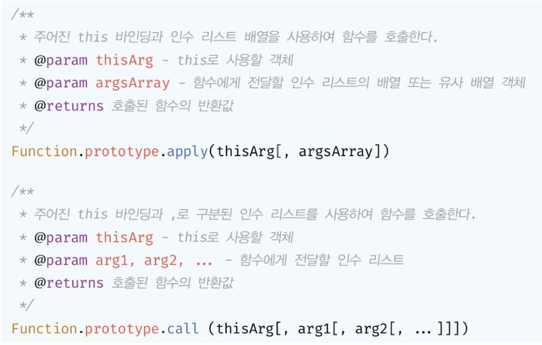

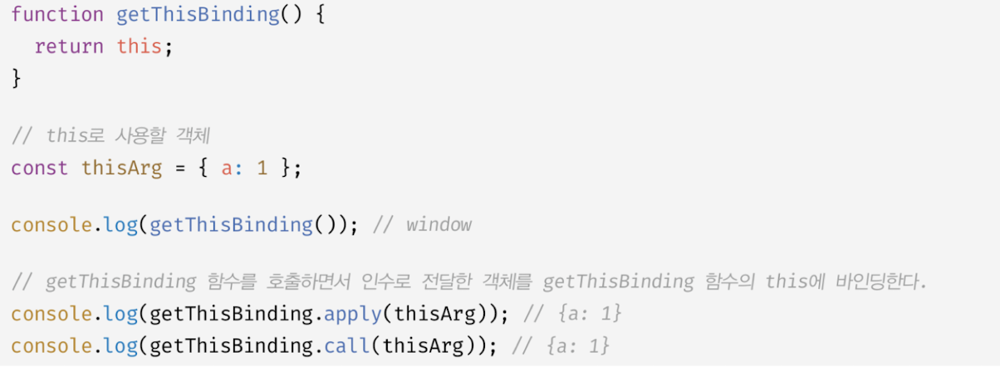

`apply`와 `call` 메서드의 본질적인 기능은 함수를 호출하는 것 입니다. `apply`와 `call` 메서드는 함수를 호출하면서 첫 번째 인수로 전달한 특정 객체를 호출한 함수의 `this`에 바인딩 합니다.

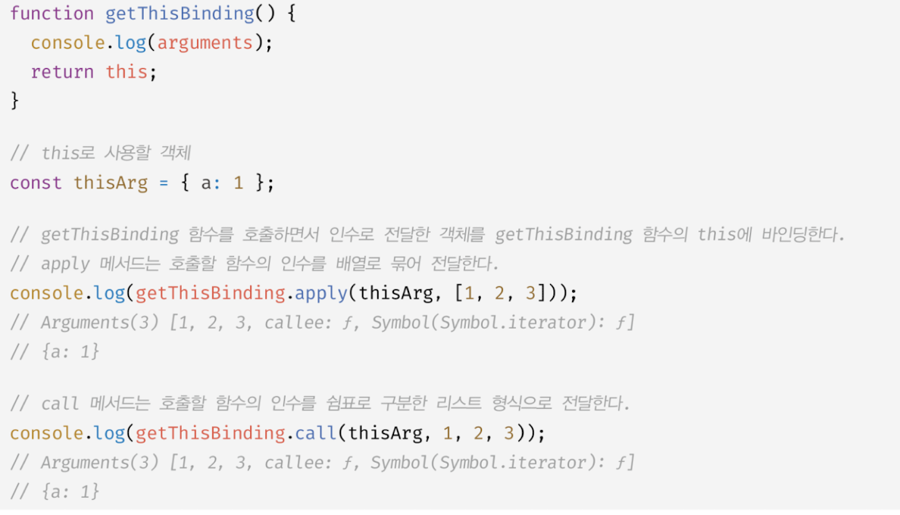

`apply` 와 `call` 메서드는 호출할 함수에 인수를 전달하는 방식만 다를 뿐 `this`로 사용할 객체를 전달하면서 함수를 호출하는 것은 동일합니다.

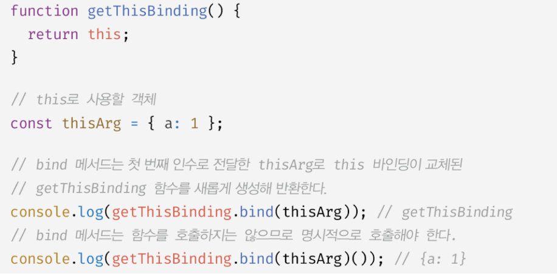

`bind` 는 `apply`와`call`과 달리 함수를 호출하지 않습니다. 
`bind` 메서드는 메서드의 `this`와 메서드 내부의 중첩 함수 또는 콜백 함수의 `this`가 불일치하는 문제를 해결하기 위해 유용하게 사용됩니다.


`person.foo`의 콜백 함수가 호출되기 이전인 1의 시점에서는, `this`는 f`oo` 메서드를 호출한 객체, 즉 Person의 객체를 가리킵니다.

`person.foo`의 콜백 함수가 일반 함수로서 호출된 2의 시점에서는 `this`는 전역객체 `window`를 가리킵니다.

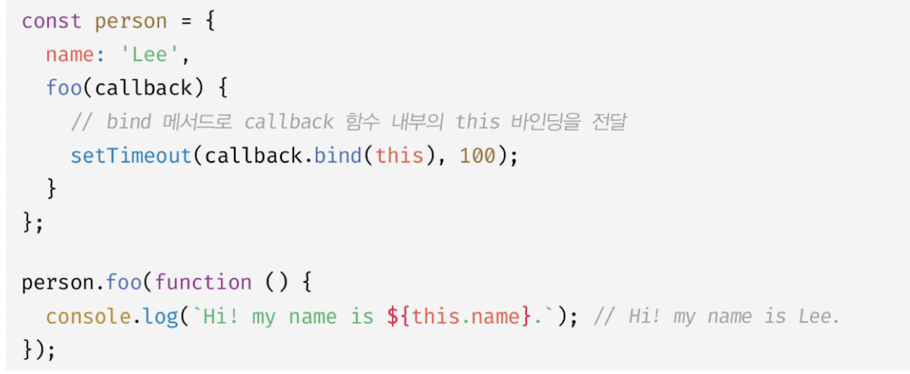

콜백 함수 내부의 `this`를 외부 함수 내부의 `this`와 일치시켜야 할 때 `bind` 메서드를 이용하면 됩니다.

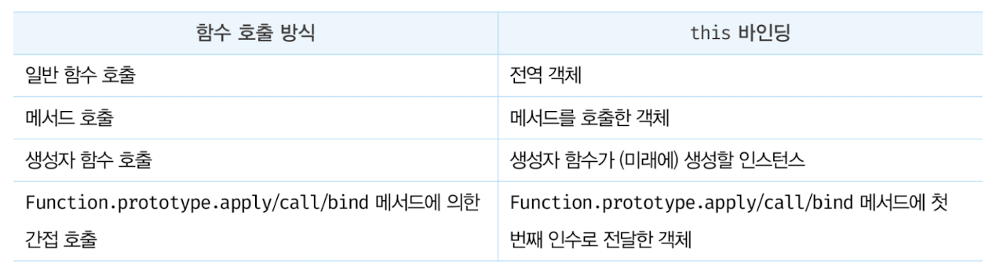