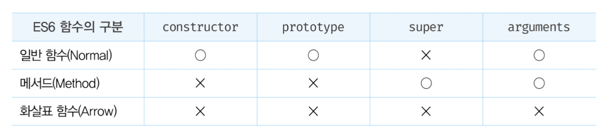
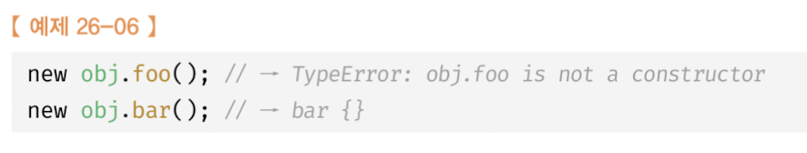
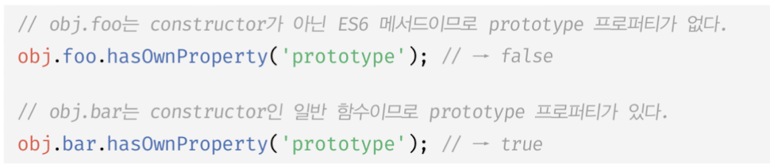

# 함수의 구분

ES6 이전의 함수는 동일한 함수라도 다양한 형태로 호출할 수 있습니다.

```js
var foo = function () {
  return 1;
};


// 일반적인 함수로서 호출
foo(); // -> 1

// 생성자 함수로서 호출
new foo();

// 메서드로서 호출
var obj = {foo: foo};
obj.foo(); // -> 1
```

**ES6 이전의 모든 함수는 일반 함수로서 호출할 수 있는 것은 물론 생성자 함수로서 호출할 수 있었습니다.**

```js 
var foo = function () {};

// ES6 이전의 모든 함수는 callable 이면서 constructor다.
foo(); // undefined
new foo(); // -> foo {}
```

> 호출할 수 있는 함수 객체 -> Callable
> 인스턴스를 생성할 수 있는 객체 -> Constructor

객체에 바인딩된 함수도 일반 함수로서 호출이 가능하고, 생성자 함수로서 호출이 가능하다.

```js
// 프로퍼티 f에 바인딩된 함수는 callable이며 constructor다.
var obj = {
  x:10,
  f: function () {return this.x;}
};

// 프로터피 f에 바인딩된 함수를 메서드로서 호출
console.log(obj.f()); //10

// 프로퍼티 f에 바인딩된 함수를 일반 함수로서 호출
var bar =obj.f;
console.log(bar());

//프로퍼티 f에 바인딩된 함수를 생성자 함수로서 호출
console.log(new obj.f()); // f {}
```

객체에 바인딩된 함수를 생성자 함수로 호출하는 것은 성능면에서 문제가 있다. 객체에 바인딩된 함수가 `constructor`라는 것은 객체에 바인딩된 함수가 `prototype` 프로퍼티를 가지며, 프로토타입 객체도 생성한다는 것을 의미하기 때문입니다.

콜백함수도 마찬가지로 `constructor`이기 때문에 불필요한 프로토타입 객체를 생성합니다.


ES6 에서는 함수를 사용 목적에 따라 세 가지 종류로 명확히 구분했습니다.



## 메서드

**ES6 사양에서 메서드는 메서드 축약 표현으로 정의된 함수만을 의미합니다.**

```js
const obj = {
  x:1,
  // foo는 메서드다.
  foo() {return this.x;}
  // bar에 바인딩된 함수는 메서드가 아닌 일반 함수다.
  bar: function() {return this.x;}
};

console.log(obj.foo()); //1
console.log(obj.bar()); //1
```

**ES6 사양에서 정의한 메서드(이하 ES6 메서드)는 인스턴스를 생성할 수 없는 non-constructor다.** 따라서 ES6 메서드는 생성자 함수로서 호출할 수 없습니다.

 

 ES6 메서드는 인스턴스를 생성할 수 없으므로 `prototype` 프로퍼티가 없고 프로토타입도 생성하지 않습니다.

 

 **ES6 메서드는 자신을 바인딩한 객체를 가리키는 내부 슬롯 [[HomeObject]]를 갖습니다.**
 ES6는 `super` 키워드를 사용할 수 있습니다.

 ```js
 const base = {
  name: 'Lee',
  sayHi() {
    return `Hi ${this.name}`;
  }
 };

 const derived = {
  __proto__: base,
  // sayHi는 ES6의 메서드다. ES6 메서드는 [[HomeObject]]를 갖는다.
  // sayHi의 [[HomeObject]]는 sayHi가 바인딩된 객체인 derived를 가리키고
  // super는 sayHi의 [[HomeObject]]의 프로토타입인 base를 가리킨다.
  sayHi() {
    return `${super.sayHi()}. how are you doing?`;
  }
 }

 console.log(derived.sayHi()); // Hi! Lee. how are you doing?
 ```

 ES6 메서드가 아닌 함수는 `super` 키워드를 사용할 수 없습니다. ES6 메서드가 아닌 함수는 내부 슬롯 [[HomeObject]]를 갖지 않기 떄문입니다.

 ```js
 const derived = {
  __proto__:base,
  // sayHi는 ES6 메서드가 아니다.
  // 따라서 sayHi는 [[HomeObject]]를 갖지 않으므로 super 키워드를 사용할 수 없다.
  sayHi: function () {
    return `${super.sayHi()}. how are you doing?`;
  }
 };
 ```

 ## 화살표 함수

 화살표 함수는 `function` 키워드 대신 화살표(=>, fat arrow)를 사용하여 기존의 함수 정의 방식보다 간략하게 함수를 정의할 수 있습니다. 특히, 화살표 함수는 콜백 함수 내부에서 `this`가 전역 객체를 가리키는 문제를 해결하기 위한 대안으로 유용합니다.

 ### 화살표 함수 정의

 #### 함수 정의

(...간단한건 생략)

**객체 리터럴 반환**

객체 리터럴을 반환하는 경우 소괄호 ()로 감싸 주어야 합니다.

 ```js
 const create = (id,content) => ({id,content});
 create(1,'JavaScript'); // -> {id: 1, content: "JavaScript"}

 // 위 표현은 다음과 동일하다.
 const create = (id,content) => {return {id,content};};
 ```

 객체 리터럴을 소괄호 ()로 감싸지 않으면 객체 리터럴의 중괄호 {}를 함수 몸체를 감싸는 중괄호 {}로 잘못 해석합니다.

 ```js
 // {id,content}를 함수 몸체 내의 쉼표 연산자문으로 해석합니다.
 const create = (id,content) => {id,content};
 create(1,'JavaScript'); // -> undefined
 ```

 **콜백 함수**

 이 경우가 가장 유용합니다.

 ```js
 //ES5
[1,2,3].map(function (v) {
  return v*2;
});

 //ES6
 [1,2,3].map(v => v*2); // -> [2,4,6]
 ```

 ### 화살표 함수와 일반 함수의 차이

1. 화살표 함수는 인스터느를 생성할 수 없는 non-constructor다.
2. 중복된 매개변수 이름을 선언할 수 없다.
3. 화살표 함수는 함수 자체의 this.arguments, super, new.target 바인딩을 갖지 않는다.

### this

화살표 함수가 일반 함수와 구별되는 가장 큰 특징은 바로 `this` 입니다. 화살표 함수는 다른 함수의 인수로 전달되어 콜백함수로 사용하는 경우가 많습니다.

화살표 함수의 `this`는 일반함수의 `this`와 다르게 동작합니다. 콜백 함수 내부의 `this`와 외부 함수 `this`가 다르기 때문에 발생하는 문제를 해결하기 위해 의도적으로 설게된 것 입니다.


1 에서 `this`는 메서드를 호출한 객체(위 예제의 경우 `prefixer`객체)를 가리킵니다. 그런데 `Array.prototype.map`의 인수로 전달한 콜백 함수의 내부인 2에서 `this`는 `undefined`를 가리킵니다. 이는 `Array.prototype.map` 메서드가 콜백 함수를 일반 함수로서 호출하기 때문입니다.

