# 이벤트

## 이벤트 드리븐 프로그래밍

이벤트가 발생했을 때 호출될 함수를 **이벤트 핸들러**라고 합니다.


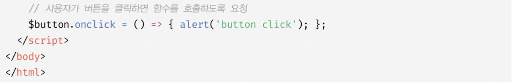

이벤트 핸들러 프로퍼티에 함수를 할당하면 해당 이벤트가 발생했을 때 할당한 함수가 브라우저에 의해 호출 됩니다.

## 이벤트 타입

이벤트 타입은 이벤트의 종류를 나타내는 문자열 입니다.

### 포커스 이벤트

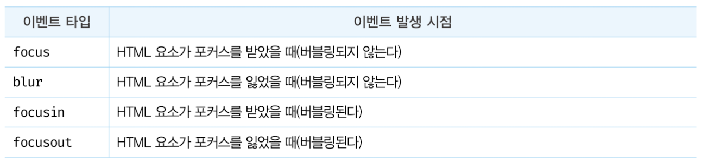

> 버블링?
> 특정 화면 요소에서 이벤트가 발생했을 때, 해당 이벤트가 더 상위의 화면 요소들로 전달되어 가는 특성

### 값 변경 이벤트

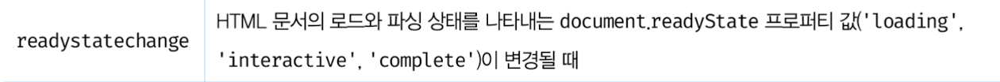

페이지 로딩이벤트에 주로 사용됩니다.

```js
document.addEventListener("readystatechange", function (e) {
    if (e.target.readyState === "loading") {
        console.log("문서가 로딩 중");
    } else if (e.target.readyState === "interactive") {
        console.log("문서는 파싱되었지만 이미지, 스타일, 프레임은 여전히 로딩 중");
    } else if (e.target.readyState === "complete"){
    	console.log("모든 리소스 로딩");
    }
}
```
- loading: 문서가 로딩 중
- interactive: 문서는 파싱되었지만 이미지, 스타일, 프레임은 여전히 로딩 중
- complete: 모든 리소스가 로딩된 상태

### DOM 뮤테이션 이벤트

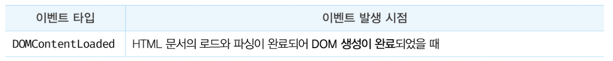

```js
window.addEventListener("DOMContentLoaded", (event) => {
  console.log("DOM fully loaded and parsed");
});
```

### 뷰 이벤트

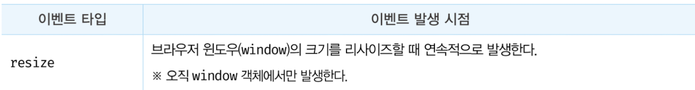

[브라우저의 크기변화를 감지하는 예시](https://mong-blog.tistory.com/entry/JS-%ED%81%AC%EA%B8%B0-%EB%B3%80%ED%99%94%EB%A5%BC-%EA%B0%90%EC%A7%80%ED%95%98%EB%8A%94-%EB%91%90-%EA%B0%80%EC%A7%80-%EB%B0%A9%EB%B2%95resize-ResizeObserver)

```js
const resizeDom = document.querySelector('.resize-dom');
const result = document.querySelector('.result');

window.addEventListener("resize", function() {
  result.innerText = resizeDom.getBoundingClientRect().width;
})
```

## 이벤트 핸들러 등록

이벤트 핸들러는 이벤트가 발생하면 브라우저에 의해 호출될 함수입니다.

### 이벤트 핸들러 어트리뷰트 방식

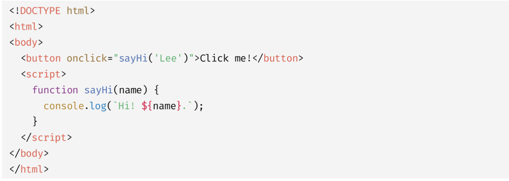

이벤트 핸들러 어트리뷰트 값으로 함수 참조가 아닌 함수 호출문 등의 문을 할당합니다.
**이벤트 핸들러 어트리뷰트 값은 사실 암묵적으로 생성될 이벤트 핸들러의 함수 몸체를 의미합니다.**

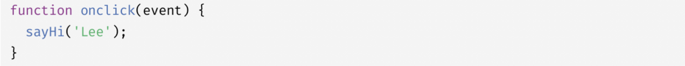

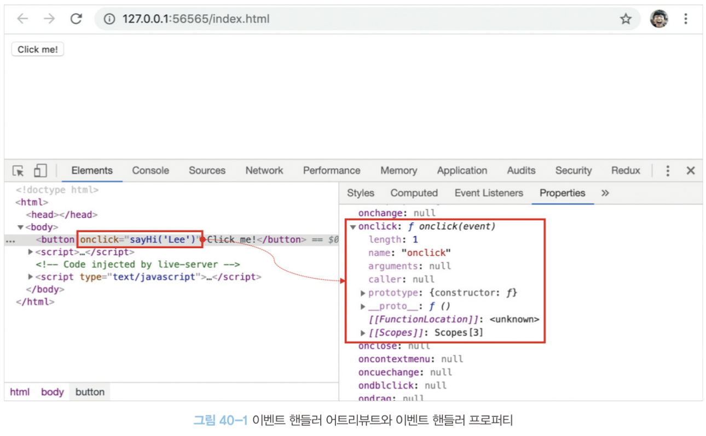

이벤트 핸들러에 인수를 전달하기 위해서 위와 같이 동작합니다. 만약 이벤트 핸들러 어트리뷰트 값으로 함수 참조를 할당해야 한다면 이벤트 핸들러에 인수를 전달하기 곤란합니다.

이벤트 핸들러 어트리뷰트 방식은 오래된 코드에서 간혹 사용해 알아둘 필요는 있지만 더는 사용하지 않는편이 좋다고 합니다.

### 이벤트 핸들러 프로퍼티 방식

`window`객체와 `Document`, `HTMLElement` 타입의 DOM 노드 객체는 이벤트에 대응하는 이벤트 핸들러 프로퍼티를 가지고 있습니다. 이벤트 핸들러 프로퍼티에 함수를 바인딩하면 이벤트 핸들러가 등록됩니다.

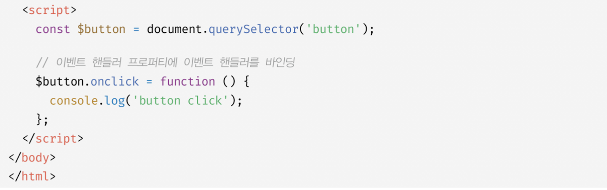

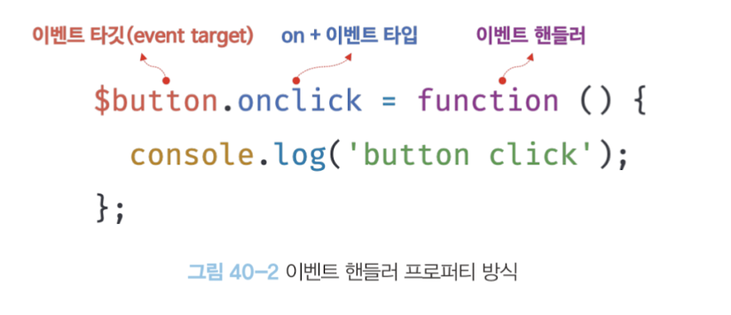

이벤트를 발생시킬 객체인 **이벤트 타깃**
이벤트의 종류를 나타내는 문자열인 **이벤트 타입**
**이벤트 핸들러**

"이벤트 핸들러 프로퍼티 방식"은 "이벤트 핸들러 어트리뷰트 방식"의 HTML과 자바스크립트가 뒤섞이는 문제를 해결할 수 있습니다. 하지만, 이벤트 핸들러 프로퍼티에 이벤트 핸들러만 바인딩할 수 있다는 단점이 있습니다.

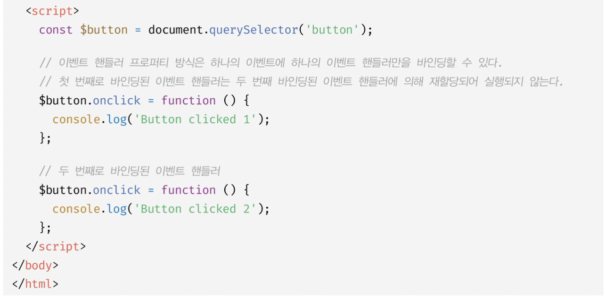

### addEventListener 메서드 방식

`EventTarget.prototype.addEventListener` 메서드를 사용하여 이벤트 핸들러를 등록할 수 있습니다.

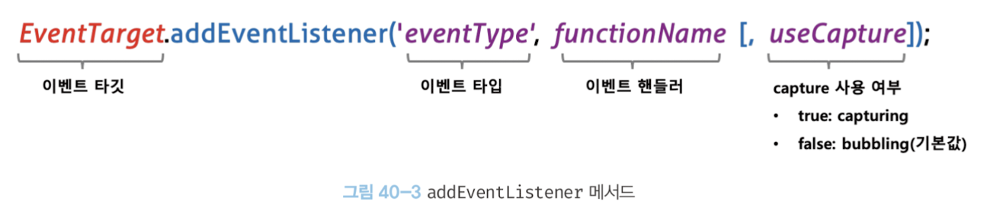

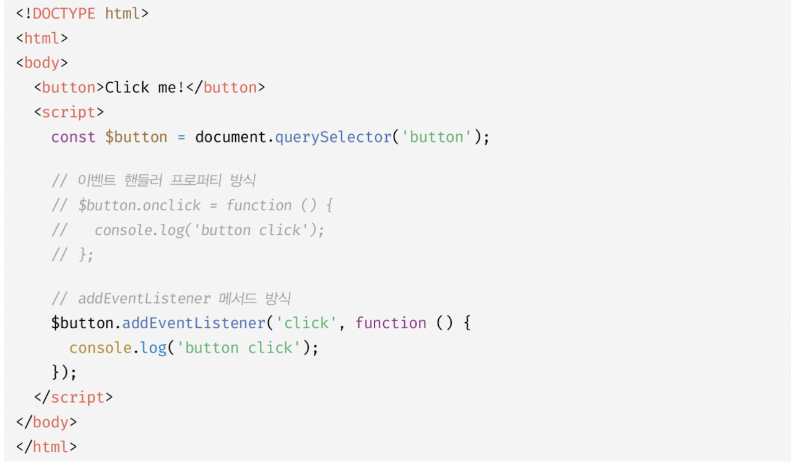

이벤트 핸들러 프로퍼티 방식은 이벤트 핸들러 프로퍼티에 이벤트 핸들러를 바인딩하지만 `addEventListener` 메서드에는 이벤트 핸들러를 인수로 전달합니다.

만일 둘 다 동시에 사용한다면?

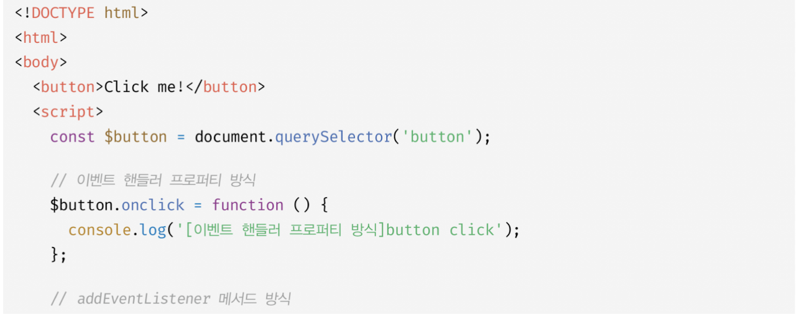
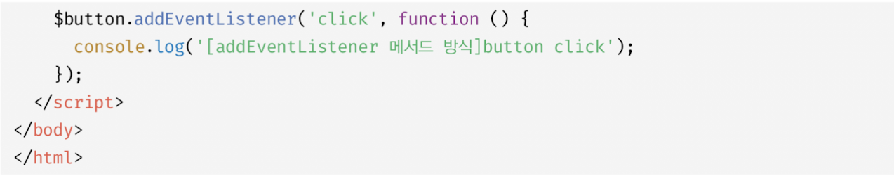

`addEventListener` 메서드 방식은 이벤트 핸들러 프로퍼티에 바인딩된 이벤트 핸들러에 아무런 영향도 주지 않습니다. 버튼 요소에서 클릭 이벤트가 발생하면 2개의 이벤트 핸들러가 모두 호출됩니다.

`addEventListener` 메서드는 하나 이상의 이벤트 핸들러를 등록할 수 있습니다. 이벤트 핸들러는 등록된 순서대로 호출됩니다.

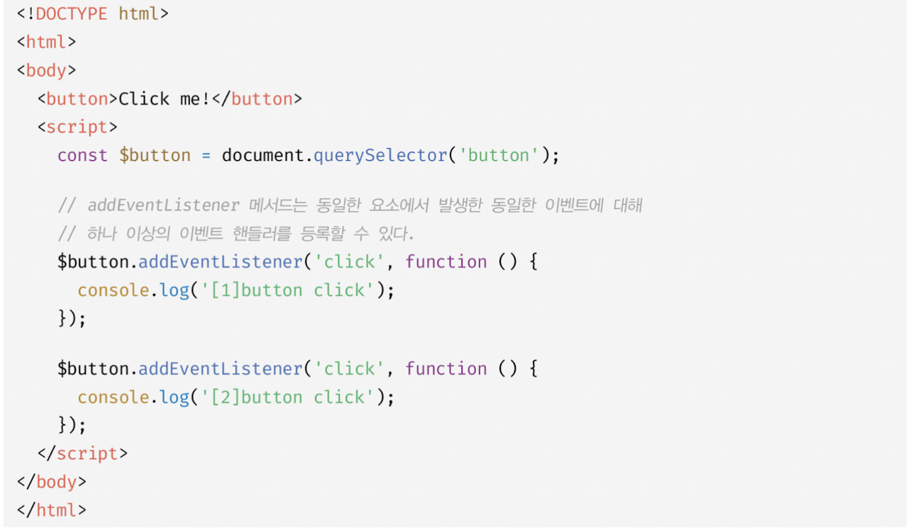

`addEventListener` 메서드를 통해 참조가 동일한 이벤트 핸들러를 중복 등록하면 하나의 이벤트 핸들러만 등록됩니다.

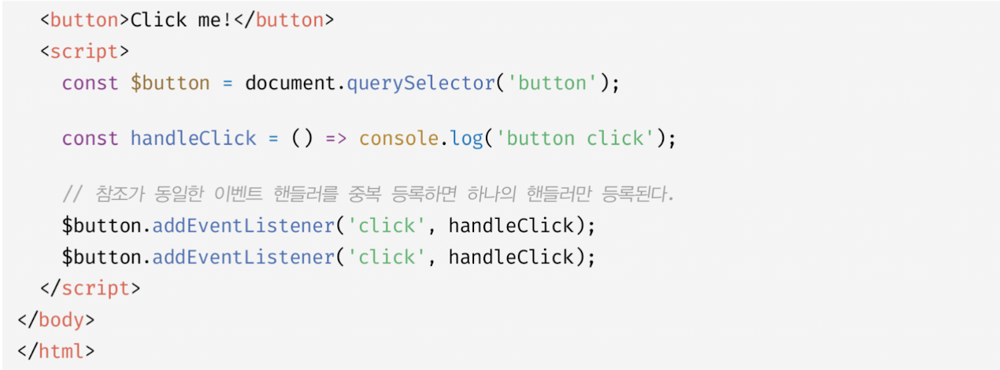

## 이벤트 핸들러 제거

`addEventListener` 메서드로 등록한 이벤트 핸들러를 제거하려면 `EventTarget.prototype.removeEventListener` 메서드를 사용합니다.

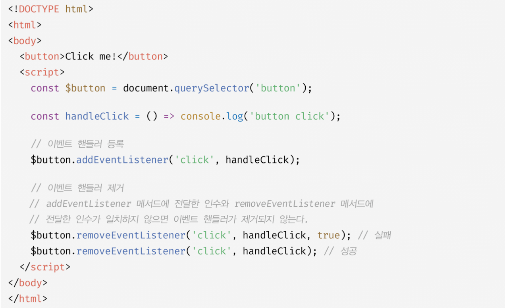

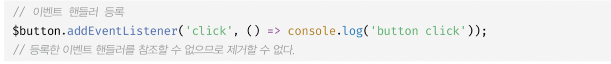

삭제를 하려면, `addEventListener` 메서드에 인수로 전달한 등록 이벤트 핸들러와 동일해야만 가능합니다.

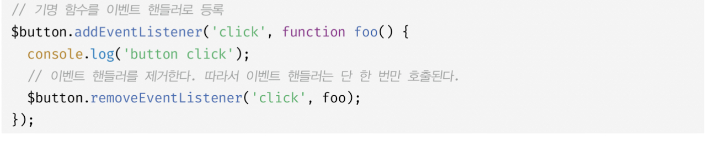

기명 이벤트 핸들러 내부에서 `removeEventListener`를 호출하여 이벤트 핸들러를 제거하는 것은 가능합니다.

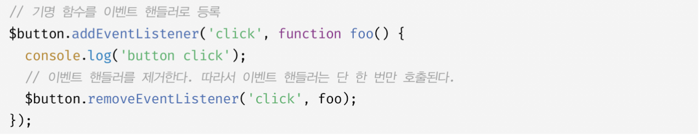

기명 함수를 이벤트 핸들러로 등록할 수 없다면 호출된 함수, 즉 함수 자신을 가리키는 `arguments.callee`를 사용할 수도 있습니다. 

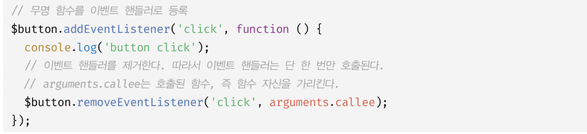

`arguments.callee`는 코드 최적화를 방해하므로 strict mode에서 사용이 금지됩니다. 따라서 가급적 이벤트 핸들러의 참조를 변수나 자료구조에 저장하여 제거하는 편이 좋습니다.


이벤트 핸들러 프로퍼티 방식으로 등록한 이벤트 핸들러는 `removeEventListener` 메서드로 제거할 수 없습니다.

## 이벤트 객체

이벤트가 발생하면 이벤트에 관련한 다양한 정보를 담고 잇는 이벤트 객체가 동적으로 생성됩니다. **생성된 이벤트 객체는 이벤트 핸들러의 첫 번째 인수로 전달됩니다.**


클릭 이벤트에 의해 생성된 이벤트 객체는 이벤트 핸들러의 첫 번째 인수로 전달되어 매개변수 e에 암묵적으로 할당됩니다. 이는 브라우저가 이벤트 핸들러를 호출할 때 이벤트 객체를 인수로 전달하기 때문입니다.


이벤트 핸들러 어트리뷰트 방식으로 이벤트 핸들러를 등록했다면 위와 같이 `event`를 통해 이벤트 객체를 전달받을 수 있습니다.


### 참고 블로그

[[js] 페이지 로딩 이벤트 readystatechange](https://velog.io/@sh0521/readystatechange)
[[JS] 크기 변화를 감지하는 두 가지 방법(resize, ResizeObserver)](출처: https://mong-blog.tistory.com/entry/JS-크기-변화를-감지하는-두-가지-방법resize-ResizeObserver)