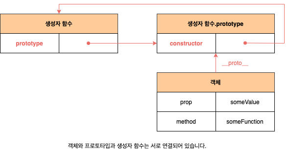
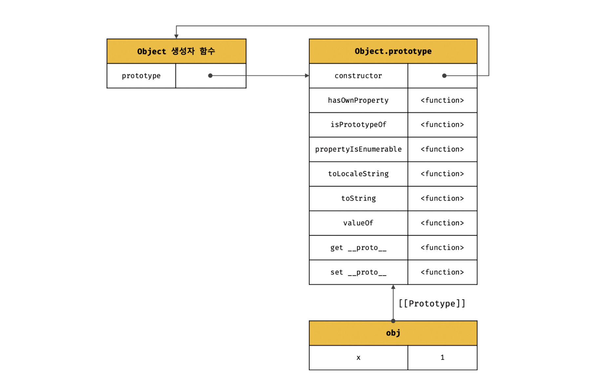
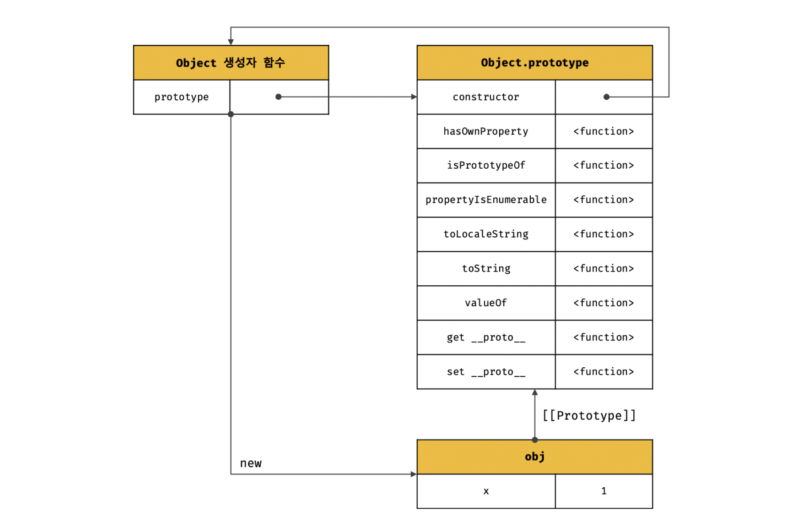
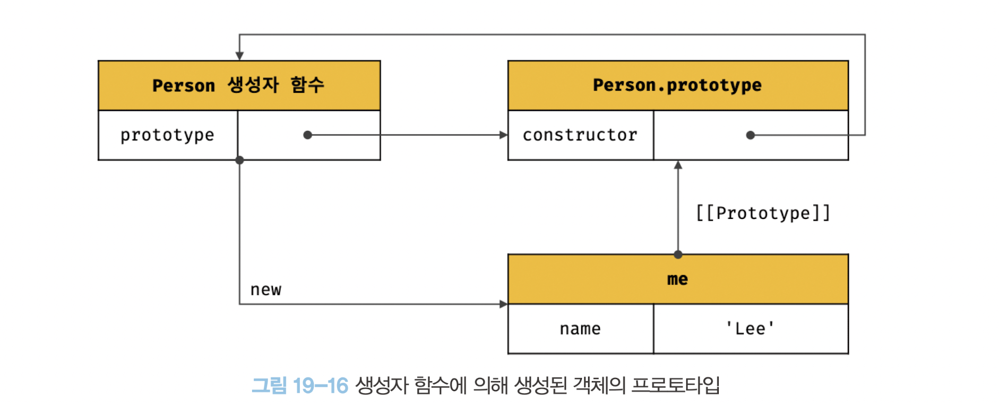
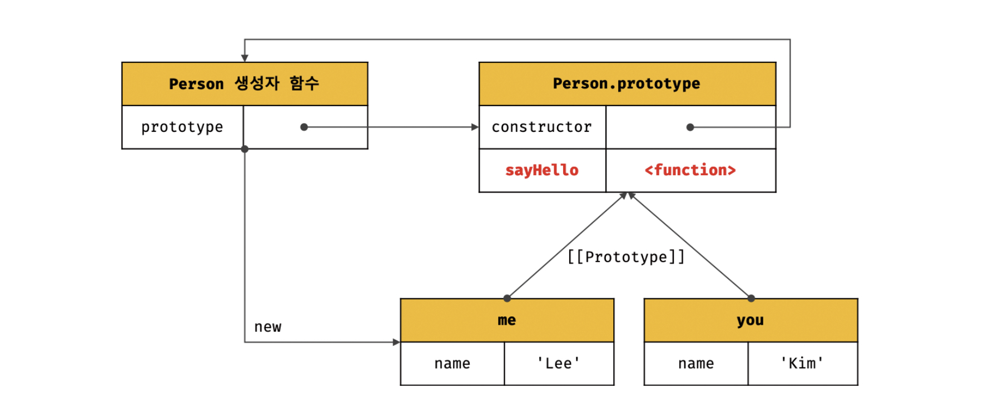
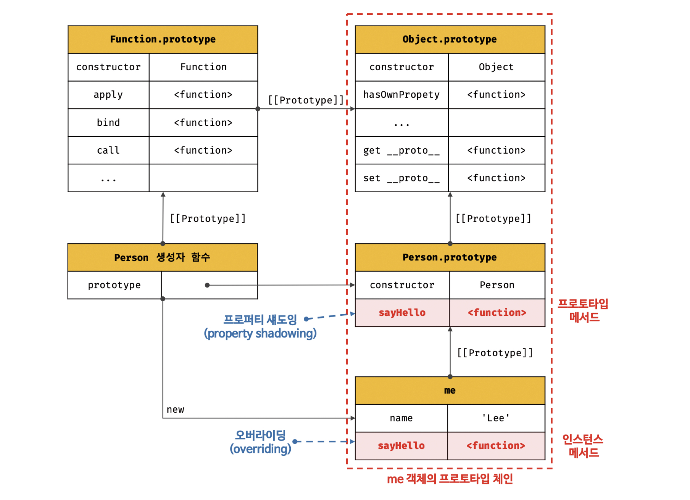
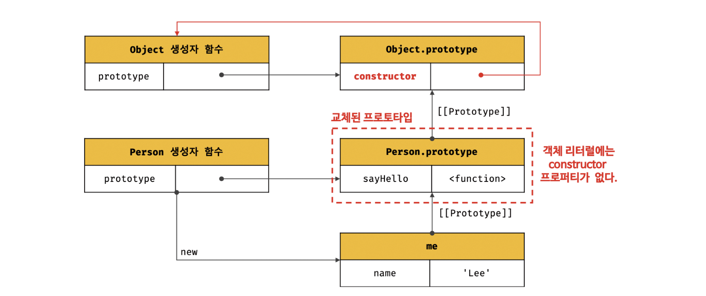

# 3주차(18장-)

# 18장 함수와 일급객체

---

### 1. 일급 객체

일급 객체의 조건

- 무명의 리터럴로 생성 가능, 런타임에 생성 가능
- 변수나 자료구조에 저장할 수 있다
- 함수의 매개변수에 전달가능
- 함수의 반환값으로 사용 가능

함수가 일급 객체라는 것은 함수를 객체와 동일하게 사용할 수 있다는 의미다.

가장 큰 특징은 일반 객체와 같이 함수의 매개변수에 전달할 수 있으며, 함수의 반환값으로 사용할 수 있다는 것이다. 

일반 객체와 차이점은 호출가능 여부이다. 

### 2. 함수 객체의 프로퍼티

arguments, caller, length, name, prototype

유사배열객체: length 프로퍼티를 가진 객체. 배열 메서드를 사용하면 에러 발생 

# 19장 프로토타입

---

# 1. 객체지향 프로그래밍

객제지향 프로그래밍은 실세계의 실체를 인식하는 철학적 사고를 프로그래밍에 접목하려는 시도에서 시작합니다. 실체는 특징이나 성질을 나타내는 속성을 가지고 있고, 이를 통해 실체를 인식하거나 구별할 수 있습니다.

예를 들어, 사람은 이름, 주소, 성별, 나이, 신장, 체중, 학력, 성격, 직업 등 다양한 속성을 갖습니다. 이때 "이름은 아무개이고 성별은 여성이며 나이는 20세인 사람"과 같이 속성을 구체적으로 표현하면 특정한 사람을 다른 사람과 구별하여 인식할 수 있습니다.

이를 프로그래밍에 접목시켜서, 사람에게는 다양한 속성이 있으나 우리가 구현하려는 프로그램에서는 사람의 이름과 주소라는 속성에만 관심이 있다고 가정해봅시다. 이처럼 다양한 속성 중에서 프로그램에 필요한 속성만 간추려 내어 표현하는 것을 추상화(abstraction)이라고 합니다.

따라서 객체는 상태 데이터와 동작을 하나의 논리적인 단위로 묶은 복합적인 자료구조라고 할 수 있습니다. 이때 객체의 상태 데이터를 프로퍼티, 동작을 메서드라고 부릅니다.

# 2. 상속과 프로토타입

- 상속: 객체지향 프로그래밍의 핵심 개념, 어떤 객체의 프로퍼티 또는 메서드를 다른 객체가 상속받아 그대로 사용할 수 있는 것을 말한다.
- 자바스크립트는 프로토타입을 기반으로 상속을 구현하여 불필요한 중복을 제거한다.

```jsx
function Circle(radius) {
	this.radius = radius;
  this.getArea = function() {
    return Math.PI * this,radius ** 2;
  }
}
 
const circle1 = new Circle(5);
const circle2 = new Circle(10);
 
console.log(circle1.getArea === circle2.getArea) // false
```

위 방식은 getArea 메서드를 모든 인스턴스가 중복해서 가지게되므로 메모리가 낭비된다.

```jsx
// 생성자 함수
function Circle(radius){
	this.radius = radius
}
 
// Circle 생성자 함수가 생성한 모든 인스턴스가 getArea 메서드를 
// 공유해서 사용할 수 있도록 프로토타입에 추가한다.
// 프로토타입은 Circle 생성자 함수의 prototype 프로퍼티에 바인딩되어 있다.
Circle.prototype.getArea = function(){
	return Math.PI * this.radius ** 2;
}
 
// 인스턴스 생성
const circle1 = new Circle(1);
const circle2 = new Circle(2);
 
// Circle 생성자 함수가 생성한 모든 인스턴스는 부모 객체의 역할을 하는
// 프로토타입 Circle.prototype으로부터 getArea 메서드를 상속받는다.
// 즉, Circle 생성자 함수가 생성하는 모든 인스턴스는 하나의 getArea 메서드를 공유한다.
console.log(circle1.getArea === circle2.getArea); // true 
```

Circle 생성자 함수가 생성한 모든 인스턴스는 자신의 프로토타입, 즉 상위(부모) 객체 역할을 하는 Circle.prototype의 모든 프로퍼티와 메서드를 상속받는다.

# 3. 프로토타입 객체

프로토타입은 객체 간 상속을 구현하기 위해 사용한다. 프로토타입은 부모 객체의 역할을 하는 객체로 다른 객체에 공유 프로퍼티를 제공한다. 프로토타입을 상속받은 자식 객체는 부모 객체의 프로퍼티를 자신의 프로퍼티처럼 자유롭게 사용할 수 있다.



- 모든 객체는 `[[Prototype]]` 이라는 내부 슬롯을 가지며 이 내부 슬롯의 값은 프로토타입의 참조다.
- `[[Prototype]]` 에 저장되는 프로토타입은 객체 생성 방식에 따라 결정된다.
- 모든 객체는 하나의 프로토타입을 갖는다. 모든 프로토타입은 생성자 함수와 연결되어 있다.

예를 들어 객체 리터럴에 의해 생성된 객체의 프로토타입은 Object.prototype이고 

생성자 함수에 의해 생성된 객체의 프로토타입은 생성자 함수의 prototype 프로퍼티에 바인딩되어 있는 객체


`__proto__` 접근자 프로퍼티를 통해 프로토타입에 접근하는 이유

- **상호 참조에 의해 프로토타입 체인이 생기는 걸 방지하기 위함**
- 모든 객체는 __proto__ 접근자 프로퍼티를 통해 [[Prototype]] 내부 슬롯에 간접 접근이 가능
- 객체가 직접 소유하는 프로퍼티가 아니므로, 상속을 통해 Object.prototype.**proto** 접근자 프로퍼티 사용 가능
- 프로토타입 체인의 규칙인 단방향 링크드 리스트를 지키기 위해,  __proto__ 접근자 프로퍼티를 통해 프로토타입에 접근함
- 모든 객체가 사용할 수 있는 것은 아니므로, 프로토타입의 참조를 취득하려면 `Object.getPrototypeOf` 메서드를, 교체하고 싶다면 `Object.setPrototypeOf` 메서드 사용 권장

프로토타입과 생성자 함수는 단독으로 존재할 수 없고 언제나 쌍으로 존재한다.

## 5. 프로토타입의 생성시점

객체는 리터럴 표기법 또는 생성자 함수에 의해 생성되므로 결국 모든 객체는 생성자 함수와 연결되어 있다. 

> 프로토타입은 생성자 함수가 생성되는 시점에 더불어 생성된다. 프로토타입과 생성자 함수는 언제나 쌍으로 존재하기 때문이다.
> 

### 19.5.1 사용자 정의 생성자 함수와 프로토타입 생성 시점

생성자 함수로서 호출할 수 있는 함수: ES6의 축약 표현으로 정의하지 않고 일반함수(함수 선언문, 함수 표현식)으로 정의한 함수 객ㅊ체

생성자 함수로서 호출할 수 있는 함수, 즉 constructor는 함수 정의가 평가되어 함수 객체를 생성하는 시점에 프로토타입도 더불어 생성된다.

```java
//함수 정의가 평가되어 함수 객체를 생성하는 시점에 프로토타입도 더불어 생성됨.
console.log(Person.protoType); //{constructor:f}

//생성자 함수
function Person(name){
	this.name= name;
}

//화살표 함수는 non-constructor로 프로토타입 생성되지 않는다. 
const Dog = name=> {this.name= name;}
console.log(Dog.prototype) //undefined

```

- 함수 선언문은 런타임 이전에 함수 호이스팅으로 엔진에 의해 먼저 실행된다.
- Person 생성자 함수는 어떤 코드보다 먼저 평가되어 함수 객체가 된다.
- 이때 프로토타입도 생성된다.  →  Person 생성자 함수의 prototype 프로퍼티에 바인딩됨.
- 생성된 프로토타입의 프로토타입은 언제나 `Object.prototype` 이다.

### 19.5.2 빌트인 생성자 함수와 프로토타입 생성 시점

`Object, String, Number, Function, Array, RegExp, Date, Promise` 등과 같은 빌트인 생성자 함수도 일반 함수와 마찬가지로 빌트인 생성자 함수가 생성되는 시점에 프로토타입이 생성된다. 생성된 프로토타입은 빌트인 생성자 함수의 prototype 프로퍼티에 바인딩 된다.

- 객체가 생성되기 이전에 프로토타입은 이미 객체화되어 존재한다.
- 생성자 함수 또는 리터럴 표기법으로 객체를 생성하면 프로토타입은 생성된 객체의 `[[Prototype]]` 내부 슬롯에 할당된다

## 6. 객체 생성 방식과 프로토타입의 결정

객체의 다양한 생성방식

- 객체 리터럴
- Object 생성자 함수
- 생성자 함수
- Object.create 메서드
- 클래스(ES6)

- 이들의 공통점은 **추상 연산** `OrdinaryObjectCreate` 에 의해 생성된다 점이다. (객체가 생성되는 시점에 객체 생성 방식에 의해 결정)
    - `OrdinaryObjectCreate` 는 빈 객체를 생성한 후, 객체에 추가할 프로퍼티 목록이 온 경우 객체에 추가한다.
    - 그리고 인수로 전달 받은 프로토타입을 자신이 생성한 객체 `[[Prototype]]` 내부 슬롯에 할당한 다음 생성한 객체를 반환.
    
    `OrdinaryObjectCreate` 는 필수적으로 자신이 생성할 객체의 프로토타입을 인수로 전달 받는다. 또한 자신이 객체에 추가할 프로퍼티 목록을 옵션으로 전달할 수 있다
    

**즉, 프로토타입은 추상 연산 `OrdinaryObjectCreate` 에 전달되는 인수에 의해 결정된다.** 인수는 객체 생성 시점에 객체 생성 방식에 따라 결정됨. 

### 19.6.1 객체 리터럴에 의해 생성된 객체의 프로토타입

> 객체 리터럴에 의해 생성되는 객체의 프로토타입은 `object.prototype` 이다.
> 

```java
const obj = {x:1};
```



위 객체 리터럴이 평가되면 추상 연산에 의해 다음과 같이 Object 생성자 함수와 Object.prototype과 생성된 객체 사이에 연결이 만들어진다.

이처럼 객체 리터럴에 의해 생성된 obj 객체는 Object.prototype을 프로토타입으로 갖게 되며, 이로써 object.prototype을 상속받고, 상속 받음으로 인해 obj 객체는 constructor 프로퍼티와 hasOwnProperty 메서드를 자신의 자산인 것처럼 자유롭게 사용할 수 있다.

```java
const obj= {x:1}
console.log(obj.constructor ===Object) //true
console.log(obj.hasOwnProperty('x')) //true
```

### 19.6.2 object 생성자 함수에 의해 생성된 객체의 프로토타입

> object 생성자 함수에 의해 생성된 객체의 프로토타입은 `object.prototypye` 이다.
> 

```java
const obj = new Object;
obj.x = 1; 

// object.prototype을 프로토타입으로 가지며, object.prototype을 상속받음.
console.log(obj.constructor === Object); // true
console.log(obj.hasOwnProperty('x')); //true
```



추상 연산에 의해 Object 생성자 함수와 Object.prototype과 생성된 객체 사이에 연결이 만들어진다. 객체 리터럴에 의해 생성된 객체와 동일한 구조이다.

이처럼 Object 생성자 함수에 의해 생성된 obj 객체도 Object.prototype을 상속받는다.

### 19.6.3 생성자 함수에 의해 생성된 객체의 프로토타입

> 생성자 함수에 의해 생성되는 프로토타입은 생성자 함수의 prototype 프로퍼티에 바인딩되어있는 객체이다.
> 


```jsx
function Person(name){
	this.name=name;
}
const me = new Person("Lee")
```

위 코드가 실행되면 추상 연산에 의해 **생성자 함수와 생성자 함수의 prototype 프로퍼티에 바인딩되어 있는 객체와 생성된 객체 사이에 연결이 만들어진다.**

```jsx
function Person(name){
	this.name= name;
}

const me = new Person('Lee')
const you = new Person('Kim')

Person.prototype.sayHello= function(){
		console.log(`Hi My name is ${this.name}`);
} //순서를 바꾸어도 상관없음. 

me.sayHello(); //Hi my name is Lee
you.sayHello()//Hi my name is Kim
```



프로토타입은 객체이므로 일반 객체와 같이 프로토타입에도 프로퍼티를 추가/삭제할 수 있고, 이런 **수정사항은 프로토타입 체인에 즉각 반영**된다.

Person 생성자 함수를 통해 생성된 모든 객체는 프로토타입에 추가된 sayHello 메서드를 상속받아 사용할 수 있다.

# 7. 프로토타입 체인

```jsx
function Person(name){
	this.name = name;
}
Person.prototype.sayHello= function(){
	console.log(`Hi! My name is ${this.name}`)
}
const me = new Person('lee');
//hasOwnProperty는 Object.prototype의 메서드
console.log(me.hasOwnProperty('name')) //true
Object.getPrototypeOf(me) === Person.prototype; //true ,
Object.getPrototypeOf(Person.prototype) === Object.prototype; //true

```

- me 객체의 프로토타입 ⇒ Person.prototype
- Person.prototype의 프로토타입⇒ Object.prototype이다.


- 접근하려는 객체의 프로퍼티가 존재하지 않을 때, 자바스크립트는 **[[Prototype]] 내부 슬롯의 참조**를 따라 부모 역할의 프로토타입의 프로퍼티를 순**차적으로 검색하는데, 이를 프로토타입 체인**이라 함
- 프로토타입 체인의 최상위 객체는 언제나 **Object.prototype이며 이를 종점**이라 칭하고, 모든 객체는 이를 상속받음

```jsx
//hasOwnProperty는 Object.prototype의 메서드
// me 객체는 프로토타입 체인을 따라 hasOwnProperty 메서드를 검색하여 사용

me.hasOwnProperty('name'); //true 
```

- me 객체에서 `hasOwnProperty` 메서드 검색
- me 객체에 해당 메서드 없음 → 프로토타입 체인을 따라 즉, `[[Prototype]]` 내부 슬롯에 바인딩 된 프로토타입으로 이동해 메서드 검색
- Person.prototype에도 메서드가 없으므로 체인을 따라 Object.prototype으로 이동
- Object.prototype에 `hasOwnProperty` 메서드를 호출. 이 메서드의 this에는 me 객체가 바인딩 됨.

> 프로토타입 체인은 상속과 프로퍼티 검색을 위한 메커니즘임
> 

### 스코프 체인

위에서 me라는 식별자를 검색할 때 스코프 체인을 사용.

- 프로퍼티가 아닌 식별자를 검색할 경우, 스코프 체인에서 검색한다.
- 그러므로 스코프 체인은 식별자 검색을 위한 메카니즘이다.
- 스코프 체인과 프로토타입의 체인은 서로 협력하여 식별자와 프로퍼티를 검색하는데 사용된다.

# 8. 오버라이딩과 프로퍼티 섀도잉

- **오버라이딩**: 상위 클래스가 가지고 있는 메소드를 하위 클래스가 재정의하여 사용하는 것
- **오버로딩**: 함수의 이름은 동일하지만 매개변수의 타입 또는 개수가 다른 메소드를 구현하고 매개변수에 의해 메소드를 구별하여 호출하는 방식. 자바스크립트에서는 arguments객체를 사용하여 구현 가능
- **프로퍼티 섀도잉**: 상속 관계에 의해 프로퍼티가 가려지는 현상

```jsx
const Person = (function (){
//생성자함수
	function Person(name){
		this.name= name;
	}
	//프로토타입 메서드
	Person.prototype.sayHello = function(){
		console.log(`Hi! My name is ${this.name}`)
	}
	//생성자 함수 반환
	return Person;
}());

const me = new Person('lee')
me.sayHello() 
//인스턴스 메서드
me.sayHello= function() { console.log(`Hey! My name is ${this.name}`)}

//인스턴스 메서드가 호출된다. 프로토타입 메서드는 인스턴스 메서드에 의해 가려진다.
me.sayHello(); //Hey! My name is lee
```



- `프로토타입 프로퍼티:` 프로토타입이 소유한 프로퍼티
- `인스턴스 프로퍼티:` 인스턴스가 소유한 프로퍼티

같은 이름의 프로퍼티를 인스턴스에 추가하면 덮어쓰는게 아니라 인스턴스 프로퍼티를 추가한다. 이는 프로토타입 메서드를 오버라이딩하고, 프로토타입 메서드는 가려진다.

이처럼 **상속 관계에 의해 프로퍼티가 가려지는 현상**을 **`프로퍼티 섀도잉`** 이라고 한다.

> 인스턴스 프로퍼티를 삭제한다면 어떻게 될까?
> 

```jsx
delete me.sayHello;
me.sayHello() //결과는??

delete me.sayHello;
me.sayHello() //한번 더 삭제하면 결과는?
```

`Hi! my name is Lee` 가 출력된다. 인스턴스 메서드가 없으므로  프로토타입의 메서드가 호출된다.

한번 더 삭제하면 여전히 프로토타입 메서드가 호출된다. 왜냐면 프로토타입 체인을 통해 프로토타입 메서드를 변경, 삭제가 불가능하기 때문이다.

⇒ **즉, 하위 객체는 프로토타입에 get 액세스는 되지만, set액세스는 불허한다. 변경하고 싶다면 체인으로 변경하는게 아닌 프로토타입에 직접 접근해야 한다.** 

# 9. 프로토타입의 교체

이거 번거로우니까 프로토타입은 직접 교체하지말아라. 19.11절에서 직**접 상속**이 더 편하다. 또는 ES6 클래스를 사용해라. 

- 프로토타입은 **임의의 다른 객체로 변경**할 수 있다.
- 프로토타입은 **객체 간의 상속 관계를 동적으로 변경**할 수 있다.
- 프로토타입은 **생성자 함수 또는 인스턴스에 의해 교체**할 수 있다.

### 9.1 생성자 함수에 의한 프로토타입 교체

```jsx
const Person = (function (){
//생성자함수
	function Person(name){
		this.name= name;
	}
	//생성자 함수의 prototype 프로퍼티를 통해 프로토타입을 교체 
	Person.prototype ={
		sayHello(){
			console.log(`Hi! My name is ${this.name}`)
		}
	}
	//생성자 함수 반환
	return Person;
}());

const me = new Person('lee')

console.log( me.constructor ===Person); //?
console.log(me.constructor ===Object) ; //??
```

- 프로토타입을 교체하면 constructor프로퍼티와 생성자 함수 간의 연결이 파괴된다.



- 여태 예시대로 생성한다면 Person.prototype에 constructor 프로퍼티가 있어야 한다.
- 답: false , true
- 이를 다시 붙이기 위해서는 교체한 객체 리터럴에 constructor프로퍼티를 추가하여 되살릴 수 있다.

```jsx
const Person = (function (){
//생성자함수
	function Person(name){
		this.name= name;
	}
	//생성자 함수의 prototype 프로퍼티를 통해 프로토타입을 교체 
	Person.prototype ={
		**constructor:Person, //constructor 프로퍼티와 생성자 함수 간의 연결을 설정** 
		sayHello(){
			console.log(`Hi! My name is ${this.name}`)
		}
	}
	//생성자 함수 반환
	return Person;
}());

const me = new Person('lee')
console.log( me.constructor ===Person); //true
console.log(me.constructor ===Object) ; //false
```

### 9.2 인스턴스에 의한 프로토타입 교체

- 프로토타입은 인스턴스의 **`__proto__`**접근자 프로퍼티 또는 **`object.getprototypeOf`**메소드를 통해 접근할 수 있다. 따라서 이를 통해 프로토타입을 교체할 수 있다.
- 생성자 함수의 prototype프로퍼티에 다른 임의 객체를 바인딩하는 것은 **생성될 프로퍼티를 교체하는 것이다.** 즉, 이는 이미 생성된 객체의 프로토타입을 교체하는 것이라고 할 수 있다.

```jsx
function Person(name){
	this.name = name;
}

const me = new Person('Lee')

//프로토타입으로 교체할 객체
const parent ={
	sayHello(){
		console.log(`Hi! My name is ${this.name}`);
	}
};
//me 객체의 프로토타입을 parent 객체로 교체
**Object.setPrototypeOf(me, parent);**
/**/me.__proto__=parent** 이 코드와 동일하게 동작

me.sayHhello(); //Hi! My name is Lee

console.log(me.constructor ===Person)  //? 
console.log(me.constructor ===Object); //? 
```

- 프로토타입을 교체하면 constructor프로퍼티와 생성자 함수 간의 연결이 파괴된다
- 프로토타입 체인을 따라 Object.prototype의 constructor프로퍼티가 검색된다.
- 답: false, ture

- **프로토타입에 대해 설명해주세요.**
    
    자바스크립트의 모든 객체들은 메서드와 속성들을 상속받기 위한 템플릿으로써 프로토타입 객체를 갖습니다.
    
    정확히 말하자면 상속되는 속성과 메서드들은 각 객체가 아니라 객체의 생성자의 `prototype`이라는 속성에 정의되어있습니다.
    
    자바스크립트에서는 객체 인스턴스와 프로토타입간에 연결이 구성되며, 이 연결을 따라 프로토타입 체인을 타고 올라가며 속성과 메서드를 탐색합니다.
    

**프로토타입의 용도**

자바스크립트에서 프로토타입(prototype)이 있는 이유는 객체 지향 프로그래밍을 지원하기 위해서입니다. 프로토타입은 객체들이 메서드와 속성을 상속받을 수 있게 하는 메커니즘입니다. 이를 통해 메모리 효율성을 높이고, 코드의 재사용성을 증대시킵니다.

1. **상속 구현:** 객체가 다른 객체의 속성과 메서드를 상속받아 사용할 수 있게 합니다.
2. **메모리 절약:** 모든 인스턴스가 공통으로 사용하는 메서드나 속성을 개별적으로 저장하지 않고, 프로토타입 체인에서 공유할 수 있게 합니다.
3. **코드 재사용:** 공통 기능을 프로토타입에 정의하여 여러 객체에서 재사용할 수 있게 합니다.
