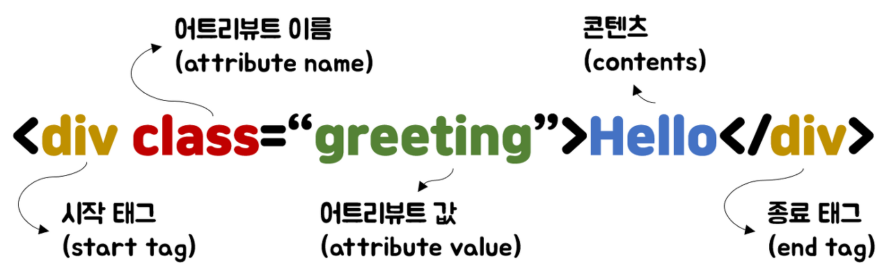
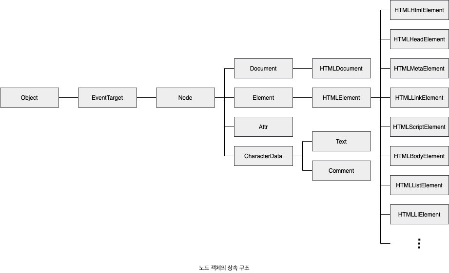
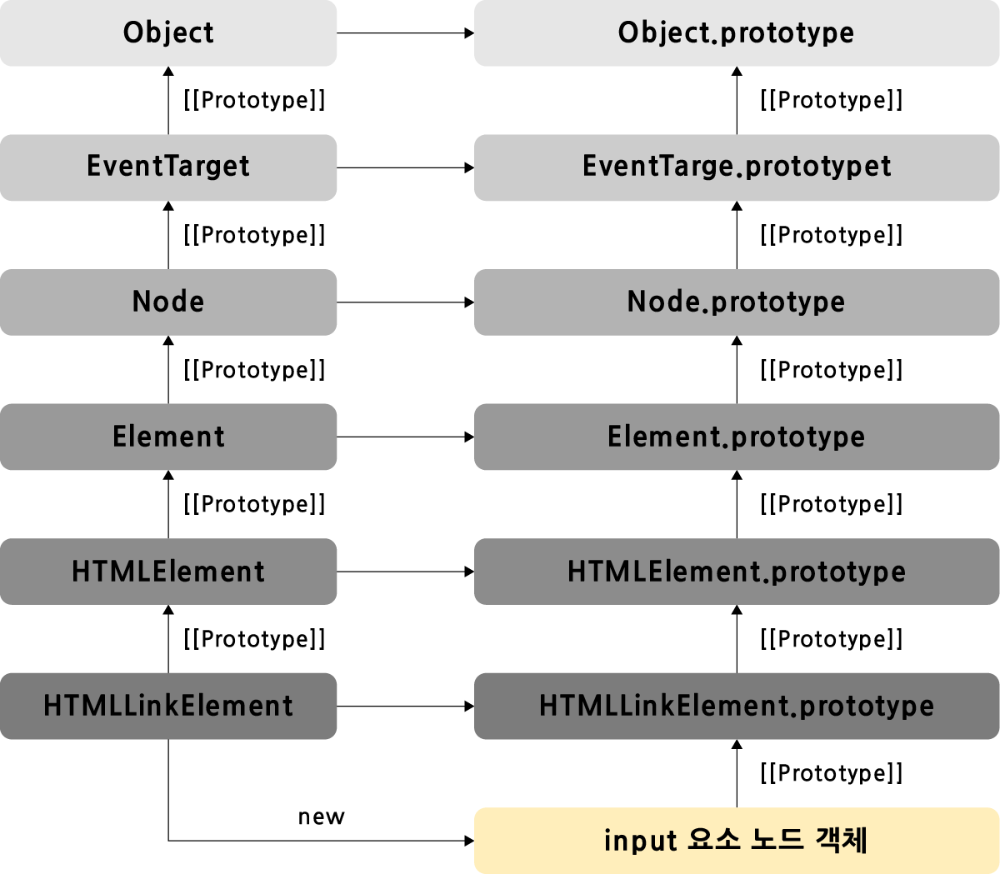

# 39장 DOM

브라우저의 렌더링 엔진은 HTMl 문서를 파싱해 브라우저가 이해할 수 있는 자료구조인 DOM을 생성한다. DOM은 HTML 문서의 계층적 구조와 정보를 표현하며 이를 제어할 수 있는 API, 즉 프로퍼티와 메서드를 제공하는 트리 자료구조다.

## 📖 1. 노드

### HTML 요소와 노드 객체




- HTML요소는 HTML 문서를 구성하는 개별적인 요소
- 렌더링 엔진에 의해 요소는 파싱되어 DOM을 구성하는 요소 노드 객체로 변환됨
- 요소 간 중첩 관계에 의해 계층적 관계가 형성됨-> 요소를 객체화한 모든 **노드 객체들을 트리 자료로 구성-> 이를 DOM이라고 함**
- 트리 자료구조는 부모 노드와 자식 노드로 구성된다. 하나의 최상위노드(루트노드)에서 시작, 자식 노드가 없는 노드를 리프노드라 함.

### 노드 객체 타입

| 타입            | 설명                                                                                                                                                                                                                        |
| --------------- | --------------------------------------------------------------------------------------------------------------------------------------------------------------------------------------------------------------------------- |
| 문서노드        | DOM 트리의 최상위에 존재하는 루트 노드로 document객체를 가리킴. window.document 또는 document로 참조 가능. <br> 브라우저환경의 모든 자바스크립트 코드는 하나의 전역 객체 window를 공유하므로 document 객체를 바라보고 있다. |
| 요소노드        | HTML요소를 가리키는 객체. 문서의 구조를 표현한다. HTML 요소간 중첩에 의해 부자 관계를 갖고 이를 통해 정보를 구조화 함                                                                                                       |
| 어트리뷰트 노드 | HTML 요소의 attribute를 가리키는 객체. attribute가 지정된 HTML 요소의 요소 노드와 연결됨. 부모 노드와 연결되어 있지 않고 요소노드에만 연결되어 있음.                                                                        |
| 텍스트 노드     | HTML 요소의 텍스트를 가리키는 객체. 요소 노드의 자식노드이며 자식 노드를 가질 수 없는 리프노드. 즉 DOM 트리의 최종단으로 접근하려면 부모노드인 요소노드에 접근이 필요                                                       |

### 노드 객체의 상속 구조

DOM을 구성하는 노드 객체는 ECMAScript 사양에 정의된 표준 빌트인 객체가 아닌 브라우저 환경에서 추가적으로 제공하는 호스트 객체다. 하지만 노드 객체도 자바스크립트 객체로 프로토타입에 의한 상속 구조를 갖는다.


- 그림처럼 모든 노드 객체는 `Object, EventTarget, Node` 인터페이스를 상속받는다
- 문서 노드는 `Document, HTMLDocument` 인터페이스를 상속 받고
- 어트리뷰트 노드는 `Attr`, 텍스트 노드는 `CharaterData`, 요소노드는 `Element` 인터페이스를 상속받는다.
  <br><br>



- 예를 들어 input 요소 노드 객체는 `HTMLInputElement, HTMLElement, Element, Node, EventTarget, Object` 의 프로토타입에 바인딩되어 있는 프로토타입 객체를 상속받는다. 즉, input 요소 노드 객체는 프로토타입 체인에 있는 모든 프로토타입의 프로퍼티나 메서드를 상속받는다.

> DOM은 HTML 문서의 계층적 문서 구조와 정보를 표현하며 노드 객체의 종류, 노드 타입에 따라 필요한 기능을 프로퍼티와 메서드의 집합인 DOM API로 제공한다. 이 DOM API를 통해 HTML 구조나 내용 또는 스타일 등을 동적으로 조작 가능하다.

## 📖 2. 요소 노드 취즉

HTML의 구조나 내용 또는 스타일을 동적으로 조작하기 위해서는 요소 노드를 취득해야한다

### id를 이용한 요소 노드 취득

`Document.prototype.getElementById` 메서드는 인수로 전달한 id 어트리뷰트 값을 갖는 하나의 요소 노드를 탐색하여 반환한다.

- id 값은 문서 내에 유일해야 하지만, 중복되더라도 에러가 발생하지 않기 때문에 관리가 필요하다
- 인수로 전달된 id값을 갖는 첫 번째 요소 노드가 반환된다. 존재하지 않는다면 null 반환
- id값과 동일한 이름의 전역 변수가 암묵적으로 형성된다.

```html
<body>
  <ul>
    <li id="apple">Apple</li>
    <li id="banana">Banana</li>
    <li id="orange">Orange</li>
  </ul>
  <script>
    // id 값이 'banana'인 요소 노드를 탐색하여 반환한다.
    // 두 번째 li 요소가파싱되어 생성된 요소 노드가 반환된다.

    const $elem = document.getElementById('banana');

    // 취득한 요소 노드의 style.color프로퍼티 값을 변경한다.
    $elem.style.color = 'red';
  </script>
</body>
```

### 태그 이름을 이용한 요소 노드 취득

`Document.prototype/Element.prototype.getElementsByTagName` 메서드는 인수로 전달한 태그 이름을 갖는 모든 요소 노드들을 탐색하여 반환한다.

```html
<body>
  <ul>
    <li id="apple">Apple</li>
    <li id="banana">Banana</li>
    <li id="orange">Orange</li>
  </ul>
  <script>
    // 태그 이름이 li인 요소 노드를 모두 탐색하여 반환한다.
    // 탐색된 요소 노드들은 HTMLCollection 객체에 담겨 반환된다.
    // HTMLCollection 객체는 유사 배열 객체이면서 이터러블이다.
    const $elems = document.getElementsByTagName('li');

    // 취득한 모든 요소 노드의 style.color 프로퍼티 값을 변경한다.
    // HTMLCollection 객체를 배열로 변환하여 순회하며 color 프로퍼티 값을 변경한다.
    [...$elems].forEach((elem) => {
      elem.style.color = 'red';
    });
  </script>
</body>
```

<br>
### class를 이용한 요소 노드 취득
`Document.prototype/Element.prototype.getElementsByClassName` 메서드는 인수로 전달한 class 어트리뷰트 값을 갖는 모든 요소 노드들을 탐색하여 반환한다.

```html
<body>
  <ul>
    <li class="fruit apple">Apple</li>
    <li class="fruit banana">Banana</li>
    <li class="fruit orange">Orange</li>
  </ul>
  <script>
    // class 값이 'fruit'인 요소 노드를 모두 탐색하여 HTMLCollection 객체에 담아 반환한다.
    const $elems = document.getElementsByClassName('fruit');

    // 취득한 모든 요소의 CSS color 프로퍼티 값을 변경한다.
    [...$elems].forEach((elem) => {
      elem.style.color = 'red';
    });

    // class 값이 'fruit apple'인 요소 노드를 모두 탐색하여 HTMLCollection 객체에 담아 반환한다.
    const $apples = document.getElementsByClassName('fruit apple');

    // 취득한 모든 요소 노드의 style.color 프로퍼티 값을 변경한다.
    [...$apples].forEach((elem) => {
      elem.style.color = 'blue';
    });
  </script>
</body>
```

<br>

### CSS 선택자를 이용한 요소노드 취득

CSS 선택자는 스타일을 적용하고
자 하는 HTML 요소를 특정할 때 사용하는 문법

```css
/* 전체 선택자 : 모든 요소 선택*/
* {
  ...;
}
/* 태그 선택자 : 모든 p 태그 요소 선택*/
p {
  ...;
}
/* id 선택자 : id 값이 'foo'인 요소 선택*/
#foo {
  ...;
}
/* 자식 선택자 : div 요소의 자식 요소 중 p 요소를 모두 선택*/
div > p {
  ...;
}
/* 일반 형재 선택자 : p 요소의 형제 요소 중에 p 요소 뒤에 위치하는 ul 요소를 모두 선택*/
p ~ ul {
  ...;
}
/* 가상 클래스 선택자 : hover 상태인 a 요소를 모두 선택*/
a:hover {
  ...;
}
/* 가상 요소 선택자 : p 요소의 콘텐츠 앞에 위치하는 공간을 선택. 일반적으로 content 프로퍼티와 함께 사용된다.*/
p::before {
  ...;
}
```

- `querySelector`: 인수로 전달한 CSS 선택자를 만족시키는 요소 노드가 여러 개인 경우 첫번째 요소 노드만 반환함.
- `querySelectAll`: 모든 요소 노드 반환. DOM 컬렉션 객체인 NodeList 객체를 반환한다. 유사 배열 객체이면서 이터러블.

### 특정 요소 노드를 취득할 수 있는지 확인

`Element.prototype.matches` 메서드

```html
<body>
  <ul id="fruits">
    <li class="apple">Apple</li>
  </ul>
</body>
<script>
  const apple = document.querySelector('.apple');
  // apple 노드는 #fruits > li.apple로 취득할 수 있다.
  console.log(apple.matches('#fruits > li.apple')); //true
</script>
```

### HTMLCollection과 NodeList

DOM 컬렉션 객체인 HTMLCollection과 NodeList는 DOM API가 여러 개의 결과값을 반환하기 위한 DOM 컬렉션 객체다

- HTMLCollection과 NodeList의 중요한 특징은 **노드 객체의 상태 변화를 실시간으로 반영하는 살아 있는 객체**라는 것.

- HTMLCollection은 언제나 live 객체로 동작한다. 단 NodeList는 대부분의 경우 노드 객체의 상태 변화를 실시간으로 반영하지 않고 과거의 정적 상태를 유지하는 non-live 객체로 동작하지만 경우에 따라 live 객체로 동작할 때가 있음.

**HTMLCollection** <br>

> `getElementsByTagName, getElementsByClassName` 메서드가 반환한다. 노드 객체의 상태 변화를 실시간으로 반영하는 살아 있는 DOM 컬렉션 객체.

```html
<html>
  <body>
    <ul id="fruits">
      <li class="red">Apple</li>
      <li class="red">Banana</li>
      <li class="red">Orange</li>
    </ul>
    <script>
      // class 값이 'red'인 요소 노드를 모두 탐색하여 HTMLCollection 객체에 담아 반환한다.
      const $elems = document.getElementsByClassName('red');
      // 이 시점에 HTMLCollection 객체에는 3개의 요소 노드가 담겨 있다.
      console.log($elems); // HTMLCollection(3) [li.red, li.red, li.red]

      // HTMLCollection 객체의 모든 요소의 class 값을 'blue'로 변경한다.
      for (let i = 0; i < $elems.length; i++) {
        $elems[i].className = 'blue';
      }

      // HTMLCollection 객체의 요소가 3개에서 1개로 변경되었다.
      console.log($elems); // HTMLCollection(1) [li.red]
    </script>
  </body>
</html>
```

- 실시간으로 $elem에서 li요소가 제거되어 반복문의 i가 2일 때, $elem.length는 1인 상태다.

**NodeList** <br>

> querySelectorAll이 반환하는 NodeList 객체는 실시간으로 노드 객체의 상태 변경을 반영하지 않는 객체로 querySelectorAll을 활용하여 해결할 수도 있다.
>
> 하지만 childNodes 프로퍼티가 반환하는 NodeList 객체는 HTMLCollection 객체와 동일하게 실시간 객체로 동작하므로 주의가 필요하다.

```html
<html>
  <body>
    <ul id="fruits">
      <li>Apple</li>
      <li>Banana</li>
    </ul>
  </body>
  <script>
    const $fruits = document.getElementById('fruits');

    // childNodes 프로퍼티는 NodeList 객체(live)를 반환한다.
    const { childNodes } = $fruits;
    console.log(childNodes instanceof NodeList); // true

    // $fruits 요소의 자식 노드는 공백 텍스트 노드(39.3.1절 "공백 텍스트 노드"- 요소 사이 개행)를 포함해 모두 5개다.
    console.log(childNodes); // NodeList(5) [text, li, text, li, text]

    for (let i = 0; i < childNodes.length; i++) {
      // removeChild 메서드는 $fruits 요소의 자식 노드를 DOM에서 삭제한다.
      // (39.6.9절 "노드 삭제" 참고)
      // removeChild 메서드가 호출될 때마다 NodeList 객체인 childNodes가 실시간으로 변경된다.
      // 따라서 첫 번째, 세 번째 다섯 번째 요소만 삭제된다.
      $fruits.removeChild(childNodes[i]);
    }

    // 예상과 다르게 $fruits 요소의 모든 자식 노드가 삭제되지 않는다.
    console.log(childNodes); // NodeList(2) [li, li]
  </script>
  <script>
    const $fruits= document.getElementById('fruits')
    const {childNodes}= $fruits;

    //스프레드 문법을 사용해 NodeList를 배열로 변환
    [...childNodes].forEach(childNode => {
      $fruits.removeChild(childNode)
    })

    console.log(childNodes) //NodeList []
  </script>
</html>
```

따라서 노드 객체의 상태 변경과 상관없이 안전하게 DOM 컬렉션을 사용하려면 HTMLCollection이나 NodeList 객체를 배열로 변환하여 사용하는 것을 권장한다. 또한 고차 함수를 사용하여 순회한다. 


## 📖 3. 노드 탐색
요소 노드를 취득한 다음, 취득한 요소 노드를 기점으로 DOM 트리의 노드를 옮겨 다니며 부모, 형제, 자식 노드 등을 탐색해야할 때가 있음.
> DOM 트리 상의 노드를 탐색할 수 있도록 Node, Element 인터페이스는 트리 탐색 프로퍼티를 제공한다.

- Node.prototype 제공: `parentNode, previoustSibling, firstChild, childNodes` 프로퍼티
- Element.prototype 제공 : `previousElementSibling, nextElementSibling, children` 프로퍼티

### 공백 텍스트 노드
HTML요소 사이의 스페이스, 탭, 줄바꿈 등의 공백 문자는 공백 테스트 노드를 생성 (DOM트리 내에 생성된다.)

### 자식 노드 탐색
자식 노드를 탐색하기 위해 사용하는 노드 탐색 프로퍼티들
- `Node.prototype.childNodes`
: childNodes 프로퍼티가 반환한 NodeList에는 요소 노드뿐만 아니라 텍스트 노드도 포함되어 있을 수 있다.

- `Element.prototype.children`
: 자식 노드 중 요소 노드만 모두 탐색해 DOM 컬렉션 객체인 HTMLCollection에 담아 반환. children 프로퍼티가 반환한 HTMLCollection에는 텍스트 노드가 포함되지 않는다.

- `Node.prototype.firstChild`: 첫번째 자식 노드 반환.
텍스트 노드이거나 요소노드

- `Node.prototype.lastChild`: 마지막 자식 노드 반환.
텍스트 노드이거나 요소노드

- `Element.prototype.firstElementChild`:첫번째 자식 요소노드 반환.
요소노드만 반환

- `Element.prototype.lastElementChild`: 마지막 자식 요소 노드 반환.
요소노드만 반환

```html
 <ul id ="fruits">
   	<li class ="apple">Apple</li>
   	<li class ="banana">Banana</li>
   	<li class ="orange">Orange</li>
  </ul>

<script>
  const fruites = document.getElementById('fruits');

console.log(fruits.childNodes);
// fruits요소의 모든 자식 노드 탐색 (텍스트 노드 포함)
// NodeList(7) [text, li.apple, text, li.banana, text, li.orange, text]] 

console.log(fruits.children);
// fruits 요소의 모든 자식 노드를 탐색함 (요소 노드만 포함)
// HTMLCollection [li.apple, li.banana, li.orange] 

//fruits 요소으ㅢ 첫 번째 자식 노드, ㅡ마지막 자식 노드 반환.
// 텍스트 노드를 반환할 수도 있다.
console.log(fruits.firstChild); // #text 
console.log(fruits.lastChild); // #text 

// 첫번째 , 마지막 자식 노드 반환
// 요소 노드만 반환한다.
console.log(fruits.firstElementChild); // li.apple
console.log(fruits.lastElementChild); // li.orange 

</script>
```

### 자식 노드 존재 확인
Node.prototype.hasChildNodes 메서드 사용
텍스트 노드를 포함하여 자식 노드의 존재를 확인

```javascript
<body>
  <ul id="fruits">
  </ul>
</body>
const fruits = document.getElementById('fruits');

console.lg(fruits.hasChildNodes); // true 

//children, childElementCount: 텍스트 노드가 아닌 요소 노드가 존재하는지 확인
console.log(fruits.children.length); // 0 => false
console.log(fruits.childElementCout); // 0 => false 
``` 

### 요소 노드의 텍스트 노드 탐색
요소노드의 텍스트 노드는 요소 노드의 자식 노드다. 따라서 요소 노드의 텍스트 노드는 firstChild 프로퍼티로 접근할 수 있다. firstChild 프로퍼티는 첫 번째 자식 노드를 반환. firstChild 프로퍼티가 반환한 노드는 텍스트 노드이거나 요소 노드.

```html
<body>
  <div id="foo">Hello</div>
</body>
<script>
  //요소 노드의 텍스트 노드는 firstChild 프로퍼티로 접근할 수 있다.
  console.log(document.getElementsById('foo').firstChild); // #text 
</script>
```

### 부모 노드 탐색
Node.prototype.paraneNode 사용
텍스트 노드는 DOM 트리의 최종단 노드인 리프 노드이므로 부모 노드가 텍스트 노드인 경우는 없음.

```html
<body>
  <ul id="fruits"><li calss="apple">
    banana
  </li></ul>
</body>
<script>
  const $apple= document.querySelector('.apple')

  console.log($banana.parentNode); // ul#fruits
</script>
```

### 형제 노드 탐색 
부모 노드가 같은 형제 노드를 탐색하려면 노드 탐색 프로퍼티를 사용해야 한다. 단, 어트리뷰트 노드는 요소 노드와 연결되어있지만 부모 노드가 같은 형제 노드가 아니기 떄문에 반환되지 않는다. 즉 아래, 프로퍼티는 텍스트 노드 또는 요소노드만 반환한다. 

|프로퍼티|설명
|---|---|
|Node.prototype.previousSibiling| 부모 노드가 같은 형제 노드 중 자신의 이전 형제 노드를 탐색해 반환. 요소노드 뿐만 아니라 텍스트 노드일 수 있음|
|Node.prototype.nextSibling|부모 노드가 같은 형제 노드 중 자신의 다음 형제 노드를 탐색해 반환. 요소노드 뿐만 아니라 텍스트 노드일 수 있음|
|Element.prototype.previousElementSibiling |위와 같으나 요소 노드만 반환 |
| Element.prototype.nextElementSibling| 요소노드만 반환| 