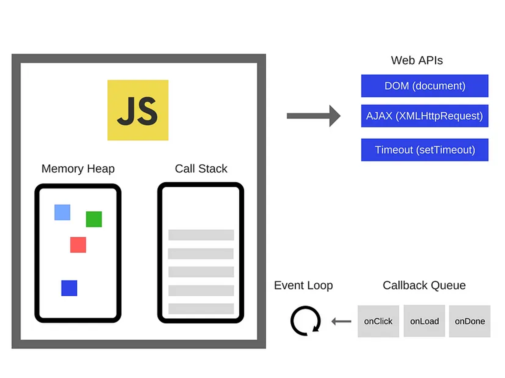
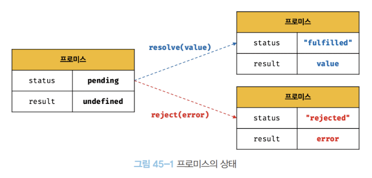

# 45장 프로미스

ES5에서 비동기 처리를 위해 프로미스를 도입했다. 이는 콜백 패턴이 가지는 단점을 보완하여 **비동기 처리 시점**을 명확히 표현할 수 있다는 특징이 있다.

## 📖1. 비동기 처리를 위한 콜백패턴의 단점

### 들어가기 앞서 자바스크립트 동작원리



- `메모리힙`: 데이터를 임시 저장하는 곳으로 함수나 변수, 함수 실행 시 사용하는 값 저장
- `콜 스택`: 코드 실행 시, 순서를 기록하고 순차적으로 실행하는 곳.

어떤 코드가 오래 걸리면 다른 코드들이 블락됨. 이 때 효과적으로 event를 관리하기 위해 필요한 것이 `Web API` , `Callback Queue` , `event loop`

- `콜백 함수`: 함수가 실행이 끝나면, 다음에 실행할 일을 정할 수 있음.
- `Web API`: 브라우저 안 C++로 구현된 멀티 쓰레드로 오래 걸리는 작업을 대신해줌. DOM event, AJAX request, setTimeout 등 비동기 이벤트 처리. JS 싱글 쓰레드의 영향을 받지않고 독립적으로 이벤트 처리 가능
- `Callback Queue` : Web API에 있는 이벤트가 실행되고 나면 JS에서 실행할 콜백을 저장하고 있는 저장소.
- `Event Loop`: 효과적으로 일을 처리하기 위한 메커니즘으로 콜 스택이 비어있는지를 주기적으로 확인해 Callback Queue에서 콜백함수를 가져와 콜 스택에서 JS 코드가 실행될 수 있도록 돕는 역할. 이때 event loop가 반복적으로 콜스택이 비어있는지 확인하는 것을 tick이라고 함.

### 콜백헬

```javascript
const get = (url) => {
  const xhr = new XMLHttpRequest();
  xhr.open('GET', url);
  xhr.send();

  xhr.onload = () => {
    return JSON.parse(xhr.response);
  };
};

const res = get('https://tistory.com');
console.log(res); // undefined
```

get함수는 비동기 함수이다. 처리과정은 다음과 같다.

1. 비동기 함수 `get` 함수 호출 -> 실행 컨텍스트 생성 -> 콜 스택에 푸시
2. XMLHttpRequest 객체 생성, xhr.onload 이벤트 핸들러 프로퍼티에 이벤트 핸들러가 바인딩된다.
3. `get` 함수가 종료되면 get 함수의 실행컨텍스트가 콜 스택에서 제거된다.
4. 그후 바로 `console.log(response)`가 실행된다. -> `undefined` 출력
5. 서버로부터 응답이 도착하면 xhr 객체에서 load 이벤트 발생
6. onload 이벤트 핸들러가 테스크 큐에 들어가고 콜스택이 비면 이벤트 루프에의해 콜스택으로 푸시되어 실행됨.

**결론**

> 비동기 함수를 호출하면 함수 내부의 비동기로 동작하는 코드가 완료되지 않아도 기다리지 않고 종료된다. 즉, 비동기 함수 내부의 비동기로 동작하는 코드는 비동기 함수가 종료된 이후에 완료된다.
>
> 비동기 함수 내부의 비동기로 동작하는 코드의 처리 결과를 외부로 반환하거나 상위 스코프의 변수로 할당하면 기대한 대로 동작하지 않는다.

따라서 비동기 처리 결과에 대한 후속 처리를 위해 `콜백 함수`를 전달한다.
필요에 따라 비동기 처리가 성공하면 호출될 콜백 함수와 비동기 처리 실패시 호출될 콜백 함수를 전달할 수 있다.

```javascript
const get = (url, successCallback, failureCallback) => {
  // 1. XMLHttpRequest 객체 생성
  const xhr = new XMLHttpRequest();

  // 2. GET 요청 초기화
  xhr.open('GET', url);

  // 3. 요청 전송
  xhr.send();

  // 4. 응답 수신 시 처리
  xhr.onload = () => {
    // 5. 응답 상태가 200(성공)일 경우
    if (xhr.status === 200) {
      // 6. 성공 콜백 함수 호출, 응답 데이터 파싱 후 전달
      successCallback(JSON.parse(xhr.response));
    } else {
      // 7. 실패 콜백 함수 호출, 상태 코드 전달
      failureCallback(xhr.status);
    }
  };
};

// GET 요청 실행, 성공 시 console.log, 실패 시 console.error 호출
get('https://json~~', console.log, console.error);
```

하지만 콜백함수를 통해 비동기 처리 결과에 대한 후속처리가 필요하게 된다면 콜백함수 호출이 중첩되어 복잡도가 늘어난다. 이것을 **콜벡헬** 이라고 한다.

**코드 예시**
```javascript
const get= (url, callback)=>{
  const xhr= new XMLHttpRequest();
  xhr.open("GET",url);
  xhr.send();

  xhr.onload=()=>{
    if(xhr.status===200){
      callback(JSON.parse(xhr.response))
    }else{
      console.error(`${xhr.status}`)
    }
  };
  const url="http://~"
  
  get(`${url}/posts/1`,({userId}=>{
    console.log(userId);
    //userId로 user 정보 획득 
    get(`${url}/posts/${userId}`,userInfo=>{
      console.log(userInfo)
    })
  }))
};
```

### 에러 처리의 한계
비동기 처리를 위한 콜백 패턴은 에러처리에 한계가 있다.
```javascript
try {
	setTimeout(() => {throw new Error('Error!');}, 1000);
}catch(e) {
	console.log('캐치한 에러', e); // 에러를 캐치하지 못한다.
}
```
에러는 호출자 방향으로 전파된다. (오류가 발생한 지점에서 호출된 상위 함수로 전파됨)
이 점을 생각하고 동작원리를 보면 다음과 같다.
1. 비동기 함수인 `setTimeout`이 호출되면 setTimeout의 실행 컨텍스트가 생성되어 콜스택에 푸시되어 실행된다.
2. `setTimeout`은 비동기 함수로 콜백 함수가 호출되는 것을 기다리지 않고 즉시 종료되어 콜스택에서 제거된다.
3. 이후 타이머 1000ms가 만료되면 콜백함수인 `throw new Error` 는 테스크 큐로 푸시된다.
4. 콜 스택이 비어있을 때 이벤트 루프로 인해 콜스택으로 콜백함수가 푸시된다. 

하지만 콜백함수가 실행될 때 `setTimeout` 함수는 이미 콜백 함수에서 제거된 상태로 catch 블럭에서 잡히지 않는다.


## 📖2. 프로미스의 생성
Promise 생성자 함수는 비동기 처리 할 콜백 함수를 인자로 전달 받는데 이 함수는 `resolve`와 `reject` 이다.

```javascript
const Promise = new Promise((resolve, reject) = > {
	if(/* 비동기 처리 성공 */){
    	resolve('result');
    }else{
  		/* 비동기 처리 실패 */
		reject('failure reason');
	}
})
```
Promise 처리 상태

|상태| 설명|
|---|---|
|pending| 비동기 처리가 아직 수행되지 않음. 프로미스가 생성된 직후의 기본 상태|
|fulfilled| 비동기 처리가 수행된 상태(성공) -> resolve 함수 호출|
|rejected| 비동기 처리가 수행된 상태(실패) -> reject 함수 호출|


- fulfilled, rejected 상태를 `settled` 상태라고 하며 이 상태에서는 다른 상태로 변화 불가하다.
  
## 📖3. 프로미스의 후속 처리 메서드
프로미스의 처리 결과에 따라 후속처리를 할 수 있는 메서드 `then`, `catch`, `finally`를 제공한다.

### Promise.prototype.then
then 메서드는 2개의 콜백 함수를 인자로 받는다.
```javascript
new Promise(resolve => resolve('fulfilled'))
  .then(v => console.log(v), e => console.error(e));
  ```
- fulfilled 상태일 때 호출되는 콜백 함수: 성공 처리 콜백 함수
- reject 상태일 때 호출되는 콜백 함수: 실패 처리 콜백 함수
- 두 콜백하수 모두 프로미스 결과를 인수로 받는다.

### Promise.prototype.catch
catch는 프로미스의 상태가 rejected일 때 호출되고 한 개의 콜백함수를 인수로 받는다.
```javascript
new Promise(resolve => reject(new Error('rejected')))
	.catch(e => console.log(e))
```

### Promise.prototype.finally
1개의 콜백함수를 인수로 받고, 콜백 함수는 프로미스의 성공/실패 여부 상관없이 무조건 `한 번` 호출된다.

이는 프로미스 상태와 상관없이 공통적으로 수행해야 할 처리 내용이 있을 때 유용하다. 
```javascript
new Promise(() => {})
	.finally(() => console.log('finally'))
```

### 후속처리 구현 예시
```javascript
const get = url => {
  return new Promise((resolve, reject) = > {  
    const xhr = new XMLHttpRequest();
    xhr.open("GET", url);
    xhr.send();

 	xhr.onload = () => {
    	if (xhr.status === 200) {
      		resolve(JSON.parse(xhr.response));
    	}else{
      		reject(new Error xhr.status);
    	}
  	};
  })};

get('https://~~')
	.then(res => console.log(res))
	.catch(err => console.error(err))
	.finally(() => console.log('Bye'));
  ```

## 📖4. 프로미스의 에러 처리
1. `then`의 두 번째 콜백 함수로 처리
2. `catch` 메서드로 처리
  
1번 방법보다 2번 방법이 가독성이 좋다.

## 📖5. 프로미스의 체이닝
`then, catch finally` 후속 처리 메서드는 프로미스를 반환하므로 연속적으로 호출이 가능하다. 이를 프로미스 체이닝이라고 한다.

프로미스는 비동기 처리 결과를 받아 후속처리를 하므로 비동기 처리를 위한 콜백 패턴에서 콜백 헬이 발생하진 않지만 결국 콜백 패턴을 사용한다.

콜백 패턴은 가독성이 좋지 않기에  ES8에서 `async/await` 을 통해 해결한다. 이는 비동기 처리의 후속처리가 없는 것처럼 (동기 처리처럼) 구현할 수 있게 해준다.

## 📖6. 프로미스의 정적 메서드
### Promise.resolve / Promise.reject
이미 존재하는 값을 래핑하여 프로미스를 생성하기 위해 사용한다.

`Promise.resolve` 메서드는 인수로 전달 받은 값을 `resolve`하는 프로미스를 생성한다.
`Promise.reject` 메서드는 인수로 전달 받은 값을 `reject`하는 프로미스를 생성한다.

```javascript
const resolvePromise= Promise.resolve([12,3])
resolvePromise.then(console.log)

const rejectPromise= Promise.reject(new Error('error'))
rejectPromise.catch(console.log)
```

### Promie.all
여러 개의 비동기 처리를 병렬 처리할 때 사용한다.
동시에 처리하는 것 같으나 실행 순서는 매개변수가 들어간 순이다.

```javascript
const requestData1 = () => new Promise(res => setTimeout(() => res(1), 3000));
const requestData2 = () => new Promise(res => setTimeout(() => res(2), 2000));
const requestData3 = () => new Promise(res => setTimeout(() => res(3), 1000));

Promise.all([requestData1(), requestData2(), requestData3()])
	.then(console.log) // [1,2,3]
    .catch(console.error)
```
- Promise.all은 전달받은 모든 프로미스가 모두 fulfille 상태가 되면 모든 처리 결과를 배열에 저장해 새로운 프로미스로 반환한다.
  
- 인수로 전달받은 Promise가 하나라도 rejected 상태라면 나머지 상태가 fulfilled되는 것을 기다리지 않고 종료한다. 따라서 rejected된 단일 promise만 catch에 잡힌다.
  
### Promise.race
Promise.all과 비슷하나 모든 프로미스가 fulfilled 상태가 되는 것을 기다리지 않고 **가장 먼저 fulfilled된 프로미스 처리 결과를 resolve하는 새로운 프로미스를 반환**한다.

```javascript
const requestData1 = () => new Promise(resolve => setTimeout(() => resolve(1), 3000));
const requestData2 = () => new Promise(resolve => setTimeout(() => resolve(2), 2000));
const requestData3 = () => new Promise(resolve => setTimeout(() => resolve(3), 1000));

Promise.race([requestData1(), requestData2(), requestData3()])
	.then(console.log) // 3
    .catch(console.error)
```

### Promise.allSettled

전달받은 모든 프로미스가 `settled` 상태(fulfilled거나 rejected거나)가 되면 처리 결과를 배열로 반환한다.

인수로 전달받은 모든 프로미스들의 처리결과가 배열로 담겨있다. 어떤 프로미스가 rejected 되더라도 catch에 잡히지 않는다.

```javascript
const promises = [
  Promise.resolve(1),
  Promise.reject('error occurred'),
  Promise.resolve(3)
];

Promise.allSettled(promises)
  .then(console.log)
  .catch(console.log); // 실행 안됨
```

## 📖7. 마이크로태스크 큐
```javascript
setTimeout(() => console.log(1), 0);

Promise.resolve()
	.then(() => console.log(2))
    .then(() => console.log(3));
```
위의 실행 결과는??


<br>
<br>
<br>
2->3->1이다
프로미스의 후속처리 메서드의 콜백함수는 태스크 큐가 아닌 `마이크로태스크 큐`에 저장되기 때문이다.

> 마이크로태스크 큐는 태스크 큐보다 우선순위가 높다. 즉, 이벤트 루프는 콜스택이 비면 태스크 큐에서 대기하고 있는 함수를 가져와 실행한다. 

## 📖8. fetch
fetch 함수는 XMLHttpRequest 객체와 마찬가지로 http 요청 전송을 제공하는 `클라이언트 사이드Web API`이다.

- fetch함수는 XMLHttpRequest 객체보다 사용법이 간단하고 프로미스를 지원한다. 이는 비동기 처리를 위한 콜백 패턴에서 자유롭게 한다.

``` javascript
const promise = fetch(url, [, options]);
```
- fetch 함수에서 http 요청을 전송할 url과 http 요청 메서드, http 요청 헤더, 페이로드 등을 설정한 객체를 전달한다.
- fetch 함수는 http 응답을 나타내는 `Response 객체`를 래핑한 `Promise` 객체를 반환한다. 
- fetch 함수가 반환하는 `Promise`객체는 **404나 500같은 http 에러가 발생해도 에러를 reject 하지 않고 Response 객체를 resolve** 한다. 네트워크 장애나 CORS에러에 의한 요청이 완료되지 못할 때만 프로미스를 reject 핟나.

```javascript
fetch(url)
  .then(res => { 
    if(!res.ok) throw new Error(res.statusText);
    return res.json();
  })
  .then(console.log)
  .catch(console.error);
  ```
- 따라서 fetch함수 사용 시, 반환한 프로미스가 resolve한 boolean타입의 `ok` 상태를 확인해 명시적으로 에러를 처리해야 한다.
- `ok`는 읽기 전용 속성으로 응답이 성공했는지 (200-299)범위를 나타내는 불리언이다.
  
