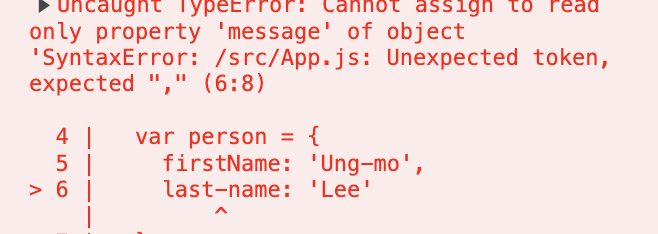
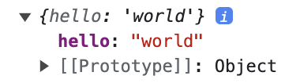
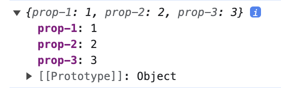

# 객체 리터럴

## 객체란?

자바스크립트는 **객체** 기반의 프로그래밍 언어입니다.

원시 값을 제외한 나머지 값(함수, 배열, 정규 표현식 등)은 모두 객체입니다.

원시 타입은 변경 불가능 한 값, 객체는 변경 가능한 값 입니다.


객체는 0개 이상의 프로퍼티로 구성된 집합이며, 프로퍼티는 key 와 value 로 구성됩니다.

자바스크립트에서 사용할 수 있는 모든 값은 프로퍼티 값이 될 수 있습니다. 

자바스크립트의 함수는 일급 객체 이므로 값으로 취급할 수 있습니다. 

따라서 함수도 프로퍼티 값으로 사용할 수 있습니다. 프로퍼티 값이 함수일 경우, 일반 함수와 구분하기 위해 메서드 라고 부릅니다.

> 일급객체?
>
> 아래 3가지 조건을 충족한 객체를 일컫습니다.
>
> 1. 모든 일급 객체는 변수나 데이터에 담을 수 있어야 한다.
> 2. 모든 일급 객체는 함수의 파라미터로 전달 할 수 있어야 한다.
> 3. 모든 일급 객체는 함수의 리턴값으로 사용 할 수 있어야 한다.


이처럼 객체는 프로퍼티와 메서드로 구성된 집합입니다.

- 프로퍼티: 객체의 상태를 나타내는 값(data)
- 메서드: 프로퍼티(상태 데이터)를 참조하고 조작할 수 있는 동작(behavior)

이처럼 객체는 객체의 상태를 나타내는 값(프로퍼티)과 프로퍼티를 참조하고 조작할 수 있는 동작(메서드)를 모두 포함할 수 있기 대문에 상태와 동작을 하나의 단위로 구조화할 수 있어 용이합니다.

> 객체와 함수
>
> 자바스크립트에서 객체와 함수는 밀접한 관계를 가집니다.
> 함수로 객체를 생성하기도 하며 함수 자체가 객체이기도 합니다.
> 두 개념을 분리해서 생각할 수는 없습니다.

## 객체 리터럴에 의한 객체 생성

객체지향 언어는 클래스를 사전에 정의하고 필요한 시점에 new 연산자와 함께 생성자를 호출하여 인스턴스를 생성하는 방식으로 객체를 생성합니다.

> 인스턴스
>
> 인스턴스란 클래스에 의해 생성되어 메모리에 저장된 실체를 말합니다.
> 객체지향 프로그래밍에서 객체는 클래스와 인스턴스를 포함한 개념입니다.
> 클래스는 인스턴스를 생성하기 위한 템플릿의 역할을 합니다.
> 인스턴스는 객체가 메모리에 저장되어 실제로 존재하는 것에 초점을 맞춘 용어입니다.

```java
public class Tv {
	String color;    // 얘네들이 필드 변수
	Boolean power;
	int channel;
	
	public void power() { //tv 를 켜거나 끄는 기능을 하는 메소드 
		power=!power;	
	}
	
	public void channelDown() {   //티비의 채널을 낮추는 기능을 하는 메소드 
		--channel;
	}
	
	public void channeUp() {   //티비의 채널을 높이는 기능을 하는 메소드 
		++channel;
	}
}
```

```java
	public static void main(String[] args) {
		Tv t;

		// Tv 인스턴스를 참조하기 위한 변수 t를 선언
		// Tv클래스 타입의 참조 변수 t 를 선언 , 메모리에 참조변수 t에 대한 공간이 마련
		// 인스턴스가 아직 생성 되지 않았기 때문에 참조변수로 아무것도 할 수가 없음

		t = new Tv();
		// Tv 인스턴스 생성
		// 연산자 new 에 의해 Tv클래스의 인스턴스가 메모리의 빈공간에 생성
		// 멤버 변수는 각 자료형에 해당하는 기본 값으로 초기화
		// String color= null;
		// Boolean power=false;
		// int channel =0;
		// 대입 연산자에 의해서 생성된 인스턴스의 주소값이 참소변수 t 에 저장 (참조변수 t 를 통해서 Tv인스턴스에 접근 )

		t.channel = 7; // 참조 변수 t에 저장된 주소에 있는 인스턴스의 멤버변수 channel 에 7을 저장한다.
						// 인스턴스의 멤버 변수 ( 속성) 을 사용하려면 ' 참조변수.멤버변수' 와 같이 사용하면 된다
		t.channelDown();
		System.out.println("현재 채널은" + t.channel + "입니다.");  //"현재 채널은 6 입니다" 출력
	}
```

자바스크립트는 프로토타입 기반 객체지향 언어로서 클래스 기반 객체지향 언어와는 달리 다양한 객체 생성 방법을 지원합니다.

- 객체 리터럴
- Object 생성자 함수
- 생성자 함수
- Object.create 메서드
- 클래스(ES6)

가장 일반적이고 간단한 방법은 **객체 리터럴**을 사용하는 방법입니다.

```js

var person = {
  name: 'Lee',
  sayHello: function () {
    console.log(`Hello! My name is ${this.name}`);
  }
};

console.log(typeof person)
console.log(person)
```


중괄호 내에 프로퍼티를 정의하지 않으면 빈 객체가 생성됩니다.

```js
 var empty = {};
console.log(typeof empty); //object
```


객체 리터럴에서 중괄호는 코드 블럭을 의미하지 않습니다. 따라서 세미콜론을 붙여줘야 합니다.

객체 리터럴은 객체를 생성하기 위해서 클래스를 먼저 정의하고 `new` 연산자와 함게 생성자를 호출할 필요가 없습니다.

## 프로퍼티

객체는 프로퍼티의 집합이며, 프로퍼티는 키와 값으로 구성됩니다.

```js
var person = {
  // 프로퍼티 키는 name, 프로퍼티 값은 'Lee'
  name: 'Lee',

  // 프로퍼티 키는 age, 프로퍼티 값은 20
  age: 20
};

```

프로퍼티를 나열할 때는 쉼표(,)로 구분합니다. (마지막은 생략가능 합니다)

프로퍼티 키와 값으로 사용할 수 있는 값은 다음과 같습니다.

- 프로퍼티 키: 빈 문자열을 포함하는 모든 문자열 또는 심벌 값
- 프로퍼티 값: 자바스크립트에서 사용할 수 있는 모든 값

프로퍼티 키는 프로퍼티 값에 접근할 수 있는 이름으로서 **식별자** 역할을 합니다.

> 네이밍 규칙
>
> _반드시 따라야하는 것은 아니나 미묘한 차이가 발생합니다._
>
> 일반적으로 문자열을 사용합니다. (문자열 사용시 따옴표로 묶어야 합니다.)
>
> 네이밍 규칙을 준수하는 이름, 자바스크립트에서 사용 가능한 유효한 이름인 경우 따옴표 생략이 가능합니다.


```js
var person = {
  firstName: 'Ung-mo', // 식별자 네이밍 규칙을 준수하는 프로퍼티 키
  'last-name': 'Lee'   // 식별자 네이밍 규칙을 준수하지 않는 프로퍼티 키
}
```

```js
var person = {
  firstName: 'Ung-mo', 
  last-name: 'Lee'     
}
```


last-name은 네이밍 규칙을 준수하지 않기 때문에 따옴표로 감싸주어야 합니다.
그렇지 않을 경우 에러가 발생합니다.

```js
var obj = {};
var key = 'hello';

// ES5 : 프로퍼티 키 동적 생성
obj[key] = 'world';
/// ES6: 계산된 프로퍼티 이름
// var obj = { [key]: 'world' };

console.log(obj); // {hello: "world"} 
```


프로퍼티 키를 동적으로 생성하는 것도 가능합니다.

```js
var obj = {
  '':''
};

console.log(foo);
```


빈 문자열로 프로퍼티 키로 사용가능하나 권장하지 않습니다.

```js
var foo = {
    0: 1,
    1: 2,
    2: 3,
  };

  console.log(foo);
```


문자열이나 심벌 값 이외를 사용하게 되면 암묵적 타입 변환을 통해서 문자열이 됩니다.

```js
var foo = {
    var: '',
    function: ''
  };

  console.log(foo);
```

`var`, `function` 과 같은 예약어를 프로퍼티 키로 사용해도 에러가 발생하지 않으나, 예상치 못한 에러를 대비해 사용하지 않는 편이 좋습니다.

```js
var foo = {
    name: "korin",
    name: "kkomul",
  };

  console.log(foo);
```


이미 존재하는 프로퍼티 키를 중복 선언하면 나중에 선언하 프로퍼티가 먼저 선언한 프로퍼티를 덮어씁니다.

## 메서드

자바스크립트에서 사용할 수 있는 모든 값은 프로퍼티 값으로 사용할 수 있습니다.

프로퍼티 값이 함수일 경우 일반 함수와 구분하기 위해 메서드라 부릅니다.

```js

var circle = {
  radius: 5 // <- 프로퍼티

  //원의 지름
  getDiameter: function() { // <- 메서드
    return 2 * this.radius; // this는 circle을 가리킨다.
  }
};

console.log(circle.getDiameter()) // 10

```

메서드 내부에서 사용한 `this`는 객체 자신을 가리키는 참조변수입니다.

## 프로퍼티 접근

프로퍼티에 접근하는 방식은 두 가지 입니다.

- 마침표 표기법: (.)을 사용하는 접근법
- 대괄호 표기법: ([...])을 사용하는 접근법
  
```js
var person = {
  name: 'Lee'
};

// 마침표 표기법에 의한 프로퍼티 접근
console.log(person.name); //Lee

// 대괄호 표기법에 의한 프로퍼티 접근
console.log(person['name']); //Lee
```

```js
var person = {
  name: 'Lee'
};

// 마침표 표기법에 의한 프로퍼티 접근
console.log(person.name);

// 대괄호 표기법에 의한 프로퍼티 접근
console.log(person[name]); 
```


**대괄호 프로퍼티 접근 연산자 내부에 지정하는 프로퍼티 키는 반드시 따옴표로 감싼 문자열이어야 합니다.**

```js
var person = {
  name: 'Lee'
};

console.log(person.age); 
```

객체에 존재하지 않는 프로퍼티에 접근하면 `undefined` 를 반환합니다.

<iframe src="https://codesandbox.io/embed/8td7hn?view=editor+%2B+preview&module=%2Fsrc%2FApp.js"
     style="width:100%; height: 500px; border:0; border-radius: 4px; overflow:hidden;"
     title="jolly-pine"
     allow="accelerometer; ambient-light-sensor; camera; encrypted-media; geolocation; gyroscope; hid; microphone; midi; payment; usb; vr; xr-spatial-tracking"
     sandbox="allow-forms allow-modals allow-popups allow-presentation allow-same-origin allow-scripts"
   ></iframe>


Q. **`person.last-name` 의 실행 결과는 Node.js 환경에서 `"ReferenceError: name is not defined"` 이고 브라우저 환경에서는 `Nan` 인 이유가 무엇일까요?**

A. 

`person.last-name`을 실행할 때 자바스크립트 엔진은 먼저 `person.last`를 평가합니다. `person` 객체에는 `last`를 키로 가진 프로퍼티가 없으므로 `undefined`로 평가됩니다. 따라서 `person.last-name` 은 `undefined - name` 과 같게 됩니다. 다음으로 자바스크립트 엔진은 `name` 이라는 식별자를 찾습니다. 이때 `name`은 프로퍼티 키가 아니라 식별자로 해석되는 것에 주의해야 합니다.

Node.js 환경에서는 현재 어디에도 `name` 이라는 식별자(변수, 함수 등의 이름) 선언이 없으므로 `ReferenceError: name is not defined` 라는 에러가 발생하게 됩니다. 
하지만 브라우저 환경에서는 `name`이라는 전역 변수(전역 객체 `window`의 프로퍼티) 가 암묵적으로 존재합니다. 전역 변수 `name`은 `window`의 이름을 가리키며, 기본값은 빈 문자열입니다.
따라서 `person.last-name`은 `undefined-''`과 같으므로 `Nan`이 됩니다.

> 전역변수
>
> 자바스크립트는 최상위에 1개의 전역객체를 가집니다.
>
> 브라우저 -> window
> Node.js -> global

> window 객체?
>
> 정의: window 객체는 브라우저에서 열린 창을 의미합니다.
>
> 역할:
> 1. 브라우저 안의 모든 요소들이 소속된 객체로, 최상위에 있기 때문에 어디서든 접근이 가능하다고 해서 '전역 객체' 라고도 부릅니다.
> 2. 일반적으로 우리가 열고 있는 브라우저 창을 의미하고, 이 창을 제어하는 다양한 메소드를 제공합니다.

## 프로퍼티 값 갱신

```js
var person = {
  name: 'Lee'
};

person.name='Kim';

console.log(person.name); // {name: "Kim"}
```

## 프로퍼티 동적 생성

```js
var person = {
  name: 'Lee'
};

person.age=20;

console.log(person.name); // {name: "Kim" age: 20}
```

존재하지 않는 프로퍼티에 값을 할당하면 동적으로 생성되어 추가되고 값이 할당됩니다.

## 프로퍼티 삭제

```js
var person = {
  name: 'Lee'
};

person.age=20;

// delete 연산자로 삭제
delete person.age;

// 프로퍼티가 존재하지 않아 삭제 불가능, 에러 발생하지 않음
delete person.address;

console.log(person); 
```


`delete` 연산자는 객체의 프로퍼티를 삭제합니다.
이때 `delete` 연산자의 피연산자는 프로퍼티 값에 접근할 수 있는 표현식이어야 합니다. 만약 존재하지 않는 프로퍼티를 삭제하면 아무런 에러 없이 무시합니다.

## ES6에서 추가된 객체 리터럴의 확장 기능

### 프로퍼티의 축약 표현

```js
// ES5

var x=1,y=2;

var obj = {
  x:x,
  y:y
};

console.log(obj);
```

```js
// ES6

var x=1,y=2;

// 프로퍼티 축약 표현
var obj = {x,y};

console.log(obj);
```

ES6 에서는 프로퍼티 값으로 변수를 사용하는 경우 변수 이름과 프로퍼티 키가 동일한 이름일 때 프로퍼티 키를 생략 할 수 있습니다. 프로퍼티 키는 변수 이름으로 자동 생성됩니다.

### 계산된 프로퍼티 이름

문자열 또는 문자열로 타입 변환할 수 있는 값으로 평가되는 표현식을 사용해 프로퍼티 키를 동적으로 생성할 수 있습니다.

```js
// ES5
var prefix = 'prop';
var i = 0;

var obj = {};

// 계산된 프로퍼티 이름으로 프로퍼티 키 동적 생성
obj[prefix + '-' + ++i] = i;
obj[prefix + '-' + ++i] = i;
obj[prefix + '-' + ++i] = i;

console.log(obj);

```

```js
// ES6
var prefix = 'prop';
var i = 0;

var obj = {
  [prefix + '-' + ++i] : i,
  [prefix + '-' + ++i] : i,
  [prefix + '-' + ++i] : i
};

console.log(obj);

```



### 메서드 축약 표현

```js
// ES5
var obj = {
  name: 'Lee',
  sayHi: function() {
    console.log('Hi! ' + this.name);
  }
};

obj.sayHi(); // Hi! Lee
```

```js
// ES5
var obj = {
  name: 'Lee',
  //메서드 축약 표현
  sayHi() {
    console.log('Hi! ' + this.name);
  }
};

obj.sayHi(); // Hi! Lee
```

### 참고블로그

[일급 객체(first-class object) 란?](https://inpa.tistory.com/entry/CS-%F0%9F%91%A8%E2%80%8D%F0%9F%92%BB-%EC%9D%BC%EA%B8%89-%EA%B0%9D%EC%B2%B4first-class-object)
[객체(object), 클래스(class), 인스턴스(instance)](https://joy-baek.tistory.com/7)
[[Javascript] 전역객체(Global Object)](https://m.blog.naver.com/seek316/221732161839)
[window 객체는 무엇인가 ?](https://velog.io/@jelkov/window-%EA%B0%9D%EC%B2%B4%EB%8A%94-%EB%AC%B4%EC%97%87%EC%9D%B8%EA%B0%80)