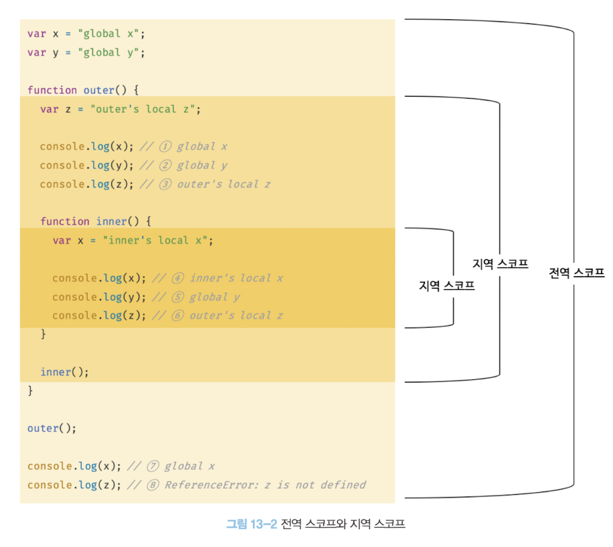
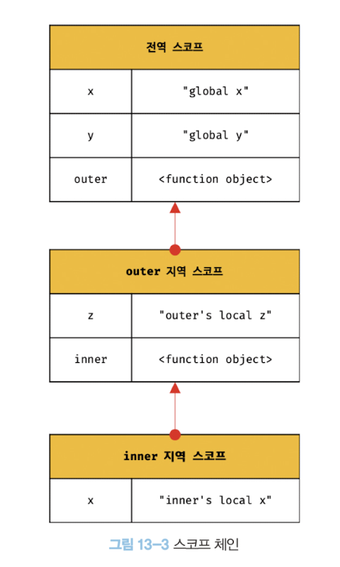

# 13장 스코프


## 스코프란?

스코프 scope (유효범위)

`var` 키워드로 선언한 변수와 `let`또는 `const`키워드로 선언한 변수의 스코프로 다르게 동작합니다. 스코프는 변수 그리고 함수와 깊은 관련이 있습니다.

```js
function add(x,y){
  //매개변수는 함수 몸체 내부에서만 참조할 수 있습니다.
  //즉, 매개변수의 스코프(유효변수)는 함수 몸체 내부입니다.
  console.log(x,y);  // 2 5
  return x+y;
}

add(2,5);

// 매개변수는 함수 몸체 내부에서만 참조할 수 있습니다.
console.log(x,y) //ReferenceError: x is not defined

```

함수의 매개변수는 몸체 내부에서만 참조할 수 있습니다. 

```js
var var1 = 1; // 코드의 가장 바깥 영역에서 선언한 변수

if(true){
  var var2 = 2; // 코드 블록 내에서 선언한 변수
  if(true) {
    var var3 = 3; // 중첩된 코드 블록 내에서 선언한 변수
  }
}

function foo() {
  var var4 = 4; // 함수 내에서 선언한 변수

  function bar() {
    var var5 = 5; // 중첩된 함수 내에서 선언한 변수
  }
}

console.log(var1) // 1
console.log(var2) // 2
console.log(var3) // 3
console.log(var4) // ReferenceError: var 4 is not defined
console.log(var5) // ReferenceError: var 5 is not defined
```

변수는 코드의 가장 바깥 영역뿐 아니라 코드 블록이나 함수 몸체 내에서도 선언 가능합니다.

모든 식별자 (변수 이름, 함수 이름, 클래스 이름 등)는 자신이 선언된 위치에 의해 다른 코드가 식별자 자신을 참조할 수 있는 유효 범위가 결정됩니다. 이를 스코프라고 합니다.

**즉, 스코프는 식별자가 유효한 범위를 말합니다.**

Q. 다음 예제는 어떻게 동작할까요?

```js
var x = 'global';

function foo() {
  var x = 'local';
  console.log(x); // 1번
}

foo();

console.log(x) // 2번
```

A. 


자바스크립트 엔진은 이름이 같은 두 개의 변수 중에서 어떤 변수를 참조해야 할 것인지를 결정해야합니다.
이를 **식별자 결정**이라고 합니다.

따라서, 스코프란 자바스크립트 엔진이 **식별자를 검색할 때 사용하는 규칙**이라고도 할 수 있습니다.

자바스크립트 엔진은 코드를 실행할 때 코드의 문맥을 고려합니다. 코드가 어디서 실행되며 주변에 어떤 코드가 있는지에 따라 위 예제의 1번과 2번처럼 동일한 코드도 다른 결과를 만들어 냅니다.

> 코드의 문맥과 환경
>
>
> 코드가 어디서 실행되며 주변에 어떤 코드가 있는지를 **렉시컬 환경**이라고 부릅니다.
>
> 즉 코드의 문맥은 렉시컬 환경으로 이루어집니다.
>
> 이를 구현한 것이 실행 컨텍스트이며, 모든 코드는 실행 컨텍스트에서 평가되고 실행됩니다.

예제 코드에서는, 코드 가장 바깥쪽 영역에 선언된 `x`변수는 어디서든 참조할 수 있습니다.
`foo` 함수 내부에 선언된 `x` 변수는 `foo` 함수 내부에서만 참조할 수 있습니다.

두 개의 `x` 변수는 식별자 이름이 동일하지만 자신이 유효한 범위, 즉 스코프가 다른 별개의 변수입니다.


스코프라는 개념이 없다면!, 같은 이름을 갖는 변수는 충돌을 일으키므로 프로그램 전체에서 하나밖에 사용할 수 없게 됩니다.

식별자는 어떤 값을 구별할 수 있어야 하기 때문에 유일해야 합니다. 즉, 하나의 값은 유일한 식별자에 연결되어야 합니다.

프로그래밍 언어에서는 스코프를 통해 식별자인 변수 이름의 충돌을 방지하여 같은 이름의 변수를 사용할 수 있게 합니다.

스코프 내에서 식별자는 유일해야 하지만 다른 스코프에는 같은 이름의 식별자를 사용할 수 있습니다.

> var 키워드로 선언한 변수의 중복 선언
>
> var 키워드로 선언된 변수는 같은 스코프 내에서 중복 선언이 허용됩니다. 이는 의도치 않게 변수값이 재할당되어 변경되는 부작용을 발생시킵니다.
>
>```js
>function foo() {
>  var x = 1;
>  // var 키워드로 선언된 변수는 같은 스코프 내에서 중복 선언을 허용한다.
>  // 아래 변수 선언문은 자바스크립트 엔진에 의해 var 키워드가 없는 것처럼 동작한다.
>  var x = 2;
>  console.log(x); // 2
>}
>
>foo();
>
>```
> 하지만 `let`이나 `const` 키워드로 선언된 변수는 같은 스코프 내에서 중복 선언을 허용하지 않습니다.
>
> ```js
>function bar() {
>  var x = 1;
>  // let이나 const 키워드로 선언된 변수는 같은 스코프 내에서 중복 선언을 허용하지 않습니다.
>  var x = 2; // SyntexError: Identifier 'x' has already been declared
>}
> bar();
>```

## 스코프의 종류

코드는 전역과 지역으로 구분할 수 있습니다.

|구분|설명|스코프|변수|
|---|---|---|---|
|전역|코드의 가장 바깥 영역|전역 스코프|전역 변수|
|지역|함수 몸체 내부|지역 스코프|지역 변수|

### 전역과 전역 스코프



전역이란 코드의 가장 바깥 영역을 말하며, 전역은 전역 스코프를 만듭니다.
전역에 변수를 선언하면 전역 스코프를 갖는 전역 변수가 됩니다.

**전역 변수는 어디서든지 참조할 수 있습니다.**

### 지역과 지역 스코프

지역이란 함수 몸체 내부를 말합니다. 지역은 지역 스코프를 만듭니다. 지역에 변수를 선언하면 지역 스코프를 같는 지역 변수가 됩니다.

**지역 변수는 자신의 지역 스코프와 하위 지역 스코프에서 유효합니다.**

위의 예제에서, `outer` 함수 내부에서 선언된 `z` 변수는 지역 변수 이므로, `outer`,`inner` 함수 내부에서 참조할 수 있지만, 전역에서 참조하면 에러가 발생합니다.

`inner` 함수 내부에 선언된 지역 변수 `x` 이외에, 전역 변수 `x`가 존재합니다.
이때 `inner` 함수 내부에서는 `x`를 참조하면 전역 변수가 아닌 지역 변수를 참조합니다.

이는 자바스크립트 엔진이 스코프 체인을 통해 참조할 변수를 검색했기 때문입니다.

## 스코프 체인

함수는 전역에서 선언할 수도 있습니다. 함수 몸체 내부에서도 선언할 수 있는데 이것을 '함수의 중첩' 이라고하고 이 함수를 '중첩 함수'라 칭합니다. 중첩 함수를 폼하는 하는 함수를 '외부 함수'라 칭합니다.

함수는 중첩될 수 있으므로 함수의 지역 스코프도 중첩될 수 있습니다.
**스코프가 함수의 중첩에 의해 계층적 구조를 가진다는 것을 의미합니다.**

중첩 함수의 지역 스코프는 중첩 함수를 포함하는 외부 함수의 지역 스코프와 계층적 구조를 갖습니다. 이때 외부 함수의 지역 스코프를 중첩 함수의 상위 스코프라 합니다.




- `inner` 함수 : `outer` 함수의 중첩 함수
- `outer` 함수의 지역 스코프 : `inner` 함수의 상위 스코프
- `outer` 함수의 상위 스코프 : 전역 스코프

모든 지역 스코프의 최상위 스코프는 전역 스코프입니다.

이렇게 **스코프가 계층적으로 연결된 것을 스코프 체인** 이라고 합니다.

**변수를 참조할 때 자바스크립트 엔진은 스코프 체인을 통해 변수를 참조하는 코드의 스코프에서 시작하여 상위 스코프 방향으로 이동하며 선언된 변수를 검색(indetifier resolution)합니다.**

스코프 체인은 물리적인 실체로 존재합니다. 자바스크립트 엔진은 코드를 실행하기에 앞서 위 그림과 유사한 자료구조인 **렉시컬 환경**을 실제로 생성합니다. 변수 선언이 실행되면 변수 식별자가 이 자료구조(렉시컬 환경)에 키(key)로 등록되고, 변수 할당이 일어나면 이 자료구조의 변수 식별자에 해당하는 값을 변경합니다. 변수 검색도 이 자료구조 상에서 이뤄집니다.

> 렉시컬 환경
>
> 스코프 체인은 실행 컨텍스트의 렉시컬 환경을 단방향으로 연결(chaining)한 것 입니다.
> 전역 렉시커 환경은 코드가 로드되면 곧바로 생성되고 함수의 렉시컬 환경은 함수가 호출되면 곧바로 생성됩니다.

### 스코프 체인에 의한 변수 검색


④, ⑤, ⑥ 을 보면, 자바스크립트 엔진이 스코프 체인을 통해 어떻게 변수를 찾아내는지 이해할 수 있습니다.

④ `x` 변수를 참조하는 코드의 스코프인 `inner` 함수의 지역 스코프에서 `x` 변수가 선언되었는지 검색 
-> 존재하므로, 검색된 변수를 참조하고 검색 종료 

⑤ `y` 변수를 참조하는 코드의 스코프인 `inner` 함수의 지역 스코프에서 검색 
-> 없음 
-> 상위 스코프 `outer` 에서 검색 
-> 없음 
-> 상위 스코프 전역 스코프에서 검색 
-> 존재, 검색된 변수를 참조하고 검색 종료

⑥ `z` 변수를 참조하는 코드의 스코프인 `inner` 함수의 지역 스코프에서 검색
-> 없음
-> 상위 스코프 `outer` 에서 검색
-> 존재, 검색한 변수를 참조하고 검색 종료

**상위 스코프에서 유효한 변수는 하위 스코프에서 자유롭게 참조할 수 있지만 하위 스코프에서 유효한 변수를 상위 스코프에서 참조할 수 없습니다.**

### 스코프 체인에 의한 함수 검색

```js
// 전역 변수
function foo() {
  console.log("global function foo")
}

function bar() {
  //중첩 함수
  function foo(){
    console.log('local function foo')
  }
  foo(); // ①
}

bar();

```


함수 선언문으로 함수를 정의하면 런타임 이전에 함수 객체가 먼저 생성됩니다. 그리고 자바스크립트 엔진은 함수 이름과 동일한 이름의 식별자를 암묵적으로 선언하고 생성된 함수 객체를 할당합니다.

모든 함수는 함수 이름과 동일한 이름의 식별자에 할당됩니다. ① 에서 `foo`함수를 호출하면 자바스크립트 엔진은 함수를 호출하기 위해 먼저 함수를 가리키는 식별자 `foo`를 검색합니다.

함수도 식별자에 할당되기 때문에 스코프를 갖습니다.

스코프를 **"식별자를 검색하는 규칙"** 이라고 표현하는 것이 적합합니다.

## 함수 레벨 스코프

**코드 블록이 아닌 함수에 의해서만 지역 스코프가 생성됩니다.**

C나 자바 등을 비롯한 대부분의 프로그래밍 언어는 함수 몸체만이 아니라 모든 코드 블록(`if`, `for`, `while` ..)이 지역 스코프를 만듭니다. 이러한 특성을 **블록 레벨 스코프**라 합니다.

하지만 **`var` 키워드로 선언된 변수는 오로지 함수의 코드 블록(함수 몸체)만을 지역 스코프로 인정합니다.**
이것을 **함수 레벨 스코프**라고 합니다.

```js
var x = 1;

if(true) {
  // var 키워드로 선언된 변수는 함수의 코드 블록(함수 몸체)만을 지역 스코프로 인정합니다.
  // 함수 밖에서 var 키워드로 선언된 변수는 코드 블록 내에서 선언되었다 할지라도 모두 전역 변수 입니다.
  // 따라서 x는 전역 변수 입니다. 이미 선언된 전역 변수 x가 있으므로 x 변수는 중복 선언됩니다.
  // 이는 의도치 않게 변수 값이 변경되는 부작용을 발생시킵니다.

  var x = 10;
}

console.log(x); // 10
```

```js
var i = 10;

for (var i=0;i<5;i++){
  console.log(i); // 0 1 2 3 4
}

// 의도치 않게 변수의 값이 변경되었습니다.
console.log(i); // 5
```

ES6에서 도입된 `let` ,`const` 키워드는 블록 레벨 스코프를 지원합니다.

## 렉시컬 스코프

```js
var x = 1;

function foo() {
  var x = 10;
  bar();
}

function bar(){
  console.log(x);
}

foo();
bar();
```

예제의 실행 결과는 `bar` 함수의 상위 스코프가 무엇인지에 따라 결정됩니다.

1. 함수를 어디서 호출했는지에 따라 함수의 상위 스코프를 결정합니다. (동적 스코프)
2. 함수를 어디서 정의했는지에 따라 함수의 상위 스코프를 결정합니다. (렉시컬 스코프 혹은 정적 스코프)

1번 방식이라면, `bar` 함수의 상위 스코프는 `foo` 함수의 지역 스코프와 전역 스코프일 것 입니다.
2번 방식이라면, `bar` 함수의 상위 스코프는 전역 스코프 일 것 입니다.

프로그래밍 언어는 일반적으로 이 두가지 방식 중 한 가지 방식으로 함수의 상위 스코프를 결정합니다.

**자바스크립트를** 비롯한 대부분의 프로그래밍 언어는 **렉시컬 스코프**를 따릅니다.

따라서, **자바스크립트는 함수를 어디서 호출했느냐가 아닌 어디서 정의했는지에 따라 상위 스코프를 결정**합니다. 함수가 호출된 위치는 상위 스코프 결정에 어떠한 영향도 미치지 않습니다. 즉, 함수의 상위 스코프는 언제나 자신이 정의된 스코프입니다.

이처럼 함수의 상위 스코프는 함수 정의가 실행될 때 정적으로 결정됩니다. 함수 정의(함수 선언문 또는 함수 표현식)가 실행되어 생성된 함수 객체는 이렇게 결정된 상위 스코프를 기억합니다. 함수가 호출될 때마다 함수의 상위 스코프를 참조할 필요가 있기 때문입니다.

예제의 경우도, `bar` 함수는 전역 코드가 실행되기 전에 먼저 평가되어 함수 객체를 생성합니다. 이떄 생성된 `bar` 함수 객체는 자신이 정의된 스코프, 전역 스코프를 기억합니다. 그리고 `bar` 함수가 호출되면 호출된 곳이 어디인지 관계없이 언제나 자신이 기억하고 있는 전역 스코프를 상위 스코프로 사용합니다.

