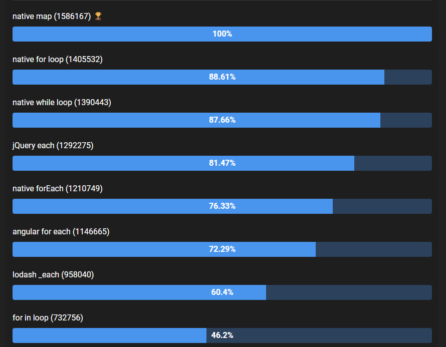

## 8장 제어문

---

Control flow statement는 조건에 따라 코드 블록을 실행하거나 반복 실행할 때 사용한다.

제어문을 사용하면 순차적인 코드 실행 흐름을 인위적으로 제어할 수 있다. 하지만 이는 순차적으로 진행하는 직관적인 코드의 흐름을 혼란스럽게 한다.

제어문을 바르게 이해해야 코딩 스킬을 향상시킬 수 있다.

참고: https://yong-nyong.tistory.com/9

### [다양한 반복문]

자바스크립트 for문의 종류는 다양하다. 각 for문마다 장점이 있고 성능의 차이도 있기 때문에 정리해보자.



https://jsben.ch/giRjy

### 1. for문

가장 기본이 되는 for문

```jsx
for ([initialization]; [condition]; [final - expression]) statement;
```

- initialization에서 초기문이 존재한다면 실행된다.
- condition: 조건을 검사해서 만족된다면 반복문은 계속되고 아니라면 종료된다.
- final-expression: 초기문에서 작성한 카운터가 for문이 반복될 때마다 증감한다.

**특징**

- 가장 빠르다.
- 모든 자료형에 이용할 수 있다.
- continue, break 사용이 가능하다.
- 변수 활용이 가능하다.

### 2. for …in

객체에 접근해 객체의 열거 가능한 속성에 대해 반복한다.

객체에 접근하기 때문에 for 반복문들 중 성능 측면에서 제일 속도가 느리다.

```jsx
const object = { a: 1, b: 2, c: 3 };

for (const property in object) {
  console.log(`${property}: ${object[property]}`);
}
```

배열의 반복을 위해서는 추천되지 않는다. 쉽게 객체의 속성을 확인할 수 있어 디버깅에 사용될 수 있다. 배열이 데이터 저장에 있어서 더 실용적이나, 키-값 쌍이 선호되는 데이터는 특정 값을 가진 key를 확인하기 때문에 for… in 을 사용할 수 있다.

**특징**

- 간결하다.
- 객체에 쉽게 접근할 수 있다.
- continue, break 가능하다.

### 3. for…of

ES6에 추가된 새로운 반복문으로 반복 가능한 객체 (Array, Map, Set, String, TypedArray, arguments 객체 등을 포함)에 대해 반복하고 각 개별 속성값에 대해 실행

```jsx
const str = 'hello';

for (let s of str) {
  console.log(s);
}
```

**특징**

- 반복 가능한 객체에 대해 간결하게 반복문을 쓸 수 있다.
- 성능도 준수한편이다.
- continue, break 사용 가능하다

문자열 비교시 자주 활용한다.

### 4. forEach

ES5 문법으로 주어진 함수를 배열 요소 각각에 대해 실행한다.

```jsx
const array = [1, 2, 3, 4, 5];

array.forEach((arr) => console.log(arr));
//출력결과: 1, 2, 3, 4, 5
```

**특징**

- 코드가 한눈에 보기 쉽고 간결하다
- 성능측면에 매우 준수하다.
- 여러 기본 매개변수를 통해 활용도가 높다.
- **continue, break가 불가능하다.**

### for ..of와 for ..in의 차이

```jsx
Object.prototype.objCustom = function () {
  console.log('objCustom');
};
Array.prototype.arrCustom = function () {
  console.log('arrCustom');
};

//모든 객체의 프로토타입인 Object.prototype에 objCustom 함수를 추가하고,
//배열의 프로토타입을 arrCustom 함수를 추가한다.
// 모든 객체와 배열은 이제 objCustom고 arrCustom을 상속받는다.

let iterable = [3, 5, 7];
iterable.foo = 'hello'; //iterable=[3,5,7,foo:"hello"]

for (let i in iterable) {
  console.log(i); // logs 0, 1, 2, "foo", "arrCustom", "objCustom"
}

for (let i of iterable) {
  console.log(i); // logs 3, 5, 7
}
```

`**for in**`의 경우 iterable을 순회하면, 배열의 인덱스(0,1,2), 추가한 foo 프로퍼티, 그리고 배열과 객체의 프로토타입 체인을 통해 상속받은 arrCustom과 objCustom메소드가 열거된다.

for in 루프는 배열의 요소뿐만 아니라, 해당 객체의 모든 열거 가능한 속성을 순회한다.

여기서는 배열의 인덱스, 직접 추가한 속성, 그리고 프로토타입 체인을 통해 상속받은 메소드(arrCustom, objCustom)이 해당된다.

\*객체 내부의 객체까지 깊게 순회하지는 않는다. 객체의 최상위 레벨 속성만 열거.

반면 `**for of**` 루프는 배열의 요소 값만 순회하고 출력한다.

반복 가능한 객체의 값에 집중하여 순회하기 때문에, 프로퍼티나 상속받은 메소드는 무시하고 요소 값만을 대상으로 한다.

⇒ for in은 객체의 모든 열거 가능한 속성에 대해 반복하고 for of는 반복 가능한 객체의 요소 값만 순회한다. for in은 예상치 못한 결과를 초래할 수도 있기 때문에 배열을 순회할 때는 주로 for, for of또는 forEach, map을 사용하는게 권장된다.

```jsx
const arr = [1, 2, 3, 4];

for (const i in arr) {
  console.log(i);
}
//0 1 2 3 (index)
for (const i of arr) {
  console.log(i);
}
//1 2 3 4
```

- 배열도 객체의 한 형태로 배열의 인덱스를 순회하게 된다.
