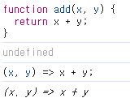
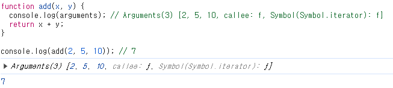
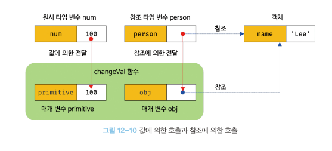

# 함수란?
입력 값을 받은 뒤 출력 값을 반환하는데, 입력으로 전달 받는 변수를 `매개 변수`, 함수 호출 시 입력하는 값을 `인수`,  함수 내부에서 처리하고 나온 출력 값을 `반환 값`이라고 한다.

함수 또한 여러 개 존재할 수 있어서 특정 함수를 구별하기 위해 식별자를 함수의 이름으로 사용할 수 있다.

```js
// 함수 정의
function add(x, y) {
  return x + y;
}

// 함수 호출
var result = add(2, 5);

console.log(result); // 7
```

## 함수를 왜 사용하는가?
함수는 필요할 때 여러 번 호출할 수 있다는 특징이 있다.

- 하나의 함수로 동일한 작업에서 사용하여 코드의 재사용성
- 하나의 코드에서 수정함으로써 여러 곳에서 수정할 필요없는 유지보수 편의성
- 적절한 함수의 이름으로 코드의 가독성

이와 같은 이유로 함수를 사용하고, 함수는 객체지만 일반 객체와 다르다.

일반 객체는 호출할 수 없지만 함수는 호출할 수 있고, 함수는 다른 함수의 인수로 전달할 수 있는 `일급 객체`이다.


## 함수 정의
함수를 정의하는 방법에는 4가지가 있다.
```js
// 함수 선언문
function add(x, y) {
  return x + y;
}

// 함수 표현식
var add = function (x, y) {
  return x + y;
};

// Function 생성자 함수
var add = new Function('x', 'y', 'return x + y');

// 화살표 함수(ES6)
var add = (x, y) => x + y;
```
### 함수 선언문
함수 선언문은 함수 이름을 생략할 수 없다.

또한 함수 선언문은 표현식이 아닌 문이다.



크롬 콘솔에서 함수 선언문을 실행하면 undefined가 출력되고, 표현식인 문인 화살표 함수는 함수가 출력되는 것을 볼 수 있다.

```js
function foo() { console.log('foo'); }

foo(); // foo

(function bar() { console.log('bar'); });

bar(); // ReferenceError: bar is not defined
```

### 함수 표현식
자바스크립트의 함수는 값처럼 변수에 할당 할 수도, 프로퍼티 값이 될 수도, 배열의 요소가 될 수도 있다.

이러한 성질을 갖는 객체를 일급 객체라 하며, 함수 리터럴로 생성한 함수 객체를 변수에 할당하는 방식을 함수 표현식이라 한다.

함수 표현식은 함수 이름을 생략할 수 있다.
```js
// 익명 함수 표현식
var add = function (x, y) {
  return x + y;
}

// 기명 함수 표현식
var add = function foo (x, y) {
  return x + y;
}

console.log(add(2,5)); // 7

console.log(foo(2,5)); // ReferenceError: foo is not defined
```

### 함수 호이스팅
```js
// 함수 참조
console.dir(add); // f add(x, y)
console.dir(sub); // undefined

// 함수 호출
console.log(add(2, 5)); // 7
console.log(sub(2, 5)); // TypeError: sub is not a function

// 함수 선언문
function add(x, y) {
  return x + y;
};

// 함수 표현식
var sub = function (x, y) {
  return x - y;
}
```
위 예제를 보면 함수 선언문은 이전에 호출이 가능하지만, 함수 표현식은 이전에 호출할 수 없다.

그 이유는 각각의 함수 생성 시점이 다르기 때문이다.

모든 선언문은 런타임 이전에 자바스크립트 엔진에 의해 먼저 실행이 되면서 함수 이름과 동일한 이름의 식별자를 암묵적으로 생성하고 생성된 함수 객체를 할당하게 된다.

따라서 함수 선언문은 이전에 함수를 참조 및 호출할 수 있으며 이처럼 함수 선언문이 코드의 상단에 끌어 올려진 것처럼 동작하는 것을 `함수 호이스팅`이라고 한다.

함수 표현식은 var 키워드로 선언했기 때문에 undefined로 초기화 되고, 아직 함수 객체가 할당되지 않았기 때문에 함수 호출에서는 타입 에러가 발생하는 것이다.

즉 함수 표현식으로 함수를 정의하면 함수 호이스팅이 발생하는 것이 아니라 변수 호이스팅이 발생하게 되며, 이로 인해 함수 선언문 대신 함수 표현식을 사용할 것을 권장한다.

### Function 생성자 함수
Function 생성자 함수에 매개 변수 목록과 함수 몸체를 문자열로 전달하면서 new 연산자와 함께 호출하면 함수 객체가 생성된다.

new 연산자 없이 호출해도 결과는 동일하게 동작한다.

```js
var add = new Function('x', 'y', 'return x + y');

console.log(add(2, 5)); // 7
```

Function 생성자 함수는 클로저를 생성하지 않는 등 함수 선언문이나 표현식과 다르게 동작한다.

### 화살표 함수
ES6에서 도입된 함수로 `function` 키워드 대신 화살표 `=>`를 사용해 좀 더 간략한 방법으로 함수를 선언할 수 있고, 항상 익명 함수로 정의한다.
```js
const add = (x, y) => x + y;
console.log(add(2, 5)); // 7
```
화살표 함수는 생성자 함수로 사용할 수 없고, 기존 함수와 this 바인딩 방식이 다르며, prototype 프로퍼티가 없고, arguments 객체를 생성하지 않는 점이 특징이다.

## 함수 호출
함수를 호출할 때 함수는 매개변수의 개수와 인수의 개수가 일치하는지 체크하지 않는다.

따라서 일치하지 않아도 에러가 발생하지 않고, 인수가 부족해서 매개변수에 인수가 할당되지 않으면 해당 값은 undefined다.

```js
function add(x, y) {
  return x + y;
}

console.log(add(2)); // 2 + undfined가 되므로 NaN이 반환된다.
console.log(add('a', 'b')); // 'ab'
```

또한 자바스크립트는 동적 타입 언어로써 매개변수의 타입을 사전에 지정할 수 없다.

따라서 적절한 인수가 전달되었는지 확인하는 법은 다음과 같다.

```js
function add(x, y) {
  if (typeof x !== 'number' || typeof y !== 'number') {
    // 매개변수를 통해 전달된 인수의 타입이 부적절한 경우 에러를 발생
    throw new TypeError('인수는 모두 숫자 값이어야 한다.');
  }
  return x + y;
}

console.log(add(2)); // TypeError: 인수는 모두 숫자 값이어야 한다.
console.log(add('a', 'b')); // TypeError: 인수는 모두 숫자 값이어야 한다.
```

이처럼 함수 내부에서 적절한 인수가 전달되었는지 확인하지만 부적절한 호출을 사전에 방지할 수 없고, 에러는 런타임에서 발생하게 된다. 따라서 타입스크립트를 사용하면 컴파일 시점에서 부적절한 호출을 방지할 수 있다.

만약 매개변수보다 인수가 더 많은 경우 초과된 인수는 암묵적으로 arguments 객체의 프로퍼티로 보관된다.

```js
function add(x, y) {
  console.log(arguments); // Arguments(3) [2, 5, 10, callee: f, Symbol(Symbol.iterator): f]
  return x + y;
}

console.log(add(2, 5, 10)); // 7
```



arguments 객체는 매개 변수 개수를 확정할 수 없는 가변 인자 함수를 구현할 때 유용하게 사용할 수 있다.

```js
function add(x, y, z) {
  x = x || 0;
  y = y || 0;
  z = z || 0;
  return x + y + z;
}

// ES6에서 도입된 매개변수 기본값 지정
function add(x = 0, y = 0, z = 0) {
  return x + y + z;
}

console.log(add(1, 2, 3)); // 6
console.log(add(1, 2)); // 3
console.log(add(1)); // 1
console.log(add()); // 0
```
이렇게 사용하면 인수 체크 및 초기화를 시킬 수 있다.

## 참조에 의한 전달과 외부 상태의 변경
매개변수도 함수 몸체 내부에서 변수와 동일하게 취급되므로 매개변수 또한 타입에 따른 전달 방식을 그대로 따른다.

> 원시 값(primitive)은 값에 의한 전달(pass by value)
> 객체 값(object)은 참조에 의한 전달(pass by reference)

```js
// 매개변수 primitive는 원시 값, obj는 객체를 전달 받음
function changeVal(primitive, obj) {
  primitive += 100;
  obj.name = 'kim';
}

// 외부 상태
let num = 100;
let person = { name: 'lee' };

console.log(num); // 100
console.log(person); // {name: 'lee'}

// 원시 값은 값 자체가 복사되어 전달되고 객체는 참조 값이 복사되어 전달된다.
// 원시 값은 재할당이 이뤄지고 객체는 변경 가능한 값이므로 직접 변경
changeVal(num, person);

// 원시 값은 원본이 훼손되지 않는다.
console.log(num); // 100

// 객체는 원본이 훼손된다. 부수 효과 발생
console.log(person); // {name: 'kim'}
```

원시 타입 인수는 값 자체가 복사되어 매개변수에 전달되기 때문에 함수 내부에서 매개변수 값을 변경해도 원본은 훼손되지 않는다. (부수 효과 발생하지 않음)

하지만 객체 타입의 인수는 참조 값이 복사되어 매개변수에 전달되기 때문에 함수 내부에서 참조 값을 변경할 경우 원본이 훼손된다. (부수 효과 발생함)



이처럼 함수에 객체를 전달하고 함수 내부에서 객체 값이 변경되면 상태 변화를 추적하기 어렵고, 코드의 복잡성이 높아지고 버그가 일어날 수 있다.

이를 해결하기 위해서는 객체를 불변 객체로 만들어 사용해야 하는데, 불변 객체로 만들기 위해서는 깊은 복사를 통해 새로운 객체를 생성하고 재할당을 통해 교체해야 한다.

> 이처럼 외부 상태를 변경하지 외부 상태에 의존하지 않는 함수를 순수 함수라고 한다.

## 다양한 함수 형태

### 즉시 실행 함수(IIFE, Immediately Invoked Function Expression)
함수 정의와 동시에 즉시 호출하는 함수를 즉시 실행 함수라고 하며, 단 한번만 호출되고 다시 호출할 수 없다.

```js
// 익명 즉시 실행 함수
(function() {
   var a = 3;
   var b = 5;
   return a * b;
}());

// 기명 즉시 실행 함수
(function foo() {
   var a = 3;
   var b = 5;
   return a * b;
}());

foo(); // ReferenceError: foo is not defined

function() { // SyntaxError: Function statements require a function name
   var a = 3;
   var b = 5;
   return a * b;
}();

function foo () { 
   var a = 3;
   var b = 5;
   return a * b;
}(); // SyntaxError: Unexpected token ')' 
// function foo() {}(); => function foo() {};();
```
이처럼 즉시 실행 함수는 반드시 `그룹 연산자 (...)`로 감싸야 한다.

함수 선언문은 함수 이름을 생략할 수 없고, 함수 선언문이 끝나는 위치(중괄호 뒤에) 세미콜론이 암묵적으로 추가되기 때문에 위와 같은 에러가 발생하게 된다.

즉 그룹 연산자로 함수를 묶는 이유는 함수 리터럴을 평가해서 함수 객체를 생성하기 위해서다.

### 재귀 함수
함수가 자기 자신을 호출하는 것을 재귀 호출이라고 한다.

재귀 함수는 자기 자신을 호출하는 함수를 말하며 주로 반복되는 처리를 위해 사용한다.

```js
// 일반적인 반복 함수
function coundown(n) {
    for (var i=n; i>0; i--) console.log(i);
}

// 재귀 함수
function  countdownRecursive(n) {
    if (n==0) return
    console.log(n)
    countdownRecursive(n-1)
}
```
재귀 함수는 무한 호출이 될 수 있으므로 반드시 종료 조건을 넣어줘야한다. 

재귀함수에 return문이 없었다면, -무한대까지 계속 반복하다가 스택오버플로 에러가 발생한다. 

이런 점에서 코드를 직관적이고 간결하게 짤 수 있을 때만 잘 선택해서 사용해야한다.

### 중첩 함수
함수 내부에 정의된 함수를 중첩 함수 또는 내부 함수라 한다.

중첩 함수를 포함하는 함수를 외부 함수라 부르며, 중첩 함수는 외부 함수 내에서만 호출할 수 있다.

```js
function outer() {
  var x = 1;

  // 중첩 함수
  function inner() {
    var y = 2;
    // 외부 함수의 변수를 참조할 수 있다.
    console.log(x + y); // 3
  }

  inner();
}

outer();
```

### 콜백 함수
함수의 매개변수를 통해 다른 함수의 내부로 전달되는 함수를 콜백 함수라고하며, 매개변수를 통해 함수의 외부에서 콜백 함수를 전달받은 함수를 고차 함수라고한다.

고차 함수는 콜백 함수를 자신의 일부분으로 합성하며 고차 함수는 매개변수를 통해 전달받은 콜백 함수의 호출 시점을 결정해서 호출한다.

콜백 함수는 고차 함수에 의해 호출되며 이때 고차 함수는 필요에 따라 함수에 인수를 전달할 수 있다.

```js
// 외부에서 전달받은 f를 n만큼 반복 호출한다
function repeat(n, f) {
  for (var i = 0; i < n; i++) {
    f(i); // i를 전달하면서 f를 호출
  }
}

var logAll = function (i) {
  console.log(i);
};

// 반복 호출할 함수를 인수로 전달한다.
repeat(5, logAll); // 0 1 2 3 4

var logOdds = function (i) {
  if (i % 2) console.log(i);
};

// 반복 호출할 함수를 인수로 전달한다.
repeat(5, logOdds); // 1 3
```

콜백 함수는 함수형 프로그래밍 패러다임뿐만 아니라 비동기 처리(이벤트 처리, Ajax 통신, 타이머 함수 등)에 활용되는 중요한 패턴이다.
```js
//콜백 함수를 사용한 이벤트 처리
//myButton 버튼을 클릭하면 콜백 함수 실행
document.getElementbyId('myButton').addEventListener('click', function () {
	console.log('button clicked!');
});

// 콜백 함수를 사용한 비동기 처리
// 1초 후에 메시지 출력
setTimeout(function () {
	console.log('1초 경과');
});
```

## 순수 함수와 비순수 함수
### 순수 함수
함수형 프로그래밍에서 어떤 외부 상태에 의존하지도 않고 변경하지도 않는, 즉 부수 효과가 없는 함수다.
```js
var count = 0; // 현재 카운트를 나타내는 상태

// 순수 함수 increase는 동일한 인수가 전달되면 언제나 동일한 값을 반환한다.
function increase(n) {
  return ++n;
}

// 순수 함수가 반환한 결과값을 변수에 재할당해서 상태를 변경
count = increase(count);
console.log(count) // 1

count = increase(count);
console.log(count) // 2
```
### 비순수 함수
외부상태에 의존하거나 외부 상태를 변경하는, 즉 부수 효과가 있는 함수다.
```js
var count = 0; // 현재 카운트를 나타내는 상태: increase 함수에 의해 변화한다.

// 비순수 함수
function increase() {
  return ++count; // 외부 상태에 의존하며 외부 상태를 변경한다.
}

// 비순수 함수는 외부 상태(count)를 변경하므로 상태 변화를 추적하기 어려워진다.
increase();
console.log(count) // 1

increase();
console.log(count) // 2
```

> **함수형 프로그래밍**
>
>함수형 프로그래밍은 순수 함수와 보조 함수의 조합을 통해 외부 상태를 변경하는 부수 효과를 최소화해서 불변성을 지향하는 프로그래밍 패러다임이다.
자바스크립트는 멀티 패러다임 언어이므로 객체지향 프로그래밍뿐만 아니라 함수형 프로그래밍을 적극적으로 활용하고 있다.