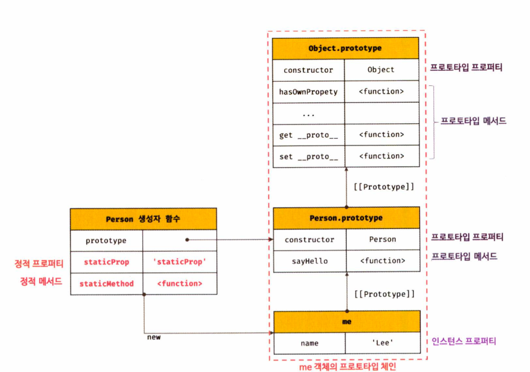

## 11 직접 상속
### 11.1 Object.create에 의한 직접 상속
`Object.create` 메서드는 명시적으로 프로토타입을 지정하여 새로운 객체를 생성한다.
다른 객체 생성 방식과 마찬가지로 추상 연산 `OrdinaryObjectCreate`를 호출한다.

`Object.create` 메서드로 객체를 생성할 때 장점은 다음과 같다.
- new 연산자 없이도 객체 생성 가능
- 프로토타입을 지정하면서 객체 생성 가능
- 객체 리터럴에 의해 생성된 객체도 상속 가능

```js
// 프로토타입이 null인 객체를 생성한다. 생성된 객체는 프로토타입 체인의 종점에 위치한다.
// obj → null
let obj = Object.create(null);
console.log(Object.getPrototypeOf(obj) === null); // true
// Object.prototype을 상속받지 못한다.
console.log(obj.toString()); // TypeError: obj.toString is not a function

// obj → Object.prototype → null
// obj = {};와 동일하다.
obj = Object.create(Object.prototype);
console.log(Object.getPrototypeOf(obj) === Object.prototype); // true

// obj → Object.prototype → null
// obj = { x: 1 };와 동일하다.
obj = Object.create(Object.prototype, {
  x: { value: 1, writable: true, enumerable: true, configurable: true }
});
// 위 코드는 다음과 동일하다.
// obj = Object.create(Object.prototype);
// obj.x = 1;
console.log(obj.x); // 1
console.log(Object.getPrototypeOf(obj) === Object.prototype); // true

const myProto = { x: 10 };
// 임의의 객체를 직접 상속받는다.
// obj → myProto → Object.prototype → null
obj = Object.create(myProto);
console.log(obj.x); // 10
console.log(Object.getPrototypeOf(obj) === myProto); // true

// 생성자 함수
function Person(name) {
  this.name = name;
}

// obj → Person.prototype → Object.prototype → null
// obj = new Person('Lee')와 동일하다.
obj = Object.create(Person.prototype);
obj.name = 'Lee';
console.log(obj.name); // Lee
console.log(Object.getPrototypeOf(obj) === Person.prototype); // true
```

`Object.prototype`의 빌트인 메서드를 객체가 직접 호출하는 것을 권장하지 않는다.

그 이유는 `Object.create` 메서드를 통해 프로토타입 체인의 종점에 위치하는 객체를 생성할 수 있기 때문이다. (`Object.craete(null)`로 생성하는 경우)

따라서 `Object.prototype.hasOwnProperty.call()` 메서드를 활용해 간접적으로 호출할 수 있다.

```js
// 프로토타입이 null인 객체를 생성한다.
const obj = Object.create(null);
obj.a = 1;

// console.log(obj.hasOwnProperty('a'));
// TypeError: obj.hasOwnProperty is not a function

// Object.prototype의 빌트인 메서드는 객체로 직접 호출하지 않는다.
console.log(Object.prototype.hasOwnProperty.call(obj, 'a')); // true
```

### 11.2 객체 리터럴 내부에서 __proto__에 의한 직접 상속

ES6에서는 객체 리터럴 내부에서 `__proto__` 접근자 프로퍼티를 사용하여 직접 상속을 구현할 수 있다.
```js
const myProto = { x: 10 };

// 객체 리터럴에 의해 객체를 생성하면서 프로토타입을 지정하여 직접 상속받을 수 있다.
const obj = {
  y: 20,
  // 객체를 직접 상속받는다.
  // obj → myProto → Object.prototype → null
  __proto__: myProto
};
/* 위 코드는 아래와 동일하다.
const obj = Object.create(myProto, {
  y: { value: 20, writable: true, enumerable: true, configurable: true }
});
*/

console.log(obj.x, obj.y); // 10 20
console.log(Object.getPrototypeOf(obj) === myProto); // true
```

## 12. 정적 프로퍼티 / 메서드
정적(static) 프로퍼티/메서드는 생성자 함수로 인스턴스를 생성하지 않아도 참조/호출할 수 있는 프로퍼티/메서드를 말한다.

```js
// 생성자 함수
function Person(name) {
  this.name = name;
}

// 프로토타입 메서드
Person.prototype.sayHello = function () {
  console.log(`Hi! My name is ${this.name}`);
};

// 정적 프로퍼티
Person.staticProp = 'static prop';

// 정적 메서드
Person.staticMethod = function () {
  console.log('staticMethod');
};

const me = new Person('Lee');

// 생성자 함수에 추가한 정적 프로퍼티/메서드는 생성자 함수로 참조/호출한다.
Person.staticMethod(); // staticMethod

// 정적 프로퍼티/메서드는 생성자 함수가 생성한 인스턴스로 참조/호출할 수 없다.
// 인스턴스로 참조/호출할 수 있는 프로퍼티/메서드는 프로토타입 체인 상에 존재해야 한다.
me.staticMethod(); // TypeError: me.staticMethod is not a function
```



이 그림을 통해서 위에서 말한 `Object.create` 메서드는 Object 생성자 함수의 정적 메서드고, `Object.prototype.hasOwnProperty` 메서드는 Object.prototype의 프로토타입 메서드다.

```js
function Foo() {}

// 프로토타입 메서드
// this를 참조하지 않는 프로토타입 메소드는 정적 메서드로 변경해도 동일한 효과를 얻을 수 있다.
Foo.prototype.x = function () {
  console.log('x');
};

const foo = new Foo();
// 프로토타입 메서드를 호출하려면 인스턴스를 생성해야 한다.
foo.x(); // x

// 정적 메서드
Foo.x = function () {
  console.log('x');
};

// 정적 메서드는 인스턴스를 생성하지 않아도 호출할 수 있다.
Foo.x(); // x
```

프로토타입 메서드 내에서 this를 사용하지 않는다면 정적 메서드로 변경할 수 있다.

그 이유는 프로토타입 메서드를 호출하려면 인스턴스를 생성해야 하지만, 정적 메서드는 인스턴스를 생성하지 않아도 호출이 가능하기 때문이다.

## 13. 프로퍼티 존재 확인
### in 연산자
`in` 연산자는 객체 내에 특정 프로퍼티가 존재하는지 여부를 확인할 수 있다.

```js
/**
 * key: 프로퍼티 키를 나타내는 문자열
 * object: 객체로 평가되는 표현식
 */
key in object

const person = {
  name: 'Lee',
  address: 'Seoul'
};

// person 객체에 name 프로퍼티가 존재한다.
console.log('name' in person);    // true
// person 객체에 address 프로퍼티가 존재한다.
console.log('address' in person); // true
// person 객체에 age 프로퍼티가 존재하지 않는다.
console.log('age' in person);     // false

// in대신 ES6에서 도입된 Reflect.has메서드도 사용할 수 있다. in과 동일하게 동작한다.
const person = { name: 'Lee' };

console.log(Reflect.has(person, 'name'));     // true
console.log(Reflect.has(person, 'toString')); // true
```
`in` 연산자는 확인 대상 객체의 프로퍼티뿐만 아니라 객체가 상속받은 모든 프로토타입의 프로퍼티를 확인하므로 주의해야한다.

person 객체에는 toString 이라는 프로퍼티가 없지만 `console.log('toString' in person);` 코드 실행하면 true가 나온다.

그 이유는 person 객체는 Object를 상속 받기 때문에 Object.prototype.toString을 확인했기 때문이다.

### Object.prototype.hasOwnProperty 메서드
`Object.prototype.hasOwnProperty` 메서드를 사용해도 객체에 특정 프로퍼티가 존재하는지 확인할 수 있다.

```js
console.log(person.hasOwnProperty('name')); // true
console.log(person.hasOwnProperty('age'));  // false
console.log(person.hasOwnProperty('toString')); // false
```
객체의 고유 프로퍼티인 경우에만 true를 반환하고 상속 받은 경우 false를 반환한다.

## 14. 프로퍼티 열거
### 14.1 for ... in 문
객체의 모든 프로퍼티를 순회하며 열거하려면 for ... in 문을 사용해야 한다.

`for (변수 선언문 in 객체) {...}`와 같이 사용하고

특징은 다음과 같다.

- 프로퍼티 키를 순회한다.
- 프로토타입 체인을 모두 순회한다.
- `[[Enumerable]]` 값을 참조한다.
- 심벌을 열거하지 않는다.
- 순서를 보장하지 않는다. (하지만 모던 브라우저는 순서를 보장한다)

```js
const age = Symbol();

const person = {
  name: 'Lee',
  address: 'Seoul',
  [age]: 10
};

// for...in 문의 변수 prop에 person 객체의 프로퍼티 키가 할당된다.
for (const key in person) {
  console.log(key + ': ' + person[key]);
}
// name: Lee
// address: Seoul
```
해당 객체의 프로토타입 체인 상에 존재하는 모든 프로퍼티 중에서 `[[Enumerable]]` 값이 true인 프로퍼티만 열거한다.

```js
Object.getOwnPropertyDescriptor(Object.prototype, "toString")
// {writable: true, enumerable: false, configurable: true, value: ƒ}
```

`toString`과 같은 경우 `[[Enumerable]]` 값이 false이기 때문에 for ... in 문에서 열거되지 않는다.

또한 프로퍼티가 심벌인 경우에도 열거하지 않는다.

배열에서는 for ... in 문보다는 일반적인 for문이나 for ... of 문 또는 forEach 메서드를 사용하는 것을 권장한다.

사실 배열도 객체이기 때문에 for ... in 문에서 프로퍼티 값을 출력할 수 있다.

### 14.2 Object.keys / values / entries 메서드
for ... in 문은 자신의 고유 프로퍼티 뿐만 아니라 상속받은 프로퍼티도 열거한다.

만약 고유 프로퍼티만 열거하기 위해서는 `Object.keys`, `Object.values`, `Object.entries` 메서드 사용하는 것을 권장한다.

`Object.keys` 메서드는 자신의 열거가능한(`Enumerable`) 프로퍼티 키를 배열로 반환한다.
```js
const person = {
  name: 'Lee',
  address: 'Seoul',
  __proto__: { age: 20 }
};

console.log(Object.keys(person)); // ["name", "address"]
```

`Object.values` 메서드는 ES8에서 도입되었고, 객체 자신의 열거 가능한 프로퍼티 값을 배열로 반환한다.
```js
console.log(Object.values(person)); // ["Lee", "Seoul"]
```

`Object.entries` 메서드도 ES8에서 도입되었고, 객체 자신의 열거 가능한 프로퍼티 키와 값의 쌍의 배열을 배열에 담아 반환한다.
```js
console.log(Object.entries(person)); // [["name", "Lee"], ["address", "Seoul"]]

Object.entries(person).forEach(([key, value]) => console.log(key, value));
/*
name Lee
address Seoul
*/
```

환경과 상황에 맞게 각 메서드들을 사용하면 좋을 것 같다.

### Q1 다음 코드의 결과는?
```js
function Study(name) {
  this.name = name;
}
Study.prototype.getStudyName = function () {
  console.log(`Study is ${this.name}`);
}

Study.title = 'javascript';
Study.getTitle = function () {
  console.log(this.title)
}
const jsStudy = new Study('react');
Study.getTitle(); // -> ?
jsStudy.getTitle();  // -> ?
```

### Q2 Object.prototype의 빌트인 메서드를 객체가 직접 호출하는 것을 권장하지 않는 이유?
