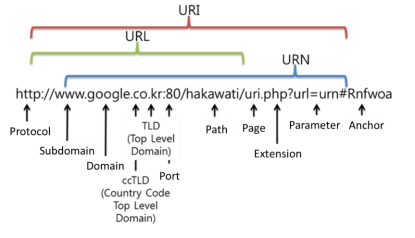

# 빌트인 객체

## 자바스크립트 객체의 분류

- 표준 빌트인 객체
- 호스트 객체
- 사용자 정의 객체

### 표준 빌트인 객체

- ECMAScript 사양에 정의된 객체를 말하며 JS 실행 환경과 관계없이 언제나 사용가능하다.

- 전역 객체의 프로퍼티로서 제공된다 따라서 별도의 선언 없이 전역 변수처럼 참조가능하다.

- Object, String, Number, Boolean, Symbol, Date, Math, RegExp, Array, Map/Set, WeakMap/WeakSet, Function, Promise, Reflect, Proxy, JSON, Error 등의 40여개의 표준 빌트인 객체를 제공한다.

- Math, Reflect, Proxy, JSON, Error 를 제외한 모든 표준 빌트인 객체는 인스턴스를 생성할 수 있는 생성자 함수 객체이다.

#### Proxy, Reflect, WeakMap/WeakSet ??

- Proxy

  특정 객체를 감싸 프로퍼티 읽기, 쓰기와 같은 객체에 가해지는 작업을 중간에서 가로채는 객체 
  
  (JS 객체 대상 인터셉터 혹은 미들웨어)
  
  [모던 JavaScript 튜토리얼의 Proxy docs](https://ko.javascript.info/proxy)

- Reflect

  proxy를 더 쉽게 사용하는 방법

  (promise와 async/await)

  [MDN의 Reflect docs](https://developer.mozilla.org/ko/docs/Web/JavaScript/Reference/Global_Objects/Reflect)


- WeakMap/WeakSet

  객체만을 키로 가지거나(WeakMap) 객체만 값으로 가지는(WeakSet) 특성을 가진 가비지 콜렉팅 대상이 되는 자료구조

  [모던 JavaScript 튜토리얼의 WeakMap/WeakSet docs](https://ko.javascript.info/weakmap-weakset)

### 원시값과 래퍼 객체

문자열이나 숫자 불리언 등의 원시값이 존재하는데도 문자열, 숫자, 불리언 객체를 생성하는 String, Number, Boolean 등의 표준 빌트인 생성자 함수가 존재하는 이유는 문자열, 숫자, 불리언 값에 대해 객체처럼(마침표 표기법 또는 대괄호 표기법)으로 접근하면 JS 엔진이 일시적으로 원시값을 연관객체(래퍼 객체)로 변환해주기 때문이다.

JS 엔진은 암묵적으로 연관된 객체(래퍼 객체)를 생성하여 생성된 객체로 프로퍼티에 접근하거나 메서드를 호출하고 다시 원시값으로 되돌린다.

```JS
const str = "hello";

console.log(str.length); // 5

// String 객체의 [[StringData]] 내부 슬롯에 "hello" 를 가지는 래퍼 객체  생성
console.log(str.toUpperCase()); // HELLO

// 래퍼 객체로 프로퍼티에 접근하거나 메서드를 호출한 후, 다시 원시값으로 되돌린다.
console.log(typeof str); // string
```

그 후 래퍼 객체의 처리가 종료되면 래퍼 객체의 [[StringData]] 내부 슬롯에 할당된 원시값으로 식별자가 가르키도록 되돌리고 래퍼 객체는 가비지 컬렉션의 대상이 된다.

문자열, 숫자, 불리언 심벌 이외의 원시값 null, undefined는 래퍼 객체를 생성하지 않는다.

## 전역 객체 (window, global)

전역 객체는 코드가 실행되기 이전 단계에 JS 엔진에 의해 어떤 객체보다도 먼저 생성되는 특수한 객체이며 어떤 객체에도 속하지 않는 최상위 객체다

전역 객체는 표준 빌트인 객체 + 환경에 따른 호스트 객체 + var 키워드로 선언한 전역 변수와 전역 함수를 프로퍼티로 갖는다

- 전역 객체는 개발자가 의도적으로 생성할 수 없다 즉, 전역 객체를 생성할 수 있는 생성자 함수가 제공되지 않는다

- 전역 객체의 프로퍼티를 참조할 때 window 또는 global을 생략할 수 있다

### 호스트 객체
호스트 객체는 ECMAScript 사양에는 정의되어 있지 않지만 자바스크립트 실행 환경 브라우저 환경 또는 Node.js 환경에서 추가로 제공하는 객체를 말한다

- 브라우저 환경

  DOM, BOM, Canvas, XMLHttpRequest, fetch, reqeustAnimationsFrame, SVG, Web Storage, Web Component, Web Worker 와 같은 클라이언트 사이드 Web API를 호스트 객첼 제공한다
  
- Node.js 환경

  Node.js 고유의 API를 호스트 객체로 제공한다

### 빌트인 전역 프로퍼티

#### Infinity

- 무한대를 나타내는 숫자값 Infinity를 갖는다

```JS
// window 생략하고 참조 가능
console.log(window.Infinity === Infinity) // true

console.log(3/0) // Infinity
console.log(-3/0) // -Infinity
console.log(typeof Infinity) // number
```

#### NaN

- 숫자가 아님(Not a Number) 를 나타내는 숫자값 NaN을 갖는다 Number.NaN과 같다

```JS
console.log(window.NaN === NaN) // true

console.log(Number("xyz")) // NaN
console.log(1 * "string") // NaN
console.log(typeof NaN) // number
```

#### undefined

- 원시타입 undefined를 값으로 가진다

### 빌트인 전역 함수

#### eval

JS 코드를 나타내는 문자열을 인수로 전달 받고 표현식이라면 eval 함수는 문자열 코드를 런타임에 평가하여 값을 생성하고 전달 받은 인수가 표현식이 아닌 문이라면 eval 함수는 문자열 코드를 런타임에 실행한다 문자열 코드가 여러개의 문으로 이루어져 있다면 모든 문을 실행한다

```JS
// 표현식인 문
eval("1 + 2;") // 3

// 표현식이 아닌 문
eval("var x = 5;") // undefined

// eval 함수에 의해 런타임에 변수 선언문이 실행되어 x 변수가 선언됨

// 객체 리터럴은 반드시 중괄호로 둘러싼다
const o = eval('({ a : 1})')
console.log(0) // { a : 1}

// 함수 리터럴은 반드시 괄호로 둘러싼다
const f = eval('function() {return 1;}')
console.log(f()) // 1

// 인수로 전달받은 문자열 코드가 여러 개의 문으로 이루어져 있다면 모든 문을 실행한다음 마지막 결과값을 반환한다.
eval("1 + 2; 3 + 4;") // 7
```

eval 함수는 기존의 스코프를 런타임에 동적으로 수정한다. 단 strict 모드에서 eval 함수는 기존의 스코프를 수정하지 않고 eval 함수 자신의 자체적인 스코프를 생성한다.

let const 키워드를 사용한 변수 선언문이라면 암묵적을 strict 모드가 적용된다.

eval 함수를 통해 사용자로부터 입력받은 콘텐츠를 실행하는 것은 보안에 매우 취약하다 또한 JS엔진에 최적화가 수행되지 않으므로 속도가 느리다

`eval 함수의 사용은 금지해야 한다.`

#### isFinite

전달받은 인수가 정상적인 유한수인지 검사하는 함수

전달 받은 인수의 타입이 숫자가 아닌 경우 숫자로 타입을 변환한 후 검사를 수행한다

무한수와 NaN은 false를 반환한다

```js
isFinite(0) // true
isFinite(2e64) // true
isFinite('10') // true
isFinite(null) // 0 > true

// 인수가 무한수 또는 NaN 이면 false
isFinite(Infinity) // false
isFinite(-Infinity) // false

// 인수가 NaN 이면 false
isFinite(NaN) // false
isFinite("hello") // false
isFinite("2005/12/12") // false
```

#### isNaN

전달 받은 인수가 NaN인지 검사하여 TF를 반환

전달받은 인수의 타입이 숫자가 아닌 경우 숫자로 타입을 변환한 후 검사를 수행한다

```js
isNaN(NaN) // true
isNaN(10) // true

isNaN("hello") // true
isNaN('10') // false
isNaN("10.10") // false
isNaN("") // false 0
isNaN(" ") // false 0

isNaN(true) // true 1
isNaN(false) // true 0

isNaN(undefined) // true
isNaN({}) // true
isNaN(new Date()) // false number
isNaN(new Date().toString()) // true
```

#### paseFloat

전달 받은 문자열 인수를 부동 소수점 숫자 실수로 해석한다

```js
parseFloat('3.14') // 3.14
parseFloat('10.00') // 10

// 공백으로 구분된 문자열은 첫 번째 문자열만 변환한다
parseFloat('34 56 66') // 34
parseFloat('40 years') // 40

// 첫 번째 문자열을 숫자로 변환할 수 없다면 NaN을 반환한다
parseFloat('He was 40') // NaN

// 앞뒤 공백은 무시된다
parseFloat(" 60 ") // 60
```

#### paseInt

전달 받은 문자열 인수를 정수로 해석한다

전달 받은 인수가 문자열이 아니라면 문자열로 변환한 다음 정수로 해석하여 반환한다

두 번째 인수로 진법을 나태내는 기수(2 ~ 36)를 전달할 수 있다. 그 결과를 10진수로 반환한다 기수의 디폴트는 10진수

```js
parseInt('3.14') // 3
parseInt('10') // 10

parseInt(10) // 10
parseInt(10.123) // 10

parseInt('10', 2) // 2
parseInt('10', 8) // 8
parseInt('10', 16) // 16
```

참고로 기수를 지정하여 10진수 숫자를 해당 기수의 문자열로 변환하여 반환하고 싶을 때는 Number.prototype.toString 메서드를 사용한다

```js
const x = 15
// 10진수 15를 2진수로 변환하여 그 결과를 문자열로 반환
x.toString(2) // '1111'

// 문자열 '1111' 을 2진수로 해석하고 그 결과를 10진수 정수로 반환
parseInt(x.toString(2), 2) // '1111'
```

기수를 전달하지 않더라도 전달된 인수 문자열이 "0x", "0X" 로 시작하는 16진수 리터럴이라면 16진수로 해석하여 10진수를 반환한다

```js
parseInt('0xf') // 15
```

하지만 2진수(0b 시작) 리터럴과 8진수 리터럴(0o 시작)은 제대로 해석하지 못한다

첫 번째 인수로 전달한 문자열의 첫번째 문자가 해당 지수의 숫자로 변환할 수 없다면 NaN을 반환한다

```js
parseInt("A0") // NaN
```

하지만 첫 번째 인수로 전달한 문자열의 두 번째 문자부터 해당 진수를 나타내는 숫자가 아닌 문자와 마주치면 이 문자와 계속되는 문자들은 전부 무시되며 해석된 정수값만 반환된다

```js
parseInt("1A0") // 1
```

#### encodeURI / decodeURI



encodeURI 함수는 완전한 URI를 문자열로 전달받아 이스케이프 처리를 위해 인코딩한다

이스케이프: 네트워크를 통해 정보를 공유할 때 어떤 시스템에서도 읽을 수 있는 아스키 문자 셋으로 변환하는 것

URI 문법 형식 표준 RFC3986에 따르면 URL은 아스키 문자 셋으로만 구성되어야 하며 한글을 포함한 대부분의 외국어나 아스키 문자 셋에 정의되지 않은 특수 문자의 경우 URL에 포함될 수 없다.

따라서 URL에 올 수 없는 문자 또는 시스템에 의해 해석될 수 있는 문자(<,>)를 이스케이프 처리한다

단 알파벳, 0~9의 숫자, -_.!~*'() 문자는 이스케이프 처리에서 제외된다


decondeURI 함수는 인코딩된 URI를 인수로 전달 받아 이스케이프 처리 이전으로 디코딩한다

#### encodeURIComponent / decodeURIComponent

encodeURIComponent 함수는 URI 구성요소를 인수로 전달 받아 인코딩한다

인수로 전달된 문자열을 URI의 구성요소인 쿼리 스트링의 일부로 간주한다

따라서 쿼리스트링으로 구분되는 =,?,& 까지 인코딩한다

## 암묵적 전역

```js
var x = 10

function foo() {
  // 선언하지 않은 식별자에 값을 할당
  y = 20
}
foo()

// y를 전역에서 참조할 수 있다
console.log(x+y) // 30
```

선언하지 않은 식별자에 값을 할당하면 전역 객체의 프로퍼티가 되어 작동한다

foo 함수가 호출되면 스코프체인을 따라 y의 식별자를 확인한다 하지만 최상단 전역 스코프에서도 찾을 수 없으므로 참조 에러가 발생한다

하지만 JS 엔진은 y=20을 window.y = 20으로 해석하여 전역 객체에 프로퍼티를 동적으로 생성한다.

이를 암묵적 전역이라 한다

하지만 y는 변수 선언 없이 단지 전역 객체의 프로퍼티로 추가되었을 뿐 y는 변수가 아니다 따라서 변수 호이스팅이 발생하지 않는다

또한 변수가 아니라 단지 프로퍼티이므로 delete 연산자로 삭제할 수 있다

전역 변수는 프로퍼티이지만 delete 연산자로 삭제할 수 없다