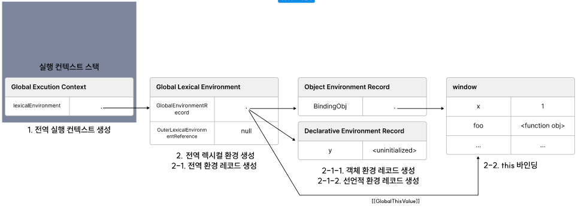
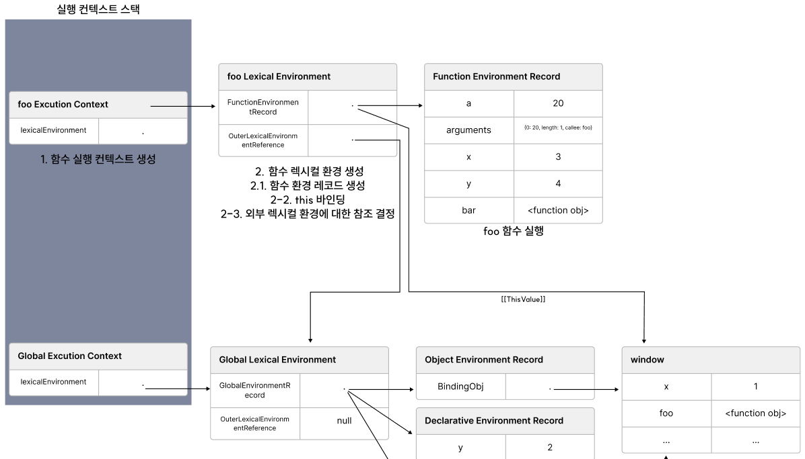

# 실행 컨텍스트

실행 컨텍스트로 이해할 수 있는 것

- 스코프 기반 식별자와 식별자에 바인딩 된 값의 관리
- 호이스팅이 발생하는 이유
- 클로저의 동작 방식
- 이벤트 핸들러와 비동기 처리의 동작 방식

## 소스코드의 타입

|소스코드의 타입|설명|
|---|---|
|전역 코드| 전역에 존재하는 소스코드, 전역 함수 및 클래스의 내부 코드는 포함하지 않는다|
|함수 코드| 함수 내부에 존재하는 소스코드, 중첩 함수 및 클래스의 내부 코드는 포함하지 않는다|
|eval 코드| 빌트인 전역 함수 eval의 인수로 전달되어 실행되는 소스코드|
|모듈 코드|모듈 내부에 존재하는 소스코드, 모듈 내부의 함수 및 클래스의 내부 코드는 포함하지 않는다|

각 소스코드의 타입에 따라 실행 컨텍스트를 생성하는 과정과 관리 내용이 다르다

1. 전역 코드

    전역 코드는 전역 변수를 관리하기 위해 최상위 스코프인 전역 스코프를 생성해야 한다. 
    
    그리고 var키워드로 선언된 전역 변수와 함수 선언문으로 정의된 전역 함수를 전역 객체의 프로퍼티와 메서드로 바인딩하여 연결 한다. 
    
    이를 위해 전역 코드가 평가되면 전역 실행 컨텍스트가 생성된다.

2. 함수 코드

    함수코드는 지역 스코프를 생성하고 지역 변수, 매개변수, arguments객체를 관리해야 한다. 
    
    그리고 생성한 지역 스코프를 전역 스코프에서 시작하는 스코프 체인의 일원으로 연결해야 한다. 
    
    이를 위해 함수 코드가 평가되면 함수 실행 컨텍스트가 생성된다.

3. eval 코드

    eval코드는 strict mode에서 자신만의 독자적인 스코프를 생성한다. 
    
    이를 위해 eval코드가 평가되면 eval실행 컨텍스트가 생성된다.

4. 모듈 코드

    모듈 코드는 모듈별로 독립적인 모듈 스코프를 생성한다. 
    
    이를 위해 모듈 코드가 평가되면 모듈 실행 컨텍스트가 생성된다.


## 소스코드의 평가와 실행 단계

JS 엔진은 소스코드를 **"평가"** 와 **"실행"** 단계로 나누어 처리한다

### 평가 단계

- 실행 컨텍스트 생성
- 변수, 함수 선언문을 먼저 실행하여 생성된 식별자를 스코프(렉시컬 환경의 레코드)에 등록

### 실행 단계 (런타임)

- 선언문을 제외한 소스코드를 순차적으로 실행
- 소스코드 실행에 필요한 정보(변수, 함수의 참조)를 실행 컨텍스트가 관리하는 스코프에서 검색하여 취득
- 변수 값의 변경등 소스코드의 실행 결과는 다시 실행 컨텍스트가 관리하는 스코프에 등록

### 실행 컨텍스트의 역할

실행 컨텍스트는 소스코드를 실행하는 데 필요한 환경을 제공하고 실행 결과를 실제로 관리하는 영역이다.

구체적으로 식별자를 등록하고 관리하는 스코프와 코드 실행 순서 관리를 구현한 내부 메커니즘으로 모든 코드는 실행 컨텍스트를 통해 실행되고 관리된다.

코드가 실행되려면 스코프, 식별자, 코드 실행 순서등의 관리가 필요하다

- 선언에 의해 생성된 모든 식별자(변수, 함수, 클래스)를 스코프로 구분하여 등록하고 상태변화(식별자에 바인딩된 값의 변화)를 지속적으로 관리할 수 있어야 한다

- 스코프는 중첩 관계에 의해 스코프 체인을 형성해야 한다. 즉, 스코프 체인을 통해 상위 스코프로 이동하여 식별자를 검색할 수 있어야 한다.

- 현재 실행중인 코드의 실행순서를 변경할 수 있어야 하며 다시 되돌아 갈 수 있어야 한다

식별자와 스코프는 렉시컬 환경으로 관리하고 코드 실행 순서는 실행 컨텍스트 스택으로 관리한다.

```javascript
// 전역 변수 선언
const x = 1
const y = 2

// 함수 정의
function foo(a) {
  const x = 10
  const y = 20

  // 메서드 호출
  console.log(a + x + y)
}

// 함수 호출
foo(100)

// 메서드 호출
console.log(x + y)
```

### 예제 코드의 실행 과정

#### 1. 전역 코드 평가

전역 코드 평가 과정을 거치며 전역 코드를 실행하기 위한 준비를 한다.

1. 전역 코드의 선언문과 함수 선언문이 먼저 실행된다.
2. 1번 작업의 결과로 생성된 전역 변수와 전역 함수가 실행 컨텍스트가 관리하는 전역 스코프에 등록된다.
3. 이때 var 키워드로 선언된 전역 변수와 함수 선언문으로 정의된 전역 함수는 전역 객체의 프로퍼티와 메서드가 된다.

#### 2. 전역 코드 실헹

전역 코드 평가 과정이 끝이나면 런타임이 시작되어 전역 코드가 순차적으로 실행된다.

1. 전역 코드를 실행하면서 전역 변수에 값이 할당되고 함수가 호출된다
2. 함수가 호출되면 순차적으로 실행되던 전역 코드의 실행을 일시 중단하고 코드 실행 순서를 함수 내부로 변경한다.

#### 3. 함수 코드 평가

함수 내부의 문들을 실행하기 앞서 함수 코드 평가 과정을 거치며 함수 코드를 실행하기 위한 준비를 한다.

1. 매개변수와 지역 변수 선언문이 먼저 실행된다
2. 1번 작업의 결과로 생성된 매개변수와 지역 변수가 실행 컨텍스트가 관리하는 지역 스코프에 등록된다.
3. 함수 내부에서 지역 변수처럼 사용할 수 있는 arguments 객체가 생성되어 지역 스코프에 등록되고 this 바인딩도 결정된다.

#### 4. 함수 코드 실행

함수 코드 평가 과정이 끝이나면 런타임이 시작되어 함수 코드가 순차적으로 실행된다.

1. 매개변수와 지역 변수에 값이 할당되고 console.log 메서드가 실행된다.
2. console.log 메서드를 실행하기 위해 먼저 식별자인 console 을 스코프 체인을 통해 검색한다.
  
    이를 위해 함수 코드의 지역 스코프는 상위 스코프인 전역 스코프와 연결되어야 한다
    
    console 식별자는 스코프 체인 상에 존재하지 않지만 전역 객체에 프로퍼티로 존재한다. 
    
    전역 객체의 프로퍼티는 전역 변수처럼 전역 스코프를 통해 검색 가능하기 떄문에 스코프 체인을 통해 검색하여 접근 가능하다.

3. log 프로퍼티를 console 객체의 프로토타입 체인을 통해 검색한다.
4. console.log 메서드에 인수로 전달된 a + x + y가 평가 된다.
  
    a, x, y 식별자는 스코프 체인을 통해 검색한다

5. console.log 메서드의 실행이 종료되면 함수 코드 실행과정이 종료되고 함수 호출 이전으로 되돌아가 전역 코드 실행을 계속한다.
</details>

## 실행 컨텍스트 스택을 통한 코드 실행 순서 제어

소스코드가 평가되면 실행 컨텍스트가 생성되고 실행 컨텍스트의 최상위 스택에 추가된다.

실행 컨텍스트 스택의 최상위에 존재하는 실행 컨텍스트는 언제나 현재 실행중인 코드의 실행 컨텍스트이다.

```javascript
const x = 1

function foo(a) {
  const y = 2

  function bar () {
    const z = 3
    console.log(x + y + z)
  }
  bar()
}

foo()
```

### 예제 코드의 실행 과정


#### 1. 전역 코드 평가와 실행

전역 코드를 평가하여 전역 실행 컨텍스트를 생성하고 실행 컨텍스트 스택에 푸시한다.

1. 전역 변수 x와 전역 함수 foo는 전역 실행 컨텍스트에 등록된다.
2. 전역 코드를 실행하며 전역 변수 x에 값을 할당하고 전역 함수 foo가 호출된다.

#### 2. foo 함수 코드 평가와 실헹

foo 함수 코드를 평가하여 foo 함수 실행 컨텍스트를 생성하고 실행 컨텍스트 스택에 푸시한다.

1. 지역 변수 y와 중접 함수 bar가 foo 함수 실행 컨텍스트에 등록된다.
2. foo 함수 코드를 실행하며 지역 변수 y에 값을 할당하고 지역함수 bar 가 호출된다.

#### 3. bar 함수 코드 평가와 실행

bar 함수 코드를 평가하여 bar 함수 실행 컨텍스트를 생성하고 실행 컨텍스트 스택에 푸시한다.

1. 지역 변수 z가 bar 함수 실행 컨텍스트에 등록된다.
2. bar 함수 코드를 실행하며 지역 변수 z에 값을 할당하고 console.log 메서드를 호출한 이후 bar 함수는 종료된다.

#### 4. foo 함수 코드로 복귀

bar 함수 실행 컨텍스트를 실행 컨텍스트 스택에서 팝 하여 제거한다.

1. foo 함수는 더 이상 실행할 코드가 없으니 종료된다.

#### 5. 전역 코드로 복귀

foo 함수 실행 컨텍스트를 실행 컨텍스트 스택에서 팝 하여 제거한다.

1. 더 이상 실행할 전역 코드가 남아있지 않으므로 전역 실행 컨텍스트를 실행 컨텍스트 스택에서 팝 하여 제거한다.

## 렉시컬 환경을 통한 식별자와 스코프 관리
실행 컨텍스트를 구성하는 컴포넌트 중 하나

- 실행 컨텍스트 스택 : 코드의 실행 순서를 관리
- 렉시컬환경 : 스코프와 식별자 관리 

렉시컬 환경(Lexical Environment)은 식별자와 식별자에 바인딩된 값, 그리고 상위 스코프에 대한 참조를 기록하는 자료구조


렉시컬 환경은 키와 값을 가지는 객체 스코프를 생성하여 식별자를 등록하고 식별자에 바인딩된 값을 관리한다


<*생성 초기의 실행 컨텍스트와 렉시컬환경*>

실행 컨텍스트는 **LexicalEnvironment** 컴포넌트와 **VariableEnvironment** 컴포넌트로 구성된다.

생성 초기의 **LexicalEnvironment** 컴포넌트와 **VariableEnvironment** 컴포넌트는 하나의 동일한 렉시컬 환경을 참조한다

이후 몇가지 상황을 만나면 **VariableEnvironment** 컴포넌트는 새로운 랙시컬 환경을 생성한다

다만 책에서는 strict 모드와 eval 코드 try/catch 문과 같은 특수 케이스를 제외하고  **LexicalEnvironment** 컴포넌트와 **VariableEnvironment** 컴포넌트도 구분하지 않고 **렉시컬 환경**으로 통일해 간략하게 설명한다

렉시컬 환경은 다음과 같이 구성된다


#### 환경 레코드 (Environment Record)

스코프에 포함된 식별자를 등록하고 등록한 식별자에 바인딩된 값을 관리하는 저장소(소스코드 타입에 따라 관리하는 내용에 차이가 있다)

#### 외부 렉시컬 환경에 대한 참조 (Outer Lexical Environment Reference)

외부 렉시컬 환경에 대한 참조는 상위 스코프를 가리킨다

상위 스코프란 외부 랙시컬 환경 즉, 해당 실행 컨텍스트를 생성한 소스코드를 포함하는 상위 코드의 렉시컬 환경

외부 렉시컬 환경에 대한 참조를 통해 단방향 링크드 리스트인 스코프 체인을 구현한다.

## 실행 컨텍스트의 생성과 실별자 검색 과정

```javascript
var x = 1;
const y = 2;

function foo(a) {
  var x = 3;
  const y = 4;
  
  function bar(b) {
    const z = 5;
    console.log(a + b + x + y + z);
  }
  bar(10)
}
foo(20) //42
```

## 예제 코드 동작 과정 (매우 김)

## 1. 전역 객체 생성

전역 객체는 전역 코드가 평가되기 이전에 생성되고 전역 객체 또한 Object.prototype을 상속받는다 즉, 적역객체도 프로토타입 체인의 일원이다.

## 2. 전역 코드 평가

소스 코드가 로드되면 다음과 같은 순서로 전역 코드를 평가한다

1. 전역 실행 컨텍스트 생성

2. 전역 렉시컬 환경 생성

    2-1. 전역 환경 레코드 생성
    - 2-1-1. 객체 환경 레코드 생성
    - 2-1-2. 선언적 환경 레코드 생성

    2-2. this 바인딩
    
    2-3. 외부 렉시컬 환경에 대한 참조 결정


### 1 . 전역 실행 컨텍스트를 생성하여 실행 컨텍스트 스택에 푸시한다

### 2 . 전역 렉시컬 환경을 생성하고 전역 실행 컨텍스트에 바인딩한다.


### 2-1. 전역 환경 레코드 생성

전역 렉시컬 환경을 구성하는 전역 환경 레코드 (Global Lexical Environment)는 전역 변수를 관리하는 전역 스코프, 전역 갹채의 빌트인 전역 프로퍼티, 빌트인 전역 함수, 표준 빌트인 객체를 제공한다.

var 키워드로 선언한 전역 변수와 let, const 로 선언한 전역 변수를 구분하기 위해 전역 스코프 역할을 하는 **전역 환경 레코드**는 **객체 환경 레코드(Object Environment Record)** 와 **선언적 환경 레코드(Declarative Environment Record)**로 구성되어 있다.

### 2-1-1. 객체 환경 레코드 생성

#### 전역 객체의 식별자(window) 없이 전역 객체의 프로퍼티를 참조할 수 있는 메커니즘

BindingObject는 1번 과정에서 생성된 전역 객체 생성에서 생성된 전역객체이다

전역 코드 평가 과정에서 var 키워드로 선언한 전역 변수와 함수 선언문으로 정의된 전역함수는 전역 환경 레코드에 연결된 BindingObject를 통해 전역 객체의 프로퍼티와 메서드가 된다 (식별자로 동륵됨)

이때 등록된 식별자를 전역 환경 레코드의 객체 환경 레코드에서 검색하면 전역 객체의 프로퍼티를 검색하여 반환한다

#### 변수 호이스팅이 발생하는 원리

전역 변수 x 는 var 키워드로 선언한 변수 이므로 "선언 단계" 와 "초기화 단계"가 동시에 진행된다

즉, 전역 코드 평가 시점에 객체 환경 레코드에 바인딩된 BindingObject를 통해 전역 객체에 변수 식별자를 키로 등록한 다음 암묵적으로 undefined를 반환한다.

즉, var 키워드로 선언한 변수와 함수 표현식은 코드 실행 단계에서 변수 선언문 이전에도 참조가능하다 다만 undefined를 반환한다.

#### 변수 호이스팅과 함수 호이스팅의 차이

```javascript
console.dir(add); //f add(num1, num2) 함수 평가와 함께 함수 객체를 생성하고 즉시 할당
console.dir(sub) //undefined

console.log(add(1, 2)) //3
console.log(sub(1, 2)) //TypeError

function add(num1, num2) {
	return num1 + num2;
}

var sub = function(num1, num2) {
	return num1 - num2;
};
```

함수 선언문으로 정의한 함수가 평가되면 함수의 이름과 동일한 이름의 식별자를 BindingObject를 통해 전역 객체에 키로 등록하고 생성된 함수 객체를 즉시 할당한다.

즉, 함수 선언문으로 정의한 함수는 함수 선언문 이전에 참조할 수 있다.

### 2-1-2. 선언적 환경 레코드 생성


"uninitialize" 란 값은 없으며 초기화 되지 않음을 표기한 것이다

let과 const로 선언한 전역 변수와 (함수 표현식 포함) 선언적 환경 레코드에 등록되고 관리된다

#### let const로 선언한 변수가 호이스팅이 발생하지만 참조할 수 없는 이유

전역 객체의 프로퍼티가 되지 않으며 "선언 단계" 와 "초기화 단계"가 분리되어 진행된다

즉, 런타임에 실행 흐름이 변수 선언문에 도달하기 전까지 **일시적 사각지대(Temporal Dead Zone)**에 빠지게 되어 참조 할 수 없다

### 2.2 This 바인딩


전역 환경 레코드의 [[GlobalThisValue]] 내부 슬롯에 this가 바인딩 된다.

this 바인딩은 전역 환경 레코드와 함수 환경 레코드에만 존재한다

객체 환경 레코드와 선언적 환경 레코드에는 this 바인딩이 없다

### 2.3. 외부 렉시컬 환경에 대한 참조 결정



외부 렉시컬 환경에 대한 참조는 현재 평가 중인 소스코드를 포함하는 외부 소스코드의 렉시컬 환경 즉 상위 스코프를 가리킨다

이를 통해 단방향 링크드 리스트인 스코프 체인을 구현한다

현재 예제에서 평가중인 소스코드는 전역 코드다 전역 코드를 포함하는 소스코드는 없으므로 전역 렉시컬 환경의 외부 렉시컬 환경에 대한 참조에 null 이 할당된다.

여기까지가 전역 코드 평가

### 전역 코드 실행


전역 코드가 순차적으로 실행되며 반수 할당무이 실행되어 전역 변수 x, y에 값이 할당되고 foo 함수가 호출된다.

#### 스코프 체인의 동작 원리

변수 할당문 또는 함수 호출문을 실행하려면 선언된 식별자인지 확인이 필요하다

선언되지 않은 식별자는 참조할 수 없고 할당이나 호출도 할 수 없다

또한 식별자는 스코프가 다르면 같은 이름을 가질 수 있어 동일한 이름의 식별자가 여러 개 존재할 수 있다

따라서 어느 스코프를 참조하면 되는지 결정할 필요가 있다

어느 스코프를 참조 할지 결정하는 것을 **식별자 결정(identifier resolution)** 이라 한다

식별자 결정을 위해 식별자를 검색할 때는 실행 중인 실행 컨텍스트에서 식별자를 검색하기 시작하고 선언된 식별자는 실행 컨텍스트의 렉시컬 환경 레코드에 등록되어 있다.

만약 실행 중인 실행 컨텍스트의 렉시컬 환경 레코드에서 식별자를 검색할 수 없으면 외부 렉시컬 환경의 참조가 기리키는 상위 스코프로 이동하여 식별자를 검색한다

## foo 함수 평가

예제 코드에서 `foo(20)` 코드를 평가한다

foo 함수가 호출되면 전역 코드의 실행을 일시 중단하고 foo 함수 내부로 코드 제어권이 이동한다. 그리고 foo 함수를 평가하기 시작한다.

함수 코드 평가는 아래 순서로 진행한다.

1. 함수 실행 컨텍스트 생성
2. 함수 렉시컬 환경 생성
  
    2.1. 함수 환경 레코드 생성
    
    2.2. this 바인딩

    2.3. 외부 렉시컬 환경에 대한 참조 결정


### 1. 함수 실행 컨텍스트 생성

### 2. 함수 렉시컬 환경 생성
  
### 2.1. 함수 환경 레코드 생성


매개변수, arguments 객체, 함수 내부에서 선언한 지역 변수와 중첩 함수를 등록하고 관리한다 

### 2.2. this 바인딩


함수 환경 레코드의 [[ThisValue]] 내부 슬롯에 this가 바인딩 된다

함수 호출 방식에 따라서 this 가 결정된다

foo 함수는 일반 함수로 호출되었으므로 this는 전역 객체를 가리킨다

### 2.3. 외부 렉시컬 환경에 대한 참조 결정


외부 렉시컬 환경에 대한 참조에 foo 함수 정의가 평가된 시점에 실행 중인 실행 컨텍스트의 렉시컬 환경의 참조가 할당된다.

foo 함수는 전역 코드에 정의된 전역 함수다 따라서 foo 함수 정의는 전역 코드 평가 시점에 평가된다.

이 시점의 실행중인 실행 컨텍스트는 전역 실행 컨텍스트이기 때문에 외부 렉시컬 환경에 대한 참조에는 전역 렉시컬 환경의 참조가 할당된다

#### 함수 객체의 내부 슬롯 [[Environment]]

[위](#변수-호이스팅과-함수-호이스팅의-차이)에서 호이스팅이 발생하는 원리를 설명하면서 함수 평가와 함께 함수 객체를 생성하고 즉시 할당한다고 했다

JS 엔진은 함수 정의를 평가하며 함수 객체를 생성한다

함수 객체의 생성 시점이 평가 단계에서 이루어지며 함수 객체의 내부 슬롯 `[[Environment]]` 에 현재 실행 중인 실행 컨텍스트의 렉시컬 환경 즉 상위 스코프를 저장한다.

#### 렉시컬 스코프를 구현하는 메커니즘

함수 렉시컬 환경의 외부 렉시컬 환경에 대한 참조에 할당되는 것은 

함수 객체의 내부 슬롯 [[Environment]] 에 저장된 렉시컬 환경의 참조(상위 스코프)이다

즉, 함수 객체의 내부 슬롯 [[Environment]] 로 렉시컬 스코프를 구현한다

예제 코드에선 foo 함수 정의를 평가할 때 실행 중인 실행 컨텍스트는 전역 실행 컨텍스트이다

전역 스코프를 foo 함수 객체의 내부 슬롯 [[Environment]] 에 저장한다

foo 함수 객체의 내부 슬롯 [[Environment]] 에 저장된 전역 스코프를 foo 함수 렉시컬 환경의 외부 렉시컬 환경에 대한 참조에 할당한다.

함수 객체의 내부 슬롯 [[Environment]] 와 렉시컬 스코프는 클로저를 이해할 때 필요하다

## foo 함수 실행



스코프 체인을 통해 식별자 검색 후 값을 바인딩 한다.


## bar 함수 코드 평가

foo 함수 내부의 `bar(10)` bar 함수를 호출하면 bar 함수 내부로 코드 제어권이 이동하고 평가를 시작한다 foo 함수 평가 과정과 동일하다

## bar 함수 코드 실행

런타임이 시작되어 bar 함수의 소스코드가 순차적으로 실행되기 시작

매개변수에 인수가 할당되고 변수 할당문이 실행되어 지역 변수 z에 값이 할당된다

그리고 console.log 가 실행된다

1. 스코프 체인에서 console 식별자 검색

    실행 중인 실행 컨텍스트의 렉시컬 환경에서 시작하여 외부 렉시컬 환경에 대한 참조로 이어지는 연속

    bar 렉시컬 환경에서 console검색

    foo 렉시컬 환경에서 console검색
    
    전역 렉시컬 환경에서 console검색 BindingObject를 통해 전역 객체에서 console 식별자 발견

2. log 메서드 검색
    
    console 식별자에 바인딩 된 객체 console 객체에서 log 메서드를 검색

    console 객체의 프로토타입 체인을 통해 메서드를 검색

3. 표현식 a + b + x + y + z의 평가

    console.log 메서드에 전달할 인수 표현식 a + b + x + y + z의 식별자 a, b, x, y, z를 스코프 체인을 통해 검색한다.

4. console.log 메서드 호출

    표현식 a + b + x + y + z가 평가되어 생성한 값 42를 console.log 메서드에 전달하여 호출한다

## bar 함수 코드 실행 종료

더이상 bar 함수에서 실행할 코드가 없으므로 실행 컨텍스트 스택에서 bar 실행 컨텍스트를 pop 하여 제거한다

foo 실행 컨텍스트가 실행 중인 실행 컨텍스트가 된다

bar 실행 컨텍스트가 pop 되었다고 해서 bar 함수 렉시컬 환경까지 즉시 소멸하지는 않는다

렉시컬 환경은 실행 컨텍스트에 의해 참조되지만 독립적인 객체이다

객체를 포함한 모든 값은 참조되지 않을 때 가비지 콜렉터에 의해 소멸된다

## foo 함수 코드 실행 종료

더이상 foo 함수에서 실행할 코드가 없으므로 실행 컨텍스트 스택에서 foo 실행 컨텍스트를 pop 하여 제거한다

전역 실행 컨텍스트가 실행 중인 실행 컨텍스트가 된다

## 전역 코드  실행 종료

더이상 전역 함수에서 실행할 코드가 없으므로 실행 컨텍스트 스택에서 전역 실행 컨텍스트를 pop 하여 제거한다

실행 컨텍스트에는 아무것도 남아있지 않은 idle 상태가 된다.

## 실행 컨텍스트와 블록 레벨 스코프

### 빠른 15장 var let const 리마인드

var 키워드로 선언한 변수: 함수의 코드 블록만 지역 스코프로 인정하는 함수 스코프

let, const 키워드로 선언한 변수: 모든 코드 블록(함수, if, for 등..)을 지역 스코프로 인정하는 블록레벨 스코프

```javascript
let x = 1;

if(true) {
  let x = 10;
  console.log(x); // 10
}

console.log(x) // 1
```

먼저 if문의 코드 블록 내에서 let 키워드로 변수가 선언되었고 if문이 실행되면 if문의 코드 블록을 위한 블록 레벨 스코프를 생성해야 한다


선언적 환경 레코드를 갖는 렉시컬 환경을 새롭게 생성하고 기존의 전역 렉시컬 환경을 교체한다

새롭게 생성된 if문의 코드 블록을 위한 렉시컬 환경의 외부 렉시컬 환경에 대한 참조는 if문이 실행되기 전의 전역 렉시컬 환경을 가리킨다


if문 코드 블록의 실행이 종료되면 if문 코드 블록이 실행되기 이전의 렉시컬 환경으로 복귀한다

if문뿐 아니라 블록 레벨 스코프를 생성하는 모든 블록문에 적용된다

for문의 경우 반복 실행시 식별자(for 문의 변수 선언문 및 for문의 코드 블록 내에서 선언된 지역 변수등)의 값을 유지해야 한다

이를 위해 for 문의 블록문이 실행될 때마다 독립적인 렉시컬 환경을 생성하여 식별자의 값을 유지한다 == 클로저