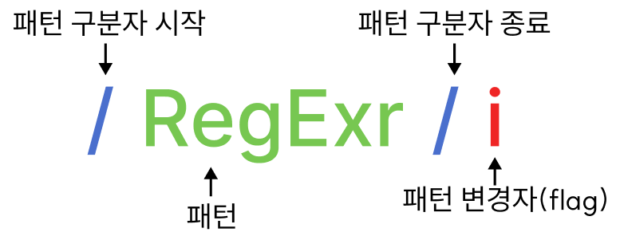

# Regex 정규 표현식

정규 표현식은 일정한 패턴을 가진 문자열의 집합을 표현하기 위해 사용되는 형식 언어

정규 표현식은 JS의 고유 문법이 아니며, 대부분의 프로그래밍 언어와 코드 에디터에 내장되어 있다

JS는 ES3부터 도입했다

## 정규 표현식의 구조



### POSIX 기본 및 확장 문법

<details>
<summary>POSIX 기본 및 확장 문법</summary>

#### POSIX 기본 문법

|메타문자|기능|설명|
|---|---|---|
|.|문자|1개의 문자와 일치한다. <br> 단일행 모드에서는 새줄 문자를 제외한다.|
|[]|문자 클래스|"["과 "]" 사이의 문자 중 하나를 선택한다. <br> 또한, "-" 기호로 범위를 지정할 수 있다.|
|[^ ]|부정|문자 클래스 안의 문자를 제외한 나머지를 선택한다. <br> [^abc]d는 ad, bd, cd는 포함하지 않고 ed, fd 등을 포함한다.|
|^|처음|(*캐럿*) 문자열이나 행의 처음을 의미한다.|
|$|끝|문자열이나 행의 끝을 의미한다.|
|( )|하위식(그룹)|여러 식을 하나로 묶을 수 있다. <br> "abc¦adc"와 "a(b¦d)c"는 같은 의미를 가진다.|
|\n|일치하는 n번째 패턴|	일치하는 패턴들 중 n번째를 선택하며, 여기에서 n은 1에서 9 중 하나가 올 수 있다.|
|*|0회 이상|(*애스터리스크*) 0개 이상의 문자를 포함한다. "a*b"는 "b", "ab", "aab", "aaab"를 포함한다.|
|{m, n}|m회 이상 n회 이하|"a{1,3}b"는 "ab", "aab", "aaab"를 포함하지만, "b"나 "aaaab"는 포함하지 않는다.|

#### POSIX 확장 문법

|메타문자|기능|설명|
|---|---|---|
|?|0 또는 1회|"a?b"는 "b", "ab"를 포함한다.|
|+|	1회 이상|"a+b"는 "ab", "aab", "aaab"를 포함하지만 "b"는 포함하지 않는다.|
|¦|선택|여러 식 중에서 하나를 선택한다. <br> "abc¦adc"는 abc와 adc 문자열을 모두 포함한다.|

</details>

## 정규 표현식의 생성

### 정규 표현식 리터럴

슬래시로 패턴을 감싸서 작성

```javascript
const re = /ab+c/;
```

> 정규 표현식 리터럴은 스크립트를 불러올 때 컴파일되므로, 바뀔 일이 없는 패턴의 경우 리터럴을 사용하면 성능이 향상될 수 있습니다. - [MDN 정규 표현식](https://developer.mozilla.org/ko/docs/Web/JavaScript/Guide/Regular_expressions#%EC%A0%95%EA%B7%9C_%ED%91%9C%ED%98%84%EC%8B%9D_%EB%A7%8C%EB%93%A4%EA%B8%B0)

### RegExp 객체의 생성자 호출

```javascript
const re = new RegExp("ab+c");
```

> 생성자 함수를 사용하면 정규 표현식이 런타임에 컴파일됩니다. 바뀔 수 있는 패턴이나, 사용자 입력 등 외부 출처에서 가져오는 패턴의 경우 이렇게 사용하세요. - [MDN 정규 표현식](https://developer.mozilla.org/ko/docs/Web/JavaScript/Guide/Regular_expressions#%EC%A0%95%EA%B7%9C_%ED%91%9C%ED%98%84%EC%8B%9D_%EB%A7%8C%EB%93%A4%EA%B8%B0)

##  JavaScript의 정규 표현식 메소드

### RegExP 객체 정규식 메소드

|메소드|설명|
|---|---|
|(정규표현식).**exec**("문자열")|문자열에 대해 정규표현식의 첫번째 패턴 매칭 결과를 배열로 반환 <br> 매칭 결과가 없는 경우 null반환 <br> g 플래그(문자열 내의 모든 패턴을 검색)가 있어도 첫번째 매칭 결과만 반환|
|(정규표현식).**test**("문자열")|문자열을 정규표현식의 패턴 매칭 결과를 불리언 값으로 반환|

### String 객체 메소드
|메소드|설명|
|---|---|
|("문자열").**match**(/정규표현식/)|문자열에서 정규표현식에 매칭되는 전체 문자열을 첫 번째 요소로 포함하는 배열과 괄호 안에 캡처된 결과를 반환 <br> 일치하는 것이 없으면 null 반환|
|("문자열").**matchAll**(/정규표현식/, "대체문자열")|정규표현식에 매칭되는 모든 항목을 배열로 변환 <br> g 플래그가 없으면 TypeError가 발생한다|
|("문자열").**search**(/정규표현식/)|정규표현식과 문자열 간에 일치하는 항목이 있는지 검색하여 문자열에서 첫 번째로 일치하는 항목의 인덱스를 반환 <br> 정규표현식의 g 플래그는 search() 결과에 아무런 영향을 미치지 않으며, 검색은 항상 정규식의 lastIndex가 0인 것처럼 수행된다 <br> 검색 결과를 찾을 수 없다면 -1을 반환|
|("문자열").**replace**(/정규표현식/ 또는 "문자열", "대체문자열")|정규표현식에 매칭되는 항목을 대체문자열로 변환 <br> pattern이 문자열인 경우 첫 번째 항목만 변경된다 <br> 원본 문자열은 변하지 않는다|
|("문자열").**replaceAll**(/정규표현식/ 또는 "문자열", "대체문자열")|정규표현식에 매칭되는 모든 항목을 대체문자열로 변환 <br> **replace**와 달리 모든 항목을 변경한다 <br> 원본 문자열은 변하지 않는다|
|("문자열").**split**(정규표현식)|문자열을 정규표현식에 매칭되는 항목으로 쪼개어 배열로 반환|

```javascript
const regex = /apple/;

regex.test("Hello banana and apple hahahaha"); // true

const txt = "Hello banana and apple hahahaha";
txt.match(regex); // ['apple']

txt.replace(regex, "watermelon"); // 'Hello banana and watermelon hahahaha'
```

## 정규식 구문

### Groups and Ranges (그룹과 범위)

|기호|의미|예시|
|---|---|---|
|[]|괄호안의 문자들 중 하나|/[abc]/: "a"또는 "b"또는 "c"|
|[ - ]|범위 - 중 하나|/[ㄱ-ㅎ가-힣]/: 한글 <br> /[0-9]/: 숫자 <br> /[a-zA-Z]/: 알파벳|
|\\||OR |a\\|b|
|[^문자]|NOT <br> 괄호안의 문자를 제외|[^lgEn]: "ㅣ", "g", "E", "n" 4개 문자를 제외|
|()|캡쳐링 그룹|/(abc)/ <br> '012abcd'에서 'abc'를 그룹화하고 캡쳐링 ($1, $2 등으로 사용 가능)|
|(?<name>)|네임드 캡쳐링 그룹|/(?<name>abc)/ <br> '012abcd'에서 'abc'를 그룹화하고 name으로 캡쳐링 함|
|(?:)|논 캡쳐링 그룹|/(?:abc)/ <br> '012abcd'에서 'abc'를 그룹화하고 캡쳐링 하지 않음|
|(...)\n|캡쳐링 그룹 재사용|/(ab)(c)\2\1/ <br> 'abccabb'에서 'abccab'와 매치됨|

#### 캡쳐링 그룹

패턴 그룹화 ()를 사용하면 g 플래그를 사용하지 않아도 전역 검색이 되어 다수의 결과를 반환한다 () 안의 표현식을 캡쳐하여 참조 가능

```javascript
'cococo'.match(/co+/) // "co"
'cooocooco'.match(/co+/) // "cooo" 
```

- 패턴 그룹화 ()를 사용하지 않은 co+ 는 "o" 에만 + 적용한다 

```javascript
'cococo'.match(/(co)+/) // "cococo", "co"
'cooocooco'.match(/(co)+/) // "co", "co"
```

- 패턴 그룹화 ()를 사용하여 "co"에 + 적용하고 "co"를 캡쳐한다
- /(co)+/는 "co"가 1회 이상 반복되는 패턴을 검색한다. 매칭된 결과는 전체 일치 부분 'cococo'와 캡처된 그룹 'co' 

#### 논 캡쳐링 그룹

```javascript
'cococo'.match(/(?:co)+/) // "cococo"
'cooocooco'.match(/(?:co)+/) // "co"
```

### Character classes (문자 클래스)

|패턴|의미|
|---|---|
|.|모든 문자열(숫자, 한글, 영어, 특수기호, 공백 포함), 단 줄바꿈은 포함되지 않는다|
|\d|(*digit*) 0-9 숫자|
|\D|숫자가 아닌 문자: \d와 일치하지 않는 일반 글자 등의 모든 문자|
|\s|(*space*) 스페이스, 탭(\t), 줄 바꿈(\n)을 비롯하여 아주 드물게 쓰이는 \v, \f, \r 을 포함하는 공백 기호|
|\S|공백이 아닌 문자 \s와 일치하지 않는 일반 글자 등의 모든 문자|
|\w|(*word*) ‘단어에 들어가는’ 문자로 라틴 문자나 숫자, 밑줄 _을 포함 <br> 키릴 문자나 힌디 문자같은 비 라틴 문자는 \w에 포함되지 않는다|
|\W|단어에 들어가지 않는 문자: \w와 일치하지 않는 비 라틴 문자나 공백 등의 모든 문자|
|\특수기호|\*\^\&\!\? ... 등등|
|\t|탭 (U+0009) 문자에 일치|
|\u|유니코드(Unicode) 문자에 일치|
|\x|16진수 문자에 일치|
|\0|8진수 문자에 일치|
|\c|[제어 문자](https://ko.wikipedia.org/wiki/%EC%A0%9C%EC%96%B4_%EB%AC%B8%EC%9E%90)에 일치|
|\f|폼 피드(FF, U+000C) 문자에 일치|
|\n|줄 바꿈(LF, U+000A) 문자에 일치|
|\r|캐리지 리턴(CR, U+000D) 문자에 일치|


#### 제어 문자 (\c) 폼 피드 (\f) 줄 바꿈 (\n) 캐리지 리턴 (\r) 예제

```javascript
// \c 제어 문자에 일치
let controlCharRegex = /[\x00-\x1F\x7F]/;
console.log(controlCharRegex.test('\u0001'));  // true, 제어 문자
console.log(controlCharRegex.test('A'));      // false, 제어 문자가 아님

// \f 폼 피드 문자에 일치
let formFeedRegex = /\f/;
console.log(formFeedRegex.test('\f'));        // true, 폼 피드 문자
console.log(formFeedRegex.test('A'));         // false, 폼 피드 문자가 아님

// \n 줄 바꿈 문자에 일치
let newLineRegex = /\n/;
console.log(newLineRegex.test('\n'));         // true, 줄 바꿈 문자
console.log(newLineRegex.test('A'));          // false, 줄 바꿈 문자가 아님

// \r 캐리지 리턴 문자에 일치
let carriageReturnRegex = /\r/;
console.log(carriageReturnRegex.test('\r'));  // true, 캐리지 리턴 문자
console.log(carriageReturnRegex.test('A'));   // false, 캐리지 리턴 문자가 아님
```

### Assertions (어서션)

문자에 매칭하는 것이 아닌 앞뒤 상황에 따라 매칭, 어서션은 매칭 결과에 포함되지 않는다.

|기호|의미|예시|
|---|---|---|
|^문자열|특정 문자열로 시작하는지 검색|/^www/|
|문자열$|특정 문자열로 종료하는지 검색|/com$/|
|\b|63개 문자(영문 대소문자 52개 + 숫자 10개 + _(underscore))가 아닌 나머지 문자에 일치하는 경계(boundary)| [\b에 대한 추가 설명](https://thesulks.tistory.com/67)|
|\B|63개 문자에 일치하는 경계||
|(?=)|긍정 전방 탐색 (Positive Lookahead)|/ab(?=c)/ <br> "ab" 뒤에 "c"가 오는 경우에만 "ab"에 일치|
|(?!)|부정 전방 탐색 (Negative Lookahead)|/ab(?!c)/ <br> "ab" 뒤에 "c"가 오지 않는 경우에만 "ab"에 일치|
|(?<=)|긍정 후방 탐색 (Positive Lookbehind)|/(?<=ab)c/ <br> "c" 앞에 "ab"가 있는 경우에만 "c"에 일치|
|(?<!>)|부정 후방 탐색 (Negative Lookbehind)|/(?<!ab)c/ <br> "c" 앞에 "ab"가 없는 경우에만 "c"에 일치|

#### \b 단어 경계 예제

```javascript
// 특정 문자로 시작하는 단어를 매칭
const regex = /\bch/g
const str = "cheese cheeses check is checking"
str.match(regex) // [ch, ch, ch, ch]
//"[ch]eese [che]eses [ch]eck is [ch]ecking"

// 특정 문자로 끝나는 단어를 매칭
const regex = /s\b/g
const str = "cheese cheeses check is checking"
str.match(regex) // [s,s]
// "cheese cheese[s] check i[s] checking"
```

### Quantifiers (수량자)

앞 문자를 반복해서 사용할지 결정

기본적으로 수량자는 탐욕적(Greedy)으로 동작하는데, 이는 매치되는 부분을 찾고도 더 길게 찾을 수 있으면 그걸 찾는 걸 말한다.
이때 ?를 뒤에 붙이면 탐욕적으로 찾는 것을 멈춘다

|기호|의미|예시|
|---|---|---|
|?|바로 앞의 문자가 0 또는 1 ({0,1} 과 동일)|/apple?/ <br> "appl" 또는 "apple" 문자열에 일치|
|*|앞의 문자가 0개 이상 ({0,} 과 동일)|/apple*/ <br> "appl" 또는 "appl" 뒤에 "e"가 0개 이상 나타나는 문자열에 일치|
|+|앞의 문자가 1개 이상 ({1,} 과 동일)|/apple+/ <br> "appl" 뒤에 "e"가 1개 이상 있는 문자열에 일치|
|{n}|n개||
|{Min,}|최소 Min개 이상||
|{Min, Max}|최소 Min개 이상, 최대 Max개 이하|{3,5}? === {3}||

### Flag (플래그)

정규 표현식의 검색 방식을 설정하기 위해 사용된다

```javascript
cosnt flags = 'i';
const regex = new RegExp('abapplec', flags);

const regex1 = /apple/i;
const regex2 = /apple/gm;
```

|플래그|의미|설명|
|---|---|---|
|i|ignore case|대소문자를 구분하지않고 검색한다|
|g|global|대상 문자열 내에서 패턴과 일치하는 모든 문자열을 검색한다|
|m|multi unit|문자열의 행이 바뀌더라도 패턴 검색을 계속한다|
|s||.​(모든 문자 정규식)이 개행 문자 \n도 포함|
|u|unicode|유니코드 전체를 지원|
|y|sticky|문자 내 특정 위치에서 검색하는 'sticky' 모드 활성화|

#### g 플래그

전역 검색을 위한 플래그

전역 검색 플래그가 없는 경우 최초 검색 결과 한번만을 반환

전역 검색 플래그가 있는 경우 모든 검색 결과를 반환

```javascript
const str = "abcabc";

// `g` 플래그 없이는 최초에 발견된 문자만 반환
str.match(/a/); // ["a", index: 0, input: "abcabc", groups: undefined]

// `g` 플래그가 있으면 모든 결과가 배열로 반환
str.match(/a/g); // (2) ["a", "a"]
```

#### i 플래그

정규식은 기본적으로 대소문자를 구분한다

i 플래그를 사용하여 대소문자를 구분하지 않을 수 있다

```javascript
const str = "abcABC";

// 대소문자 a 검색
str.match(/a/gi); // (2) ["a", "A"]
```

#### m 플래그

여러 줄의 문자열 필터링 시 사용

m 플래그와 다르게 시작 앵커(^)와 종료 앵커($)는 전채 문자열이 아닌 각 줄 별로 대응된다

```javascript
const str = "Hello World and\nPower Hello?\nPower Overwhelming!!";
/*
Hello World and
Power Hello?
Power Overwhelming!!
*/

// Hello 단어로 시작하는지 검사 (^ 문자는 문장 시작점을 의미)
str.match(/^Hello/); // ["Hello"]
// → 첫번째 줄은 잘 찾음

// Power 단어로 시작하는지 검사 (^ 문자는 문장 시작점을 의미)
str.match(/^Power/); // null
// → 그러나 그 다음 줄은 검색되지 아니함

// 따라서 m 플래그를 통해 개행되는 다음 줄도 검색되게 설정
str.match(/^Power/m); // ['Power']

// 세번째 줄도 검색되게 하고싶으면 g 플래그와 혼합 사용
str.match(/^Power/gm); // ['Power', 'Power']
```

#### y 플래그

y 플래그는 "sticky" 플래그라고 불리며, 문자열의 검색 시작 위치에서 정확하게 일치하는지 검색합니다. 

정규 표현식이 특정 검색 시작 지점부터 정확히 일치하는지 확인하는 데 유용

```javascript
const str = "hello world hello";

// 정규 표현식 생성, 'hello'를 찾음
const regex = /hello/y;

// 검색 시작 위치를 설정
regex.lastIndex = 0;
console.log(regex.test(str));  // true, 첫 번째 'hello' 일치

// 다음 검색 시작 위치를 설정 (이전 검색 후)
regex.lastIndex = 6;
console.log(regex.test(str));  // false, 정확히 일치하지 않음 (공백 때문에)

// 위치를 정확히 설정
regex.lastIndex = 12;
console.log(regex.test(str));  // true, 두 번째 'hello' 일치

// 'sticky' 플래그가 없으면 같은 검색이 가능하지만 동작이 다를 수 있음
const regexGlobal = /hello/g;
regexGlobal.lastIndex = 6;
console.log(regexGlobal.test(str));  // true, 'hello'를 어디서든 찾음
```

y 플래그를 사용한 정규 표현식은 [Regexp 인스턴스 속성 lastIndex ](https://developer.mozilla.org/en-US/docs/Web/JavaScript/Reference/Global_Objects/RegExp/lastIndex) 위치에서 정확히 일치하는 경우에만 true를 반환합니다

## 자주 사용하는 정규 표현식

### 특정 단어로 시작하는지 검사

```javascript
let regex = /^http?s:\/\//;

console.log(regex.test('https://example.com/'));  // true
console.log(regex.test('http://example2.com/'));  // true
```
|패턴|의미|
|---|---|
|^|문자열의 시작을 의미|
|http?s:\/\/|'http://' 또는 'https://' 문자열을 매칭|

### 특정 단어로 끝나는지 검사

```javascript
let regex = /html$/;

console.log(regex.test('index.html'));  // true
console.log(regex.test('main.js'));  // false
```

|패턴|의미|
|---|---|
|html|'html'라는 문자열을 매칭|
|$|문자열의 끝을 의미|

### 숫자로만 이루어진 문자열인지 검사

```javascript
let regex = /^\d+$/;

console.log(regex.test('12345'));    // true
console.log(regex.test('123a45'));   // false
```

|패턴|의미|
|---|---|
|^|문자열의 시작을 의미|
|\d|숫자(0-9)와 일치|
|+|앞의 패턴이 1회 이상 반복되는 경우와 일치|
|$|문자열의 끝을 의미|

### 하나 이상의 공백으로 시작하는지 검사

```javascript
let regex = /^\s+/;

console.log(regex.test('  leading space'));  // true
console.log(regex.test('no leading space')); // false
```

|패턴|의미|
|---|---|
|^|문자열의 시작을 의미|
|\s|공백 문자와 일치 (\s === [\t\r\n\v\f])|
|+|앞의 패턴이 1회 이상 반복되는 경우와 일치|

### 아이디로 사용 가능한지 검사 (영문자 또는 숫자로 시작하고, 4~10자 길이)

```javascript
let regex = /^[a-zA-Z0-9]{4,10}$/;

console.log(regex.test('user_name'));  // true
console.log(regex.test('user!name'));  // false
console.log(regex.test('us'));         // false
```

|패턴|의미|
|---|---|
|^|문자열의 시작을 의미|
|[a-zA-Z0-9_]{4,10}|영문자, 숫자가 4회 이상 10회 이하 반복되는 경우와 일치|
|$|문자열의 끝을 의미|

### 메일 주소 형식에 맞는지 검사

엄격한 이메일 검증식은 운영 방침을 정하고 RFC 5322 표준에 가능한 많이 따르는 것이 중요

```javascript
let regex = /^[a-zA-Z0-9.!#$%&'*+/=?^_`{|}~-]+@[a-zA-Z0-9-]+(?:\.[a-zA-Z0-9-]+)*$/;

console.log(regex.test('user@example.com'));        // true
console.log(regex.test('user.name+tag+sorting@example.com'));  // true
console.log(regex.test('user@sub.example.com'));    // true
console.log(regex.test('user@ex-ample.com'));       // true
console.log(regex.test('user@.com'));               // false
console.log(regex.test('user@com.'));               // false
console.log(regex.test('@example.com'));            // false
console.log(regex.test('user@ example.com'));       // false
console.log(regex.test('user@example..com'));       // false
```

<details>
<summary>예제 코드의 이메일 정규식 설명</summary>

|패턴|의미|
|---|---|
|^|문자열의 시작을 의미 <br> 정규식이 문자열의 시작부터 일치해야 한다는 것을 의미|
| [a-zA-Z0-9.!#$%&'*+/=?^_`{\|}~-]+|: 대괄호 안의 문자는 이메일 주소의 로컬 파트 (즉, '@' 앞부분)에서 허용되는 문자 정의<br> .!#$%&'*+/=?^_`{\|}~-: 이메일 주소에서 허용되는 특수 문자|
|+|앞의 패턴이 1회 이상 반복됨을 의미 <br> 로컬 파트에는 최소 하나 이상의 허용된 문자가 있어야 한다|
|@|'@' 문자와 일치 <br> 이메일 주소에서 로컬 파트와 도메인 파트를 구분하는 데 사용|
|[a-zA-Z0-9-]|대괄호 안의 문자는 도메인 파트 (즉, '@' 뒷부분)에서 허용되는 문자들을 정의|
|+|앞의 패턴이 1회 이상 반복됨을 의미 <br> 도메인 파트에는 최소 하나 이상의 허용된 문자가 있어야 한다|
|(?:)|비캡처 그룹 의미 <br>|
|\\ |이스케이프 문자 \는 특수 문자 .을 이스케이프|
|.|'.' 문자와 일치 <br> 도메인 부분에서 각 레이블을 구분하는 데 사용|
|[a-zA-Z0-9-]|영문자 (대문자, 소문자), 숫자, 그리고 하이픈(-) 중 하나와 일치 <br> 도메인의 각 레이블에서 허용되는 문자들을 정의|
|+|앞의 패턴이 1회 이상 반복됨을 의미 <br> 각 레이블에는 최소 하나 이상의 허용된 문자가 있어야 한다|
|*|앞의 패턴이 0회 이상 반복됨을 의미|
|$|문자열의 끝을 의미 <br> 정규식이 문자열의 끝까지 일치해야 한다는 것을 의미|

</details>

### 핸드폰 번호 형식에 맞는지 검사 (대한민국, 010, 011, 016, 017, 018, 019로 시작)

```javascript
let regex = /^(010|011|016|017|018|019)-\d{3,4}-\d{4}$/;

console.log(regex.test('010-1234-5678'));  // true
console.log(regex.test('011-123-4567'));   // true
console.log(regex.test('020-1234-5678'));  // false
```

|패턴|의미|
|---|---|
|^|문자열의 시작을 의미|
|(010|011|016|017|018|019)|'010', '011', '016', '017', '018', '019' 중 하나와 일치|
|-|'-' 문자와 일치|
|\d{3,4}|숫자가 3회 이상 4회 이하 반복되는 경우와 일치|
|-|'-' 문자와 일치|
|\d{4}|숫자가 4회 반복되는 경우와 일치|
|$|문자열의 끝을 의미|

### 특수문자 포함 여부 검사

#### 방법 1

```javascript
let regex = /[^A-Za-z0-9]/gi
console.log(regex.test('Hello!'));  
```

|패턴|의미|
|---|---|
|[^A-Za-z0-9]|A-Za-z0-9 이외의 문자가 있는지 검사|
|gi|대소문자 구분하지 않고 전역 검색|

#### 방법 2

```javascript
let regex = /[!@#$%^&*(),.?":{}|<>]/;

console.log(regex.test('Hello!'));    // true
console.log(regex.test('Hello'));     // false
```

|패턴|의미|
|---|---|
|[!@#$%^&*(),.?":{}\|<>]| [] 안의 특수문자와 일치하는 문자가 있는지 검사|

#### 특수 문자 제거 방법

```javascript
let regex = /[^A-Za-z0-9]/gi

console.log('abc#123'.replace(regex); //abc123 
```

특수 문자 제거 시 String.prototype.replace 메서드 사용

### 8자 이상 16자 이하의 영문 대문자 + 소문자 + 숫자 + 특수문자의 조합 비밀번호 검사

```javascript
let regex = /^(?=.*[a-z])(?=.*[A-Z])(?=.*\d)(?=.*[!@#$%^&*(),.?":{}|<>])[A-Za-z\d!@#$%^&*(),.?":{}|<>]{8,16}$/;

console.log(regex.test('Password123!'));  // true
console.log(regex.test('pass123!'));      // false (소문자, 숫자, 특수문자만 포함, 길이 부족)
console.log(regex.test('Password'));      // false (숫자, 특수문자 없음)
```

|패턴|의미|
|---|---|
|^| 문자열의 시작을 의미|
|(?=.*[a-z])| 문자열 어딘가에 최소 하나의 소문자가 포함되어야 함을 의미하는 긍정형 전방 탐색|
|(?=.*[A-Z])| 문자열 어딘가에 최소 하나의 대문자가 포함되어야 함을 의미하는 긍정형 전방 탐색|
|(?=.*\d)| 문자열 어딘가에 최소 하나의 숫자가 포함되어야 함을 의미하는 긍정형 전방 탐색|
|(?=.[!@#$%^&(),.?":{}\|<>])| 문자열 어딘가에 최소 하나의 특수문자가 포함되어야 함을 의미하는 긍정형 전방 탐색|
|[A-Za-z\d!@#$%^&*(),.?":{}\|<>]{8,16}| 영문자(대소문자), 숫자, 특수문자가 8회 이상 16회 이하 반복되는 경우와 일치|
|$| 문자열의 끝을 의미|


## Cheatsheet

### 연습 사이트

[드림코딩 정규 표현식 강의(매우 짧음)](https://www.youtube.com/watch?v=t3M6toIflyQ)
[https://regexr.com/](https://regexr.com/)
[정규 표현식 패턴 퀴즈 사이트](https://regexone.com/)

### 문자

```javascript
// 영문자 대소문자, 숫자로만 구성
const reg = /[a-zA-Z0-9]/;
// 공백없는 숫자와 대소문자
const reg = /^[a-zA-Z0-9]*$/
// 공백포함 숫자와 대소문자
const reg = /^[a-zA-Z0-9 ]*$/
// 한글포함 특수문자와 공백
const reg = /[^?a-zA-Z0-9/]/;
// 한글, 대문자, 특수문자, 공백 포함
const reg = /^(?=.*[ㄱ-ㅎㅏ-ㅣ가-힣A-Z!@#$%^&*()_+\-=\[\]{};':"\\|,.<>\/?])/;
// 한글제외 특수문자와 공백
const reg = /[^-가-?a-zA-Z0-9/ ]/;
// 특수문자
const reg = /[\{\}\[\]\/?.,;:|\)*~`!^\-_+<>@\#$%&\\\=\(\'\"]/g;
// 특수문자와 공백
const reg = /[\{\}\[\]\/?.,;:|\)*~`!^\-_+<>@\#$%&\\\=\(\'\"\s]/g;
// 숫자인지 체크
const reg = /^(\(?\+?[0-9]*\)?)?[0-9_\- \(\)]*$/;
const reg = /[0-9]/g;
// 모든 공백 체크
const reg = /\s/g;
```

### 이메일

```javascript
// 일반 이메일 주소 체크
const reg = /^([a-z0-9_\.-]+)@([\da-z\.-]+)\.([a-z\.]{2,6})$/;
// 정밀한 이메일 주소 체크
const reg = /(([^<>()\[\]\\.,;:\s@"]+(\.[^<>()\[\]\\.,;:\s@"]+)*)|(".+"))@((\[[0-9]{1,3}\.[0-9]{1,3}\.[0-9]{1,3}\.[0-9]{1,3}])|(([a-zA-Z\-0-9]+\.)+[a-zA-Z]{2,}))/;
```

### 비밀번호

```javascript
// 최소 8자리 이상 영문 대소문자, 숫자, 특수문자가 각각 1개 이상
const reg = /^(?=.*?[A-Z])(?=.*?[a-z])(?=.*?[0-9])(?=.*?[#?!@$ %^&*-]).{8,}$/;
// 최소 8자리 이상 숫자, 특수문자가 1개 이상 포함
const reg = /^(?=.*?[0-9])(?=.*?[#?!@$ %^&*-]).{8,}$/;
```

### 신용카드

```javascript
// 영문자(소문자), 숫자, "-", "_"로만 구성된 길이 2~10자리 사이의 문자열
const reg = /^[a-z0-9_-]{2,10}$/
// 19자리 숫자와 "-"로 구성 (신용카드 번호)
const reg = /^[0-9-]{19}$/;
// 숫자로 구성된 4자리-4자리-4자리-4자리 유형 체크 (신용카드 번호)
const reg = /^[0-9]{4}[-\s\.]?[0-9]{4}[-\s\.]?[0-9]{4}[-\s\.]?[0-9]{4}$/
```

### 번호

```javascript
// 3자리-3~4자리-4자리 유형 (문자 아무거나 가능)
const reg = /^\d[3]-\d[3,4]-\d[4]$/;
// 일반 전화번호
const reg = /^\d{2,3}-\d{3,4}-\d{4}$/;
// 휴대폰 번호
const reg = /^\d{3}-\d{3,4}-\d{4}$/;
// 주민등록번호 체크
const reg = /^[-A-Za-z0-9_]+[-A-Za-z0-9_.]*[@]{1}[-A-Za-z0-9_]+[-A-Za-z0-9_.]*[.]{1}[A-Za-z]{1,5}$/;
```

### 시간

```javascript
// 년월일 (yyyy-mm-dd) 체크
const reg = /^(19|20)\d\d([- /.])(0[1-9]|1[012])\2(0[1-9]|[12][0-9]|3[01])$/;
```

### 개발

```javascript
// 웹사이트 링크인지 체크
const reg = /<a\s+(?:[^>]*)href=\"((?:https:\/\/|http:\/\/)(?:.*?))">(?:.*?)<\/a>/;
// URL 체크 (프로토콜 포함, ex-http://naver.com)
const reg = /https?:\/\/(www\.)?[-a-zA-Z0-9@:%._\+~#=]{2,256}\.[a-z]{2,6}\b([-a-zA-Z0-9@:%_\+.~#()?&//=]*)/;
// URL 체크 (프로토콜 옵션, ex-http://naver.com, naver.com)
const reg = /(https?:\/\/)?(www\.)?[-a-zA-Z0-9@:%._\+~#=]{2,256}\.[a-z]{2,6}\b([-a-zA-Z0-9@:%_\+.~#?&//=]*)/;
// IP 주소 (IPv4)
const reg = /^(?:(?:25[0-5]|2[0-4][0-9]|[01]?[0-9][0-9]?)\.){3}(?:25[0-5]|2[0-4][0-9]|[01]?[0-9][0-9]?)$/;
// 맥어드레스 체크 
const reg = /^[a-fA-F0-9]{2}(:[a-fA-F0-9]{2}){5}$/;
// HTML 태그인지 체크
const reg = /^<([a-z]+)([^<]+)*(?:>(.*)<\/\1>|\s+\/>)$/;
// 하이퍼링크 체크
const reg = /(?!<a\sname=\"([\w\s\d\-\.\#]+)\"><\/a>)<a\sname=\"([\w\s\d\-\.\#]+)\">(.*?)<\/a>/;
```

## 레퍼런스
- [정규표현식 위키피디아](https://ko.wikipedia.org/wiki/%EC%A0%95%EA%B7%9C_%ED%91%9C%ED%98%84%EC%8B%9D)
-  [MDN 정규 표현식](https://developer.mozilla.org/ko/docs/Web/JavaScript/Guide/Regular_expressions#%EC%A0%95%EA%B7%9C_%ED%91%9C%ED%98%84%EC%8B%9D_%EB%A7%8C%EB%93%A4%EA%B8%B0)
- [inpa.tistory](https://inpa.tistory.com/entry/JS-%F0%9F%93%9A-%EC%A0%95%EA%B7%9C%EC%8B%9D-RegExp-%EB%88%84%EA%B5%AC%EB%82%98-%EC%9D%B4%ED%95%B4%ED%95%98%EA%B8%B0-%EC%89%BD%EA%B2%8C-%EC%A0%95%EB%A6%AC#%EC%A0%95%EA%B7%9C_%ED%91%9C%ED%98%84%EC%8B%9Dregular_expression)
- [\b 설명](https://thesulks.tistory.com/67)
- [\b 예제](https://velog.io/@sean2337/JavaScript-%EC%A0%95%EA%B7%9C%EC%8B%9D-%EC%9E%91%EC%84%B1-%EB%B0%A9%EB%B2%95#1-b-%EB%8B%A8%EC%96%B4-%EA%B2%BD%EA%B3%84)
- [정규표현식 구문](https://cotnmin.dev/9)
- [cheatsheet](https://velog.io/@haru/frequently-used-regexp)
- [드림코딩 정규 표현식 강의(매우 짧음)](https://www.youtube.com/watch?v=t3M6toIflyQ)
- [https://regexr.com/](https://regexr.com/)
- [정규 표현식 패턴 퀴즈 사이트](https://regexone.com/)