# 브라우저의 렌더링 과정

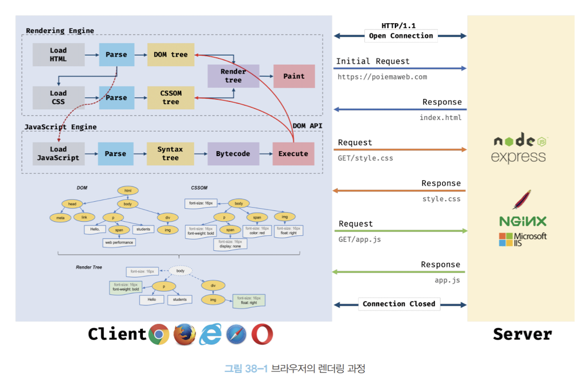

1. 브라우저는 HTML, CSS, JS, 이미지, 폰트 파일 등 렌더링에 필요한 리소스를 요청하고 서버로부터 응답을 받는다
2. 브라우저의 렌더링 엔진은 서버로부터 응답된 HTML과 CSS를 파싱하여 DOM과 CSSOM을 생성하고 이들을 결합하여 렌더 트리를 생성한다
3. 브라우저의 자바스크립트 엔진은 서버로부터 응답된 자바스크립트를 파싱하여 AST(Abstract Syntax Tree) 를 생성하고 바이트코드로 변환하여 실행한다 이때 자바스크립트는 DOM API를 통해 DOM이나 CSSOM을 변경할 수 있다 변경된 DOM과 CSSOM은 다시 렌더 트리로 결합된다 
4. 렌더 트리를 기반으로 HTML 요소의 레이아웃을 계산하고 브라우저 화면에 HTML 요소를 페인팅한다

## 요청과 응답

브라우저의 핵심 기능: 필요한 리소스를 서버에 요청하고 서버로부터 응답받아 화면에 렌더링하는 것

브라우저는 서버에 요청을 전송하기 위해 주소창을 제공한다

### URI 구조
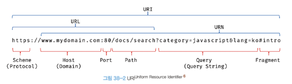

브라우저의 주소창에 URL을 입력하면 URL의 호스트 네임이 DNS를 통해 IP 주소로 변환되고 해당 IP 주소의 서버로 요청을 전송한다

## HTTP(HyperText Transfer Protocol) 1.1 & 2.0

### 웹에서 브라우저와 서버가 통신하기 위한 프로토콜 1.1 버전과 2.0 버전의 차이

#### HTTP 1.1

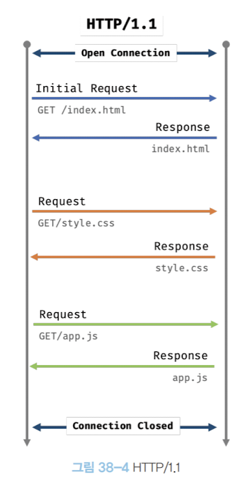

- 커넥션당 하나의 요청과 응답을 처리한다 (=== 여러 개의 요청을 한 번에 전송할 수 없고 응답도 마찬가지)
- 동시 요청이 불가능한 구조로 요청할 리소스 수에 비례하여 응답시간도 증가한다

#### HTTP2.0

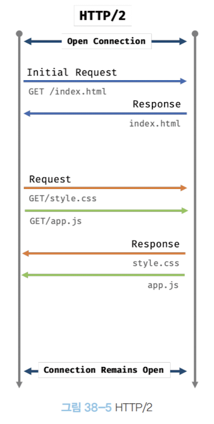

- 커넥션당 여러 개의 요청과 응답을 처리한다. (=== 다중 요청, 다중 응답이 가능)

## HTML 파싱과 DOM 생성

HTML 문서는 문자열로 이루어진 순수한 텍스트이다 순수한 텍스트인 HTML를 브라우저에 시각화 하려면 **HTML 문서를 파싱하여 브라우저가 이해할 수 있는 자료구조인 DOM으로 변환하여 메모리에 저장해야 한다**

```html
<!DOCTYPE html>
<html lang="en">
<head>
  <meta charset="UTF-8">
  <link rel="stylesheet" href="style.css">
</head>
<body>
  <ul>
    <li id="apple">Apple</li>
    <li id="banana">Banana</li>
    <li id="orange">Orange</li>
  </ul>
  <script src="app.js"></script>
</body>
</html>
```
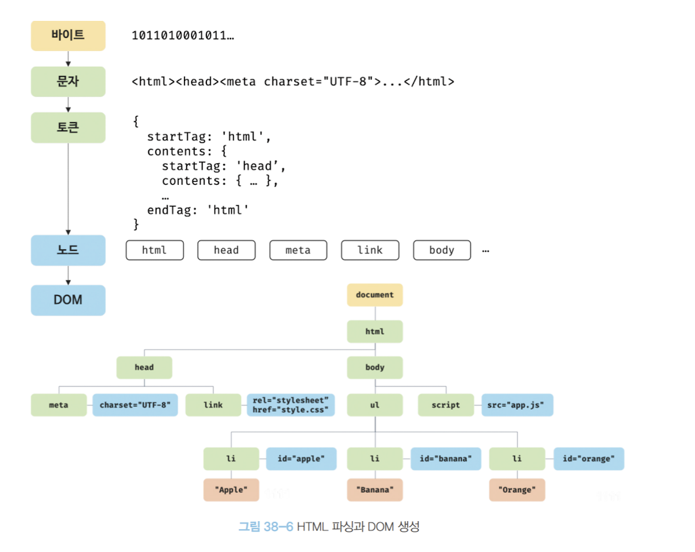

1. 서버에 존재하던 HTML 파일이 브라우저의 요청에 의해 응답된다

    - 서버는 브라우저가 요청한 HTML 파일을 읽어 들여 메모리에 저장한 다음 메모리에 저장된 바이트를 응답한다
    - 브라우저는 서버가 응답한 HTML 문서를 바이트 형태로 응답받는다

2. 응답된 바이트 형태의 HTML 문서는 meta 태그의 charset 어트리뷰트에 의해 지정된 인코딩 방식을 기준으로 문자열로 변환된다
3. 문자열로 변환된 HTML 문서를 읽어 들여 문법적 의미를 갖는 코드의 최소 단위인 토큰들로 분해한다
4. 각 토큰들을 객체로 변환하여 노드들을 생성한다

    - 노드는 이후 DOM을 구성하는 기본 요소가 된다
5. HTML 문서는 HTML 요소들의 집합으로 이루어지며 HTML 요소는 중첩 관계를 갖는다

    - 이러한 HTML 요소 간의 부자 관계를 반영하여 모든 노드들을 트리 자료구조인 DOM을 구성한다

## CSS 파싱과 CSSOM 생성


```css
body {
  font-size: 18px;
}

ul {
  list-style-type: none;
}
```

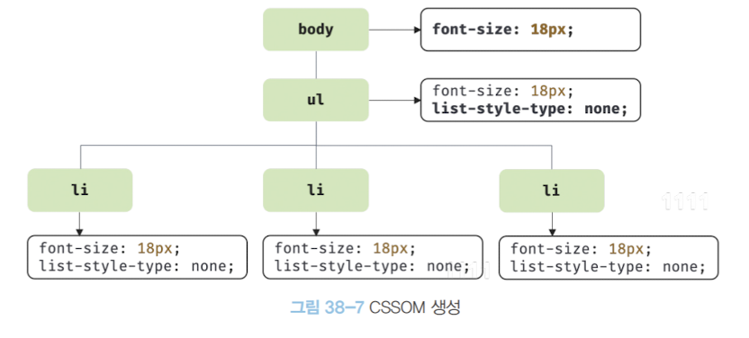

렌더링 엔진은 한 줄씩 순차적으로 HTML 파일을 파싱하여 DOM을 생성해 나간다

중간에 CSS를 로드하는 link 태그를 만나면 DOM 생성을 중지하고 link 태그 내부의 href 요소에 지정된 CSS 파일을 서버에 요청하여 로드한 CSS 파일 혹은 CSS 구문을 파싱하여 CSSOM을 생성한다

CSS 파싱이 완료된 이후 DOM 생성을 재개한다

## 렌더 트리 생성

렌더링 엔진은 서버로부터 응답된 HTML과 CSS를 파싱하여 각각 DOM과 CSSOM를 생성하고 렌더 트리로 결합한다

렌더 트리는 화면에 렌더링 되는 노드만으로 구성되어 있으며 화면에 렌더링 되지 않는 노드 (meta,script 태그)와 CSS에 의해 비표시(display:none)되는 노드들은 포함하지 않는다

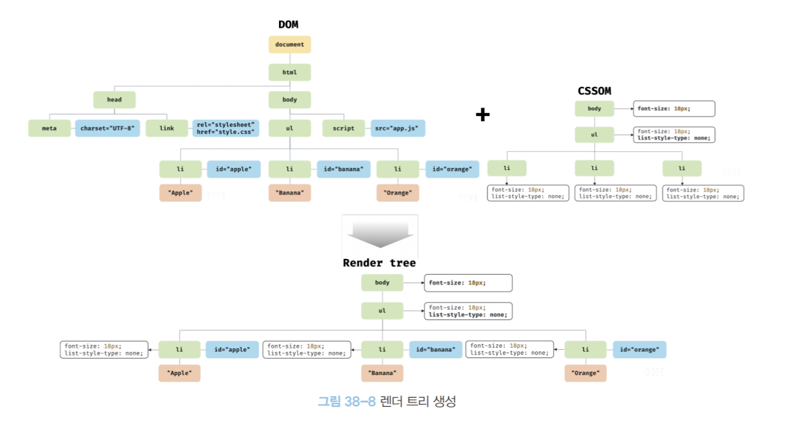

완성된 렌더 트리는 각 HTML 요소의 레이아웃(위치와 크키)을 계산하는 데 사용되며 브라우저 화면에 픽셀을 렌더링하는 페인팅 처리에 입력된다

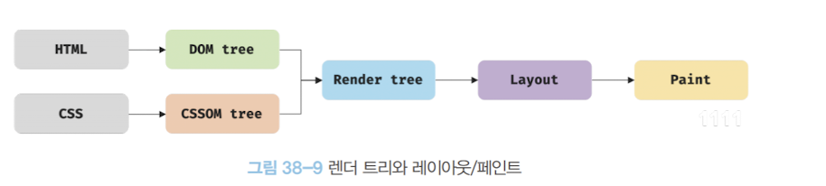

이 과정은 반복되어 실행될 수 있고 다음과 같은 경우 레이아웃 계산과 페인트 계산이 재차 실행된다.

- JS에 의한 노드 추가 또는 삭제
- 브라우처 창의 리사이징에 따른 뷰포트 크기변경
- HTML 요소의 레이아웃을 변경시키는 width/height, margin, padding, border, display, position, 오프셋 등의 스타일 변경

## 자바스크립트 파싱과 실행

DOM은 HTML 문서의 구조와 정보뿐만 아니라 JS로 HTML 요소와 스타일 등을 변경할 수 있는 인터페이스 DOM API를 제공한다

CSS 파싱 과정과 마찬가지로 렌더링 엔진은 DOM 생성 과정 중에 script 태그를 만나면 DOM 생성을 중ㄷ낟하고 script 태그의 src 어트리뷰트에 정의된 JS 파일을 서버에 요청한다

로드된 JS 파일을 파싱하기 위해 렌더링 엔진에서 JS 엔진으로 제어권을 넘기고 JS 파싱과 실행이 종료되면 다시 렌더링 엔진으로 제어권을 넘기고 DOM 생성을 재개한다

JS 엔진은 JS 코드를 파싱하여 CPU가 이해할 수 있는 저수준 언어로 변환하고 실행한다.

JS 엔진은 JS를 해석하여 AST(Abstract Syntax Tree, 추상 구문 트리)를 생성하고 AST를 기반으로 인터프리터가 실행할 수 있는 중간 코드인 바이트 코드를 생성하여 실행한다.

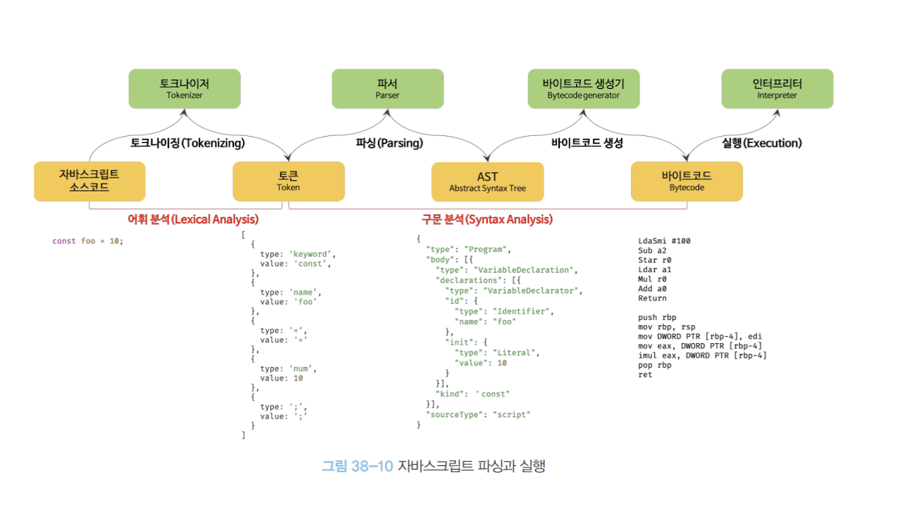

#### 토크나이징

단순한 문자열인 JS 소스코드를 어휘 분석하여 문법정 의미를 갖는 코드의 최소 단위인 토큰들로 분해한다

#### 파싱

토큰들의 집합을 구문 분석하여 AST(토큰에 문법적 의미와 구조를 반영한 트리)를 생성한다

AST를 사용해 typescript, babel, prettier 같은 트랜스파일러를 구현할 수 있다

[AST explorer](https://astexplorer.net)에서 다양한 오픈소스 JS 파서를 사용해 AST를 만들어 볼 수 있다

```typescript
type whisky = { type:"Sherry"|"Bourbon"|"Peat"|"Trash", years:number};

const grants: Whisky = {type:"Trash", years:4};
```

#### 바이트코드 생성과 실행

AST는 인터프리터가 실행할 수 있는 중간 코드인 바이트코드로 변환되고 실행된다

V8엔진의 경우 터보팬 이라 불리는 컴파일러에 으해 최적화된 머신코드로 컴파일되어 성능을 최적화한다

## 리플로우와 리페인트

JS 코드에 DOM 혹은 CSSOM을 변경하는 DOM API가 사용된 경우 변경된 DOM과 CSSOM은 다시 렌더 트리로 결합한다

변경된 렌더 트리를 기반으로 다시 레리아웃과 페인트 과정을 거치며 이를 **리플로우**, **리페인트** 라 한다

### 리플로우

레이아웃을 다시 계산하는 것

- 노드의 추가 삭제
- 요소의 크기/위치 변경
- 윈도우 리사이징 등 레이아웃에 영향을 주는 변경

### 리페인트

- 시각적 요소 변경

재결합된 렌더 트리를 기반으로 다시 페인트하는 것

리플로우와 리페인트가 반드시 순차적으로 실행되는 것은 아니며 레이아웃에 영향이 없는 변경은 리플로우 없이 리페인트만 실행된다

### 참조 [Reflow와 Repaint가 실행되는 시점- Jae Hyeok Jeong 개발자의 프론트엔드 면접 질문 저장소](https://github.com/Esoolgnah/Frontend-Interview-Questions/blob/main/Notes/important-5/reflow-repaint.md)

## script 태그의 async/defer 어트리뷰트

JS 파싱으로 DOM생성을 블로킹하는 문제가 발생할 경우 body 태그 아래로 script 태그를 위치하는 방법도 있지만 명시적으로 해결할 수 있는 방법이 있다

async / defer 어트리뷰트는 src 어트리뷰트를 사용해 외부 JS 파일을 로드하는 경우에만 사용할 수 있다

async / defer 어트리뷰트를 사용하면 HTML 파싱과 JS 파일 로드가 비동기적으로 동시에 실행되며 JS 실행 시점에 차이가 있다

### async

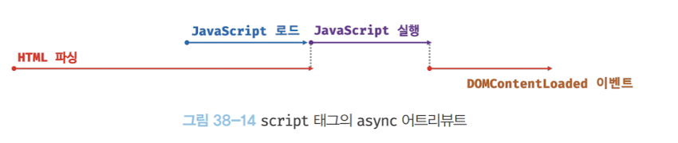

HTML 파싱과 JS 파일 로드가 비동기적으로 동시에 실행된다 단, JS의 파일의 파싱과 실행은 **JS 파일의 로드가 완료된 직후** 진행된다

여러개의 script 태그에 async 어트리뷰트를 지정하면 script 태그의 순서와 상관없이 로드가 완료된 JS부터 먼저 실행되어 실행 순서를 보장하지 않는다


### defer

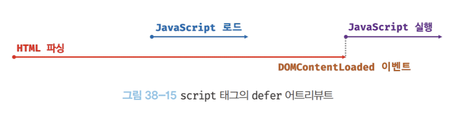

HTML 파싱과 JS 파일 로드가 비동기적으로 동시에 실행된다 단 JS 파일의 파싱과 실행은 **HTML 파싱이 완료된 직후(=== DOM 생성이 완료된 직후)** DOMContentLoaded 이벤트가 발생하면 진행된다.

DOM 생성 직후 실행되어야 할 JS에 유용하다

## 브라우저 주소창에 주소를 입력하고 메인 페이지가 화면에 표시될 때 까지의 과정을 설명해주세요.


###  Jae Hyeok Jeong 개발자의 프론트엔드 면접 질문 저장소

[주소창에 google.com을 입력하면 일어나는 일](https://github.com/Esoolgnah/Frontend-Interview-Questions/blob/main/Notes/important-5/what-happens-when-type-google.md) + 
[브라우저의 렌더링 원리](https://github.com/Esoolgnah/Frontend-Interview-Questions/blob/main/Notes/important-5/what-happens-when-type-google.md)