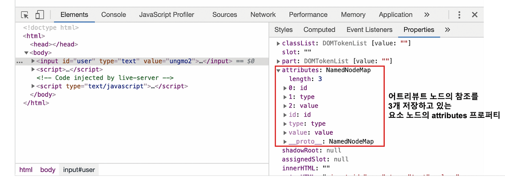
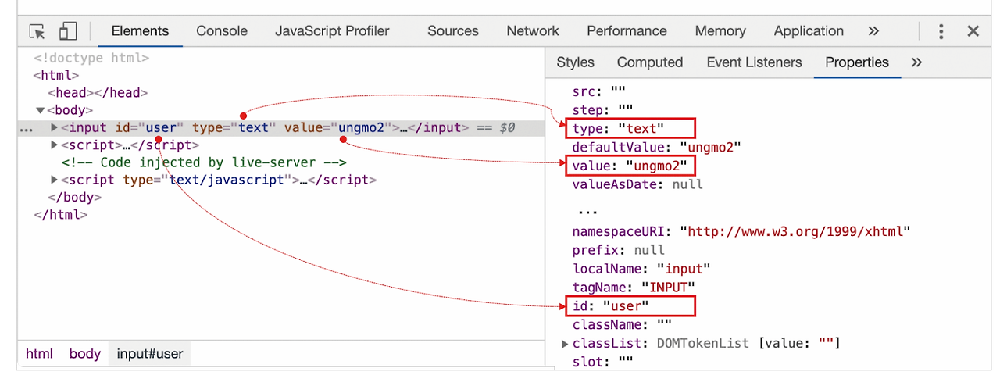

# DOM 39.7 - 9

## 39.7 어트리뷰트

### 어트리뷰트 노드 & attribute 프로퍼티

HTML 요소는 여러 개의 어트리뷰트(속성)를 가질 수 있다

공통적으로 사용 가능한 어트리뷰트

- 글로벌 어트리뷰트
  
  id, class, style, title, lang, tabindex, draggable, hidden

- 이벤트 핸들러 어트리뷰트

  onclick, onchange, onfocus, onblur, oninput, onkeypress, onkeydown, onkeyup, onmouseover, onsubmit, onload

특정 HTML 요소에만 사용 가능한 어트리뷰트

- input

  type, value, checked

```HTML
...
<input id="user" type="text" value="hello">
...
```

HTML 문서가 파싱될 때 HTML 요소의 어트리뷰트는 **각각 하나의 어트리뷰트 노드로 변환**되어 HTML 요소와 연결된다



모든 어트리뷰트 노드의 참조는 유사 배열 객체이자 이터러블인 *NamedNodeMap* 객체에 담겨서 HTML 요소 노드의 attribute 프로퍼티에 저장된다

```HTML
<!DOCTYPE html>
...
<input id="user" type="text" value="hello">
...
<script>
  // 요소 노드의 attribute 프로퍼티는 요소 노드의 모든 어트리뷰트의 참조가 담긴 NamedNodeMap 객체를 반환한다
  const { attributes } = document.getElementById("user");
  
  // NamedNodeMap {0: id, 1: type, 2: value, id: id, type: type, value: value, length: 3 }
  console.log(attribute)

  console.log(attributes.id.value) // user
  console.log(attributes.type.value) // text
  console.log(attributes.value.value) // hello
</script>
```

모든 어트리뷰트 노드는 요소 노드의 readonly 프로퍼티인 Element.prototype.attributes 프로퍼티로 접근 가능하며 getter를 통해 접근하여 모든 어트리뷰트 노드의 참조가 담긴 NamedNodeMap 객체를 반환한다

### HTML 어트리뷰트 조작

*Element.prototype.getAttribute/setAttribute* 메서드를 사용하여 attributes 프로퍼티를 통하지 않고 요소 노드에서 직접 HTML 어트리뷰트 값을 취득하거나 변경할 수 있다

```HTML
<!DOCTYPE html>
...
<input id="user" type="text" value="hello">
...
<script>
  const input = document.getElementById("user");

  // value 어트리뷰트 값을 취득
  const inputValue = input.getAttribute("value");
  console.log(inputValue) // hello

  // value 어트리뷰트 값을 변경
  input.setAttribute("value","foo");
  console.log(input.getAttribute("value")) // foo
</script>
```
- Element.prototype.getAttribute: 어트리뷰트 참조
- Element.prototype.setAttribute: 어트리뷰트 변경
- Element.prototype.hasAttribute: 어트리뷰트 확인
- Element.prototype.removeAttribute: 어트리뷰트 삭제

### HTML 어트리뷰트 vs DOM 프로퍼티

요소 노드 객체에는 HTML 어트리뷰트에 대응하는 프로퍼티(DOM 프로퍼티)가 존재한다

이 DOM 프로퍼티들은 HTML 어트리뷰트 값을 초기값으로 가지고 있다



DOM 프로퍼티는 sette/getter를 가지는 접근자 프로퍼티이며 참조와 변경이 가능하다

```HTML
<!DOCTYPE html>
...
<input id="user" type="text" value="hello">
...
<script>
  const input = document.getElementById("user");

  // 요소 노드의 value 프로퍼티 값을 변경
  input.value = "foo";

  // 요소 노드의 value 프로퍼티 값을 참조
  console.log(input.value) // foo
</script>
```

HTML 어트리뷰트는 DOM에서 중복 관리되고 있는 것처럼 보이나 그렇지 않다

- 요소 노드의 attributes 프로퍼티에서 관리하는 어트리뷰트 노드
- HTML 어트리뷰트에 대응하는 요소 노드의 프로퍼티(DOM 프로퍼티)

**HTML 어트리뷰트의 역할은 HTML 요소의 초기 상태를 지정하는 것이며 HTML 요소의 초기 상태를 의미하며 변하지 않는다**

```HTML
<input id="user" type="text" value="hello">
```

#### 첫 렌더링 시

1. 이 input 요소의 value 어트리뷰트는 input 요소가 렌더링될 떄 input 필드에 표시할 **초기값**을 지정한다

2. 이때 input 요소의 value 어트리뷰트는 어트리뷰트 노드로 변환되어 요소 노드의 attributes 프로퍼티에 저장된다

3. 이와 별도로 value 어트리뷰트의 값은 요소 노드의 value 프로퍼티에 할당된다

input 요소의 요소 노드가 생성되어 첫 렌더링이 끝난 시점까지 어트리뷰트 노드의 어트리뷰특 값과 요소 노드의 value 프로퍼티에 할당된 값은 HTML 어트리뷰트 값과 동일하다

```HTML
<!DOCTYPE html>
...
<input id="user" type="text" value="hello">
...
<script>
  const input = document.getElementById("user");
  
  // attributes 프로퍼티에 wj정된 value 어트리뷰트 값
  console.log(input.getAttribute("value")); // hello

  // 요소 노드의 value 프로퍼티에 저장된 value 어트리뷰트 값
  console.log(input.value); // hello
</script>
```

#### 사용자 입력이 발생 시

**요소 노드는 state를 가지고 있다**(input에 입력한 값, checkbox에 선택된 값등...)

사용자가 입력을 진행할 때 input 요소 노드는 사용자 입력에 의해 생성된 **최신 상태(foo)**와 HTML 어트리뷰트로 지정한 **초기 상태(hello)**를 관리한다

**요소 노드는 2개의 상태(초기 상태, 최신 상태)를 관리한다**

- **요소의 초기 상태는 어트리뷰트 노드가 관리**

- **요소의 최신 상태는 DOM 프로퍼티가 관리**

### 어트리뷰트 노드

**HTML 어트리뷰트로 지정한 HTML 요소의 초기 상태는 어트리뷰트 노드가 관리한다**

어트리뷰트 노드가 관리하는 초기 상태값을 취득하거나 변경하려면 getAttribute/setAttribute 메서드를 사용한다

HTML 요소에 지정한 어트리뷰트 값은 사용자 입력에 의해 변하지 않으므로 결과는 언제나 동일하다

### DOM 프로퍼티

**사용자가 입력한 최신 상태는 HTML 어트리뷰트에 대응하는 요소 노드의 DOM 프로퍼티가 관리한다**

### HTML 오트리뷰트와 DOM 프로퍼티의 대응 관계

대부분의 HTML 어트리뷰트는 HTML 어트리뷰트 이름과 동일한 DOM 프로퍼티와 1:1로 대응한다

단, 다음과 같은 HTML 어트리뷰트와 DOM 프로퍼티가 언제나 1:1 대응하는 것은 아니며, HTML 어트리뷰트 이름과 DOM 프로퍼티 기가 반드시 일치하는 것은 아니다

- id 어트리뷰트와 id 프로퍼티는 1:1 대응하며, 동일한 값으로 연동한다
- input 요소의 value 어트리뷰트는 value 프로퍼티와 1:1 대응한다 하지만 value 어트리뷰트는 초기 상태를 value 프로퍼티는 최신 상태를 가진다
- class 어트리뷰트는 className, classList 프로퍼티와 대응한다(JS에서 class는 예약어이기 때문)
- for 어트리뷰트는 htmlFor 프로퍼티와 1:1 대응한다
- td 요소의 colspan 어트리뷰트는 대응하는 프로퍼티가 존재하지 않는다
- textContent 프로퍼티는 대응하는 어트리뷰트가 존재하지 않는다
- 어트리뷰트 이름은 대소문자를 구분하지 않지만 대응하는 프로퍼티 기는 카멜 케이스를 따른다

### DOM 프로퍼티 값의 타입

getAttribute로 최득한 값은 언제나 string이나 DOM 프로퍼티로 취득한 최신 상태 값은 string이 아닐 수 있다

```HTML
<!DOCTYPE html>
...
<input type="checkbox" checked>
...
<script>
  const checkbox = document.querySelector('input[type=checkbox]');
  
  // getAttribute 메서드로 취득한 어트리뷰트 값은 언제나 문자열이다
  console.log(checkbox.getAttribute("value")); // ''

  // DOM 프로퍼티로 취득한 최신 상태 값은 문자열이 아닐 수 있다
  console.log(checkbox.checked); // true
</script>
```

### data 어트리뷰트와 dataset 프로퍼티

data 어트리뷰트와 dataset 프로퍼티를 사용하면 HTML 요소에 정의한 사용자 정의 어트리뷰트와 JS 간에 데이터를 교환할 수 있다

data 어트리뷰트는 data-user-id, data-role 과 같이 data- 접두사 다음에 임의 이름을 붙여 사용한다

```HTML
<!DOCTYPE html>
...
<ul class="user">
  <li id="1" data-user-id="7621" data-role="admin">LEE</li>
  <li id="2" data-user-id="9524" data-role="subscriber">KIM</li>
</ul>
<script>
  const users = [...document.querySelector(".user").children];

  // user-id가 '7521'인 요소 노드를 취득한다
  const user = users.find(user => user.dataset.userID === "7621");

  // user-id가 '7521'인 요소 노드에서 data-role의 값을 취득한다
  console.log(user.dataset.role); // admin
  
  // user-id가 '7521'인 요소 노드에서 data-role의 값을 변경한다
  user.dataset.role = "subscriber";

  // dataset 프로퍼티는 DOMStringMap 객체를 반환한다
  console.log(use.dataset) // DOMStringMap {userId: "7621", "role": "subscriber"}
</script>
...
```

data 어트리뷰트의 값은 HTMLElement.dataset 프로퍼티로 취득할 수 있다

dataset 프로퍼티는 HTML 요소의 모든 data 어트리뷰트의 정보를 제공하는 DOMStringMap 객체를 반환한다

DOMStringMap 객체는 data 어트리뷰트의 사용자 지정 프로퍼티를 가지고 있고 이를 통해 data 어트리뷰트 값을 취득하거나 변경할 수 있다

존재하지 않는 이름을 키로 사용하여 dataset 프로퍼티에 값을 할당하면 HTML 요소에 data 어트리뷰트가 추가된다

카멜 케이스로 추가한 프로퍼티 기는 data 어트리뷰트에 data- 케밥 케이스로 변환되어 추가된다

## 39.8 스타일

### 인라인 스타일 조작

HTMLElement.prototype.style 프로퍼티는 setter와 getter 모두 존재하는 접근자 프로퍼티로서 요소 노드의 인라인 스타일을 취득하거나 추가 또는 변경한다

```HTML
<!DOCTYPE html>
...
<div style="color: red">hello world</div>
<script>
  const div = document.querySelector("div");

  // 인라인 스타일을 취득
  console.log(div.style); // CSSStyleDeclaration {0: "color", ... }

  // 인라인 스타일을 변경
  div.style.color = "blue";

  // 인라인 스타일 추가
  div.style.width = "100px";
  div.style.height = "100px";
  div.style.backgroundColor = "yello";
</script>
...
```

style 프로퍼티를 참조하면 CSSStyleDeclaration 타입의 객체를 반환한다

CSS 프로퍼티는 케밥 케이스를 따르고 이에 대응하는 CSSStyleDeclaration 객체의 프로퍼티는 카멜 케이스를 따른다

케밥 케이스의 CSS 프로퍼티를 그대로 사용하려면 대괄호 표기법을 사용한다
```javascript
div.style.backgroundColor = "yellow"; 
div.style.["background-color"] = "yellow";

```
단위 지정이 필요한 CSS 프로퍼티의 값은 반드시 단위를 지정해야 한다

px, em, % 등의 크기가 필요한 프로퍼티에 값을 할당할 때 단위를 생략하면 적용되지 않는다

### 클래스 조작

.으로 시작하는 클래스 선택자를 사용하여 CSS class를 미리 정의한 다은 HTML 요소의 class 어트리뷰트 값을 변경하여 HTML 요소 스타일을 변경할 수 있다

#### className

Element.prototype.className 프로퍼티는 setter와 getter 모두 존재하는 접근자 프로퍼티로서 HTML 요소의 class 어트리뷰트 값을 취득하거나 변경한다

```HTML
<!DOCTYPE html>
<head>
  <style>
    .box {
      width: 100px; height: 100px;
      background-color: antiquewhite;
    }
    .red { color: red; }
    .blue { color: blue; }
  </style>
</head>
<body>
  <div class="box red">hello world</div>
  ...
  <script>
    const box = document.querySelector(".box");

    // .box 요소의 class 어트리뷰트 값을 취득
    console.log(div.className); // "box red"

    // 인라인 스타일을 변경
    div.className = box.className.replace("red","blue");
  </script>
  ...
</body>
```

#### classList

Element.prototype.classList 프로퍼티는 class 어트리뷰트의 정보를 담은 DOMTokenList 객체를 반환한다

DOMTokenList 객체는 class 어트리뷰트의 정보를 나타내는 컬렉션 객체로서 유사 배열 객체이면서 이터러블이다

- add(...className)

  인수로 전달한 1개 이상의 문자열을 class 어트리뷰트 값으로 추가한다

  ```javascript
  box.className.add("foo") // -> class="box red foo"
  box.className.add("bar", "baz") // -> class="box red foo bar baz"
  ```
  
- remove(...className)

  인수로 전달한 1개 이상의 문자열과 일치하는 클래스를 class 어트리뷰트에서 삭제한다

  인수로 전달한 문자열과 일치하는 클래스가 class 어트리뷰트에 없으면 에러 없이 무시된다

  ```javascript
  box.className.remove("foo") // -> class="box red bar baz"
  box.className.remove("bar", "baz") // -> class="box red"
  box.className.remove("x") // -> class="box red"
  ```
 
- item(...className)

  인수로 전달한 index에 해당하는 클래스를 class 어트리뷰트에서 반환한다

  ```javascript
  box.className.item(0) // -> "box"
  box.className.item(1) // -> "red"
  ```

- contains(...className)

  인수로 전달한 문자열과 일치하는 클래스가 class 어트리뷰트에 포함되어 있는지 확인한다

  ```javascript
  box.className.contains("box") // ->  true
  box.className.contains("blue") // ->  false
  ```

- replace(oldClassName, newClassName)

  class 어트리뷰트에서 첫 번째 인수로 전달한 문자열을 두 번째 인수로 전달한 문자열로 변경한다

  ```javascript
  box.className.replace("red", "blue") // -> class="box blue"
  ```

- toggle(className[.force])

  class 어트리뷰트에 인수로 전달한 문자열과 일치하는 클래스가 존재하면 제거하고 존재하지 않으면 추가한다

  ```javascript
  box.className.toggle("foo") // -> class="box blue foo"
  box.className.toggle("foo") // -> class="box blue"
  ```

  두 번째 인수로 불리언 값으로 평가되는 조건식을 전달할 수 있다
  - true: class 어트리뷰트에 강제ㅔ로 첫 번째 전달 받은 인수를 추가
  - false: class 어트리뷰트에서 강제로 첫 번째 인수로 전달 받은 문자열을 제거한다

  ```javascript
  // class 어트리뷰트에 강제로 'foo' 클래스를 추가
  box.className.toggle("foo", true) // -> class="box blue foo"

  // class 어트리뷰트에 'foo' 클래스를 제거
  box.className.toggle("foo", false) // -> class="box blue"
  ```

### 요소에 적용되어 있는 CSS 스타일 참조

style 프로퍼티는 인라인 스타일만 반환한다 따라서 클래스를 적용한 스타일이나 상속을 통해 암묵적으로 적용된 스타일은 참조할 수 없다

HTML에 적용된 모든 CSS를 참조하려는 경우 getComputedStyle 메서드를 사용한다

window.getComputedStyle(element,[,presudo]) 메서드는 첫 번째 인수에 전달한 노드에 적용되어 있는 평가된 스타일을 CSSStyleDeclaration 객체에 담아 반환한다

평가된 스타일이란 요소 노드에 적용되어 있는 모든 스타일

링크 스타일, 임베딩 스타일, 인라인 스타이르 JS에 적용된 스타일, 상속된 스타일, 기본 스타일 등 모든 스타일이 조합되어 최종적으로 적용된 스타일을 말한다

getComputedStyle의 두번 째 인수(presudo) :after, :before와 같은 요소를 지정하는 문자열을 전달할 수 있다

```HTML
<!DOCTYPE html>
<head>
  <style>
    body {
      color: red;
    }

    .box {
      width: 100px; 
      height: 50px;
      background-color: cornsilk;
      border: 1px solid black
    }

    .box:before {
      content: 'Hello'
    }
  </style>
</head>
<body>
  <div class="box">Box</div>
  ...
  <script>
    const box = document.querySelector(".box");

    const computedStyle = window.getComputedStyle(box)
    console.log(div.className); // CSSStyleDeclaration

    // 임베딩 스타일
    console.log(computedStyle.width) // 100px
    console.log(computedStyle.height) // 50px
    console.log(computedStyle.backgroundColor) // rgb(255,248,220)  
    console.log(computedStyle.border) // 1px solid rgb(0,0,0)

    // 상속 스타일
    console.log(computedStyle.color) // rgb(255,0,0)

    // 기본 스타일
    console.log(computedStyle.display) // block

    // 의사 요소 :before의 스타일을 취득한다
    const computedStyle = window.getComputedStyle(box, ":before")
    console.log(computedStyle.content) // "Hello"
  </script>
  ...
</body>
```

### DOM 표준

HTML 과 DOM 표준은 W3C 와 WHATWG 라는 두 단체가 공통된 표준을 만들어 왔으나 현재는 구글, 애플, MS, 모질라로 구성된 4개의 주류 브라우저 벤더사가 주도하는 WHATWG가 단일 표준을 정한다

현재 DOM은 다음과 같이 4개의 레벨이 있다

|레벨|표준 문서 URL|
|---|---|
|DOM level 1|https://www.w3c.org/TR/REC-DOM-Level-1|
|DOM level 2|https://www.w3c.org/TR/DOM-Level-2-Core|
|DOM level 3|https://www.w3c.org/TR/DOM-Level-3-Core|
|DOM level 4|https://dom.spec.whatwg.org|