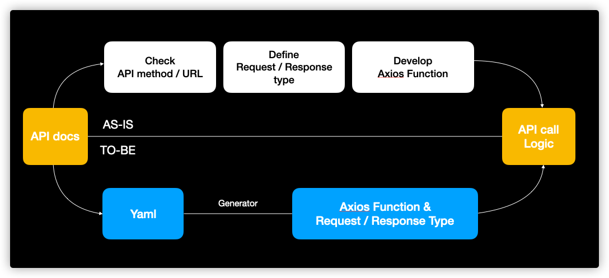
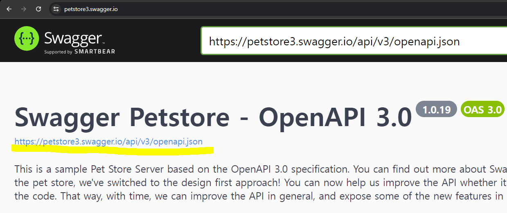
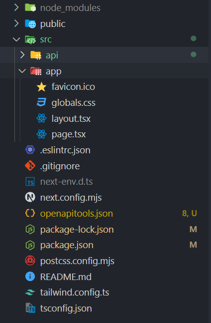
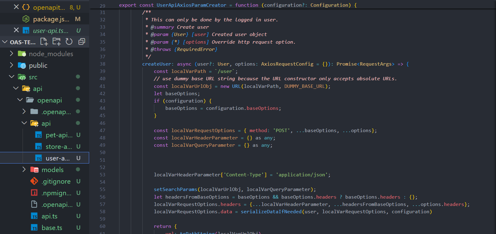

# OAS (Open API Spec)

## 정의

RESTful API를 쉽게 관리하고 사용할 수 있게 도와주는 표준 명세 작성 방식

API의 구조와 작동 방식을 명확하게 문서화한 .json 혹은 .yaml 확장자 파일

open-api-generator를 사용해 OAS 파일에 정의된 명세에 맞는 타입스크립트 파일을 생성한다

## 사용 배경

토이 프로젝트 또는 팀 프로젝트를 진행해 봤다면 백엔드 API를 API 연동할 때 참고한 문서는 다음과 같을 것이다.

- 공식 문서
- *"스웨거"*
- 포스트맨

Open API 관리자 또는 백엔드 개발자가 공들여 문서화한 결과물들은 실제 API 연동을 위한 코드를 공유하는 것은 아니다. 수 많은 API의 요청, 응답, 에러 핸들링을 위한 타입들이 필요하며 SDK가 제공되는 경우를 제외하고는 직접 작성해야 했다.

또한 개발 진행중에도 기획의 변경되거나, 구현을 잘못되었다는 사실을 알게 되거나, 이름이 모호해서 등의 이유로 API 스펙은 크고 작은 변경은 언제 발생해도 이상하지 않다.

개발자라면 변경된 API 스펙을 다시 확인하고 적용한 뒤 다시 개발을 시작하면 기존의 코드에서 충돌과 버그들이 생긴 경험이 있을 것이다. 대부분의 버그는 서버에서 넘어온 데이터와 관련있으며 원인은 서버의 DTO 타입을 개발자가 재정의 하고 있고 API 통신 스펙을 잘못사용한 경우이다.



[image credit](https://hmos.dev/how-to-use-oas-generator#%EA%B7%B8%EB%9E%98%EC%84%9C-%EB%AD%90%EA%B0%80-%EC%A2%8B%EC%9D%80%EB%8D%B0)


### 기존의 API 연동 개발 순서 "AS-IS"

1. API 문서를 확인하여 URL, method 등 호출 스펙을 추출한다.

2. 요청 및 응답을 확인하고 해당 타입을 정의한다.

3. 호출 함수를 정의한다.

4. API 스펙이 업데이트 되면 1 ~ 3의 과정을 반복한다.

기존의 API 연동 개발 순서는 모든 과정에서 휴먼 에러가 발생할 여지가 다분하며 개발 생산성의 병목 지점이 되기도 한다.

### API 연동 개발 순서 순서 "TO-BE"

1. API 문서의 yaml 또는 json 형식의 OAS 파일을 가져온다.

2. OAS generator를 사용해 호출 함수 및 요청, 응답의 타입까지 생성한다.

3. API 스펙이 업데이트 되면 OAS generator를 다시 실행한다.

4. git diff로 변경점만 확인 가능하다.

API 연동 개발 순서는 개발자의 휴먼 에러가 발생할 여지를 최대한 줄이고 *딸깍* 으로 개발 생산성을 높힐 수 있다.

## 왜 쓰나

프론트엔드 개발 팀에서 API에 대한 타입 정의와 API 연동 스펙에 대한 단일 진실 공급원이 생기고 백엔드 OAS를 재정의하지 않아도 되어 생산성을 높힐 수 있다.

백엔드 개발자 또한 OAS 작성을 통해 다른 개발자와 API 연동 스펙 이슈에 대한 소통문제를 최소화하고 컴파일러에게 위임하여 다른 개발을 할 수 있다

## 단점

### API 문서화 방법은 개발팀 by 개발팀

스웨거를 사용한 API 문서화는 어렵지 않게 OAS를 도입할 수 있다. 하지만 API 문서에서 yaml 또는 json 파일로 OAS를 추출할 수 없는 상황에서는 유효하지 않을 것이다.

### API 문서의 정확도

OAS generator는 API 문서를 기반으로 코드를 생성하기 때문에 API 문서의 정확도에 의존성을 가진다. DTO 속성의 optional 지정을 남발하거나 서버의 API 개발을 완료하고 API 문서를 업데이트하지 않은 경우 오히려 프로젝트는 더 복잡해진다.

### 번들 사이즈 증가와 중복 코드

OAS generator는 API 문서와 template를 기반으로 코드를 생성한다. template 패턴이 반복되어 코드 중복이 발생하고 나아가 번들 사이즈 증가로 이어진다.
최적화 하지 않은 OAS generator 사용은 번들 사이즈를 증가시켜 성능에 영향을 주게된다.

### 초기 도입시 설정 러닝커브와 유지보수

세상 만사 실버 불릿은 없다. OAS generator 도입 시 옵션, 코드 템플릿, 파일 구조등 설정 과정이 복잡하고 러닝 커브가 있다. 팀 단위 프로젝트에서는 팀원들에게 적절한 안내가 필요해 보인다. 

## 실습

### 사용할 OAS

[Swagger PetStore](https://petstore3.swagger.io/)



### 방법 1 : openapi-generator-cli

[공식 문서](https://openapi-generator.tech/)

Java 기반으로 작성되어 JDK가 필요하나 config 파일을 분리하여 cli에 전달할 수 있다.

커스텀 template을 사용할 수 있다.

open-api-generator-cli를 이용해서 input, output path, cofig, template를 지정해서 code를 생성한다

#### cli와 config 설정

```json
// package.json
{
  ...
  "scripts" : {
    "openapi": openapi-generator-cli generate -g typescript-axios -i 타겟 OAS 경로 -o 생성한 코드를 저장할 경로
  }
}
```
- -g: generator를 설정하는 옵션, typescript-axios를 사용한다.
- -i: input을 의미하는 옵션, 타겟이 되는 OAS 파일 위치를 지정한다.
- -o: 코드를 생성할 위치를 지정한다.
- -c: generator 설정 파일을 지정한다.
- -t: 사용할 커스텀 template 설정 파일 경로를 지정한다.

generater 마다 설정값이 다르며 openapitools.json 파일로 설정값을 관리할 수 있다.

#### 실습

Nextjs 프로젝트에 적용하기 위해 nextjs 프로젝트를 생성한다

```bash
npx create-next-app@latest oas-test
npm i -D @openapitools/openapi-generator-cli -g
```

프로젝트의 루트 경로에 제너레이터 설정 파일을 생성한다.
추가적인 옵션은 [공식 문서](https://openapi-generator.tech/docs/generators/typescript-axios#metadata)를 참고하자.

```json
// openapitools.json
{
  // OpenAPI Generator CLI 구성 스키마 정의
  "$schema": "node_modules/@openapitools/openapi-generator-cli/config.schema.json",
  
  // JSON 파일의 들여쓰기 공백 수
  "spaces": 2,
  
  "generator-cli": {
    // OpenAPI Generator CLI 버전
    "version": "5.3.1"
  },
  
  // ES6 문법 지원 여부
  "supportsES6": true,
  
  // API와 모델을 별도의 파일로 생성할지 여부
  "withSeparateModelsAndApi": true,
  
  // 생성된 API 클래스가 위치할 패키지명
  "apiPackage": "api",
  
  // 생성된 모델 클래스가 위치할 패키지명
  "modelPackage": "models",
  
  // enum 프로퍼티의 명명 규칙 (원본 유지)
  "enumPropertyNaming": "original",
  
  // enum 이름에 추가할 접미사 (없음)
  "enumNameSuffix": "",
  
  // API 호출 시 단일 객체 파라미터 사용 여부
  "useSingleRequestParameter": false,
  
  // TypeScript 3.0 이상의 기능 사용 여부
  "typescriptThreePlus": true
}
```
./src/api 폴더를 생성하고 준비를 마친다.



실습에 사용할 OAS 파일은 curl을 사용하여 다운로드하여 사용한다. 직접 다운 받아 프로젝트에 추가해도 좋다.

```json
// package.json
{
  ...
  "scripts" : {
    "openapi": "curl https://petstore3.swagger.io/api/v3/openapi.json > ./src/api/target-api.json && openapi-generator-cli generate -g typescript-axios -i ./src/api/target-api.json -o ./src/api/openapi -c ./openapitools.json"
  }
}

```
1. **curl https://petstore3.swagger.io/api/v3/openapi.json > ./src/api/target-api.json**

    - curl은 cli 도구로, URL로부터 데이터를 전송받거나 전송하기 위해 사용된다.
    - curl에 전달한 주소로부터 데이터를 요청한다.
    - ">" 연산자는 왼쪽에서 오른쪽으로 데이터를 리디렉션한다. 즉, curl을 통해 받은 데이터를 ./src/api/target-api.json 파일에 저장한다.

2. **openapi-generator-cli generate -g typescript-axios -i ./src/api/target-api.json -o ./src/api/openapi**

    - generate: 생성 시작
    - -g typescript-axios: typescript-axios 제너레이터를 지정한다.
    - -i ./src/api/target-api.json: OAS 파일의 경로를 지정한다. 
    - -o ./src/api/openapi: 생성 결과를 ./src/api/openapi 경로에 저장한다.

3. **-c ./openapitools.json**

    - 루트 경로에 생성한 제너레이터 설정 파일 지정한다.

```bash
npm run openapi
```
실행결과 api 폴더와 models 폴더가 생성된다.



커스텀 template는 실습하지 않고 [참고한 블로그 글](https://hmos.dev/how-to-use-oas-generator#custom-template%EC%9D%80-%EC%96%B8%EC%A0%9C-%EC%82%AC%EC%9A%A9%ED%95%A0%EA%B9%8C)로 대체한다.

### 방법 2 : swagger-typescript-api

[공식 문서](https://www.npmjs.com/package/swagger-typescript-api?activeTab=readme) & [github 저장소](https://github.com/acacode/swagger-typescript-api)

별도의 config파일을 cli에 전달할 수 없어 스크립트가 길어진다.

```yaml
{
  Options:
  -v, --version: 현재 버전 출력
  -p, --path <string>: swagger 스키마의 경로 또는 URL
  -o, --output <string>: TypeScript API 파일의 출력 경로 (기본값: "./")
  -n, --name <string>: 출력 TypeScript API 파일의 이름 (기본값: "Api.ts")
  -t, --templates <string>: 템플릿이 포함된 폴더의 경로
  -d, --default-as-success: "default" 응답 상태 코드를 성공 응답으로 사용
                            일부 swagger 스키마는 기본적으로 "default" 응답 상태 코드를 성공 응답 타입으로 사용합니다. (기본값: false)
  -r, --responses: 요청 응답에 대한 추가 정보 생성
                    잘못된 응답에 대한 타이핑도 추가 (기본값: false)
  --union-enums: 모든 "enum" 타입을 유니온 타입 (T1 | T2 | TN)으로 생성 (기본값: false)
  --add-readonly: readonly 속성 생성 (기본값: false)
  --route-types: API 경로에 대한 타입 정의 생성 (기본값: false)
  --no-client: API 클래스를 생성하지 않음
  --enum-names-as-values: 'x-enumNames'의 값을 enum 값으로 사용 (키로만 사용하지 않음) (기본값: false)
  --extract-request-params: 요청 매개변수를 데이터 계약으로 추출 (경로 매개변수와 쿼리 매개변수를 하나의 객체로 결합)
  --extract-request-body: 요청 본문 타입을 데이터 계약으로 추출 (기본값: false)
  --extract-response-body: 응답 본문 타입을 데이터 계약으로 추출 (기본값: false)
  --extract-response-error: 응답 오류 타입을 데이터 계약으로 추출 (기본값: false)
  --modular: HTTP 클라이언트, data-contracts 및 경로에 대해 별도의 파일 생성 (기본값: false)
  --js: 선언 파일이 있는 JS API 모듈 생성 (기본값: false)
  --module-name-index <number>: 경로 분리를 위해 사용할 경로 인덱스 결정 (예: GET:/fruits/getFruit -> index:0 -> moduleName -> fruits) (기본값: 0)
  --module-name-first-tag: 첫 번째 태그를 기준으로 경로 분리 (기본값: false)
  --disableStrictSSL: 엄격한 SSL 비활성화 (기본값: false)
  --disableProxy: 프록시 비활성화 (기본값: false)
  --axios: axios HTTP 클라이언트 생성 (기본값: false)
  --unwrap-response-data: 응답에서 데이터 항목 풀기 (기본값: false)
  --disable-throw-on-error: response.ok가 true가 아니더라도 오류를 발생시키지 않음 (기본값: false)
  --single-http-client: Api 생성자에 HttpClient 인스턴스를 전달할 수 있음 (기본값: false)
  --silent: 콘솔에 오류만 출력 (기본값: false)
  --default-response <type>: 빈 응답 스키마에 대한 기본 타입 (기본값: "void")
  --type-prefix <string>: 데이터 계약 이름 접두사 (기본값: "")
  --type-suffix <string>: 데이터 계약 이름 접미사 (기본값: "")
  --clean-output: API 생성 전에 출력 폴더를 정리합니다. 경고: 데이터 손실이 발생할 수 있음 (기본값: false)
  --api-class-name <string>: API 클래스의 이름 (기본값: "Api")
  --patch: swagger 소스 정의의 작은 오류 수정 (기본값: false)
  --debug: 이 도구 내부의 프로세스에 대한 추가 정보 (기본값: false)
  --another-array-type: Array<Type>으로 배열 타입 생성 (기본적으로 Type[]) (기본값: false)
  --sort-types: 필드 및 타입 정렬 (기본값: false)
  --sort-routes: 경로를 알파벳 순으로 정렬 (기본값: false)
  --custom-config <string>: 사용자 정의 구성: primitiveTypeConstructs, hooks, 등 (기본값: "")
  --extract-enums: 인라인 인터페이스/타입 콘텐츠에서 모든 열거형을 추출하여 TypeScript 열거형 구조로 생성 (기본값: false)
  -h, --help: 명령어 도움말 표시

Commands:
  generate-templates: ".ejs" 템플릿 생성에 필요
    -o, --output <string>: 생성된 템플릿의 출력 경로
    -m, --modular: HTTP 클라이언트, data-contracts 및 경로에 대해 별도의 파일로 템플릿 생성 (기본값: false)
    --http-client <string>: HTTP 클라이언트 유형 (가능한 값: "fetch", "axios") (기본값: "fetch")
    -c, --clean-output: 템플릿 생성 전에 출력 폴더를 정리합니다. 경고: 데이터 손실이 발생할 수 있음 (기본값: false)
    -r, --rewrite: 기존 템플릿의 내용을 덮어씀 (기본값: false)
    --silent: 콘솔에 오류만 출력 (기본값: false)
    -h, --help: 명령어 도움말 표시
}
```

#### 설치

```bash
npm i -D swagger-typescript-api -g
```

#### script 설정


플레이 그라운드가 없는지 있는데 못 찾는 건지... 옵션의 개수가 많아서 조합해가면서 공부하는 것이 빠르다.

```json
// package.json
{
  "scripts": {
    "openapi": "swagger-typescript-api - 옵션 -p OAS 파일 경로 -o 실행 결과 저장 경로"
  }
}
```

#### 실행

```bash
npm run openapi
```