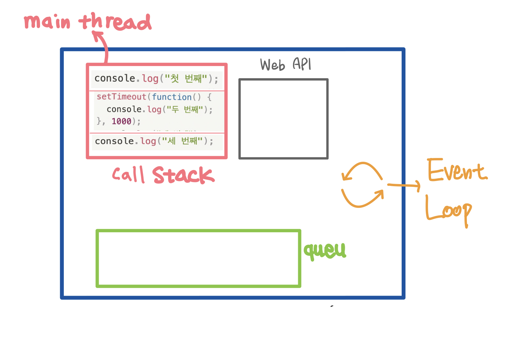
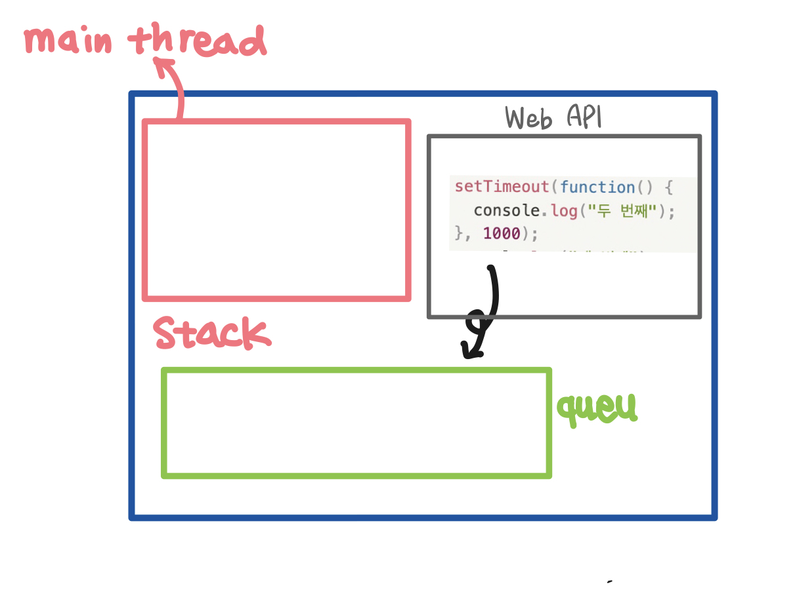
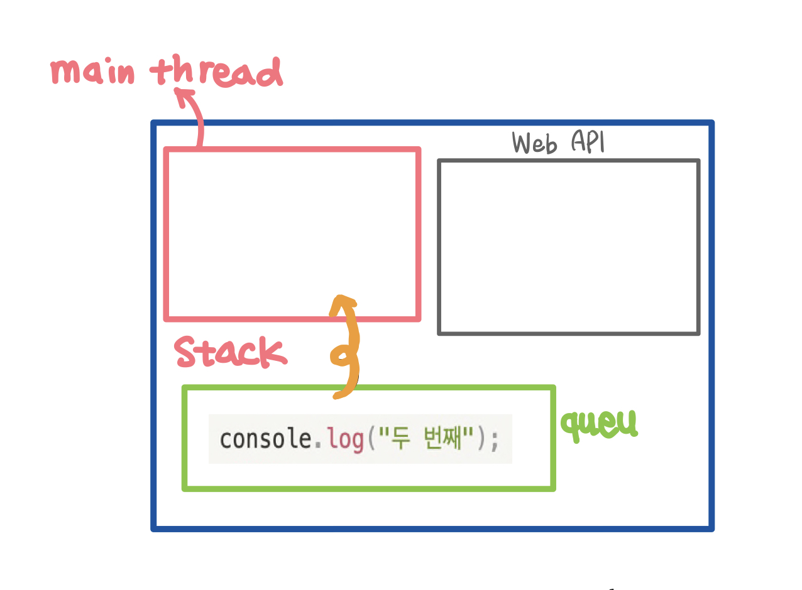
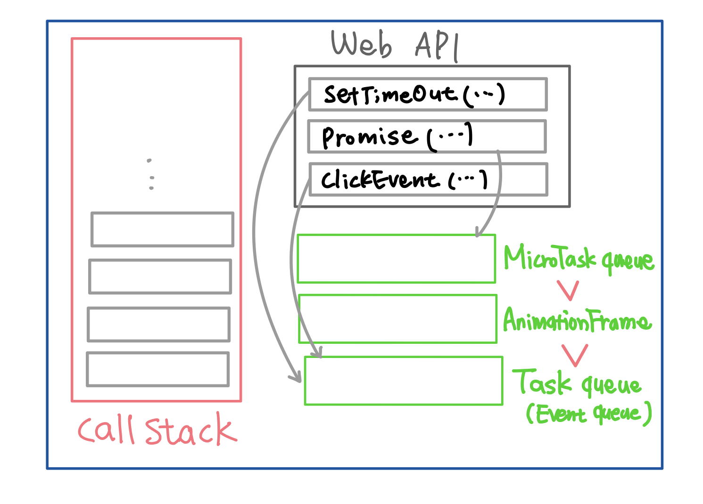

자바스크립트는 싱글 스레드에서 작동한다. 즉 한번에 하나의 작업만 동기적으로 처리할 수 있다. 그러나 이러한 싱글 스레드 기반의 JS에서도 우리는 많은 비동기 작업을 처리한다. 웹 에서는 사용자에게 많은 양의 정보를 다양한 방식으로 제공하려면 비동기 작업이 필수적이다. 그렇다면 싱글스레드인 자바스크립트 환경에서 어떻게 우리는 비동기 작업을 수행하는 것일까?

이를 알기 위해서는 비동기 처리를 도와주는 이벤트 루프, 태스크 큐 등의 개념을 알아야 한다.

(아래의 내용은 자바스크립트 런타임 중 가장 유명한 v8(자바스크립트 엔진)을 기준으로 한다)

v8이 뭐고 어떤 역할을 해주는뎅?

## JavaScript Engine

자바스크립트 언어를 해석해서 컴퓨터에게 전달해서 동작하도록 해줌

- ex
  - V8 엔진 👍👍 → Chrome, node.js
    - 구글에서 만든 크롬 브라우저에 내장된 자바스크립트를 실제 실행하는 엔진.

### JavaScript 엔진의 동작 과정

- 파싱
  - js 코드를 읽어들이고 문법을 분석하여 추상 구문 트리(AST)를 생성. 이 단계에서 코드의 구조와 의미를 파악.
  - ex)const x = 10; → const, x,=,10,; 와 같은 문법적으로 의미있는 토큰으로 분해
    - AST:
- 컴파일 및 최적화
  - 생성된 AST가 머신코드로 변환됨.
  - jit컴파일러: 자주 실행되는 코드 블록을 실시간을 모니터링하여 그 코드블록을 기계어로 컴파일하여 최적화된 형태호 변환 → 재사용 시 성능 향상
- 실행
  - 기계 코드가 실행됨. main 스레드에서 이루어짐. 스택(Stack)과 큐(Queue)를 통해 관리됨
    비

## 비동기처리가 되는 과정

---



### 콜스택

위의 그림에서 보이는 것과 같이 자바스크립트는 싱글 스레드이기 때문에 수행할 코드나 함수가 순차적으로 콜스택에 쌓이며 이가 순차적으로 실행된다.

### 큐

실행해야 할 태스크의 집합이다. 이때 실행해야 할 작업은 비동기 함수의 콜백함수나 이벤트 핸들러 등을 의미한다.

### 이벤트 루프

이벤트 루프는 메인 스레드의 호출스택 내부에 실행중인 코드가 있는지 그리고 큐에 대기중인 함수가 있는지 반복하여 확인하는 역할을 한다. 그리고 호출스택이 비었다면 큐에 대기중인 작업이 있는지 확인하고, 순차적으로 꺼내와 실행한다.

그렇다면 비동기 함수를 수행하는 것은 누구일까? (setTimeout, fetch등등)

이는 메인 스레드가 아닌 별도의 스래드에서 수행된다. 이를 수행하는 것은 Web API가 맡는다. 브라우저에서는 Web API가 그리고 node환경에서는 이를 수행하는 곳을 Background라고 지칭한다.

### Web API(Background):

- 메인 스레드(주 스레드)와는 별도로 동작하는 별도의 실행 환경.
- 자바스크립트 엔진이 이벤트 루프와 함께 Web API에서 비동기 작업을 처리하는 메커니즘을 제공.
- 메인 스레드의 실행을 차단하지 않음

**예시**

그렇다면 예시를 통해 자세하게 과정을 살펴보자

```jsx
console.log('첫 번째');
setTimeout(function () {
  console.log('두 번째');
}, 1000);
console.log('세 번째');
```

다들 알다시피 다음 코드의 결과는 “첫번째” → “세번째” → “두번째” 이다.

이제부터 본격적으로 다음 코드가 어떻게 비동기로 처리되는지 알아보자.

먼저 `console.log("첫 번째");` 코드가 콜스택에 쌓이고 실행이 될것이다.


다음 `setTimeout` 함수는 비동기 함수이므로 외부의 스레드인 Web API로 넘어가 처리가 된다. 물론 콜스택에서 사라진다.

그리고 `console.log("세 번째");` 가 실행된다.



이렇게 옮겨진 비동기 함수는 처리가 완료된 후(1초가 지난 후) setTimeout의 콜백함수는 task queue로 이동하여 대기하게 된다.



큐에 대기중인 `Console.log(”두번째”)` 는 이벤트 루프에 의해 콜스택으로 옮겨지고 그제서야 실행이 된다.

이때 이벤트 루프는 계속해서 콜스택에 실행중인 코드가 있는지 확인하고 콜스택에 실행중인 코드가 없어야만 큐의 대기중인 함수를 옮긴다.

**요약**

- setTimaout 같은 함수는 바로 실행 할 수 없음. → stack에 집에넣어 실행하지 않고 대기실로 제껴두고 다른거 먼저 실행. (처리가 오래 걸리는 코드들은 제낌) → Web API
- Queue에 처리가 완료 된 코드들을 넣음
- stack이 비면 하나씩 올려보냄



위에서는 현의상 큐 하나로만 설명했지만 사실 다양한 큐가 존재한다.

### 큐의 종류

- Microtask Queue: Promise(ajax 호출)…
- Animation Frame
- Task Queue: setTimeout, Event, setInterval …

우선순위는 Microtask > Animation Frame > Task Queue 순이다

```jsx
console. Log("시작");

setTimeout (function () {
	console.log("중간" );
}, 0）；

Promise.resolve()
.then(function () {
		console.log("프로미스" );
	}
);
window.requestAmimationFrame(() => {
	console.log("애니메이션 프레임")
	}
)

```

그러므로 다음코드의 실행결과는

“시작 ” → “프로미스” → → “애니메이션 프레임” → “중간” 이 된다.
