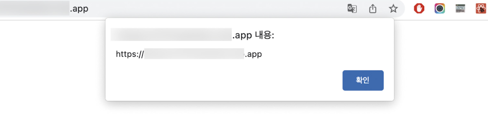

# XSS

what’s Cross-Site Scripting?

웹 어플리케이션에서 가장 많이 보이는 취약점 중 하나로, 웹사이트 개발자가 아닌 제3자가 웹사이트에 악성 스크립트를 삽입해 실행할 수 있는 취약점을 의미한다.

이 취약점은 게시판과 같이 사용자가 입력할 수 있고 이 입력을 다른 사용자에게 보여줄 수 있는 경우에 발생한다.

리엑트에서는 이러한 XSS 이슈가 어떻게 발생할 수 있으며 이를 어떻게 방지할 수 있는지 알아보자.

## DagerouslySetInnerHtml prop

이름에서 알 수 있듯 DOM의 innerHTML을 특정한 내용으로 교체할 수 있는 방법이다. 관리자가 입력한 내용을 브라우저에 표시하는 용도로 사용된다.

dagerouslySetInnerHTML 은 오직 \_html을 키를 가지고 있는 객체만 인수로 받으며, 받은 문자열을 DOM에 그대로 표시한다. 하지만 dagerouslySetInnerHTML이 인수로 받는 문자열에는 제한이 없다는 점에서 위험하다.

다음 예제를 보자.

```jsx
function App() {
// 결과물: <div>First , Second</div>
	return <div dagerouslySetInnerHTML={{__html: 'First , Second' }} />}>
	}
```

```jsx
function App() {
	return <div dagerouslySetInnerHTML={{__html: html }} />}>
	}
	export default App
```

바로 위 코드를 방문하면 origin이 alert로 나타나는 결과가 나온다.



그렇기 때문에 말 그대로 dagerouslySetInnerHTML은 사용에 주의를 기울여야 하며 여기에 넘겨주는 문자얼 값은 한번 더 검증이 필요하다.

## useRef를 활용한 직접 삽입

dagerouslySetInnerHTML와 비슷하게 DOM에 직접 내용을 삽입할 수 있는 방법으로 useRef가 있다. useRef또한 직접 DOM에 접근할 수 있으므로 앞서와 비슷한 방식으로 innerHTML에 보안 취약점이 있는 스크립트를 삽입하면 동일한 문제가 발생한다.

스크립트나 svg/onload 를 사용하는 방식 외에도 a태그에 잘못된 href를 사입하거나 이벤트를 활용하는 등 여러 방식의 XSS가 있다. 이 모든것의 공통적 문제는 개발자가 만들지 않은 코드를 삽입한다는 것이다.

## 리액트에서 어떻게 XSS를 피하는가?

가장 확실한 방법은 제 3자가 삽입할 수 있는 HTML을 안전한 HTML코드로 한번 치환하는 것이다. 이 과정을 Sanitize 또는 Escape 라고 하는데, 가장 확실한 방법은 npm에 있는 라이브러리를 사용하는 것이다.

가장 유명한 라이브러리로는

- DOMpurity
- sanitize-html
- js-xss

등이 있다.

### Sanitize-html

sanitize-html은 허용할 태그와 목록을 일일히 나열하는 이른바 허용 목록 방식을 채택한다.

허용 목록을 일일히 추가하는 것이 귀찮을 수 있지만 허용 목록에 추가하는 것을 깜박하는 것이 차단 목록으로 해야 할 것을 놓쳐 보안 이슈로 연결되는 것 보다는 나을 것이다.

또한 단순히 보여줄 때뿐만 아니라 사용자가 콘텐츠를 저장할 때도 한번 이스케이프 과정을 거치는 것이 더 효율적이고 안전하다.

### escape 시 유의 사항

치환하는 과정은 되도록 서버에서 수행하는 것이 좋다. 예시로 POST요청으로 입력받은 HTML을 받은 데이터를 저장하는데, 이 이스케이프 과정을 클라이언트에서만 수행하면 POST요청을 스크립트나 curl 등으로 직접 요청하는 경우 스크립트에서 실행하는 이스케이프 과정을 생략하고 바로 저장될 가능성이 있기 때문이다.

따라서 ‘클라이언트에서 사용자가 입력한 데이터는 일단 의심한다’ 는 마인드로 클라이언트의 POST요청에 있는 HTML을 이스케이프 하는것이 제일 안전한다.

마지막으로, 웹사이트에 POST가 없다고 하더라도 XSS는 발생할 수 있다. 예를 들어 쿼리스트링에 있는 내용을 그대로 실행하거나 보여주는 경우에도 보안 취약점이 발생할 수 있다. 따라서 개발자는 자신이 작성한 코드가 아닌 query, GET 파라미터, 서버에 저장된 사용자가 입력한 데이터 등 외부에 존재하는 모든 코드를 위험한 코드로 간주하고 이를 적절하게 처리하는 것이 좋다.

## getServerSideProps와 서버 컴포넌트를 주의하자

ssr은 성능 이점과 동시에 서버라는 개발 환경을 프론트엔드에게 쥐어준 셈이다. 하지만 서버에는 노출되면 안 되는 정보들이 있기 때문에 클라이언트에 정보를 내려줄 때 조심할 필요가 있다.

예시로 getServerSideProps에서 cookie정보를 가져와 이를 클라이언트 컴포넌트에 문자열로 제공해 클라이언트 에서 쿠키의 유효성에 따라 이후 작업을 처리한다고 가정해 보자.

이러한 상황은 보안관전에서 좋지 않다.

getServerSideProps에서 반환되는 값은 모두 사용자의 HTML에 기록되고 전역 변수로 등록되어 스크립트로 접근할 수 있는 보안 위협에 노출되는 값이 된다.

따라서 getServerSideProps가 반환하는 값 또는 서버 컴포넌트가 클라이언트에 반환하는 props는 반드시 필요한 값으로만 철저히 제한되어야 한다.

따라서 쿠키 전체를 제공하기 보다 클라이언트에서 필요한 토큰값만 제한적으로 반환하거나 이 값이 없을 때 예외 처리할 리다이렉트를 서버에서 처리하는 등의 방식을 따라야 한다.

(불필요한 값들을 클리이언트에 노출하지 않고 리다이렉트 등은 서버에서 처리하므로 성능 또한 올린다.)
