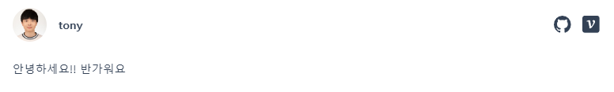

# 모던 리액트 Deep Dive
매 주 스터디를 진행하면서 나온 결과물을 저장하고 공유하기 위한 레포지토리입니다.

## 스터디 목적

[모던 리액트 Deep Dive](https://product.kyobobook.co.kr/detail/S000210725203)을 통해 리액트의 핵심 개념과 동작 원리를 습득하고 정리 및 발표하여 최종적으로 완독하는 것입니다.

추가로 준비한 이력서를 가지고 모의 면접을 진행하여 취업을 목표로 진행합니다.

### 스터디 날짜
매 주 일요일 (13시)

| 주차 | 날짜 |
| :---: | :---: |
| 1주차 | 2024.03.31 (일) |
| 2주차 | 2024.04.07 (일) |
| 3주차 | 2024.04.14 (일) |
| 4주차 | 2024.04.21 (일) |
| 5주차 | 2024.04.28 (일) |
| 6주차 | 2024.05.05 (일) |
| 7주차 | 2024.05.12 (일) |
| 8주차 | 2024.05.19 (일) |
| 9주차 | 2024.05.26 (일) |
| 10주차 | 2024.06.02 (일) |

### 스터디원 소개
|  | |  |  |  |  |
|:---:|:---:|:---:|:---:|:---:|:---:|
| [장태민_토니](https://github.com/taemin-jang) | [현승재_워커](https://github.com/goldmayo) | [김도연_던](https://github.com/kimdoyeonn) | [이현지_코린](https://github.com/hyeonzii) | [이윤지_벨라](https://github.com/yunjiisy) | [정윤정_올립](https://github.com/busy-joj) |

## 스터디 진행 방식

- 매 주 일요일마다 스터디를 진행합니다. (리액트 딥 다이브 약 10주 예상)
- 스터디 당일 13시부터 3시간동안 각자 공부한 리액트 딥 다이브 발표 및 질의응답을 진행합니다.
- 스터디 진행 일주일 전에 해당 주차 공부할 내용(챕터 별 소주제)을 분담합니다.
- 각자 맡은 주제에 대해 학습하여 정리합니다.
    - 정리한 내용은 발표 당일(일요일) 12시까지 [learning-react-study](https://github.com/FE-HelpStudy/learning-react-study)에 PR을 남깁니다.
- 이후 시간은 모의 면접을 진행합니다.
    - 모의 면접은 2개의 팀(4명, 3명)으로 나누고, 한 타임(최대 1시간 30분)에 면접관과 면접자를 서로 번갈아가면서 진행합니다.
    - 4명팀은 2 : 2로, 3명팀은 2 : 1로 모의 면접 진행 및 피드백을 주고 받습니다.
    - 모의 면접 진행 시 [**Clova Note**](https://clovanote.naver.com/)를 통해 면접 내용을 기록합니다.

## 스터디 규칙

- 호칭은 닉네임으로 편하게 불러주세요!
- 스터디 참여도를 높이기 위해 스터디 미 참여시 벌금(10,000원)을 내야합니다.
    
    > 벌금은 같이 이야기해서 조율해봐요.
    > 
    - 스터디 당일 참여하지 못하더라도 준비한 내용은 꼭 올려주세요.
    - 참여가 어려울 경우 스터디 톡방에 최소 2일전엔 말씀해주세요.
- 스터디 당일 원활한 진행을 위해 정리한 내용은 스터디 당일 12시까지 PR을 남겨주세요.

## GIt PR

- [learning-react-study](https://github.com/FE-HelpStudy/learning-react-study)에서 Repo main 브랜치를 Fork해주세요.
- pages > modern-react-deep-dive 폴더 안에 본인 닉네임 폴더를 하나 만들어주세요.
- 각자 학습 후 정리한 내용을 본인 닉네임 폴더 안에 mdx 파일로 올려주세요.
  - (선택 사항) mdx 파일에 frontMatter를 추가할 수 있어요.
  - 아래 예시처럼 writer(본인 닉네임), velog 링크 추가하면 됩니다. (이전에 요청이 있어서 추가해봤어요)
    ```mdx
    ---
      writer : 'tony'
      velog : 'https://velog.io/@taemin-jang'
    ---

    안녕하세요!! 반가워요
    ```
    
- Fork한 Repo main 브랜치에서 스터디 Repo main 브랜치로 PR 형식에 맞게 작성 후 남겨주세요.

스터디 Repo main에 정상적으로 올라가면 아래 배포된 사이트에서 확인할 수 있어요!
[Learning React Study](https://learning-react-study.vercel.app/)