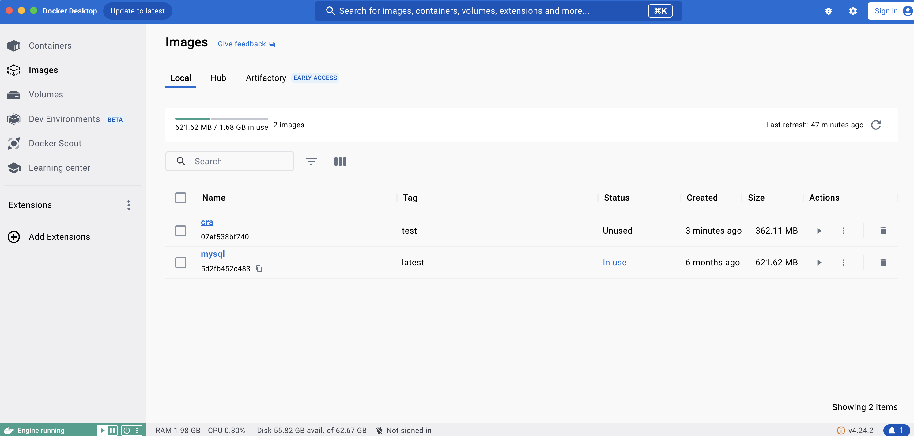
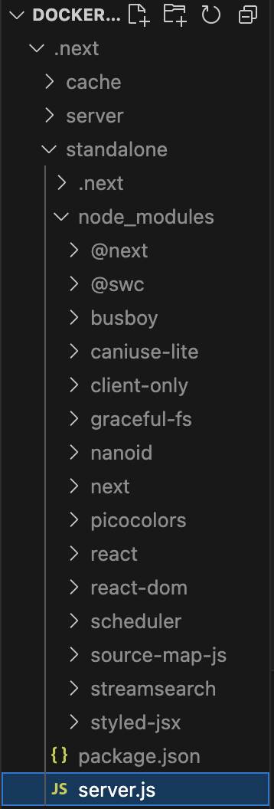

# 도커를 사용하는 이유

어플리케이션을 자유롭게 커스터마이징 해야 할 필요가 있습니다.
예시로 NGINX 관련 설정을 추가하는 상황이 해당됩니다.

유연하지 못한 비용 체계도 문제입니다.

예전에는, 웹 애플리케이션을 배포하기 위해 직접 장비를 준비하고, 해당 장비에 애플리케이션 구동에 필요한 각종 파일을 설치하고 소스를 다운로드해서 설치했다면,

요즘에는 애플리케이션을 하나의 **컨테이너**로 만들어서 빠르게 배포하는 것이 일반적입니다.

이 컨테이너를 만드는데 필요한 것이 **도커** 입니다.

도커는 서비스 운영에 필요한 애플리케이션을 격리해 컨테이너로 만드는데 이용하는 소프트웨어입니다.

## 도커란?

"도커는 개발자가 모던 애플리케이션을 구축,공유,실행하는 것을 도와줄 수 있도록 설계된 플랫폼이다. 도커는 지루한 설정 과정을 대신해 주므로 코드를 작성하는 일에만 집중할 수 있다."

### 지루한 설정 과정?

- 애플리케이션이 실행될 수 있는 컴퓨팅 리소스 확보
- 사용하는 라이브러리에 따라 설치 방법을 다르게 함
- 외부 네트워크로 이 애플리케이션을 개방
- 운영체제 설치
- Node.js 설치
- 빌드.....

도커는 애플리케이션을 빠르게 배포하기 위해서 **컨테이너** 라는 단위로 패키징하고, 이 **컨테이너** 내부에서애플리케이션이 실행될 수 있도록 도와줍니다.
이 **컨테이너**를 바탕으로 독립된 환경에서 애플리케이션이 항상 일관되게 실행할 수 있도록 보장해줍니다.

### 도커 용어

- 이미지: 컨테이너를 만드는데 사용되는 템플릿, 이 이미지를 만들기 위해서는 Dockerfile이 필요하며, 이 파일을 빌드하면 이미지를 만들 수 있습니다.
- 컨테이너: 도커의 이미지를 실행한 상태를 컨테이너라고 합니다. 이 컨테이너가 바로 독립된 공갑이며, 이미지가 목표하는 운영체제, 파일 시스템, 각종 자원 및 네트워크 등이 할당되어 실행될 수 있는 독립된 공간이 생성됩니다.
- Dockerfile: 어떤 이미지 파일을 만들지 정의하는 파일입니다. 이 파일을 빌드하면 이미지를 만들 수 있으며, 흔히 도커 이미지화한다(dockerize)라고 할 때 가장 먼저 하는 것이 바로 이 Dockerfile을 만드는 것 입니다.
- 태그: 이미지를 식별할 수 있는 레이블 값을 의미합니다. 일반적으로 `이름:태그명`  형태로 구성돼 있습니다. 대표적인 이미지인 `ubuntu:latest`를 예로 들면 `ubuntu`는 이미지 이름이고 `latest`는 태그명입니다.
- 리포지토리: 이미지를 모아두는 저장소, 앞서 언급했던 이름에 다양한 태그로 지정된 이미지가 모여있는 저장소 입니다.
- 레지스트리: 리포지터리에 접근할 수 있게 해주는 서비스, 대표적인 레지스트리로는 도커 허브가 있씁니다. 이 레지스트리에는 다양한 리포지토리가 있으며, 이 리포지토리에서 사용자는 자신이 원하는 이미지를 내려받아 사용할 수 있습니다.

> 이미지 vs 컨테이너
> 이미지는 컨테이너를 만드는 데 사용되는 읽기 전용 템플릿입니다.
> 컨테이너는 이러한 템플릿에서 생성된 배포된 인스턴스 입니다.


> 도커라이즈
>
> 애플리케이션을 도커 이미지로 만드는 과정

### 자주 쓰는 도커 cli 명령어

**도커 데스크톱**이 설치된 로컬 환경에서는 직접 쓸 일이 많지 않은 명령어 입니다.

_읽고 넘어가주시면 될 것 같습니다._

- `docker build (-t 이미지:태그 경로)`: `Dockerfile`을 기준으로 이미지를 빌드하는 작업을 말합니다. 일반적으로 태그를 부여하는 옵션인 `-t`와 함께 많이 사용됩니다.
  - `docker build -t foo:bar ./` 
- `docker push 사용자/이미지:태그`: 이미지나 리포지토리를 도커 레지스트리에 업로드하는 과정을 의미합니다.
  - `docker push yceffort/foo:bar`는 `yceffort`라는 사용자 계정에 `foo:bar` 이미지를 푸시하는 것을 말합니다. 별도 설정이 돼 있지 않다면 기본적으로 도커 허브에 업로드 합니다.
- `docker tag 원본이미지:태그 변경할_이미지:태그`: 이미지에 태그를 생성하는 명령어, 이름을 수정하는게 아니라 기존 이미지에 새로운 태그를 붙이는 것입니다.
- `docker inspect {이미지명|컨테이너명}`: 이미지나 컨테이너의 세부 정보를 출력하는 명령어
- `docker run`: 이미지를 기반으로 새로운 컨테이너를 생성하는 명령어
- `docker ps`: 현재 가동 중인 컨테이너 목록을 확인할 수 있는 명령어, `--all` 과 함께 사용한다면 가동중이지 않은 것도 확인 가능합니다.
- `docker rm {이미지명}`: 컨테이너를 삭제하는 명령어, 실행 중인 컨테이너를 삭제하려면 `docker stop {이미지명}`으로 해당 컨테이너를 중지시키고 삭제해야 합니다. 

## create-react-app을 위한 Dockerfile 작성하기

**프론트엔드 애플리케이션이 도커 이미지에서 해야할 작업 (간단히 요약)**

1. 운영체제 설정
2. Node.js 설치: npm 프로젝트 구동을 위해
3. npm ci: 프로젝트 빌드에 필요한 의존성 모듈 설치
4. npm run build
5. 실행: `create-react-app`의 경우에는 정적인 리소스를 서버에 올리는 것만으로도 충분

**Dockerfile에 기재해봅시다!**

```
FROM node:18.12.0-alpine3.16 as build

WORKDIR /app

COPY package.json ./package.json
COPY package-lock.json ./package-lock.json

RUN npm ci

COPY . ./

RUN npm run build
```

1. `FROM node:18.12.0-alpine3.16 as build`
`FROM`은 이 이미지가 어떤 베이스 이미지에서 실행될지를 결정합니다. 베이스 이미지란 이 이미지를 실행하는데 필요한 이미지를 의미합니다.

도커는 어떠한 이미지 위에 또 다른 이미지를 생성할 수 있습니다. 여기서 사용한 베이스 이미지는 `node:18.12.0-alpine3.16` 입니다. `node:18.12.0` 이란 Node.js 18.12.0 버전이 설치돼 있는 이미지를 의미하며 

`alpine3.16`은 이 이미지가 `alpine3.16` 버전의 운영체제 위에서 실행되는 이미지라는 것을 의미합니다. 여기서 `alpine`은 알파인 리눅스를 의미합니다.(굉장히 가볍고 깔끔하다고 합니다.)

도커 이미지 저장소에서 `node:18.12.0-alpine3.16`이라는 이미지를 사용하겠다는 의미입니다. 이 베이스 이미지 한 줄만으로 운영체제를 설치하는 복잡한 과정 없이도 원하는 운영체제를 사용할 수 있습니다.

2. `WORKDIR /app`
 수행하고자 하는 디렉토리

3. `COPY`
 파일을 복사하는 명령어

4. `RUN npm ci`
 `RUN` 을 실행하면 컨테이너에서 명령어를 실행할 수 있습니다. 여기서는 의존성 설치 명령어인 `npm ci`를 실행하게 됩니다.

5. `COPY . ./`
 의존성을 설치했으니 이제 빌드만 남았습니다. 빌드를 위해서는 대부분의 리소스가 필요하기 때문에 이와 같이 작성해줍니다.

6. `RUN npm run build`
 빌드에 필요한 리소스를 복사했으므로 빌드 명령어를 통해 애플리케이션을 빌드합니다.

### 빌드

`docker build . -t cra:test` 로 빌드를 수행합니다. `-t`로 이름과 태그로 각각 `cra`와 `test`를 부여했습니다.
 



도커 데스크톱에서 해당 이미지가 생성된 것을 확인할 수 있습니다.

근데 저는 vite로 프로젝트를 생성해서 그런가 이미지가 실행되지 않았습니다........

우선 포트번호도 3000과 5137로 다르기 때문에 vite를 이용한 예시를 다시 찾았습니다.

## vite 프로젝트 nginx + docker 이용해서 로컬에 띄우기

> nginx?
>
> 웹 서버
> 클라이언트 요청에 따라 HTML, CSS, JS, 이미지 파일과 같은 정적 파일을 응답하여 제공하는 소프트웨어


```
# ./nginx/nginx.conf

server {
    listen 80;
    access_log /var/log/nginx/access.log;
    error_log /var/log/nginx/error.log;
    location / {
        # root를 /usr/share/nginx/html 을 바라보게 했으므로(Dockerfile 참고)
        # 해당 경로 아래에 배포해주면 됩니다.
        root   /usr/share/nginx/html;
        index  index.html index.htm;
        try_files $uri $uri/ /index.html;
    }
}
```

root에 nginx 관련 파일을 추가해줍니다.

**Dockerfile**

```
# ./Dockerfile

# nginx
FROM nginx

# 작업 디렉토리는 default로 지정했습니다.
WORKDIR /

# 로컬에서 빌드한 결과물을 /usr/share/nginx/html 으로 복사합니다.
COPY ./dist /usr/share/nginx/html

# 기본 nginx 설정 파일을 삭제합니다. (custom 설정과 충돌 방지)
RUN rm /etc/nginx/conf.d/default.conf

# custom 설정파일을 컨테이너 내부로 복사합니다.
COPY nginx/nginx.conf /etc/nginx/conf.d

# 컨테이너의 80번 포트를 열어줍니다.
EXPOSE 80

# nginx 서버를 실행하고 백그라운드로 동작하도록 합니다.
CMD ["nginx", "-g", "daemon off;"]
```

**프로젝트 빌드**

`npm run build`

경로이슈가 생겨 수동 빌드로 진행된 예시를 가지고 왔기 때문에 수동으로 진행시켜 줍니다.

**Dockerfile Image 생성**

`docker build --no-cache --tag nginxtest:test .`


이미지가 생성된 것을 확인할 수 있습니다.


3000 으로 실행시켜 줍니다.


페이지가 뜨는 것을 확인할 수 있습니다!

## create-next-app을 위한 Dockerfile 작성하기

Next 프로젝트의 다른점은, 단순하게 빌드된 파일을 올리는 수준이 아니라 서버 실행이 필요합니다.

```
FROM node:18.12.0-alpine3.16 as deps

WORKDIR /app

COPY package.json ./package.json
COPY package-lock.json ./package-lock.json

RUN npm ci
```

```
FROM node:18.12.0-alpine3.16 as build

WORKDIR /app

# COPY package.json ./package.json
# COPY package-lock.json ./package-lock.json

# RUN npm ci

COPY --from=deps /app/node_modules ./node_modules
COPY . ./

RUN npm run build
```





```
FROM node:18.17.0-alpine as deps

WORKDIR /app

COPY package.json ./package.json
COPY package-lock.json ./package-lock.json

RUN npm ci

FROM node:18.17.0-alpine as build

WORKDIR /app

COPY --from=deps /app/node_modules ./node_modules
COPY . ./

RUN npm run build

FROM node:18.17.0-alpine as runner

COPY --from=build /app/public ./public
COPY --from=build /app/.next/standalone ./
COPY --from=build /app/.next/static ./.next/static

EXPOSE 3000

ENTRYPOINT ["node","server.js"]
```

책에 나온대로 하면 버전 오류가 나서, 위와 같이 수정해줍니다!


(Amazon ECS: 서버 배포)[https://constell847.oopy.io/3bcbb6cc-9d25-455c-ad13-41e3ecdb893e]

## chatgpt가 알려준 방법...ㅎㅎ

"AWS에서 Docker 이미지를 배포하려면 Amazon Elastic Container Service (ECS) 또는 Amazon Elastic Kubernetes Service (EKS)와 같은 서비스를 사용하여 컨테이너를 실행하고 관리할 수 있습니다. 아래는 간단한 과정을 안내합니다."

### ECS 활용

> ECS?
>
> Amazon Elastic Container Service
>
> 컨테이너 애플리케이션을 쉽게 배포, 관리 및 확대할 수 있도록 도와주는 완전 관리형 컨테이너 오케스트레이션 서비스

1. 도커 이미지 빌드

  로커에서 Docker 이미지를 빌드합니다.

  `docker build -t [이미지 이름] .`

  우리로 치면

  `docker build -t next:test .`

2. 도커 이미지를 Amazon ECR에 푸시

  Amazon Elastic Container Registry (ECR)를 사용하여 도커 이미지를 저장하고 관리합니다.

  ```bash
  # AWS CLI를 사용하여 ECR에 로그인
  aws ecr get-login-password --region your-region | docker login --username AWS --password-stdin your-account-id.dkr.ecr.your-region.amazonaws.com

  # 이미지를 ECR 리포지토리에 푸시
  docker tag your-image-name:latest your-account-id.dkr.ecr.your-region.amazonaws.com/your-repository-name:latest
  docker push your-account-id.dkr.ecr.your-region.amazonaws.com/your-repository-name:latest
  ```

3. Amazon ECS 클러스터 생성

  AWS Management Console에서 Amazon ECS를 사용하여 클러스터를 생성합니다.

4. 작업 정의(Task Definition) 생성

  ECS 작업 정의를 생성하여 컨테이너 생성을 정의합니다.

  - 컨테이너 이미지: ECR에서 푸시한 도커 이미지 경로 (your-account-id.dkr.ecr.your-region.amazonaws.com/your-repository-name:latest)
  - 포트 매핑: 호스트와 컨테이너 포트를 매핑 (예: 호스트 80 → 컨테이너 3000)

5. 서비스 생성

  ECS 서비스를 생성하여 작업을 실행하고 관리합니다.

   - 클러스터: 위에서 생성한 ECS 클러스터 선택
   - 작업 정의: 위에서 생성한 작업 정의 선택
   - 서비스 유형: 원하는 설정으로 선택(예: 로드밸런싱 등)

### EKS 활용

> EKS?
>
> Amazon Elastic Kubernetes Service
> Amazon Web Services(AWS)에 Kubernetes 컨트롤 플레인을 설치, 운영 및 유지 관리할 필요가 없는 관리형 서비스

1. 도커 이미지 빌드
  동일하게 로컬에서 Docker 이미지를 빌드합니다.

2. 도커 이미지를 Amazon ECR에 푸시
  위의 ECS와 동일한 방법으로 ECR에 도커 이미지를 푸시합니다.

3. Amazon EKS 클러스터 생성
  AWS Management Console에서 Amazon EKS를 사용하여 Kubernetes 클러스터를 생성합니다.

4. Kubernetes 배포 작성
  Kubernetes 배포 파일(manifest)을 작성하여 컨테이너를 배포합니다.
  - Deployment: 컨테이너 실행에 대한 세부 정보를 정의
  - Service: 컨테이너에 대한 로드 밸런싱 및 서비스 디스커버리를 제공
  
5. kubectl을 사용하여 배포
  작성한 Kubernetes 배포 파일을 사용하여 컨테이너를 배포합니다.
  ```bash
  kubectl apply -f your-deployment.yaml
  ```

### 참조블로그
[[Docker] 컨테이너, 도커 컨테이너, 도커 이미지 (Dontainer, Docker Container, Docker Image)](https://rfriend.tistory.com/744)
[vite + nginx를 도커 이미지로 만들어 배포하기 - local 편](https://velog.io/@bebop0303/local%EC%97%90%EC%84%9C-vite-nginx%EB%A5%BC-%EB%8F%84%EC%BB%A4-%EC%9D%B4%EB%AF%B8%EC%A7%80%EB%A1%9C-%EB%A7%8C%EB%93%A4%EC%96%B4-%EB%B0%B0%ED%8F%AC%ED%95%98%EA%B8%B0)
[Amazon Elastic Container Service란 무엇입니까?](https://docs.aws.amazon.com/ko_kr/AmazonECS/latest/developerguide/Welcome.html)
[Amazon EKS란 무엇입니까?](https://docs.aws.amazon.com/ko_kr/eks/latest/userguide/what-is-eks.html)