# HTTP 보안 헤더 설정하기

## HTTP 보안 헤더?

브라우저가 렌더링하는 내용과 관련된 보안 취약점을 미연에 방지하기 위해 브라우저와 함게 작동하는 헤더를 의미합니다.

> HTTP?
>
> 서버/클라이언트 모델을 따라 데이터를 주고 받기 위한 프로토콜

## Strict-Transport-Security

HTTP의 `Strict-Transport-Security` 응답 헤더는 모든 사이트가 HTTPS를 통해 접근해야 하며, 만약 HTTP로 접근하면 HTTPS로 변경되게 합니다.

> HTTPS?
>
> HTTP에 데이터 암호화가 추가된 프로토콜
> 네트워크 상에서 중간에 제 3자가 정보를 볼 수 없도록 암호화를 지원하고 있습니다.

**사용법**

```
Strict-Transport-Security: max-age=<expire-time>; includeSubDomains
```

`<expire=time>`은 이 설정을 브라우저가 기억해야 하는 시간을 의미, 초 단위로 기록됩니다.

이 기간 내, HTTP로 사용자가 요청해도 HTTPS로 변경해줍니다.

헤더의 시간이 경과할 경우, HTTP로 로드를 시도한 다음 응답에 따라 HTTPS로 디옹하는 등의 작업을 수행합니다.

`includeSubDomains`가 있을 경우이러한 규칙이 모든 하위 도메인에도 적용됩니다.

## X-XSS-Protectioin

비표준 기술, 사파리와 구형 브라우저에서만 제공되는 기능입니다.

페이지에서 XSS 취약점이 발견되면 페이지 로딩을 중단하는 헤더입니다.

> XSS 취약점
>
> Cross-Site-Scripting의 줄임말로, 웹 애플리케이션에서 발생할 수 있는 보안 취약점
> 이 악성 스크립트는 공격자에게 사용자의 정보를 전송하거나, 예상치 못한 악의적인 행동을 수행할 수 있습니다.

## X-Frame-Options

`X-Frame-Options`는 페이지를 `frame`,`iframe`,`embed`,`object` 내부에서 렌더링을 허용할지를 나타낼 수 있습니다.

예시상황)

`iframe`을 이용해서 네이버를 보여주는 상황,
사용자는 이 페이지를 진짜 네이버로 오해할 수 있습니다.
공격자는 이를 이용해서 사용자의 정보를 탈취할 수 있습니다!

해당 옵셥이, 외부에서 자신의 페이지를 위와 같은 방식으로 삽입되는 것을 막아줍니다!

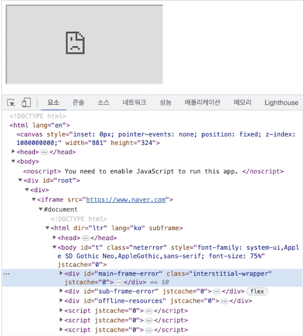

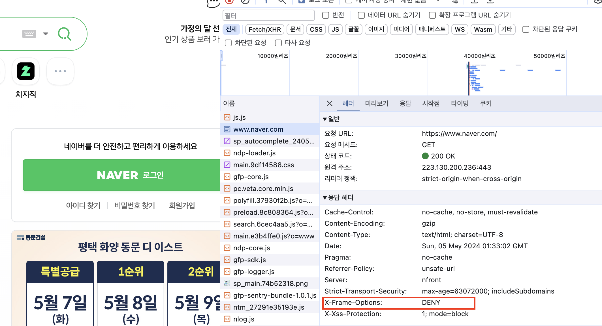

`DENY`: 프레임 관련 코드가 있다면 무조건 막는다.
`SAMEORIGIN`: 같은 `origin`에 대해서만 프레임을 허용한다.

> origin?
>
> 출처(Origin) 이란 URL 구조에서 살펴본 Protocol, Host, Port를 합친 것을 말합니다.

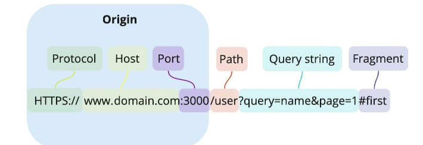

_(출처:https://velog.io/@dae_eun2/CORS)_

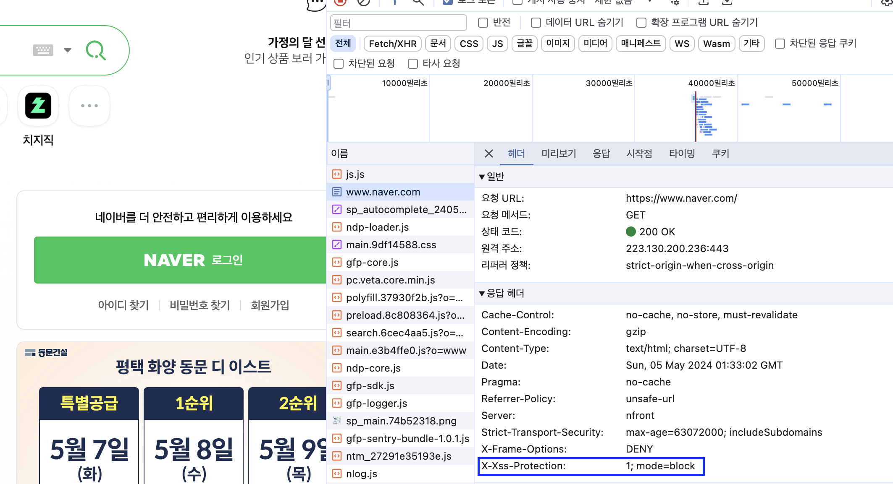

`X-XSS-Protectioin` 도 설정되어 있습니다.

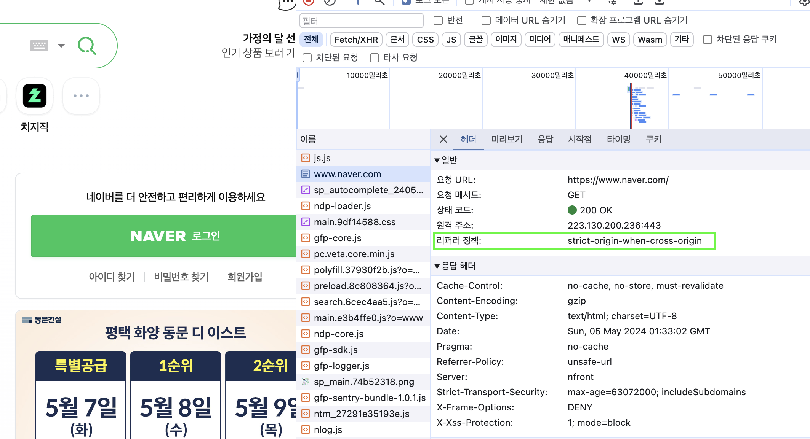

크롬의 기본정책값인 `strict-origin-when-cross-origin` 입니다.

프라이버시가 더 강해진 형태입니다. `cross-origin` 요청인 경우에는 `refer`에 `origin` 값만 전달합니다. 그래서 `url path`,`query string` 에 포함된 개인정보가 유출될 가능성을 막아줍니다!

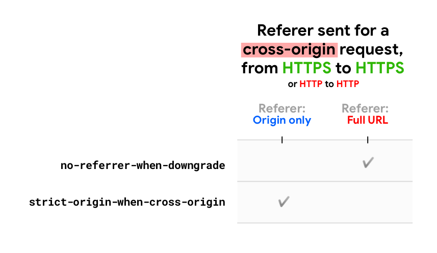

이전 정책과 비교한 사진입니다.

## Permissions-Policy

웹사이트에서 사용할 수 있는 기능과 사용할 수 없는 기능을 명시적으로 선언하는 헤더입니다.

개발자는 다양한 브라우저의 기능이나 API를 선택적으로 활성화하거나 필요에 따라서는 비활성화 할 수도 있습니다.

기능이란, 카메라나 GPS와 같이 브라우저가 제공하는 기능을 얘기합니다.

예시상황)

브라우저에서 사용자의 위치를 확인하는 기능(geolocation)과 관련된 코드를 전혀 작성하지 않았습니다.

해당 기능이 별도로 차단돼 있지않고, XSS 공격 등으로 인해 이 기능을 취득해서 사용하게 되면!

사용자의 위치를 획득할 수 있게 됩니다!

```
# 모든 geolocation 사용을 막는다.
Permission-Policy: geolocation=()

# geolocation을 페이지 자신과 몇 가지 페이지에 대해서만 허용한다.
Permission-Policy: geolocation=(self "https://a.yceffort.kr "https://b.yceffort.kr")

# 카메라는 모든 곳에서 허용한다.
Permission-Policy: geolocation= camera=*

# pip 기능을 막고, geolocation은 자신과 특정 페이지만 허용하며,
# 카메라는 모든 곳에서 허용한다.
Permission-Policy: picture-in-picture  geolocation=(self https://ycerffort.kr), camera=*

```

https://www.permissionspolicy.com/

위 주소에서 기능을 선택해 만드는 것도 가능합니다.

## X-Content-Type-Options

이 헤더를 이해하기 위해선 MIME이 무엇인지 알아야 합니다.

> MIME?
>
> Multipurpose Internet Mail Extensions의 약자입니다.
> Content-type의 값으로 사용됩니다.
> 본래는 메일을 전송할 때 사용하던 인코딩 방식이었으나, 현재는 Content-type에서 대표적으로 사용됩니다.

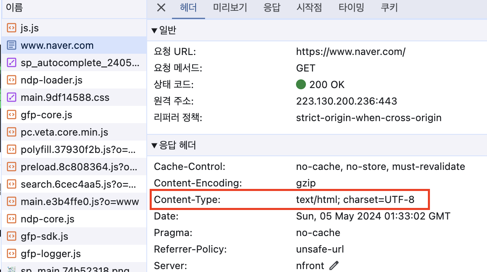

네이버에서는 `Content-Type: text/html; charset=UTF-8` 로 반환해 브라우저가 이를 UTF-8로 인코딩된 `text/html`로 인식할 수 있게 도와주고, 브라우저는 이 헤더를 참고해 해당 파일에 대해 HTML을 파싱하는 과정을 거치게 됩니다. 이러한 MIME는 jpg,CSS,JSON 등 다양합니다.

`X-Content-Type-Options`는 헤더에서 제공하는 MIME 유형이 브라우저에 의해 임의로 변경되지 않게 하는 헤더입니다.

`X-Content-Type-Options: text/css` 헤더가 없는 파일은브라우저가 임의로 CSS로 사용할 수 없습니다.

즉, 웹서버가 브라우저에 강제로 이 파일을 읽는 방식을 지정하는 것 입니다.

예시상황)

jpg인 척 하는 스크립트를 업로드하게 되면, jpg인 줄 알고 실행시켰으나 그 스크립트가 악의적인 것이게 되면 보안문제가 발생하게 됩니다.

이 경우에는, `text/css`가 아닌 경우, 혹은 파일 내용이 `script`나 MIME 타입이 자바스크립트 타입이 아니면 차단하게 됩니다.

```
X-Content-Type-Options: nosniff
```

## Referrer-Policy

Http 요청에는 `Refer` 라는 헤더가 존재하는데, 이 헤더에는 현재 요청을 보낸 페이지의 주소가 나타납니다.

해당 헤더는 사용자가 어디서 와서 상문 중인지 인식할 수 있는 헤더이지만, 사용자 입장에서는 원치않는 정보가 노출될 위험이 존재합니다.

`Referrer-Policy` 헤더는 이 `Referer` 헤더에서 사용할 수 있는 데이터를 나타냅니다.

> 철자가 다른데요?
>
> Referer 라는 오타가 이미 표준으로 등록된 이후에 오타를 발견했다고 합니다.

`Referer`에 대해 알기전에 origin을 다시 한번 보고 가야합니다.

https://yceffort.kr

- schema: HTTPS 프로토콜을 의미합니다.
- hostname: `yceffort.kr`이라는 호스트명을 의미합니다.
- port: 443 포트를 의미합니다.

두 주소를 비교할 시, `same-origin` 인지, `cross-origin` 인지는 다음과 같이 구분할 수 있습니다.

1. https://yceffort.kr 기반
   
    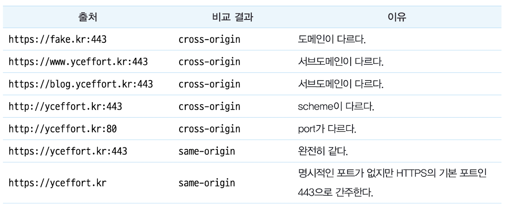

2. Referrer-Policy 기반
   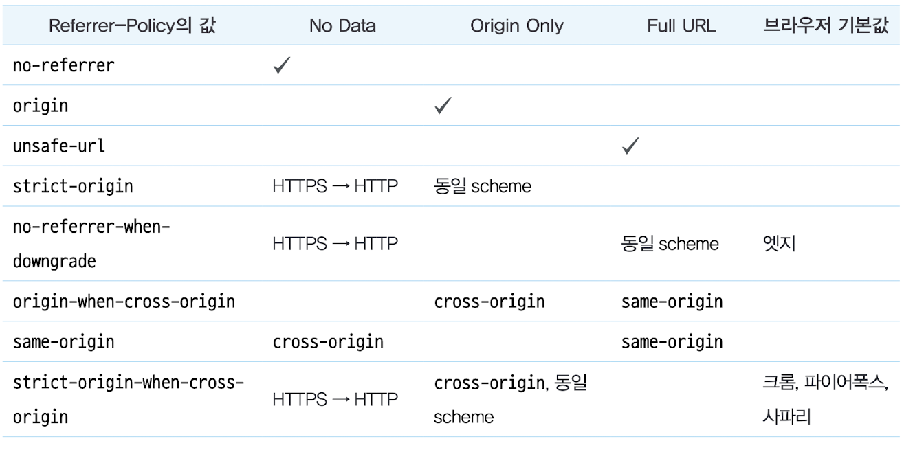

`Referrer-Policy`는 응답 헤더뿐만 아니라 페이지의 `<meta/>` 태그로도 다음과 같이 설정 가능합니다.

```html
<meta name="referrer" content="origin" />
```

페이지 이동 시에도 설정 가능합니다.

```html
<a href="https://yceffort.kr" referrerpolicy="origin">....</a>
```

구글에서는 이용자의 개인정보 보호를 위해 `strict-origin-when-cross-origin` 혹은 그 이상을 명시해 둘 것을 권고합니다.

만약 이 값이 설정되어 있지 않는다면, 브라우저의 기본값으로 작동하게 되어 웹사이트에 접근하는 환경별로 다른 결과를 만들어내 혼란을 야기할 수 있습니다.

## Content-Security-Policy

콘텐츠 보안 정책(Content-Security-Policy) 은 XSS 공격이나 데이터 삽입 공격과 같은 다양한 보안 위협을 막기 위해 설계되었습니다.

사용할 수 있는 지시문이 굉장히 많기 때문에, 대표적으로 사용되는 몇 가지만 소개하겠습니다.

### *-src

`font-src`,`img-src`,`script-src` 등 다양한 `src`를 제어할 수 있는 지시문입니다.

```
Content-Security-Policy: font-src <source>;
Content-Security-Policy: font-src <source> <source>;
```

위와 같이 선언해두면, font의 src로 가져올 수 있는 소스를 제안할 수 있습니다.

```
Content-Security-Policy: font-src https://yceffort.kr/;
```

위와 같은 응답 헤더를 반환했다면 다음 폰트는 사용할 수 없게 됩니다.

```js
<style>
  @font-face {
    font-family: 'Noto Sans KR';
    font-style: normal;
    font-weight: 400;
    font-display: swap;
    src: url(https://.....)
    format('woff2')
  }
</style>
```

이 외에도

- script-src
- style-src
- font-src 
...

매우 많습니다.

```
Content-Security-Policy: default-src <source>;
```

`default-src`로 한번에 처리도 가능합니다.

### form action

```js
<meta http-equiv="Content-Security-Policy" content="form=action 'none' ">
```

form 액션 자페를 막아버립니다.

## 보안 헤더 설정하기

### Next.js

```js
# next.config.js

module.exports = {
  ...,
  async headers() {
    return [
      {
        source :'/(.*)',
        headers : [
          {
            key: 'Strict-Transport-Security',
            value: 'max-age=63072000;'
          }
        ]
      }
    ]
  }
}
```

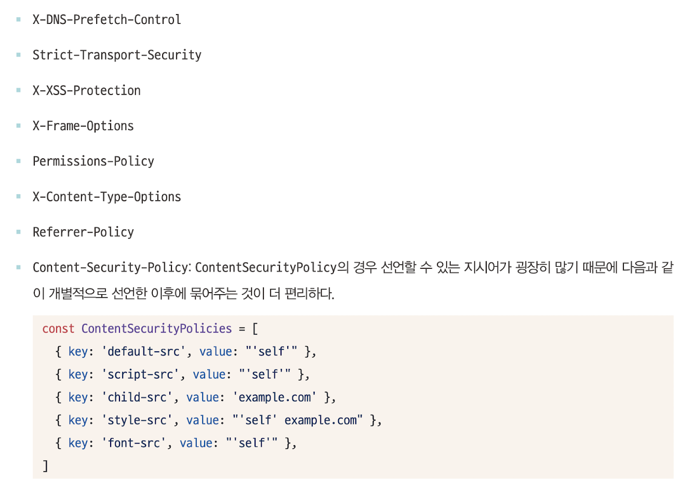
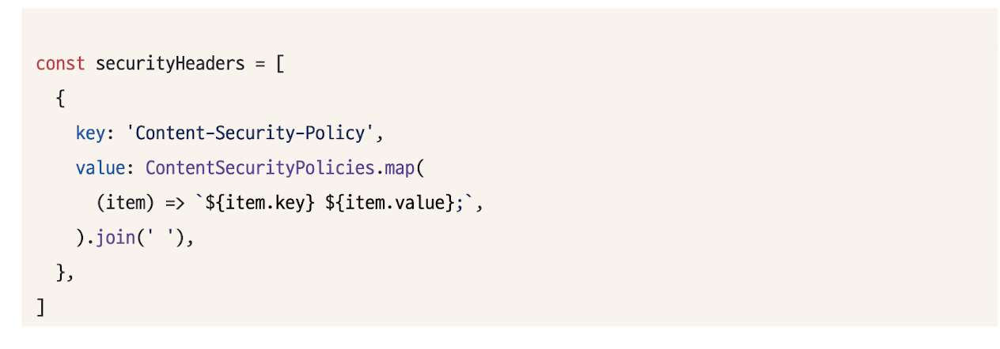

### NGINX
경로별로 add_header 지시자를 사용해 원하는 응답 헤더를 추가할 수 있습니다.

```js
location / {
  # ...
  add_header X-XSS-Protection 1 : "mode=nblack"
  add_header Content-Security-Policy "default-src 'self'; script=-src: 'self' child-src e...m; style-src ...";
  # ...
}
```

## 보안헤더 확인하기

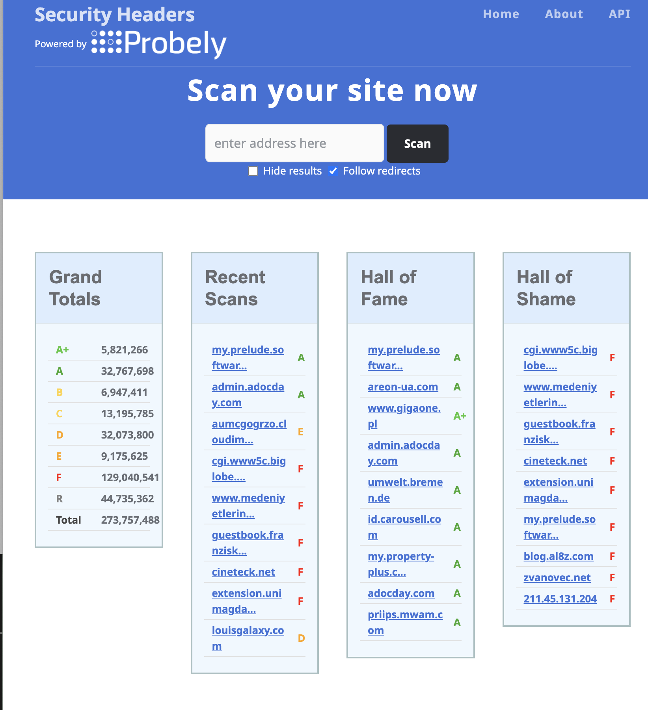

#### 참고블로그

[[Web] HTTP와 HTTPS의 개념 및 차이점](https://mangkyu.tistory.com/98)
[next.js http header 적용하기](https://devpunch.tistory.com/26)
[xss 취약점](https://yozm.wishket.com/magazine/questions/share/03FPeUM0L22SZKU2/)
[Chrome의 기본 레퍼러 정책 변화 - strict-origin-when-cross-origin (2020.07 / Chrome v.85)](https://americanopeople.tistory.com/358)
[[웹 개발] Origin(출처)란 무엇인가? (What is Origin?)](https://etloveguitar.tistory.com/83)