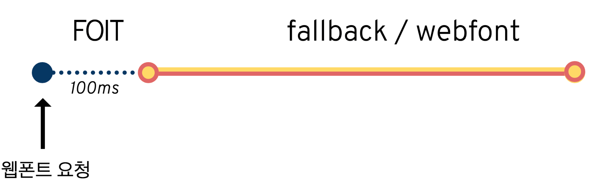
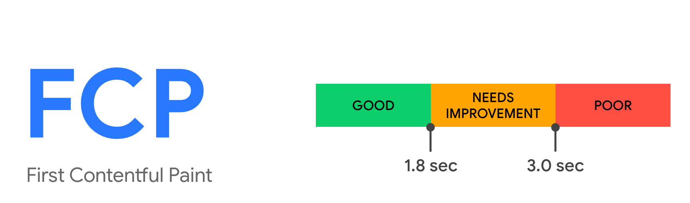

### 누적레이아웃 이동(Cumulative Layout Shift)이란?

- 웹사이트에서 사용자가 겪는 예기치 못한 레이아웃의 이동이 발생하는 경우를 지표로 측정하는 것
- CLS 가 낮을 수록 더 좋은 웹사이트이다.
- CLS 는 사용자의 가시적인 콘텐츠에 영향을 미쳐야 하기 때문에 뷰포트 내부의 요소에 대해서만 측정하며, 뷰포트 밖의 요소에 대해서는 측정하지 앟는다.
- 단순히 요소가 추가된다고 무조건 레이아웃 이동으로 간주되는 것은 아니고 다른 요소의 시작 위치에 영향을 미치지 않았다면 레이아웃 이동으로 간주되지 않는다.
- 또한 사용자 액션으로 인해 발생한 레이아웃 이동은 점수에 포함되지 않는다.

**영향분율 : 레이아웃 이동이 발생한 요소의 전체 높이와 뷰포트 높이의 비율을 의미한다.**

**거리분율 : 레이아웃 이동이 발생한 요소가 뷰포트 대비 얼마나 이동했는지를 의미한다.**

**CLS = 영향분율 \* 거리분율**

### 기준 점수


### CLS 개선방안

**1) 삽입이 예상되는 요소를 위한 추가적인 공간 확보**

대부분의 큰 누적 레이아웃 이동은 클라이언트에서 삽입되는 동적인 요소로 인해 발생한다.

최초 렌더링 이후에 실행되는 useEffect 가 많을 수록, 그리고 이 useEffect 가 렌더링에 영향을 미칠수록 이 누적레이아웃 이동에 좋지 못한 점수를 받을 가능성이 커진다.

해결방안

- useEffect 의 내부에서 요소에 영향을 미치는 작업,특히 뷰포트 내부에서 노출될 확률이 높은 작업을 최소화
- useEffect 대신에 useLayoutEffect 훅을 사용
  useEffect 와 useLayoutEffect 의 차이

```jsx
useEffect 는 컴포넌트들이 render 와 paint 된 이후 비동기적으로 실행되어 useEffect 내부에 dom 에 영향을 주는 코드가 있을 경우 화면의 깜빡임을 보게 된다.

useLayoutEffect 는 컴포넌트들이 render 된 후 paint 가 진행되며 이는 동기적으로 실행된다.paint 가 되기전에 실행되기 때문에 dom 을 조작하는 코드가 존재하더라도 사용자는 깜빡임을 경험하지 않는다.
```

- 스켈레톤 UI 처럼 무언가 동적으로 들것으로 예상되는 공간을 미리 확보해두는 것도 좋은 방법이지만 해당 영역이 뜨지 안흔ㄴ 케이스가 있다면 누적레이아웃 이동을 피하기 어렵다.
- 서버사이드 렌더링(가장 좋은 방법)
  서버에서 동적인 요소의 유무를 사전에 판단해 클라이언트에 HTML 을 미리 제공해주어 해결

**2) 폰트 로딩 최적화**

**폰트로 인해 발생할 수 있는 문제**

1. FOUT(flash of ustyled text) : HTML 문서에서 지정한 폰트가 보이지 않고 대체 기본 폰트로 보이고 있다가 뒤늦게 폰트가 적용되는 현상
2. FOIT(flash of invisible text) : HTML 문서에서 지정한 폰트가 보이지 않고 기본 폰트도 없어서 텍스트가 없는 채로 있다가 뒤늦게 폰트가 로딩되면서 페이지에 렌더링 되는 현상

해결방안

1. <link> 의 preload 사용 : rel = preload 는 페이지에서 즉시 필요로 하는 리소스를 명시하는 기능 preload 로 지정된 요소는 웹페이지의 생명주기에서 초기에 불러와야 하는 중요한 리소스로 간주되어 더 빠르게 사용할 수 있도록 준비해준다.
2. font-family : optional
   
   출처 https://d2.naver.com/helloworld/4969726

3. auto(기본값) : 브라우저가 폰트를 불러오는 방법을 결정한다.
4. block 옵션: FOIT와 동일하게 작동하는 옵션이다. 웹 폰트가 로딩되지 않았을 때는 텍스트를 렌더링하지 않는다(최대 3초). 웹 폰트 로딩이 완료되면 웹 폰트를 적용한다.
5. swap 옵션: FOUT와 동일하게 작동하는 옵션이다. 우선 폴백 폰트로 글자를 렌더링하고, 웹 폰트 로딩이 완료되면 웹 폰트를 적용한다. 웹 폰트 로딩 여부와 관계없이 항상 텍스트가 보인다.
6. fallback 옵션: fallback 옵션을 사용하면 우선 100ms 동안 텍스트가 보이지 않고, 그 후 폴백 폰트로 렌더링한다. 2초의 전환(swap) 시간 안에 로딩이 완료되면 웹 폰트로 전환한다. 하지만 이 시간이 지나면 웹 폰트 다운로드가 완료되어도 웹 폰트로 전환하지 않고 폴백 폰트를 유지한다.전환 시간 이후에 다운로드된 웹 폰트는 웹 페이지에 적용되지는 않지만 캐시에는 저장된다. 그래서 추후에 사용자가 다시 방문했을 때 바로 웹 폰트가 적용된다는 장점이 있다.
7. optional 옵션: fallback 옵션과 비슷하지만 다르게 작동하는 옵션이다. 우선 100ms 동안 텍스트가 보이지 않고 그 후 폴백 폰트로 전환한다. 웹 폰트를 다운로드하지만 브라우저가 네트워크 상태를 파악해 웹 폰트 전환 여부를 결정한다는 점이 이 옵션의 특이한 점이다. 예를 들어 네트워크의 연결 상태가 안 좋으면 웹 폰트의 다운로드가 완료되어도 캐시에 저장만 하고 전환은 하지 않는다.

요약 : 최대한 중요한 폰트의 다운로드를 우선순위에 밀어넣고 이 우선순위를 활용했음에도 빠르게 로딩하는 데 실패했다면 다음을 기약하고 기본 폰트를 노출하는 것이다.

**3)적절한 이미지 크기 설정**

```jsx
 //./styles.css
 img {
 width: 100%;
 height: auto
 }
```

반응형 웹사이트 개발 시 % 와 auto 를 사용할때 CLS 가 커지는 결과를 낳는다.

auto 를 사용한 height 경우 이미지가 완전히 다운로드 되기 전까지 높이를 알 수 없기 때문에 레이아웃 이동이 크게 발생한다.

⇒해결방안

width : 100% height:auto 와 함께 width 와 height 를 원하는 비율로 지정하면 브라우저가 이미지를 로딩하기 전에 적절한 가로세로 비율을 계산해 이미지가 표시되는 만큼 면적을 할당한다.

이는 브라우저가 기본으로 제공하는 aspectio ratio 속성 때문에 가능

```jsx
import './style.css'
export default fuction App(){
return (
<div className ="App">

</div>)
}
```

### 그 외의 성능확인 지표들

**최초바이트까지의 시간 (Time To First Byte,TTFB)**

페이지를 요청했을 때 최초의 응답이 오는 바이트까지가 얼마나 걸리는지를 측정하는 지표다.

600ms 이상 걸릴 경우 개선이 필요함

서버에서 HTML 을 만들기 위해 해야하는 작업이 많거나 느릴수록 최초바이트까지의 시간이 길어지게 되믄로 서버사이드렌더링 애플리케이션에서 주의깊게 봐야함

**개선 시 고려사항**

- 페이지를 만드는데 필요한 작업을 최소화하고 페이지를 그리는 데 중요한 내용만 ssr 에서 준비하는 등의 최적화
- API 호출 최적화

**최초 콘텐츠풀 페인트 (First Contentful Paint,FCP)**

페이지가 로드되기 시작한 시점부터 페이지 콘텐츠의 일부가 화면에 렌더링 될때 까지의 시간을 측정한다.



**개선 시 고려사항**

- 최초바이트까지의 시간을 개선 : 일단 뭐라도 다운로되가 시작돼야 렌더링을 할 수 있기 때문에 최초바이트까지의 시간을 단축해야 한다.
- 렌더링을가로막는 리소스 최소화 : js 나 css 같은 리소스를 최소화해야하고 비동기적으로 로드되게해야한다.
- Above the Fold 에 대한 최적화 : 최초에 스크롤을 하지 않아도 보이는 영역으로 lazy loading 이나 스크립트에 의존해 렌더링 되는 것을 피해야 한다.
- 페이지 리다이렉트 최소화
- DOM 크기 최소화: 구글의 기준에 따르면 DOM 노드는 1500개 미만으로 깊이는 32단계까지만 그리고 부모 노드는 자식 노드를 60개 전도만 가지고 있어야 한다.
