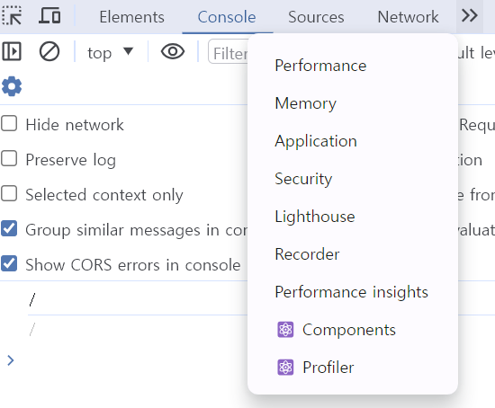
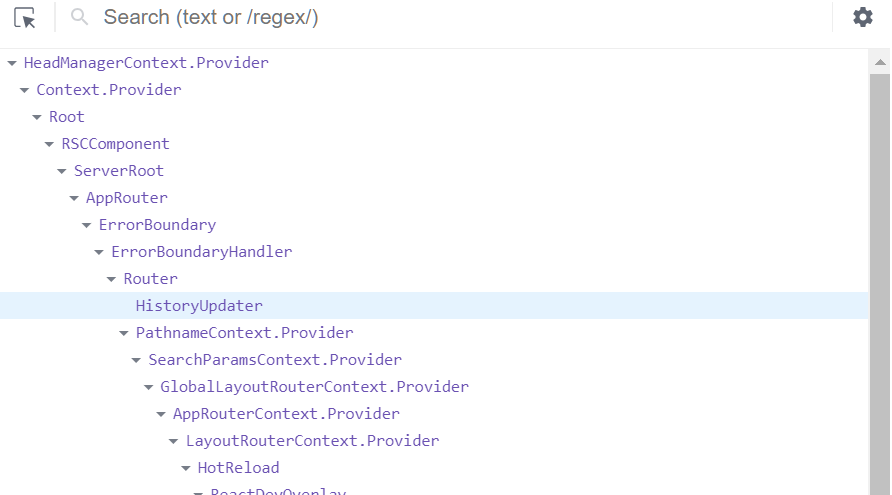
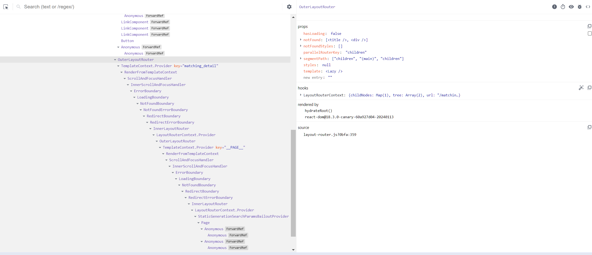
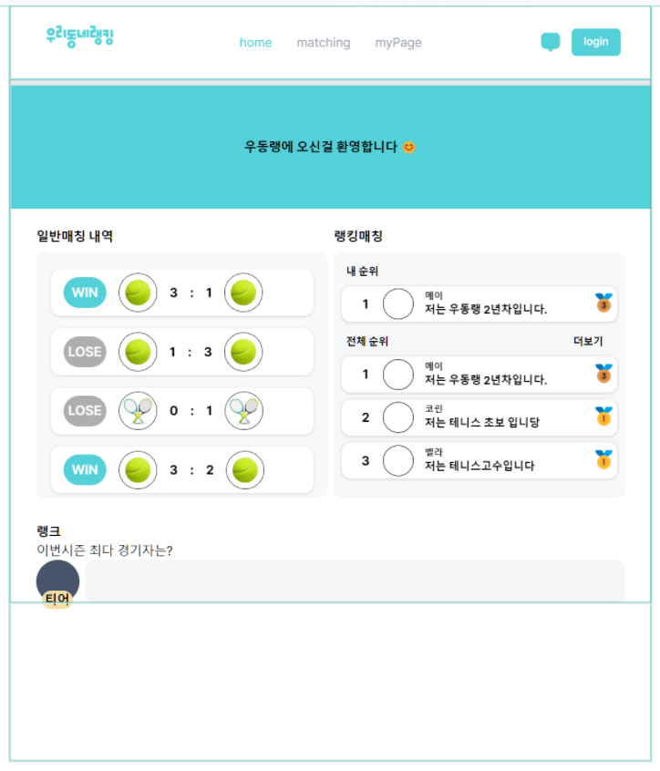
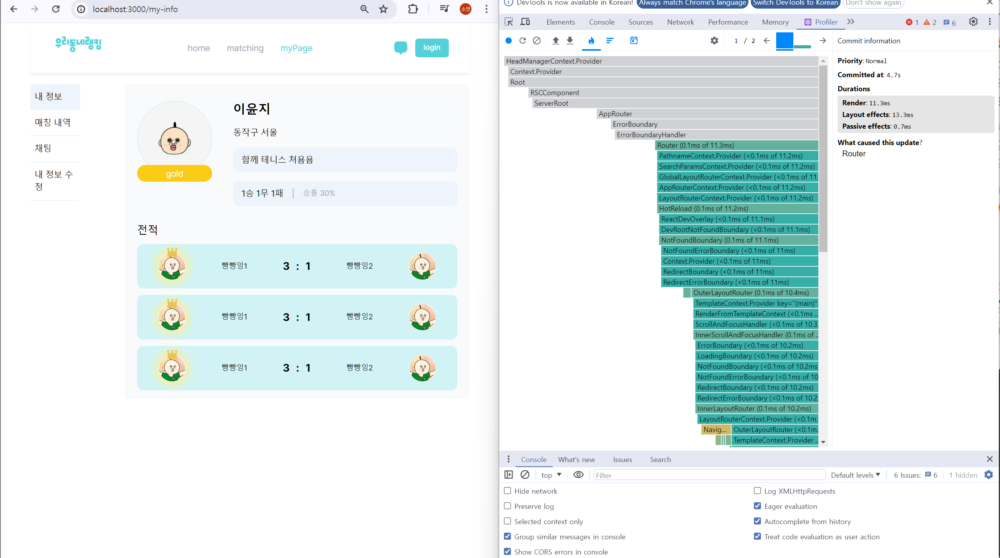

# 리액트 개발도구로 디버깅하기

### react-dev-tools

- 리액트로 개발된 애플리케이션의 디버깅을 돕기 위한 리액트 개발도구
- 리액트 개발 도구를 브라우저 확장 도구로 설치해 사용해 웹개발시 편리하게 사용할 수 있다.

### 리액트 개발 도구 활용하기

---

리액트 개발 도구 설치 후 리액트로 개발된 페이지에 들어가면 디버그 도구인 Components 와 Profiler 가 추가되어 있음

## 컴포넌트(components)

---

애플리케이션의 컴포넌트 트리를 확인 할 수 있다. 컴포넌트의 구조뿐 아니라 props 와 내부 hooks 등 다양한 정보를 확인할 수 있다.

컴포넌트를 기명함수로 작성했을때 개발도구에서 확인하는데 많은 도움을 준다.

함수를 기명함수로 바꾸기 어렵다면 함수에 displayName 속성을 추가해도 된다.

**컴포넌트명과 props**

- 왼쪽 컴포넌트 트리에서 컴포넌트를 선택했을때 해당 컴포넌트에 대한 자세한정보를 보여주는 영역이다.
- 해당 컴포넌트가 받은 props 를 확인할 수 있다.
- 컴포넌트에서 사용중인 훅 정보를 사용할 수 있다.

**컴포넌트를 렌더링한 주체, renderd by**

- rendered by 는 해당 컴포넌트를 렌더링한 주체가 누구인지 확인할 수 있다.
- 프로덕션모드에서는 react-dom 의 버전만 확인할 수 있지만 개발모드에서는 해당 컴포넌트를 렌더링한 부모 컴포넌트까지 확인할 수 있다.

## 프로파일러(profiler)

---

- 리액트가 렌더링하는 과정에서 발생하는 상황을 확인하기 위한 도구
- 리액트 애플리케이션이 렌더링 되는 과정에서 어떤 컴포넌트라 렌더링됐는지, 또 몇 차례나 렌더링이 일어났으며 어떤 작업에서 오래 걸렸는지 등 컴포넌트 렌더링 과정에서 발생하는 일을 확인할 수 있다
- 프로덕션 빌드 이후에는 실행이 불가능 하며 개발모드에서 사용 가능 .

컴포넌트가 렌더링될 때마다 강조를 표시하고 싶다면 리액트 개발자도구의 설정에서 Highlight updates when components render 옵션을 켜면 된다.

**프로파일 과정**

1. Start Profiling 버튼으로 프로파일링 시작

2. Reload and Start profiling : 첫번째 버튼과 유사하지만 해당 버튼을 누르면 웹페이지가 새로고침 되면서 이와 동시에 프로파일링이 시작된다.

3. Stop Profiling :프로파일링된 현재 내용을 모두 지우는 버튼

4. Load Profile & Save Profile : 프로파일링 결과를 저장하면 사용자의 브라우저에 해당 프로파일링 결과를 저장하고 불러오는 버튼이다. 프로파일링 결과를 저장하면 사용자의 브라우저에 해당 프로파일링 정보가 담긴 JSON 파일이 다운로드 되며 이 파일을 다시 로딩해 프로파일링 정보를 불러올 수 있다.

**Flamegraph :** 렌더 커밋별로 어떤 작업이 일어났는지 확인 가능

너비가 넓을 수록 해당 컴포넌트를 렌더링하는데 오래걸렸다는 것을 의미한다.

**Ranked :** 해당 커밋에서 렌더링하는데 오랜 시간이 걸린 컴포넌트를 순서대로 나열한 그래프다.

**타임라인**

- 타임라인에서는 시간이 지남에 따라 컴포넌트에서 어떤 일이 일어났는지를 확인할 수 잇다.
- input 에 글자를 입력하면서 state 의 값이 업데이트 되고, 이 값이 동기로 업데이트 됐는지 또 언제 업데이트가 이뤄졌는지 등을 확인할 수 있다.
- 시간의 흐름에 따라 리액트가 작동하는 내용을 추적하는데 유용하다.
- 시간 단위로 프로파일링 기간 동안 무슨일이 있었는지, 무엇이 렌더링 됐고, 또 어느 시점에 렌더링 됐는지 리액트의 유휴시간은 어느 정도였는지 등을 자세히 확인할 수 있다.
