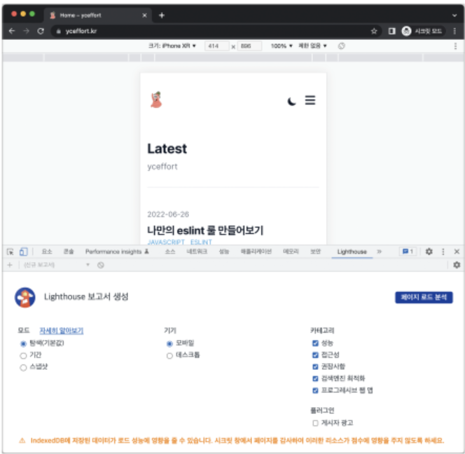

# 웹페이지 성능 측정 방법

## 애플리케이션에서 확인하기

### create-react-app

CRA를 통해 프로젝트를 생성하면 Web-Vitals 파일을 확인할 수 있다.

- **web-vitals** 라이브러리로 CLS(누적 레이아웃 이동),FID(최초 입력 지연), FCP(최초 콘텐츠풀 페인트), TTFB(첫 바이트까지의 시간)을 측정해준다.

- 웹페이지에서 다양한 성능을 측정할 수 있도록 도와주는 API인 **PerfomanceObserver**를 사용하여 측정 [(PerfomanceObserver 자세히 알아보기)](https://developer.mozilla.org/en-US/docs/Web/API/PerformanceObserver)

- sendBeacon API나 fetch등의 API를 사용해 임의의 서버로 정보를 보내거나 구글 애널리틱스와도 연동이 가능하다.

### create-next-app

- 성능 측정을 할 수 있는 메서드 NextWebVitalsMetric을 제공한다.
  [(useReportWebVitals 관련 공식문서)](https://nextjs.org/docs/pages/building-your-application/optimizing/analytics)

```javascript
import { useReportWebVitals } from "next/web-vitals";

function MyApp({ Component, pageProps }) {
  useReportWebVitals((metric) => {
    switch (metric.name) {
      case "FCP": {
        // handle FCP results
      }
      case "LCP": {
        // handle LCP results
      }
      // ...
    }
  });

  return <Component {...pageProps} />;
}
```

<!-- - 기본적인 핵심 웹지표 외에도 Next.js에 특화된 사용자 지표 제공 -->

- Next.js에 특화된 사용자 지표 제공
  - Next.js-hydration : 페이지가 서버 사이트에서 렌더링되어 하이드레이션하는 데 걸린 시간 **(최초에 서버 사이드 렌더링을 수행하기 때문에 필연적으로 하이드레이션 작업이 뒤따른다.)**
  - Next.js-route-change-to-render : 페이지가 경로를 변경한 후 페이지를 렌더링 시작에 걸리는 시간
  - Next.js-render : 경로 변경이 완료된 후 페이지를 렌더링하는 데 걸린 시간

### 구글 라이트하우스

구글에서 제공하는 웹 페이지 성능 측정 도구로, 핵심 웹지표뿐만 아니라 접근성, PWA, SEO 등 다양한 요소를 측정하고 점검할 수 있다.



#### 1. 탐색모드

일반적으로 페이지에 접속했을 때부터 페이지 로딩이 완료될 때까지의 성능을 측정하는 모드  
측정을 시작하면 페이지를 처음부터 다시 불러와서 로딩이 끝날 때까지 각각의 지표를 수집

- **성능**

  - FCP : 최초 콘텐츠풀 페인트
  - LCP : 최대 콘텐츠풀 페인트
  - CLS : 누적 레이아웃 이동
  - TTI(Time to Interactive) : 페이지에서 사용자가 완전히 상호작용할 수 있을 때까지 걸리는 시간 측정

    - 최초 콘텐츠풀 페인트로 측정되는 페이지 내 콘텐츠가 표시되는 시점
    - 보여지는 페이지 요소의 대부분에 이벤트 핸들러가 부착되는 시점
    - 페이지가 유저의 상호작용에 50ms 내로 응답하는 시점

      -> **메인 스레드가 하는 js작업을 최소화, 전체적인 js 실행 속도 높이는 방법으로 개선 가능**

  - Speed Index : 페이지가 로드되는 동안 콘텐츠가 얼마나 빨리 시각적으로 표시되는지를 계산
  - Total Blocking Time : 사용자가 무언가 작업이 진행되고 있지 않다는 것을 눈치챌 수 있는 시간을 대상으로 총 차단 시간을 계산  
    -> 대상 : FCP ~ TTI 사이의 작업  
    -> 메인 스레드가 차단되는 긴 작업을 모아서 50ms를 빼고 합산

- **접근성**(=웹 접근성)  
  언제 어디서나 누구나 이용할 수 있도록 보장해야 한다.

- **권장사항**  
  웹 사이트를 개발할 때 고려해야할 요소를 얼마나 지키고 있는지를 측정

  - CSP가 XSS공격에 효과적인지 확인
  - 감지된 js라이브러리 등...

- **검색엔진 최적화**
  - 문서를 크롤링하기 쉽게 만들었는지
  - robots.txt가 유효한지
  - 이미지와 링크에 설명 문자가 존재하는지
  - meta 정보를 빠르게 확인할 수 있는지

#### 2. 기간 모드

실제 웹페이지를 탐색하는 동안 지표를 측정  
탐색모드와 마찬가지로 성능, 권장사항에 대한 지표를 확인할 수 있다.

- 흔적(View Trace) : 상세하게 시간의 흐름에 따라 어떻게 웹페이지가 로딩됐는지를 보여준다.
- 트리맵 : 페이지를 불러올 때 함께 로딩한 모든 리소스를 함께 모아서 볼 수 있는 곳
  - 전체 데이터 로딩 중 특정 리소스가 어느 정도의 비율을 차지했는지 확인가능
  - 실제로 불러왔지만 사용되지 않은 리소스의 비율 확인 가능 -> 번들리된 리소스에서 불필요한 것이 없는지 확인해 보는 것이 좋다.

#### 3. 스냅샷

탐색모드와 매우 유사하지만 현재 페이지 상태를 기준으로 분석  
페이지 로딩이 아닌 **페이지의 특정 상태를 기준으로 분석**할 때 사용하는 모드

### 크롬 개발자 도구

#### 1. 성능 통계(performance Insighs) 탭

라이트하우스와 비슷하게 Page Load를 선택해 로딩 시작부터 끝까지 확인하거나 Start Recording을 눌러서 원하는 액션을 수행하면서 성능을 측정

- Insights : 성능을 측정하는 기간 동안 발생한 이벤트 중 눈여겨봐야 할 내용을 시간의 흐름에 따라 모아서 보여준다.

  - 핵심 웹 지표 : FCP, LCP, Dom Content Loaded
  - Performance Measure : User Timing API로 측정한 지표를 확인, User Timing은 사용자가 버튼을 클릭하거나 애플리케이션 내에서 특정 작업을 수행할 때 지정한 마커를 통해 데이터를 측정하고 기록하는 데에 도움
    [user-timing 무엇?](https://developer.mozilla.org/en-US/docs/Web/API/Performance_API/User_timing)
  - **Long Task** : 메인 스레드에서 실행되는 데 오랜 시간으로 분류된 긴 작업으로 어떤 함수로 인해 오랜 시간이 걸렸는지 확인 가능
  - Render blocking CSS : 렌더링을 막는 CSS 확인
  - Forced Style recalculation : 이미 스타일이 한번 계산된 이후에 어떤 이유로 다시 재계산 되는 작업이 발생했음을 표시

- 메인 메뉴 : 성능을 측정하는 기간동안 무슨일이 일어났는지 확인할 수 있는 다양한 기능 제공

#### 2. 성능 탭

성능 분석에 사용하기 위해 만들어진 탭  
 내용이 어렵고 복잡하지만, 그만큼 더 자세한 정보를 제공한다. (Performance Insights 정보만으로 충분하다)

- **소요 시간과 기본** : 시간의 흐름에 따라 메인 스레드의 작업은 어떻게 이뤄졌는지, 힙 영역은 어떻게 변화했는지 등을 확인

## 정리

성능을 0.1초 개선한 것만으로도 사용자에게 긍정적인 경험을 안겨주기에 성능 개선을 위해 다양한 방법을 활용하여 반복적으로 꾸준히 탐색하자!!
