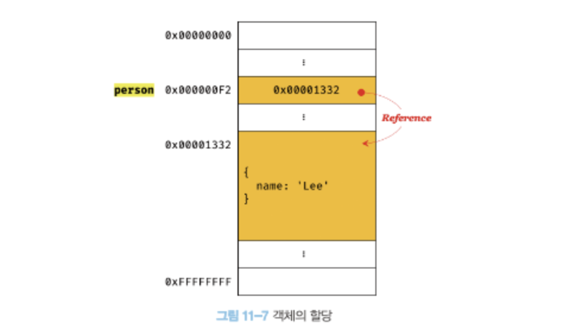

# 원시 값과 객체의 비교

원시 타입과 객체 타입은 세가지 측면에서 다르다.

1. 변경 가능 여부

- 원시 타입 : 변경 불가능한 값
- 객체 타입 : 변경 가능한 값

2. 저장되는 값

- 원시 타입 : 변수에 **실제 값**이 저장된다.
- 객체 타입 : 변수에 **참조 값**이 저장된다.

3. 다른 변수에 할당하면?

- 원시 타입 : 원시 값이 복사되어 전달된다.
- 객체 타입 : 참조 값이 복사되어 전달된다.

## 원시 값

### 변경 불가능한 값

원시 타입의 값은 변경 불가능한 값이다.

- 헷갈리지 말자!
  -> 변수 : 하나의 값을 저장하기 위해 **확보한 메모리 공간 자체**이자 메모리 공간을 식별하기 위해 붙인 이름  
  -> 값 : 변수에 저장된 데이터

즉, 변경 불가능하다는 것은 원시 값 자체를 변경할 수 없다는 것 (변수는 언제든지 재할당하여 변수 값을 교체할 수 있다.)

- 변수에 새 원시 타입의 값 할당시
  새로운 메모리 공간 확보 -> 재할당한 원시 값 저장 -> 변수는 새롭게 재할당한 원시값

  

### 문자열과 불변성

자바스크립트의 문자열은 원시 타입이며, 변경 불가능하다.

```javascript
var str = "hello";
str = "world";
```

```javascript
var str = "string";
str[0] = "S";
console.log(str); // string
```

생성된 문자열의 일부 문자를 변경해도 반영되지 않는다.  
왜?! 원시 타입 = 변경 불가능한 값 = 데이터의 신뢰성 보장

### 값에 의한 전달

변수에 변수를 할당했을 때 무엇이 어떻게 전달되는가?

```javascript
var score = 80;
var copy = score;

console.log(score); // 80
console.log(copy); // 80
console.log(score === copy); // true

score = 100;
console.log(score); // 100
console.log(copy); // ?
```

1. copy = score

- score의 값은 80이므로 copy의 값도 80이다. 이때 **새로운 숫자 값 80**이 생성되어 할당된다. -> **score와 copy의 값 80은 다른 메모리 공간에 저장된 별개의 값!!**

2. score = 100;

- score의 값을 변경했다한들 두 변수의 값는 다른 메모리 공간에 저장된 별개의 값이기에 copy값는 영향이 없다.

=> '값에 의한 전달'은 엄격하게 표현하면 변수에는 값이 전달되는 것이 아니라 **메모리 주소가 전달**된다.

## 객체

객체는 원시 값과 같이 확보해야 할 메모리 공간의 크기를 사전에 정해 둘 수 없다!  
=> 그렇기 때문에 원시 값과 다른 방식으로 동작하고 저장된다.

### 변경 가능한 값

객체 타입의 값은 **변경 가능한 값**이다.

- 원시 값 자체를 값으로 갖는 원시 타입과는 달리 객체는 메모리 공간에 **객체가 저장된 메모리 공간의 주소인 참조 값을 저장**한다.
- 참조 값을 통해 실제 객체에 접근한다.
  
- 객체의 크기는 예측 불가능 하기 때문에 객체를 복사해 생성하는 비용을 절약하고 성능을 향상시키기 위해 객체를 변경 가능한 값으로 설계한 것
- 여러 개의 식별자가 하나의 객체를 공유한다.

#### 얕은 복사 깊은 복사

### 참조에 의한 전달

```javascript
var person = {
  name: "Lee",
};
var copy = person; // 참조 값을 얕은 복사
```

- 객체를 가리키는 변수(person)를 다른 변수(copy)에 할당하면 **참조 값이 복사되어 전달**된다. = 참조에 의한 전달
  
- person과 copy에 저장된 메모리 주소는 다르지만 동일한 참조 값을 갖는다 => **동일한 객체를 가리키고 이는 하나의 객체를 공유한다는 것**

=> 객체는 원본 또는 사본 중 어느 한쪽에서 객체를 변경하면!!!!! 서로 영향을 주고 받는다는 것을 항상 염두해두자!!

### Quiz

```javascript
var person1 = {
  name: "Lee",
};
var person2 = {
  name: "Lee",
};
console.log(person1 === person2);
console.log(person1.name === person2.name);
```

=== 일치 비교 연산자는 변수에 저장되어 있는 값을 타입 반환하지 않고 비교한다.  
=== 일치 비교 연산자 사용시,
객체를 할당한 변수를 비교하면 참조 값을 비교하고,  
원시 값을 할당한 변수를 비교하면 원시 값을 비교한다.
