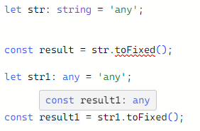
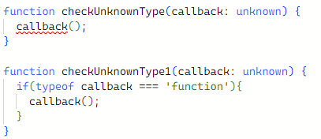
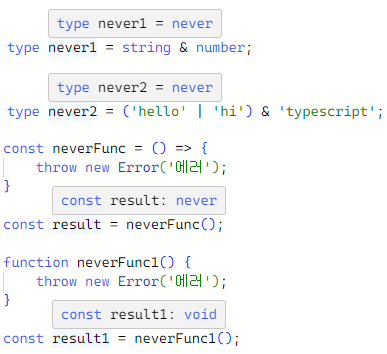

# 타입스크립트?
타입스크립트는 기존 자바스크립트 문법에 타입이 추가된 언어다.

> 타입이란?
프로그래밍 언어에서는 자료형으로 자바스크립트에는 number, string, boolean, null, undefined, symbol, bigint, object가 있다.

자바스크립트는 기본적으로 동적 타입의 언어로써 코드를 실행했을 때만 에러를 확인할 수 있다는 문제가 있다.

> 동적 타입과 정적 타입?
간단하게 말하면,
컴파일(코드 작성) 시 변수 타입이 결정되는 언어는 정적 타입 언어
런타임(코드 실행) 시 변수 타입이 결정되는 언어는 동적 타입 언어다.

동적 타입 언어는 타입을 매번 정의하지 않아도 자동으로 타입을 판단하여 지정해줌으로써 개발자에게 자유도가 높아 빠르게 코드를 작성할 수 있다.

하지만 코드의 규모가 커질수록 코드는 복잡해지고, 에러를 찾기 어려워진다.

특히 개발하다가 자주 맞이하는 오류는 타입 오류다. 타입 오류는 단순한 오타일 수도 있고, 사용하는 라이브러리의 API를 이해하지 못하거나, 런타임 동작에 대한 잘못된 가정 등을 통해 발생한 오류일 수 있다.

타입스크립트는 타입 오류와 오타를 코드 실행 전에 잡아주기 때문에 실제로 코드를 실행했을 때 오류가 나는 경우가 많이 줄어들게 된다.

# 리액트에서 효과적으로 타입스크립트 활용하기

## any 대신 unknown을 사용하자
타입스크립트를 사용할 때 실수 중 하나는 any를 자주 사용하는 것이다.

any 타입은 모든 동작을 허용해준다고 생각하면 된다.

아래 사진은 문자열로 선언한 str을 숫자형 메서드인 toFixed를 사용할 때 any 타입은 에러가 발생하지 않는다. 실제로 이 코드는 런타임 때 에러를 발생시킬 것이고, 이는 타입스크립트를 사용하지 않는 것과 다름없다.


any를 사용하게 되면 any 타입으로 타이핑한 변수를 다른 변수에 할당하면 해당 변수도 any 타입을 가지게 됩니다.

따라서 한 번 any 타입을 쓰면 그 뒤로도 계속 any 타입이 생성되기 때문에 any의 사용을 지양하고, any로 추론되는 타입이 있으면 타입을 직접 표기해줘야 한다.

만약 자바스크립트에서 타입스크립트로 변경할 때와 같이 타입을 단정할 수 없는 경우 any 대신 unknown을 사용하는 것이 좋다.

unknown은 any와 같이 top type으로 모든 값을 할당할 수 있지만, 타입 좁히기(type narrowing)를 하지 않으면 어떠한 동작도 수행할 수 없다.


callback은 unknown 타입으로 아직 알 수 없는 값이기 때문에 바로 사용할 수 없다. 따라서 unknown 타입으로 선언된 변수를 사용하려면 type narrowing을 해야하므로 any 보다 더 안전하게 사용할 수 있다.

unknown 타입과 반대되는 bottom type으로 never 타입은 어떠한 타입으로도 대입할 수 없다.


never1 타입은 string과 number를 교차 타입인데 만족하는 타입은 없기 때문에 never로 선언된다. never2 타입도 마찬가지다.

neverFunc와 neverFunc1은 둘다 에러를 반환하는데 함수 선언문은 throw를 하더라도 반환 값의 타입이 void인 반면 함수 표현식은 never가 된다.

> Top Type과 Bottom Type


## 타입 가드를 활용하자
Type guards는 타입을 좁히는데 사용할 수 있는 다양한 방법이 있다.

### 1. instanceof와 typeof
instanceof는 지정한 인스턴스가 특정 클래스의 인스턴스인지 확인할 수 있는 연산자다.
```js
try {
  ...
} catch (e) {
  // e는 unknown 타입
  
  // UnAuthorizedError 타입 가드 조건문
  if(e instanceof UnAuthorizedError){
    // 해당 에러가 UnAuthorizedError이면 처리 수행
   	... 
  }
    
  throw e;
}
```

typeof 연산자는 특정 요소에 대한 자료형을 확인할 수 있다.
```ts
// typeof 연산자 반환 값
// string, number, bigint, boolean, symbol, undefined, object, function
function logging (value: string | undefined) { 
	if (typeof value === 'string') { 
		console.log(value); 
	if (typeof value === 'undefined' ) { 
		return
    }
}
```
> typeof null 반환 값은 "object"이므로 null일 경우 일치 비교 연산자를 통해 확인해야한다.

### 2. in operator narrowing
in 연산자는 property in object로 사용되며, 주로 어떤 객체에 키가 존재하는지 확인하는 용도로 사용한다.

```ts
interface Student {
  age: number
  score: number
}

interface Teacher {
  name: string
}

function doSchool(person: Student | Teacher) {
  if('age' in person) {
    // person은 Student일 때
    person.age
    person.score
  }
  
  if('name' in person) {
    // person은 Teacher일 때
    person.name
  }
}
```
위처럼 in 연산자는 타입에 여러가지 객체가 존재할 수 있는 경우 프로퍼티 값을 확인하여 타입을 좁힐 수 있다.

### 3. 제네릭(generic)
제네릭은 함수나 클래스 내부에서 단일 타입이 아닌 다양한 타입에 대응할 수 있도록 도와주는 도구다.
```ts
function getFirstAndLast(list: unknown[]) {
  return [list[0], list[list.length - 1]];
}

const [first, last] = getFirstAndLast([1, 2, 3, 4, 5]);

first // unknown
last // unknown
```
list로 다양한 타입이 들어올 수 있기 때문에 unknown 타입을 썼지만 타입 좁히기를 하지 않아서 unknown 타입의 값을 반환했다. 이를 해결하기 위해 타입 좁히기를 해도 되지만, 모든 타입을 정의할 순 없으므로 이때 사용할 수 있는 것이 제네릭이다.

```ts
function getFirstAndLast<T>(list: T[]): [T, T] {
  return [list[0], list[list.length - 1]];
}

const [first, last] = getFirstAndLast([1, 2, 3, 4, 5]);

first // number
last // number

const [first1, last1] = getFirstAndLast([1, 2, 3, 4, 5]);

first1 // string
last1 // string
```
제네릭을 통해 함수를 호출할 때 전달한 인수의 타입 맞게 매개변수가 대응하여 원하는 타입으로 반환해준다.
제네릭을 하나 이상 사용할 수도 있다. `function getFirstAndLast<First, Last>(first: First, last: Last)`
> 인수와 매개변수
인수는 함수를 호출할 때 전달하는 값 ex) `getFirstAndLast([1, 2, 3, 4, 5])` [1, 2, 3, 4, 5]가 인수다.
매개변수는 함수를 정의할 때 전달받을 값 ex) `function getFirstAndLast(list)` list가 매개변수다.

리액트에서 useState 사용할 때 제네릭을 사용해서 타입을 정의할 수 있다.
`const [state, setState] = useState<string>('');`

### 4. 인덱스 시그니처
인덱스 시그니처란 객체의 키를 정의하는 방식을 의미하며, `[key: string]: string`와 같이 사용할 수 있다.

이를 사용하면 키에 원하는 타입을 부여할 수 있고, 이와 유사하게 Record를 사용할 수도 있다.
> Record<Key, Value> 사용하면 객체 타입에 원하는 키와 값을 넣을 수 있다.

```ts
// Record를 사용
type Hello = Record<'hello' | 'hi', string>;
/** Record와 동일
type Hello = {
  hello: string
  hi : string
}
**/

const hello: Hello = {
  hello: '안녕',
  hi: '방가'
}

// 타입을 사용한 인덱스 시그니처
type Hello1 = {
  [key in 'hello' | 'hi']: string
}

const hello1: Hello1 = {
  hello: '안녕',
  hi: '방가'
}
```

인덱스 시그니처를 처음 사용하다보면 다음과 같은 에러가 발생할 수 있다


이렇게 발생한 이유는 `Object.keys(hello)`의 타입은 `string[]`이고, hello의 타입은 Hello이기 때문에 타입 불일치가 일어난다.

따라서 이를 해결하기 위해서는 다양한 방법이 있다.
```ts
// 1. Object.keys(hello)를 as로 타입을 강제로 단언
// Array<keyof Hello> => ["hello", "hi"]
(Object.keys(hello) as Array<keyof Hello>).map(key => {
  const value = hello[key];
  return value;
}
                                              
// 2. 타입 가드 함수를 만드는 방법
function keyOf<T extends Object>(obj: T): Array<keyof T> {
  return Array.from(Object.keys(obj)) as Array<keyof T>;
}

keyOf(hello).map(key => {
  const value = hello[key];
  return value;
})

// 3. 가져온 key를 as로 타입 강제로 단언
// Object.keys로 가져온 타입은 항상 string[]을 반환함
Object.keys(hello).map(key => {
  const value = hello[key as keyof Hello];
  return value;
}
```

Object.keys가 string[]으로 강제된 이유는 자바스크립트의 덕 타이핑 구조로 인해, 타입스크립트도 모든 키가 들어올 수 있는 가능성을 열어둬 객체의 키에 포괄적으로 대응하기 위해 `string[]`으로 타입을 제공는 것이다.

> 덕 타이핑(duck typing)과 구조적 타이핑
- 덕 타이핑은 아래 사진과 같이 콘센트든 돼지코이든 이름은 상관없이 꽂을 수만 있으면 그것을 콘센트로 부를 수 있다는 것처럼 객체가 열려 있는 구조로 만들어져 있다. (다형성)
자바스크립트가 덕 타이핑으로 런타임에 타입을 체크한다.


- 구조적 타이핑은 덕 타이핑을 모델링하지만 타입 시스템 기반에서 컴파일 타임에서 타입을 체크한다.
타입스크립트가 구조적 타이핑 특징을 가진다.


- [타입스크립트 교과서](https://product.kyobobook.co.kr/detail/S000208416779)
- [모던 리액트 Deep Dive](https://product.kyobobook.co.kr/detail/S000210725203)
- [러닝 타입스크립트 09. 타입 제한자](https://hyejineee.github.io/blog/reading/learning-typescript-09)
- [타입스크립트 타입 정복 : Type Guards와 Narrowing](https://frontj.com/entry/%ED%83%80%EC%9E%85%EC%8A%A4%ED%81%AC%EB%A6%BD%ED%8A%B8-%ED%83%80%EC%9E%85-%EC%A0%95%EB%B3%B5-Type-Guards%EC%99%80-Narrowing?category=949731)
- [덕 타이핑과 구조적 타이핑](https://vallista.kr/%EB%8D%95-%ED%83%80%EC%9D%B4%ED%95%91%EA%B3%BC-%EA%B5%AC%EC%A1%B0%EC%A0%81-%ED%83%80%EC%9D%B4%ED%95%91/)